# 深入探究分散化社会图形和创造者经济项目✍️的状态

> 原文：<https://medium.com/coinmonks/a-deep-dive-into-the-state-of-decentralized-social-graphs-and-creator-economy-projects-%EF%B8%8F-d6163f028707?source=collection_archive---------7----------------------->

随着技术，特别是社交媒体的进步，我们的数字生活越来越优先于社交生活。我们比以往任何时候都更加重视我们的数字存在，甚至 web3 也在加速这一趋势，特别是元宇宙、PFP NFTs 和其他类似的技术。

我们都知道这些社交媒体平台由大公司所有，这使人类面临许多风险。📵

在现实生活中，我想不出比埃隆·马斯克的 Twitter 收购、川普的 Truth 社交网络或脸书的数据泄露更好的例子来证明去中心化技术是多么重要。

**社交网络和社交图的区别🤔**

社交图是用于社交网络的表示和实现的结构。

一棵有[根的树](https://mathworld.wolfram.com/RootedTree.html)。

然而，另一方面，社交网络🗣️是由社交图表示的结构，其涉及特定时间点或特定类别或受众的所有关系和实体。

例如:-由代表特定类型的节点组成的树，如 Linkedin，用于就您的业务/工作与人联系💼。

**定义网络的层次和发展**

**网页 1:-**

Web1️⃣是一个具有对称客户端和服务器的对等(P2P)网络。也被称为信息经济。这是一个客户端，一个服务器模型。

关于媒体和社交图，这被认为是旧的信息景观。报纸网络📰因为他们是人们唯一的信息来源。学术界和媒体被认为是国家的上游，这是一个信息控制的经济。

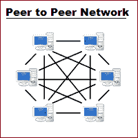

**Web 2:-**

Web2️⃣是一个模型视图控制器(MVC ),拥有巨大的中央集权和庞大的客户。这种体验更好，因为它让大量客户端加入了平台。它使用带有大量客户端的客户端-服务器模式。(多台客户机和一台服务器)。

这被视为一个新的信息景观。这里每个人都有发言权，然而权力和声音🔇被集中的社交网络所控制，人们无法在这样的平台上充分表达自己。🤐

巴拉吉斯说,**现代政治体系是基于声音的幻觉，而不是声音的现实。在这里，学术界和媒体争论对内容进行审查，像脸书、推特、Youtube 等平台操纵和玩弄他们想让人们看到的内容。**

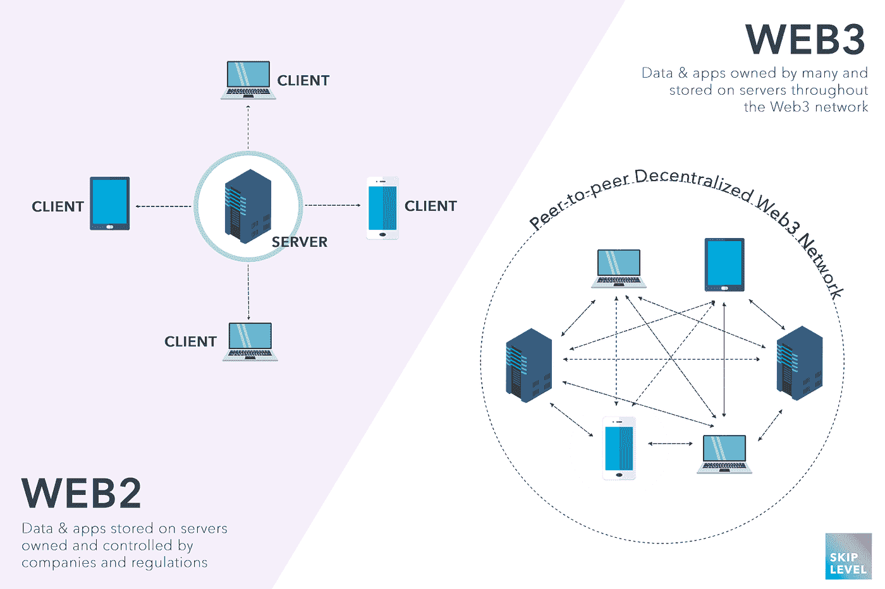

**Web 3:-**

Web3️⃣是一个客户端区块链客户端(CBC)与许多客户端和许多服务器模型。它被认为是最新的信息景观。

加密货币和区块链目前正在通过允许用户绕过审查和收回所有权来推动这个 web3 向前发展。这是通过开源和分散我们周围的互联网来实现的。

建立了许多协议🏗️在这些区块链之上，分散我们周围的一切，包括媒体和社交图。在这里，信息是由人来验证和控制的👥他们自己而不是大公司。

【web2 平台的问题

*   **中央集权**

当平台或政府不喜欢你的作品，或者有针对他们的内容时，他们可以很容易地删除你的内容。通过向消费者隐瞒数据，这可能会导致受监管的内容消费经济。

此外，生活在一个数据开放程度较低的世界是相当危险的。☠️

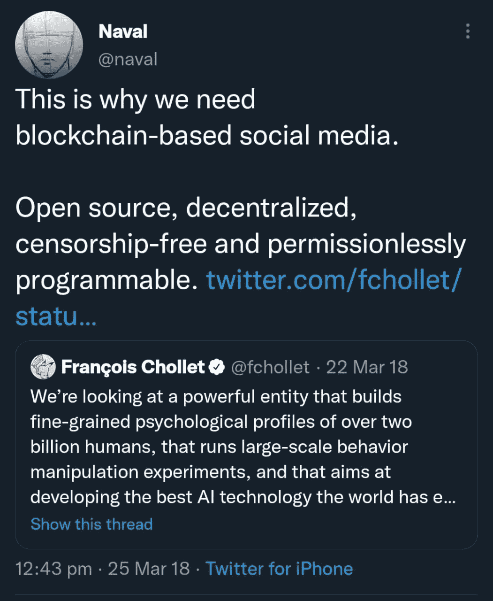

*   **没有数据所有权并滥用它们**

我们都知道并鄙视这样一个事实，即像脸书这样的公司出售我们的数据，并为我们提供我们可能不喜欢的定制广告😑。只有我们能够控制我们的数据，问题才会得到控制。

*   **被操纵的内容发现导致触及范围更小**

创作者不为人知的努力可能是最难接受的事情之一，尤其是当你的作品非常优秀的时候。这些是由这些公司制造的人工智能操纵的，它们决定过滤并呈现他们想让人们看到的东西。

还有很多其他问题:(

**亿万富翁💸控股媒体公司**

当 Elon 在 twitter 被收购后说他将为言论自由开放一切资源时，你可能会很高兴，但有几个人离开了这个平台，因为他们可能会反对他，只有当你意识到许多媒体公司都是由亿万富翁拥有时，这才显得可疑🤯。

此外，平台的判断是基于他的偏好而不是社区需求，这与人们在 web3 协议中做出决策的现实相矛盾，因为这些平台有自己的治理决策。此外，杰夫·贝佐斯拥有《华盛顿邮报》的消息会让你感到惊讶吗，该报在媒体 industry🎙️拥有大量股份。欲了解更多详情，请访问这篇[福布斯文章](https://www.forbes.com/sites/katevinton/2016/06/01/these-15-billionaires-own-americas-news-media-companies/?sh=7c875863660a)。

**合法性或意识形态层(L0)在 Web3 中的作用**

我们都很清楚区块链空间中现存的第一层(以太坊，索拉纳)和第二层(多边形)。

但是还有另一层，巴拉吉斯称之为意识形态或合法性层。他坚持认为，这一层比可行性+规模相结合更重要，因为这种意识形态使技术及其反馈回路成为可能。人们头脑中的想法💡人民 bodies🧠行动使这些 l0 成为可能。这种变化不仅仅是由计算机软件和硬件带来的，还包括人们的精神软件、他们的哲学、他们的存在以及在这个新空间中获得股份的意愿，这可以为整个 web3 带来转机。

**web 3 如何塑造创造者经济？**

有影响力的人、艺术家、音乐家、游戏玩家或任何有粉丝基础的人都被称为创作者。Web3 通过鼓励、拥有和分享他们的材料，让个人成为创造者，允许他们追求自己的激情而不是职业😎。

智能合同最有效的用途之一是拥有并出售一份材料，同时向原创者支付版税。人们也可能对其内容主张️知识产权/商业权利。空投和提供治理价值是另外两个可以携带的品质。任何关于虚假内容的指控都是毫无价值的。价值是由人决定的，而不是像 web2 平台中常见的集中服务。

Web3 将网络参与者聚集在一起，为一个相似的目标而努力:作为价值、金钱的网络扩展💰，权力被分配给所有人。

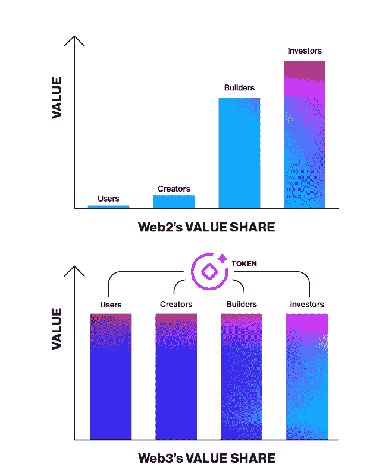

web3 中创作者的内容将有更好的传播范围，因为观众也有动力去消费你的内容。当写关于创造者和网络 3 经济的文章时，我不能忽视 [NFTs](https://ethereum.org/en/nft/) (不可替代的代币)。简而言之，你的任何不可替代的(独特的)作品都可以成为 NFT。无论是一篇文章，一首歌，一个迷因，还是别的什么。

下面是关于非功能性测试用例的流程图。

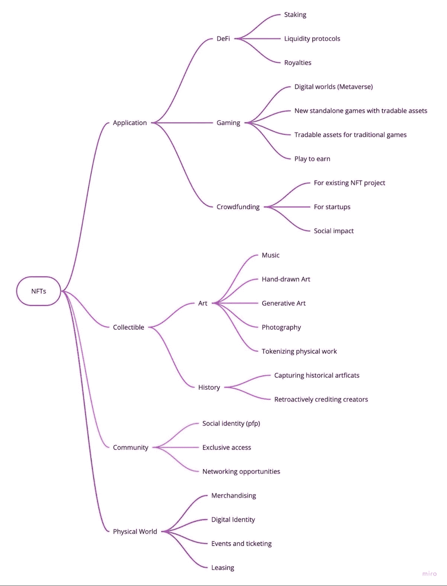

对于那些长期或短期押注于你的内容的人来说，NFT 也是一种投资。这促使创作者在未来推出更好的内容。🥳你可以很容易地获得一些资本💵而不是依靠其他人(风投)来完成这些非功能性交易。

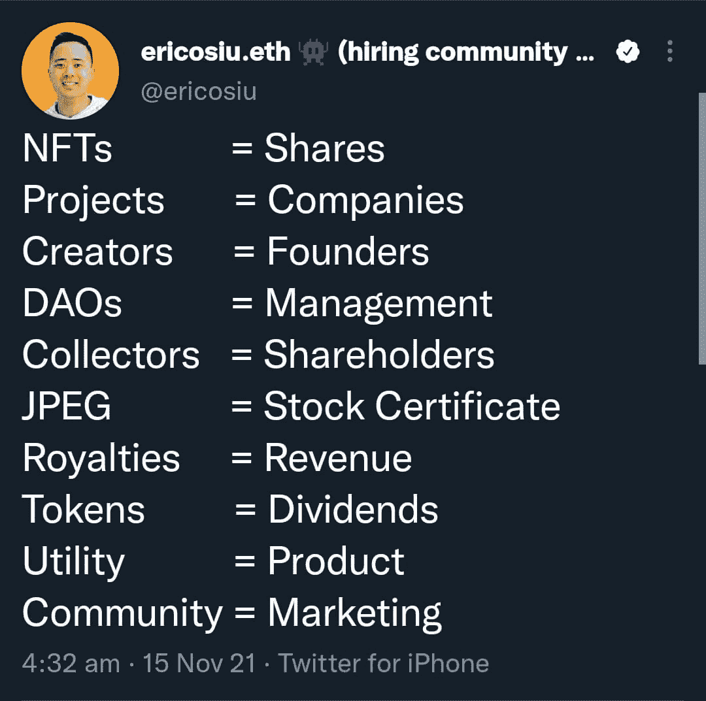

上面的推文比较了 web3 如何将管理技能直接带到创作者手中。

以下是来自 a16z 加密状态报告的一些见解📜2022 年，作为一名内容创作者，你能在 web3 中挣多少钱🤑。

该分析统计了 22，400 名 web3 创作者，而 web2 创作者有 30 亿人，两者不具有可比性。然而，web3 仍处于早期阶段，新的赚钱方式正在出现📈，可以跟上 web3 美工的发展和入职。

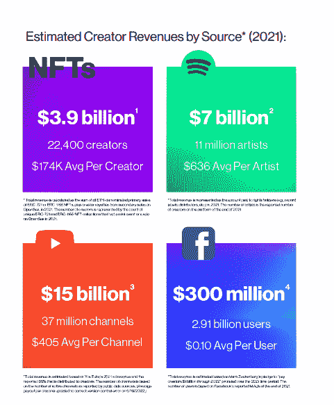

Source:- a16z 2022 crypto report

根据分析，web3 为每个创作者支付了 17.4 万美元，而 Meta 为每个用户支付了 0.1 美元，Spotify 为每个艺术家支付了 636 美元，YouTube 为每个频道支付了 2.47 美元。Web3 虽小但功能强大。

web3 中确实存在集中式服务，因为并非所有的内容创建者都准备好使用分散式服务。但是，情况正在发生变化。以 Opensea 为例，它是早期的 NFT 交易平台之一，目前仍受控制，但收取的费用相对较低，一些竞争对手，如 Magic Eden 和 Looksrare，正在通过去中心化获得动力🌞。

这是 a16z 的研究📎关于 web2 与 web3 平台的比较

Web2 巨头的收费过高；web3 平台提供了更公平的经济条件。相比之下，Meta 在脸书和 Instagram 上的使用率超过了 100 %,而 OpenSea 只有 2.5%。“当大型科技公司比黑手党更容易得手时，你就知道我们的经济出现了严重问题”。

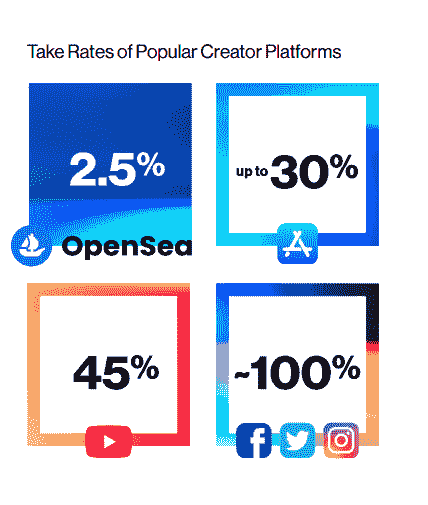

**现有的 Web3 社交图项目和工具**

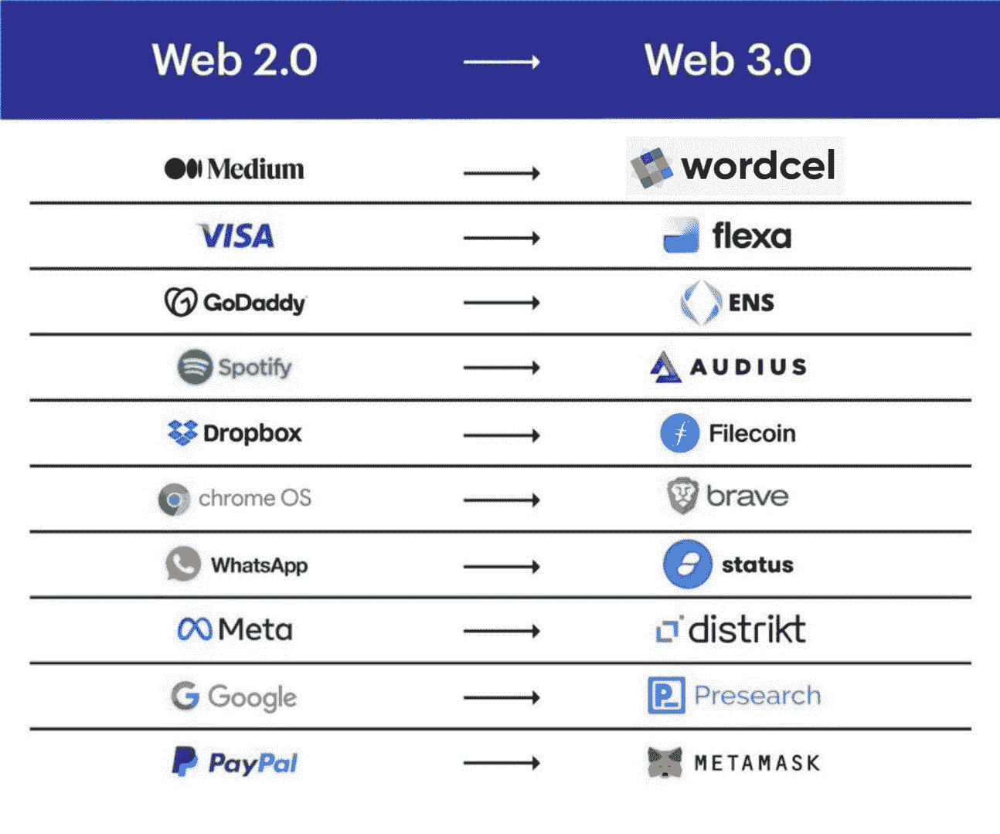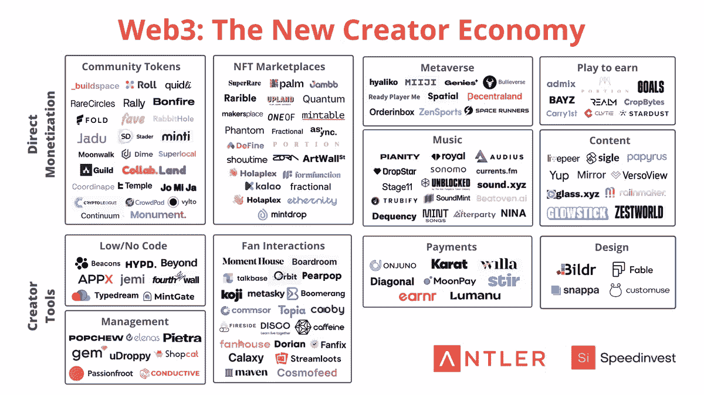

在这一部分，我想介绍几个 web3 社交图项目。

**1。Mirror.xyz**

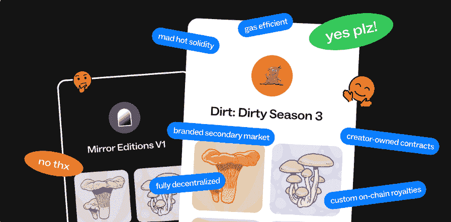

早期作家之一的对媒体道📻，mirror 专注于通过创建 NFT，举办拍卖，发起众筹活动，为作家提供货币化选择。加入镜子写一篇文章需要你提供 1 美元写🪞token，但没有任何报名费。

向作者提供的创建工具很少，例如不同的编辑器模式、导入条目、创建块和嵌入 NFT。帖子发布在以太坊 L2s 上，交易成本更快更便宜。

**2。镜头协议**

这个项目是由 Aave 团队发起的，他们希望为人们提供一个类似脸书和 Twitter 的分散式社交网络。这是一个建立在多边形链上的 permissionless🖐、可组合和去中心化的社交图。

该协议仍处于早期阶段，尚未公开，但已经在 web3 社区中引起了很大兴趣。如果您在 CT 上很活跃，您可能会看到有人通过链接要求他们进行连接🤝镜头协议🔍。

你需要签署一封公开信，以便提前进入平台。他们还引入了个人资料、关注 NFT 等等。Lens Protocol 是一个完全开源的社区，用于构建社交应用和分析平台📊、验证系统和 DAO 工具。

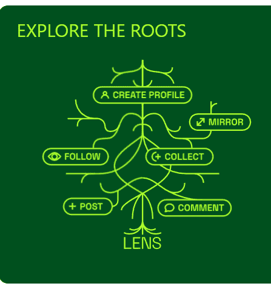

目前有基于该协议构建的应用程序，任何人也可以创建自己的应用程序。该平台通过向创作者提供大量工具而变得更加友好。

**3。奥迪斯**

Spotify 的替代品，但赋予创作者分发、货币化和流式播放不可阻挡的音频的权力🎵。Audius 是建立在区块链(实际上是几个)和社区运行的节点之上的协议和平台。Audius 是开源的，开放数据和访问，开放所有权。治理和奖励令牌被命名为$AUDIO，你也可以在上面下注和赚钱。歌迷可以有高质量的免费收听🎶还可以获得基于创作者的独家内容。

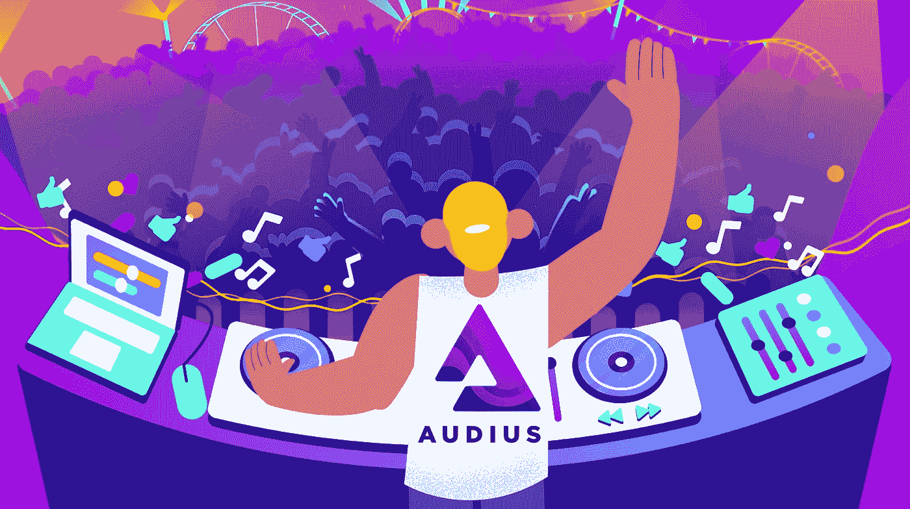

Audius 协议由两个链外服务提供支持，即发现节点和内容节点。

**Wordcel 是什么意思，为什么要用 word cel？**

在看什么是作为平台的 wordcel 之前，我们先来看看 wordcel 的起源和含义。

具有很强语言能力的人被称为单词学家，而具有优秀数学和科学能力的人被称为形状旋转者/数字学家。这个词因 roon( [@tszzl](https://twitter.com/tszzl) )的一条推文而变得流行起来，这条推文是关于决定 AI vs Crypto 是 wordcel 还是 shape rotator 之类的二分法。Wordcels 和 shape rotators 经常被视为竞争对手🌚

如果你更感兴趣，这里有一篇来自 roon 的解释[形状&单词](https://roonscape.substack.com/p/a-song-of-shapes-and-words?s=r)的文章和来自 Vitalik 的[推文。](https://twitter.com/VitalikButerin/status/1489998900438077441)

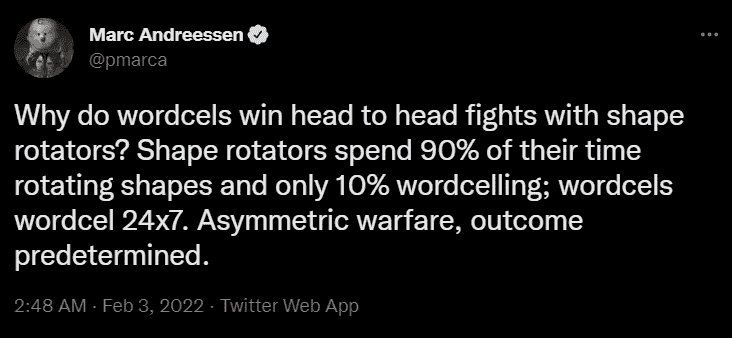

现在到平台上。

Wordcel club 是一个分散的出版栈，位于 tools⚒️.的索拉纳区块链，有很多内容创作 Wordcel 是一个协议原语平台，将优先考虑长格式内容，任何人都可以构建它🏗️，因为它是首先形成链上分散介质的第 0 层的协议。

它位于索拉纳区块链，因为它拥有最活跃的地址和最多的每日交易量，是迄今为止最快、最强大的区块链。

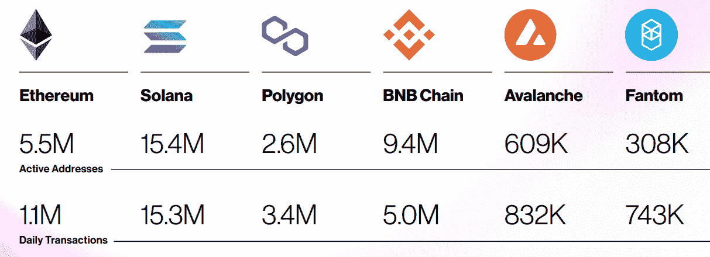

Source:- a16z 2022 crypto report

数据发布在链上，内容托管在 Arweave 上。这个平台给了人们在自己的域名上托管的机会。👀

我觉得，从现有的 web2 平台(如 Medium 和 Substack)导入一个人的数据堆栈，将是 wordcel 作为一个平台的潜力，通过实现赋予创作者主权权力的目标，来潜在地搭载创作者。⚔️ wordcel 允许你从 Vim，VScode，concept，或者它自己的定制编辑器中发布。它还向创作者提供用户控制、言论自由、抵制审查、数据隐私和分发控制。

你还可以在 Solana Blockchain explorer 上找到每个帖子下方的帖子证明按钮来验证它。看看 wordcel 的 Genesis 帖子[这里](https://genesis.wordcel.club/post/GuG8vcjLTWjPWNsGGtRv8Fm3yvxczpeCWLRneCtQwmM5)看看这个平台怎么样。(Genesis post 是 wordcel 上的第一篇帖子)对于那些 CT 人来说，如果你还在疑惑并等待 twitter 的编辑按钮🤥，记住 wordcel 为链上文章提供了一个编辑按钮选项😲。

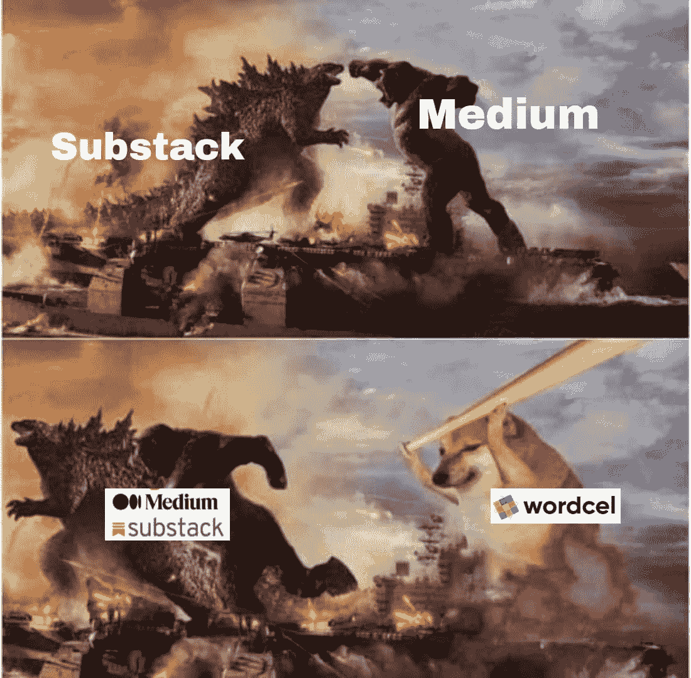

Wordcel 与它的 web2 替代品竞争👊像 Hashnode、ghost、Medium 和 substack，将所有权还给人们。

**结论:-**

归根结底，由我们(人民)来决定哪些平台最适合我们，我们必须采取措施创造一个没有审查的社会。💪

最后，我想引用 balajis 的 6 层框架来支持 L0s:-

1.  由于国家(政府)可能支持也可能不支持这些计划，因此采取地方或国际行动。

2.获得选民的大致共识，因为内部一致是第一位的。任何减少党派偏见的事情都应该避免。所以，一个人必须优先考虑大的胜利，而不是琐碎的 CT twitter 战斗。

3.学会写法律范本，因为在这个网络空间，技术专家肯定比银行和敌对的学者更受青睐。a16z 已经推出了 web3 政策，这就是一个经典的例子。

用一种奇特的方式引用这句话"**给他们写所有的法规，否则法律就会为你写好**"否则你也可以这样说:👾学习制定法律的速度要快于他们学习取缔代码的速度

4.通过建立你的社区和媒体渠道来避免扭曲。这样做将有助于你与 L0s 的根源联系起来。

5.分析风险，因为 web1 是关于技术风险，web2 是关于市场风险，但 web3 中的风险将是政治风险。还要记住，竞争对手是传统媒体、企业、学者、监管机构和非政府组织，他们将争夺 l0。

6.全球流动，宣扬简单。会有一些规定，你可能不得不为了一个原因而搬家。

唷，那都是小家伙。😊感觉讽刺写一篇关于集中服务的分散媒体的文章。期待 wordcel 的公开发布，很高兴为超级战队道和 Wordcel 写下我的第一笔赏金😇。感谢给我这个机会，我很乐意与阅读这篇文章的任何人联系，讨论你的观点。

推特:-[https://twitter.com/Madhan_Raj17](https://twitter.com/Madhan_Raj17)

还有，我是在赏金结果公布后才发表这篇文章的，我没有成功。我会感谢任何反馈。

谢谢:)

> 加入 Coinmonks [Telegram group](https://t.me/joinchat/Trz8jaxd6xEsBI4p) 并了解加密交易和投资

**参考文献&来源🗒️:-**

1.a16z 加密报告 22([https://a16z crypto . com/WP-content/uploads/2022/05/state-of-crypto-2022 _ a16z-crypto . pdf](https://a16zcrypto.com/wp-content/uploads/2022/05/state-of-crypto-2022_a16z-crypto.pdf))

2.Wordcel，Balajis，Vitalik & roonz Twitter。

[3。https://www.antler.co/blog/creatoreconomy2022](https://www.antler.co/blog/creatoreconomy2022)

[4。https://weblog . cenriqueortiz . com/social software/2008/02/17/social-graph-vs-social-network/](https://weblog.cenriqueortiz.com/socialsoftware/2008/02/17/social-graph-vs-social-network/)

[5。https://www.entrepreneur.com/article/403948](https://www.entrepreneur.com/article/403948)

[6。https://lens.xyz/](https://lens.xyz/)

[7。https://docs.audius.org/](https://docs.audius.org/)

8.[断点 2021 通话](https://www.youtube.com/watch?v=4AyeAy9ljHY&t=494s)