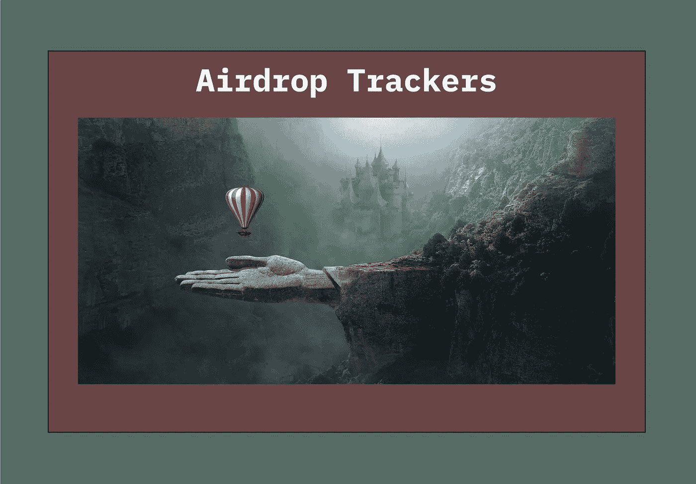

# DeFi 工具箱—第一部分

> 原文：<https://medium.com/coinmonks/a-defi-tool-box-part-one-6c6573bb2f82?source=collection_archive---------20----------------------->

# 你已经到了，现在怎么办？

欢迎区块链的新来者提供创建钱包的所有必要信息，以及如何从法定货币过渡到正在使用的主要加密货币。这些信息在大多数区块链的主要网站上都很容易找到(带有有用的链接)。例如，在西蒙·查德威克领导的 Terra Blockchain 中，Loop Finance 创造了一种名为 Loop Learn 的美丽学习体验。这个收藏已经给人留下了深刻的印象，一旦这个系列的视频完成，任何人都可以获得大量的资源库。

作为新用户，一旦我们学会了基础知识，建立了自己的钱包，我们就可以靠自己开始探索了。然而，如果我们每天都使用 crypto，我们会很快发现我们需要更多的工具来有效地浏览区块链广阔的互联网。我们需要许多工具来跟踪我们的投资组合、获取定价信息、访问分散的交易所、创建策略和执行专门的任务。

对于宇宙中的区块链，我准备了一份对我非常有帮助的工具清单。我的目标是分享信息，希望你能在这里找到有用的东西。在本系列的第一部分中，我将它们分类如下:

*   投资组合跟踪器
*   区块链探索者
*   价格追踪器和图表工具
*   空投跟踪器
*   区块链生态系统列表
*   域名服务

# 一直在寻找越来越多的应用

在与您一起深入研究这些工具之前，我想提出一些重要的观察结果。首先，我仍然完全沉浸在我的探索中，我正慢慢地穿越宇宙区块链；换句话说，在我写这篇文章的时候，我还没有登陆区块链。第二，我的注意力完全集中在 DeFi 上。第三，我几乎没有研究过任何元宇宙、游戏和 NFT 协议；因此，这里没有关于这些新兴加密领域的信息。第四，随着我们进入每个后续的 DeFi 工具箱章节，应用程序和工具将会越来越先进。毕竟目标是成为见多识广的德根！最后，随着我发现更多优秀的应用程序添加到我们的工具箱中，我计划提供更新。

让我们开始吧。

至少可以说，投资组合追踪器领域非常拥挤，我已经尝试了几十种。毫无疑问，Apeboard 是我用过的最有用的投资组合跟踪工具。因为我是一个热心的实验者，我为许多不同的区块链创造了许多不同的钱包。在撰写本文时，Apeboard Finance 支持 34 个不同区块链的 327 种协议，并且他们还在定期添加更多协议。你所要做的就是输入你的钱包地址，然后你就会得到一个有价值的投资组合数据的完整列表。此外，您还可以添加多个钱包并设置一个档案，您可以将该档案添加到书签中以供日后参考。为了进一步阅读，我在下面的源代码部分留下了 Pete Stablecoin 关于 Apeboard 的文章的链接。

[https://apeboard.finance/dashboard](https://apeboard.finance/dashboard)

在我看来，Delta Investment Tracker 的移动应用程序在跟踪个人交易方面非常出色。它们可以从主要的应用程序商店获得。你可以创建多个投资组合，并列出许多主要的加密硬币和代币，这意味着他们不断跟踪市场，更新你的立场。对于未列出的令牌，您仍可以将其作为自定义令牌添加到您的投资组合中；但是，它们不会自动跟踪市场价格。

https://delta.app/en/crypto-tracker

区块链浏览器是参考交易、审查钱包和验证代币、流动性对和合同地址的无价工具。

https://terrascope.info/

地形探测器—[https://finder.terra.money/](https://finder.terra.money/)

TerraScope 和 Terra Finder 是用于 Terra 区块链的区块链探险者。Mintscan 是宇宙区块链公司使用的最受欢迎的区块链探测器:

[https://www.mintscan.io/cosmos](https://www.mintscan.io/cosmos)

当你点击页面顶部的方框，你可以直接访问 37 个不同的区块链区块链探险家！

可能因为我对这种快节奏和令人兴奋的技术还不熟悉，所以我是一个狂热的价格观察者。我发现目睹当地事件、全球影响、公告或新功能发布对代币或代币集合的价格的影响非常有趣。在这个类别中有许多很好的应用和选择，但是所有价格跟踪和图表工具中的王必须是交易视图。

**对于价格**:

[https://www . trading view . com/markets/cryptocurrences/prices-all/](https://www.tradingview.com/markets/cryptocurrencies/prices-all/)

**对于图表**:

【https://www.tradingview.com/chart/ 

特别是对于区块链，Coinhall 是不可或缺的。除了为泰若 AMM 和德克斯的几乎每一笔代币交易提供便捷的价格跟踪工具和图表外，Coinhall 还作为一个聚合器运作，实现“最佳价格互换”。我在下面的资源部分留下了一篇关于 Coinhall 的文章。

[https://coinhall.org/](https://coinhall.org/)

OsmosisZone 有一个信息页面，列出了 AMM 代币交易的所有价格数据。除了拥有漂亮的用户界面之外，这些页面包含的信息量也非常丰富。信息不仅可用于单个代币，也可用于流动性对。点击一个特定的令牌，打开的不仅仅是价格、流动性和交易量信息，还有十页的交易记录，当然还有图表。我还建议点击“打开专家图表”，因为它可以让您即时访问令牌的整页交易视图。

[https://info.osmosis.zone/](https://info.osmosis.zone/)

值得一提的是，Cosmos Pug 提供了十几种 JunoNetwork 专用令牌的价格和图表。

[https://cosmospug.com/charts/](https://cosmospug.com/charts/)

此外，BronBro 的 Monitor 应用程序在 18 个不同的仪表盘上显示价格、统计数据和图表，包括 Juno Network 和 Osmosis。

[https://monitor.bronbro.io/d/juno-stats/juno-stats?orgId=2&刷新=5s](https://monitor.bronbro.io/d/juno-stats/juno-stats?orgId=2&refresh=5s)

有关秘密网络上的链上分析数据、合同地址和 LP 对信息，请查看:

秘密分析—[https://secretanalytics.xyz/](https://secretanalytics.xyz/)

最后，更一般的网站是非常有用的检查价格，TVL，和大量的区块链和协议，包括许多来自 Terra 和 Cosmos 的硬币和代币的体积信息。

DeFiLlama—[https://defillama.com/](https://defillama.com/)

https://coinmarketcap.com/

https://www.coingecko.com/

在区块链土地上的空投已经明显放缓；然而，在另一个宇宙区块链有许多空投。我提供了多个跟踪应用程序的链接，以检查当前和即将到来的空投。

Terra 的智能桩—【https://terra.smartstake.io/airdrops 

宇宙智能桩—【https://cosmos.smartstake.io/airdrops 

CosmicPug 空投—[https://cosmospug.com/airdrops/](https://cosmospug.com/airdrops/)

宇宙空投—[https://www.cosmosairdrops.io/](https://www.cosmosairdrops.io/)

随着项目在宇宙中启动，捕捉未来空投的提示:stake ATOM、OSMO、SCRT 和 JUNO tokens！我还在下面的来源部分留下了 AshCoin 的一篇文章。它更深入地保护你的空投份额。

下面提供的各种生态系统列表和地图的链接本身有大量链接指向正在进行和即将进行的项目、协议和应用程序。这些是我开始研究的地方，任何时候我准备好学习新的东西或者寻找新的机会。

Terra 项目列表的 smart stake—[https://terra.smartstake.io/projects](https://terra.smartstake.io/projects)

Terra 生态系统地图的 smart stake—[https://terra.smartstake.io/eco](https://terra.smartstake.io/eco)

土地生态系统列表—[https://www.terra.money/ecosystem](https://www.terra.money/ecosystem)

Cosmos 生态系统应用和服务—[https://cosmos . network/ecosystem/apps/](https://cosmos.network/ecosystem/apps/)

Juno 网络生态系统—[https://www.junonetwork.io/ecosystem](https://www.junonetwork.io/ecosystem)

秘密网络生态系统—[https://scrt . Network/ecosystem/dapps](https://scrt.network/ecosystem/dapps)

坚持一个网络生态系统—[https://persistence.one/](https://persistence.one/)

创建你自己的域名，并把它绑在你的钱包上，现在可以在 Terra 区块链使用 TNS，Terra 名称服务。他们还推出了自己的令牌(TNS)，并完成了一项利润丰厚的空投活动。我在下面的源代码部分留下了 Ben Kageyama 关于 TNS 的循环文章的链接。

[https://tns.money/](https://tns.money/)

Juno 网络还有一个名称服务:(de)NS — Juno 名称服务。这些名称是随 JUNO 一起购买的。我在下面的源代码部分留下了 Cooper 关于(de)NS 的 Loop 文章的链接。

https://dens.sh/

但是，早在这两个名字服务创建并上线之前，Starname 就在 2020 年 8 月推出了！Starname 尚未与 Keplr 或 TerraStation 钱包建立联系。不过如果你是 Cosmostation 用户，可以链接钱包。Starname 使用 IOV 代币作为交易媒介，IOV 可以通过渗透购买。

【https://www.starname.me/ 

Evmos 区块链正在建立一个名称服务，目前计划在 5 月初推出 mainnet。他们也将发布自己的令牌(EVNS ),并计划空投。

[https://evmosnameservice.com/](https://evmosnameservice.com/)

# 旅程继续，还有额外奖励

这只是该系列的第一部分，在第二部分，我将提供有关贸易和农业应用程序和工具的信息。同时，我在下面的资源部分为您收集了额外的资源。我添加了视频和 YouTube 内容制作者的链接，我从他们那里学到了很多，并定期观看以保持更新。

Wordt vervolgd — Opa。

# 资料来源、参考文献和进一步阅读

Pete Stablecoin 关于 Apeboard 的循环文章—[https://www . Loop . markets/ape-board-cross-chain-defi-dashboard/](https://www.loop.markets/ape-board-cross-chain-defi-dashboard/)

我关于 CoinHall 的循环文章—[https://www.loop.markets/terras-monitoring-station/](https://www.loop.markets/terras-monitoring-station/)

AshCoin 关于宇宙空投的循环文章

[https://www . loop . markets/airdrop-season-on-the-cosmos-terra/](https://www.loop.markets/airdrop-season-on-the-cosmos-terra/)

Ben Kageyama 关于 TNS 的 Loop 文章—[https://www . Loop . markets/simplify-your-terra-address-with-terra-name-service/](https://www.loop.markets/simplify-your-terra-address-with-terra-name-service/)

Cooper 关于(de)NS 的 Loop 文章—[https://www . Loop . markets/intro ucing-de-NS-name-service-on-Juno-network/](https://www.loop.markets/introucing-de-ns-name-service-on-juno-network/)

专注于宇宙区块链和特拉区块链的视频和 YouTube 内容制作者:

[循环学习](https://learn.loop.markets/)

[Cryptocito — YouTube](https://www.youtube.com/channel/UCE1JHFSfUWcXVyzV3KGA9Fw)

[被解放的姜戈——YouTube](https://www.youtube.com/c/ChjangoUnchained)

[IBC 帮——YouTube](https://www.youtube.com/c/IBCGANG)

[对加密充满信心——YouTube](https://www.youtube.com/c/ConfidentinCrypto)

[Terra Bites——YouTube](https://www.youtube.com/c/TerraBites)

[danku_r — YouTube](https://www.youtube.com/c/dankur)

[财富小贴士——YouTube](https://www.youtube.com/c/TheWealthTip)

[反抗者定义——YouTube](https://www.youtube.com/c/RebelDefi)

Terra Money TV-YouTube

人们把它描述为“Terra 的图书馆”、“Terra 的社区”、“你写作挣钱的地方”。自己来看看 Loop 社区有多牛逼: [https://www.loop.markets？ref=52879](https://www.loop.markets/?ref=52879)

> 加入 Coinmonks [电报频道](https://t.me/coincodecap)和 [Youtube 频道](https://www.youtube.com/c/coinmonks/videos)了解加密交易和投资

# 另外，阅读

*   [3 商业评论](/coinmonks/3commas-review-an-excellent-crypto-trading-bot-2020-1313a58bec92) | [Pionex 评论](https://coincodecap.com/pionex-review-exchange-with-crypto-trading-bot) | [Coinrule 评论](/coinmonks/coinrule-review-2021-a-beginner-friendly-crypto-trading-bot-daf0504848ba)
*   [莱杰 vs Ngrave](/coinmonks/ledger-vs-ngrave-zero-7e40f0c1d694) | [莱杰 nano s vs x](/coinmonks/ledger-nano-s-vs-x-battery-hardware-price-storage-59a6663fe3b0) | [币安评论](/coinmonks/binance-review-ee10d3bf3b6e)
*   [Bybit Exchange 评论](/coinmonks/bybit-exchange-review-dbd570019b71) | [Bityard 评论](https://coincodecap.com/bityard-reivew) | [Jet-Bot 评论](https://coincodecap.com/jet-bot-review)
*   [3 commas vs crypto hopper](/coinmonks/3commas-vs-pionex-vs-cryptohopper-best-crypto-bot-6a98d2baa203)|[赚取加密利息](/coinmonks/earn-crypto-interest-b10b810fdda3)
*   最好的比特币[硬件钱包](/coinmonks/hardware-wallets-dfa1211730c6) | [BitBox02 回顾](/coinmonks/bitbox02-review-your-swiss-bitcoin-hardware-wallet-c36c88fff29)