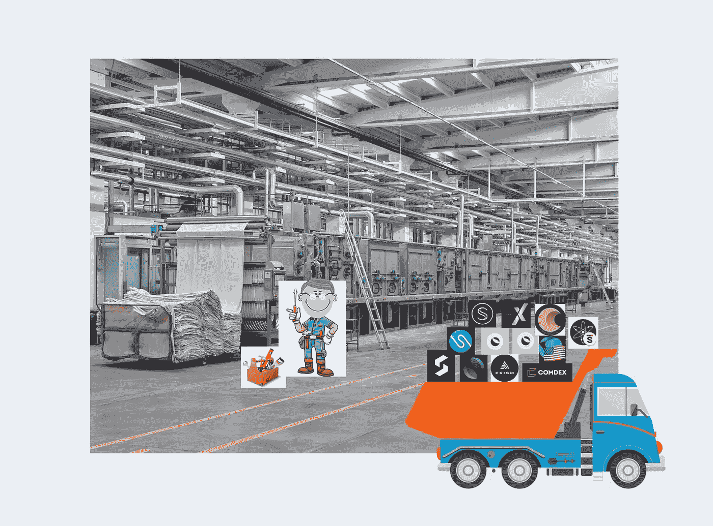
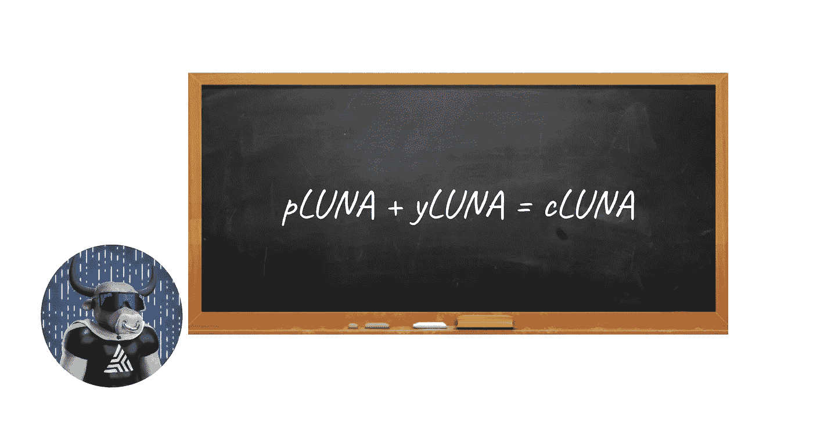
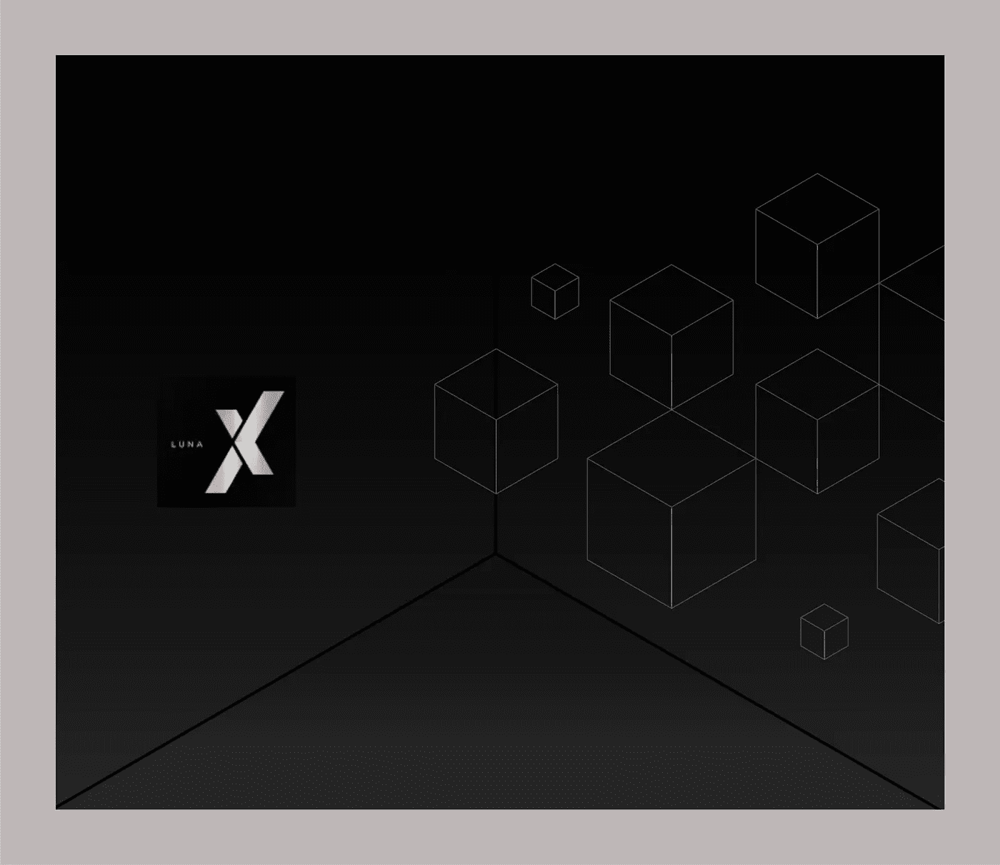
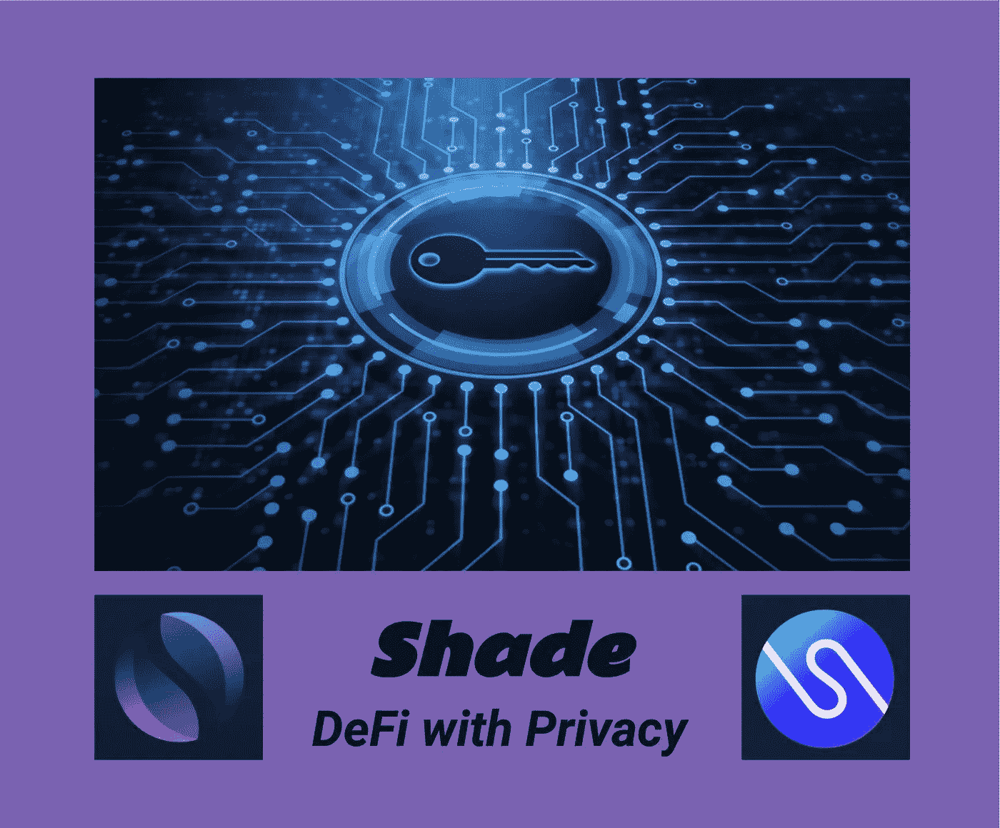
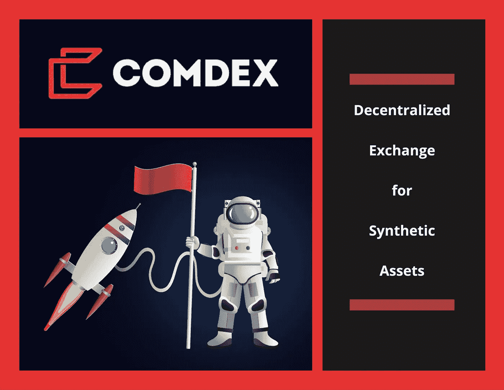
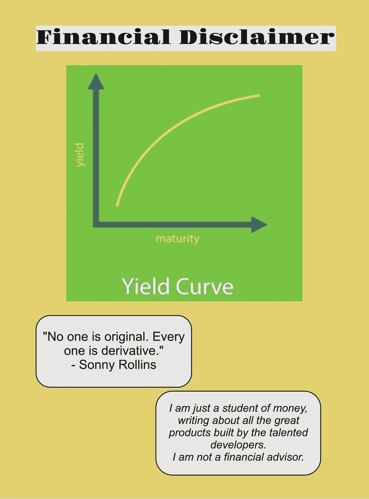

# DeFi 工具箱—第四部分

> 原文：<https://medium.com/coinmonks/a-defi-toolbox-part-four-4dc30be0ad80?source=collection_archive---------13----------------------->

# （使）有一定上升

在本系列的前三部分中，我们看了一下投资组合监控和管理工具、交易和耕作工具以及借贷应用程序。在这个系列的最后一部分，让我们看看宇宙区块链的一些高级工具和应用程序。具体来说，我想把包含衍生品的高级 DeFi 策略添加到我们的工具箱中。我还想展望未来，强调几个令人兴奋的即将推出的应用程序。

# 派生物

金融衍生品构成了全球超过 900 万亿美元的市场。在传统金融中，衍生品是指其价值取决于基础资产、一篮子资产甚至基准的合约。这些合同是由两方或多方签订的，在交易所或场外交易。价格来源于标的资产的价格波动。典型的例子是期货合同、远期、期权和互换。

尽管第一个比特币期货合约是在 2011 年推出的，但对加密市场而言，衍生品仍相对较新。最近的开发工作集中在这一领域，正如您将在下面看到的，几个创新的应用程序已经在区块链的大宇宙生态系统中推出。

# 折射月亮

谈到衍生品，区块链大地上的 Prism 协议已经成为新一代 DeFi 创新的代名词。在将我们的 LUNA 带到协议中时，我们看到了一种全新的技术，类似于传统金融中的优惠券剥离:数字资产的折射。露娜最初被分成两个相等的部分:

*   yLUNA——资产的收益率部分
*   pLUNA —资产的主要组成部分。

[https://prismprotocol.app/refract](https://prismprotocol.app/refract)

在完成折射后，协议随后提供具有标准赌注、增加赌注、流动性池和互换的收益生成选项。用户界面非常易于使用，协议在其仪表盘上提供了丰富的信息，包括统计数据、图表、产量和奖励。

可以部署许多策略来利用这些额外的衍生产品，包括套利机会、互换和对一套资产的奖励分配，既可以在协议内，也可以快速扩展到 Terra 区块链内的其他协议。限价单功能也被集成到协议的 DEX 中。

我已经写了一系列六篇文章，记录了 Prism 协议的历程，您可以在下面的资源部分找到链接。

# LUNAX

施塔德实验室为露娜提供了一种液体打桩衍生物。在 Stader 金库中下注我们的 LUNA 后，我们会收到一个名为 LUNAX 的液体代币，它在从 Stader 获得下注奖励的同时，还可以用于在 Loop、TerraSwap 和 Astroport AMM 赌场中提供流动性，从而获得额外的奖励。可能的配对包括卢娜、UST 和布鲁纳。

[https://terra.staderlabs.com/lt-pools](https://terra.staderlabs.com/lt-pools)

LUNAX 还可以作为 Edge Protocol 在区块链土地上的借贷应用的抵押品，以获得供应激励。

# 阴影衍生物

Shade Protocol 的第一个产品发布是秘密网络的 SCRT 令牌的液体赌注衍生品。在阴影协议中锁定 SCRT 后，我们得到了衍生的 stkd-SCRT。赌注 SCRT 将积累赌注回报，并可同时用于流动性提供，交易和贷款(很快)。

https://shadederivatives.io/

【https://app.shadeprotocol.io/staking-derivatives 

与 stkd-SCRT 的互换已经可以通过 ButtonSwap 和 SiennaSwap 实现。前四个流动性池已经在 SiennaSwap 上创建，将 stkd-SCRT 与 SIENNA、SSCRT、sUSDC 和 sXMR 配对。

[https://app . sienna . network/swap/pool](https://app.sienna.network/swap/pool)

SiennaSwap 是一个 AMM，支持大量数字资产，处理本地令牌与其秘密对等物的互换，并提供激励性的流动性池。SiennaLend 是借贷应用程序，将于 4 月底推出。

阴影协议自己的 SHD 令牌将很快跟进。与 SCRT 提供的一对一的衍生产品转换不同，衍生产品 stkd-SHD 将以每十个 SHD 一个的比例铸造。作为即将发行的丝绸稳定币的更大储备策略的一部分，Shade 将对其衍生金库进行超额抵押。

# 更具流动性的股份资产

Persistence One Network 上的 pSTAKE 和 Crescent Network 上的 Crescent DEX 都引入了流动的 staked 数字资产。

pSTAKE 的产品是在以太坊网络上铸造的，通过智能和复杂的转换过程将宇宙旗舰资产 ATOM 转换为 stkATOM。

[https://app.pstake.finance/](https://app.pstake.finance/)

Crescent DEX 最近推出了自己的流动资产。在标记 CRE 时，铸造液体令牌 bCRE。这种新资产可以在 DEX 上交易或出租，以获得流动性激励。bCRE 目前的农业配对包括:CRE、ATOM、UST 和 LUNA。

[https://app . crescent . net/swap](https://app.crescent.network/swap)

# 这么多正在进行中

即将推出的高级应用和工具包括从合成资产、期权和外汇市场交易到利用多资产金库、指数基金和更独特的衍生资产的高级策略。

预计将推出的第一个新协议是 Comdex One，该协议目前正处于 testnet 阶段，其第一套卫星集将进行合成交换。我花了相当多的时间在交换的测试网上，这给我留下了深刻的印象。用户界面是有组织的和漂亮的，功能是全功能的，提供的信息包括我们可能要求的一切。交易所包括衍生品的互换、耕种和借贷功能，这些功能代表了现实生活商品的符号化版本。在 Persistence One 网络上运行的新交易所推出的前三个资产是:cGOLD、cSILVER 和 cOIL。除了原生 CMDX 令牌，我们将能够在 IBC 存放和提取 ATOM、XPRT、OSMO、UST 和 LUNA 作为抵押资产。

【https://comdex.one/home 号

Quicksilver Protocol 将在今年第三季度推出，作为宇宙中的一个主权区块链，运营一个专门用于液体打桩的区域。一旦来自 Cosmos Hub 的链间安全 V1 上线，Quicksilver 将利用这一关键特性，并最初使用与该 Hub 相同的验证器集启动。它将能够迅速登上其他宇宙区域，并提供液体打桩服务。通过 Quicksilver 对流动资产的创新设计，治理权、空投资格和奖励收集都将成为可能。

【https://quicksilver.zone/ 

区块链的 Nebula 协议和区块链的 Konstellation Network 的 VegaX 都将提供基于索引的策略。通过数字资产的集群或篮子，这些投资策略跟踪受欢迎的行业或类别，包括例如蓝筹股、稳定股、DeFi 或以生态系统为中心的股票。

[https://app.neb.money/#/gov](https://app.neb.money/#/gov)

[https://vegaxholdings.com/](https://vegaxholdings.com/)

适马金融公司将在区块链推出期权交易。该协议刚刚发布了白皮书:

[https://sig.finance/sigma_wp.pdf](https://sig.finance/sigma_wp.pdf)

Vertex Protocol 也将在 Terra 区块链推出，它将创建一个加密外汇市场、交易永久掉期和交易杠杆现货。

[https://vertexprotocol.io/](https://vertexprotocol.io/)

Neptune Finance 将推出杠杆收益率农业策略，可通过其自动化金库进行部署。他们还将为自己的金库提供清算保护。协议将在区块链星球启动。

https://nept.finance/

最后但同样重要的是，Levana Finance 将推出其创新型衍生品，首先是其永久互换平台。

当 Levana 上线时，该计划要求推出其第一个令牌，即 Levana 杠杆指数(LLI)令牌。我们将能够利用 LLI 在我们感兴趣的资产池中获得杠杆头寸。LLI 代币将根据《列瓦纳议定书》铸造，代表该资产池的所有权地位。我们将能够简单地交换我们的代币或硬币，使用 Terra 中的一个 AMM。第一个例子是卢娜，我们可以用卢娜换一个卢娜 2X-LLI 代币。目的是让这些交换在 AMM 的阿斯特罗波特进行，并随后扩展到 AMM 的其他地方。最后，Levana 还将利用 Mars 协议借贷市场。

【https://www.levana.finance/ 

# 不适合胆小的人

在这个由四部分组成的系列的每一篇后续文章中，我们都增加了工具和应用程序的复杂性。随着应用程序和工具越来越复杂，使用它们的风险也增加了。智能合同更高级，并执行更高级的功能。存在失败和被利用的风险；然而，几乎所有协议都进行了内部和外部审计，以降低智能合同风险。

不管怎样，这些应用程序中的许多都不适合心脏虚弱的人。大多数公司的产品设计中都有数周的锁定期。流动资产的进出交易可能非常有利可图，但如果管理不当，也会导致抵押资产的部分或全部损失。

我在这里和下面的资源部分提供了所有协议、应用和工具的链接。我的目标是让你容易地获得你做研究所需的所有信息，并为利用 DeFi 中的这些创新准备你自己的策略。

# 系列结束了，但旅程还在继续

在我们结束 DeFi 工具箱系列时，有必要进行一下反思。我们武库中的工具数量迅速增长，有许多新的应用程序可以纳入我们的产品组合。仅仅几个星期的时间，我们就创造了一套有用的工具来帮助我们导航、互动和参与宇宙生态系统的区块链。

在这个蓬勃发展的生态系统中，似乎没有什么能减缓创新的步伐。随着通货膨胀加剧，供应链中断，健康问题，以及每天都在谈论即将到来的衰退，资产价格疲软是这些数字资产受到影响的唯一迹象。新应用、工具、实用程序甚至整个区块链的发布公告每天都在发布。宇宙的成长是我冒险进入这个生态系统并将继续我的旅程的主要原因。我希望你喜欢这个系列，这里提供的信息可以帮助你进入这个美妙的数字货币领域。

他在门口喊——Opa。

# 资料来源、参考文献和进一步阅读

棱镜协议—[https://prismprotocol.app/](https://prismprotocol.app/)

斯塔德实验室—【https://staderlabs.com/ 

遮光协议—【https://shadeprotocol.io/ 

西耶娜网络—[https://sienna . Network/](https://sienna.network/)

按钮交换—[https://btn.group/secret_network/button_swap](https://btn.group/secret_network/button_swap)

坚持一个 https://persistence.one/区块链—

pSTAKE 协议—[https://pstake.finance/](https://pstake.finance/)

新月网—[https://crescent . Network/](https://crescent.network/)

https://comdex.one/home

来自 https://youtu.be/8JCNpQaes6g IBC 帮的 Comdex Testnet 视频—

水银地带—@水银地带

konstellation Network—[https://konstellation.tech/](https://konstellation.tech/)

https://vegaxholdings.com/

星云协议—@星云协议

适马财经— @sig_finance

顶点协议—@顶点协议

海王金融—[https://nept.finance/](https://nept.finance/)

莱万那议定书—[https://www.levana.finance/](https://www.levana.finance/)

**我的关于 Prism 协议的循环文章**:

1.变身露娜[https://www.loop.markets/transforming-luna/](https://www.loop.markets/transforming-luna/)

2.一个新的协议被伪造——https://www.loop.markets/a-new-protocol-is-forged

3.获得月神的力量——【https://www.loop.markets/derive-the-power-of-luna/】T4

4.折射月神—[https://www.loop.markets/refracting-luna/](https://www.loop.markets/refracting-luna/)

5.棱镜智能农业—[https://www.loop.markets/intelligent-farming-with-prism/](https://www.loop.markets/intelligent-farming-with-prism/)

6.我得不到尊重—[https://www.loop.markets/i-get-no-respect/](https://www.loop.markets/i-get-no-respect/)

人们把它描述为“Terra 的图书馆”、“Terra 的社区”、“你写作挣钱的地方”。自己来看看 Loop 社区有多牛逼: [https://www.loop.markets？ref=52879](https://www.loop.markets/?ref=52879)

> 加入 Coinmonks [电报频道](https://t.me/coincodecap)和 [Youtube 频道](https://www.youtube.com/c/coinmonks/videos)了解加密交易和投资

# 另外，阅读

*   [OKEx vs KuCoin](https://coincodecap.com/okex-kucoin) | [摄氏替代品](https://coincodecap.com/celsius-alternatives) | [如何购买 VeChain](https://coincodecap.com/buy-vechain)
*   [ProfitFarmers 回顾](https://coincodecap.com/profitfarmers-review) | [如何使用 Cornix Trading Bot](https://coincodecap.com/cornix-trading-bot)
*   [如何匿名购买比特币](https://coincodecap.com/buy-bitcoin-anonymously) | [比特币现金钱包](https://coincodecap.com/bitcoin-cash-wallets)
*   [瓦济里克斯 NFT 评论](https://coincodecap.com/wazirx-nft-review) | [比茨盖普 vs 皮奥克斯](https://coincodecap.com/bitsgap-vs-pionex) | [坦吉姆评论](https://coincodecap.com/tangem-wallet-review)
*   [如何使用 Solidity 在以太坊上创建 DApp？](https://coincodecap.com/create-a-dapp-on-ethereum-using-solidity)