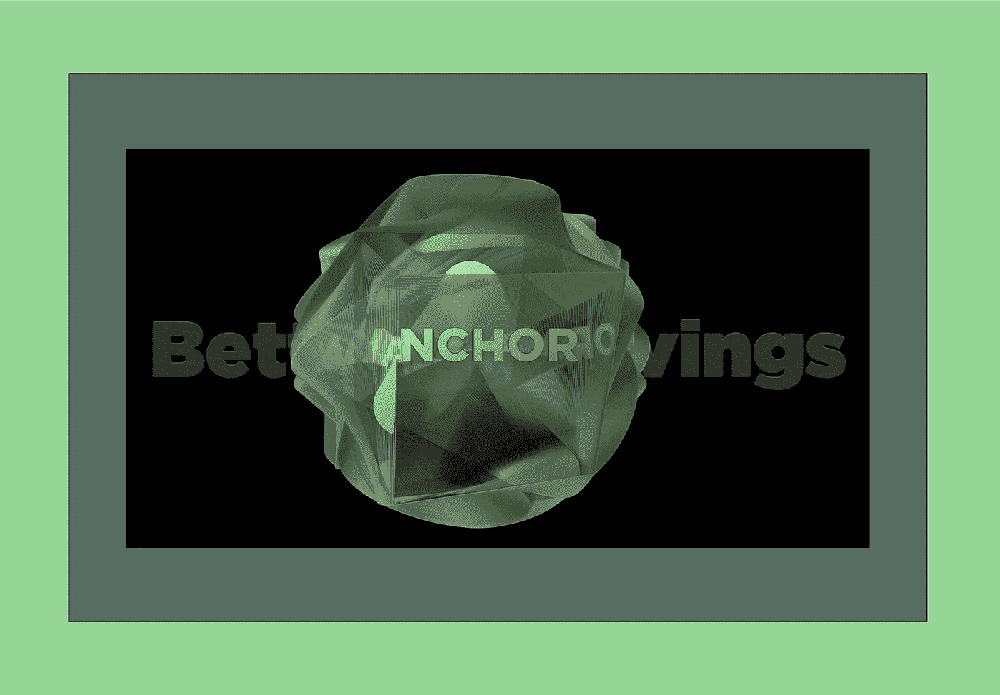

# DeFi 工具箱—第三部分

> 原文：<https://medium.com/coinmonks/a-defi-toolbox-part-three-516f182f0cb1?source=collection_archive---------26----------------------->

# 我们需要一个车库

在 DeFi 工具箱系列的第三部分中，让我们看看区块链宇宙中的借贷应用程序和工具。当我们看一看这个不断增长的 DeFi 应用领域时，请记住，货币市场需要借贷双方。换句话说，如果你对利用借款机会不感兴趣，你可能仍然想考虑成为贷款人。正如你将会看到的，纯粹作为一个贷款人来存放你的资产会有非常丰厚的收益。

另一方面，我们的工具箱在快速增长，我正在积极寻找借东西的机会，为我们所有的工具建一个车库！

# 卡瓦网络

卡瓦网络是一个区块链，它开发了一个包含以太坊和宇宙的共链架构。Kava 有一个内置的 DEX 来执行掉期交易，一个 Mint dApp 用于在其本地 stablecoin USDX 铸造贷款，还有一个 Lend dApp 用于货币市场产品。

在卡瓦交换，目前有十三个资产支持。

[https://app.kava.io/swap/trade](https://app.kava.io/swap/trade)

其中 9 项资产由卡瓦铸币厂支持，可用作抵押在 USDX 借贷。

【https://app.kava.io/mint 号

卡瓦贷款是货币市场功能移动到另一个水平，因为我们现在可以提供九个支持资产中的任何一个，并打开了一整套的可能性。具体来说，我们可以:

*   赚取年百分比收益率(APY)
*   赚取额外的 APY 作为奖励，以金币、卡瓦金币、AKT 金币或这些代币的组合支付
*   根据您提供的代币借款，并获得任何受支持的代币
*   将借用的代币重新提供给卡瓦借出池
*   用借来的代币向卡瓦互换池提供流动性。

【https://app.kava.io/lend 

在写这篇文章的时候，Kava Lend 正在运行一个 Surge 事件来引入更多的 ATOM 和 AKT 存款。参与 Surge 活动并为您提供 ATOM 和 AKT 的 APY 目前为这两种代币提供了超过 40%的优惠，远远高于您下注所能获得的优惠。随着越来越多的资产被加入缓冲池，APY 股市的下跌将带来回报，但仍将保持高位。

[https://app.kava.io/atom-surge](https://app.kava.io/atom-surge)

[https://app.kava.io/akt-surge](https://app.kava.io/akt-surge)

请注意，卡瓦贷款奖励是在 1-12 个月的授权时间表中支付的。此外，额外的浪涌事件将在未来增加，下一个硬币预计将是 UST 和露娜。最后，如果你选择用你提供的资产来借款，你必须积极地管理你的借款头寸，因为资产价格的大幅下跌将会清算你。

# 红岸

火星协议最近在特拉区块链启动，在一个多月的时间里已经积累了 1.76 亿 UST，近 800 万美元的 ANC 代币和超过 4300 万美元的 LUNA 硬币。APY 的存款供给仍然极低，但借贷利率也是如此。玛氏还引入了三个杠杆产量养殖池，并将其命名为玛氏田地。

[https://app.marsprotocol.io/#/](https://app.marsprotocol.io/#/)

随着其他协议通过治理投票的进行，预计会有更多的存款令牌和产品。MARS token 持有者可以下注并获得一个液体 xMARS token 作为回报。随着时间的推移，这种流动赌注令牌会升值，因为借款人 10%的费用用于购买 MARS 令牌并加入 xMARS 赌注池。APY 目前仅为 0.26%，但预计将随着红岸的增长而增加。

# 边缘协议

Edge 协议目前处于测试阶段，是区块链的一个货币市场。有九种不同的资产可以提供，它的开始很有希望，已经超过了 4300 万美元的存款，并接近 7000 万美元的初始上限。有趣的是，创世池包括原生 LUNA 和四种不同的变体。除了原始的 Terra 资产，MIR 和 ANC，UST 和 aUST 也可以被供应。除了两个例外，借款利率在整个 Genesis 池中是有竞争力的。

https://app.edgeprotocol.io/pool

你可以简单地存放你的资产，利用上市的 APY；然而，你也可以提供你的资产作为抵押品，通过能够以你的抵押品借入资金池中的任何资产来提高你的借款能力。用户界面易于导航，过程也很简单。

与传统金融中抵押借款所涉及的一切相比，这是 DeFi 应用程序力量的真实展示。请注意，这只是测试版，它是实验性的，旨在展示 Edge 的能力。完整的协议要到夏天才会发布，目标是让其他协议在 Edge 上发布。

# 动态货币

作为自付贷款，动能货币刚刚推出了一个非常创新的协议。将 UST 作为抵押品存入银行后，用户可以用他们的抵押品资产的未来收益来借款。借入的资金以 kUST 支付，这是一种可以在 DeFi 的其他地方使用的流动性代币。Phaser 应用程序是协议的一部分，旨在保持 UST 和 kUST 之间 1:1 的联系。

在偿还贷款后可以立即提款，或者贷款随着时间的推移自动偿还，并从抵押品中获得收益。如果没有贷款，收益会累积在抵押品上，增加你未来的借贷能力。

[https://app.kinetic.money/vault](https://app.kinetic.money/vault)

UST 只是第一笔抵押资产，预计以后还会推出更多。

# 锚协议

在 Terra 区块链最初的创始协议之一，锚协议是一个生产机器。存款人带来 UST，经过一个非常简单的过程，将泰铢加入 Anchor Earn，然后收到一张存款收据。流动性代币 aUST 随着时间的推移而升值，目前的汇率为 19.5% APY。换句话说，当 UST 的 aUST 被烧毁时，根据你持有的时间长短，你将获得比你最初存入的更多的 UST。

在接下来的三个月里，主播收入预计至少会每月下降 1.5%。最近推出的动态利率将最低利率定为 15%；然而，这可以通过未来的治理来改变。这一动态利率与收益率准备金挂钩，随着越来越多的储户选择 UST，而借款人选择抵押资产并以此为抵押借款，收益率准备金不断被耗尽。

https://app.anchorprotocol.com/earn

在货币市场的借款方，有四种资产可以作为抵押品纳入协议，以便借入 UST:

bLUNA——可在锚内粘合和铸造

贝丝——与以太坊上的丽都粘合

bATOM —在 Persistence One 上与 pSTAKE Finance 绑定

瓦萨瓦克斯——雪崩时与本齐粘合。

【https://app.anchorprotocol.com/basset/bluna/mint 

[https://anchor.lido.fi/](https://anchor.lido.fi/)

[https://app.pstake.finance/anchor](https://app.pstake.finance/anchor)

[https://staking.benqi.fi/stake](https://staking.benqi.fi/stake)

就像卡瓦一样，当基础担保资产的价格低于既定的借款限额水平时，贷款就会被清算。与卡瓦不同的是，在区块链土地上有一个精心设计的清算过程(稍后会有更多介绍)。虽然绑定 LUNA 的过程非常简单，并且可以毫不费力地执行，但对于其他三个资源来说却不是这样。一个捷径是使用 Terra 上的三个 AMM 中的一个切换到 bLUNA，bETH 或 wasAVAX 然而，bATOM 的流动性池还不可用。

# Nexus 协议

管理锚借用是描述这一区块链大地上创新协议的最佳方式。Nexus 在幕后为其客户处理所有抵押品管理，以其治理令牌 Psi 的形式支付收益。Nexus 目前有三个自动锚借用金库:bLUNA、bETH 和 wasAVAX。一旦这些保税资产被存入金库，Nexus 提供了一个流动的 nAsset，然后可以在流动性池中进行大量的 APR。同样，奖励以 Psi 令牌的形式支付，可以在治理中下注以获得更多收益(这次是自动复利)。

[https://terra.nexusprotocol.app/vaults](https://terra.nexusprotocol.app/vaults)

所有这些选项都不需要锁定。如果你想通过借款从锚定资产中获得额外收益，但不想自己主动管理 LTV 头寸，Nexus 是一个绝佳的机会。

# 贷款清算

Terra 区块链有两个协议完全致力于清算的投标过程。这一过程以前是为财力雄厚的竞标者保留的，但现在任何有兴趣以折扣价获得清算资产的人都可以利用这一过程。

有了鲸声优协议 Orca 应用程序，用户可以向 UST 或 aUST 出价的市场数量迅速增加，包括 bLUNA、bETH、bATOM 和 wasAVAX。用户选择他们希望购买清算资产的折扣金额，他们的出价被放入相应的保险费率池中。在市场低迷时期，首先执行最低溢价的清算出价。

https://orca.kujira.app/

锁定在 bLUNA 和 bETH 清算池中的总价值已经高达数十亿美元；然而，其他市场较新，TVL 氏症较低。鲸声优的虎鲸应用程序也准备在 Avalanche 和 Polkadot 上发布。

最近进入清算竞价市场的是 Lighthouse DeFi。目前提供四个市场:bLUNA、bETH、sAVAX 和 bATOM。这个过程也非常简单，你选择你想要的出价金额和保险费率。一旦激活，您与 UST 的清算出价将等待执行。由于 Lighthouse 是新的，仍处于测试阶段，他们还没有收费，您只需为区块链上的交易处理支付汽油费。

[https://app.lighthousedefi.com/](https://app.lighthousedefi.com/)

# 未来的银行

虽然许多人认为这些协议是未来的银行，但必须记住几个重要的方面。最重要的是，将你的资金存入任何一个货币市场都有风险。智能合同风险、潜在的黑客攻击、桥接故障，甚至区块链暂停确实存在，并在 DeFi 中发生。DeFi 中有一些保险产品，但与传统金融机构提供的存款保险相比，它们就相形见绌了。换句话说，与传统银行提供的微不足道的收益率相比，你是否想追求这些高收益率的分析必须包括这些更高的风险水平。做你的研究是一个关键的组成部分，为了帮助你，我在资料部分放了一篇文章，其中我展示了一个对我有用的框架。

作为 DeFi 工具箱系列的最后一部分，我们将关注最近几周推出的衍生品、新应用和工具，以及未来几个月将在宇宙区块链推出的一些令人兴奋的 DeFi 应用和工具。

Wordt vervolgd — Opa。

# 资料来源、参考文献和进一步阅读

卡瓦·伦德—【https://app.kava.io/lend 

火星协议—【https://app.marsprotocol.io/#/redbank 

边缘协议—[https://app.edgeprotocol.io/pool](https://app.edgeprotocol.io/pool)

动能货币—[https://app.kinetic.money/vault](https://app.kinetic.money/vault)

锚协议—[https://app.anchorprotocol.com/](https://app.anchorprotocol.com/)

坚持一个 p take—[https://app.pstake.finance/anchor](https://app.pstake.finance/anchor)

利多—[https://anchor.lido.fi/](https://anchor.lido.fi/)

https://staking.benqi.fi/stake 本齐

Nexus 协议—[https://terra.nexusprotocol.app/](https://terra.nexusprotocol.app/)

https://orca.kujira.app/[鲸声优议定书](https://orca.kujira.app/)

灯塔协议—【https://app.lighthousedefi.com/ 

我的关于 Nexus 协议的循环文章—[https://www . Loop . markets/Nexus-Protocol-building-the-connections-for-the-future-of-money/](https://www.loop.markets/nexus-protocol-building-the-connections-for-the-future-of-money/)

我关于鲸声优协议的 Loop 文章—[https://www . Loop . markets/ku jira—反思—去中心化—贷款—清算/](https://www.loop.markets/kujira-rethinking-and-decentralizing-loan-liquidations/)

我的关于做项目研究的循环文章—[https://www.loop.markets/navigating-choppy-waters/](https://www.loop.markets/navigating-choppy-waters/)

人们把它描述为“Terra 的图书馆”、“Terra 的社区”、“你写作挣钱的地方”。自己来看看 Loop 社区有多牛逼: [https://www.loop.markets？ref=52879](https://www.loop.markets/?ref=52879)

> 加入 Coinmonks [电报频道](https://t.me/coincodecap)和 [Youtube 频道](https://www.youtube.com/c/coinmonks/videos)了解加密交易和投资

# 另外，阅读

*   [AscendEx 保证金交易](https://coincodecap.com/ascendex-margin-trading) | [Bitfinex 赌注](https://coincodecap.com/bitfinex-staking) | [bitFlyer 点评](https://coincodecap.com/bitflyer-review)
*   [Bitget 回顾](https://coincodecap.com/bitget-review)|[Gemini vs block fi](https://coincodecap.com/gemini-vs-blockfi)cmd |[OKEx 期货交易](https://coincodecap.com/okex-futures-trading)
*   [AscendEx Staking](https://coincodecap.com/ascendex-staking)|[Bot Ocean Review](https://coincodecap.com/bot-ocean-review)|[最佳比特币钱包](https://coincodecap.com/bitcoin-wallets-india)
*   [霍比审核](https://coincodecap.com/huobi-review) | [OKEx 保证金交易](https://coincodecap.com/okex-margin-trading) | [期货交易](https://coincodecap.com/futures-trading)
*   [网格交易机器人](https://coincodecap.com/grid-trading) | [Cryptohopper 审查](/coinmonks/cryptohopper-review-a388ff5bae88) | [Bexplus 审查](https://coincodecap.com/bexplus-review)