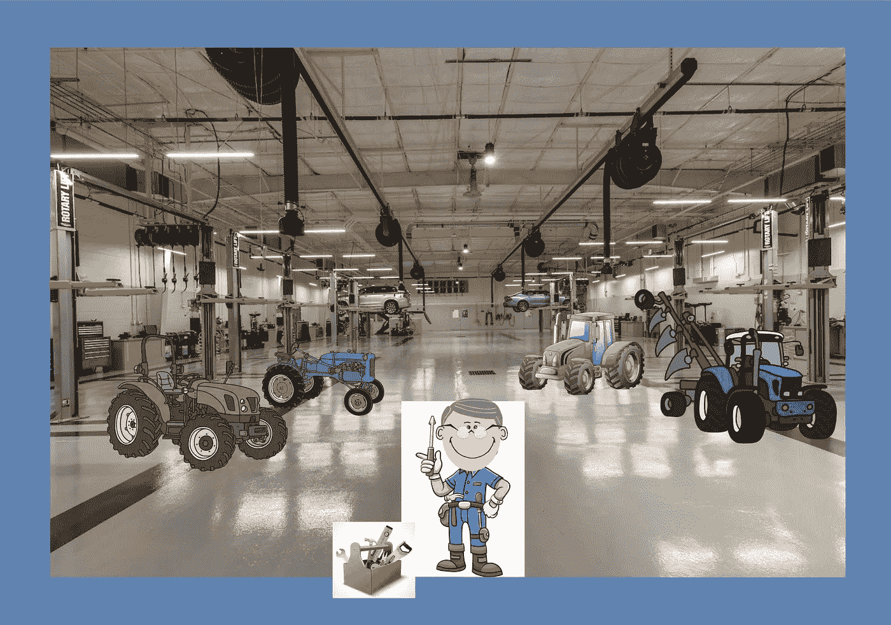
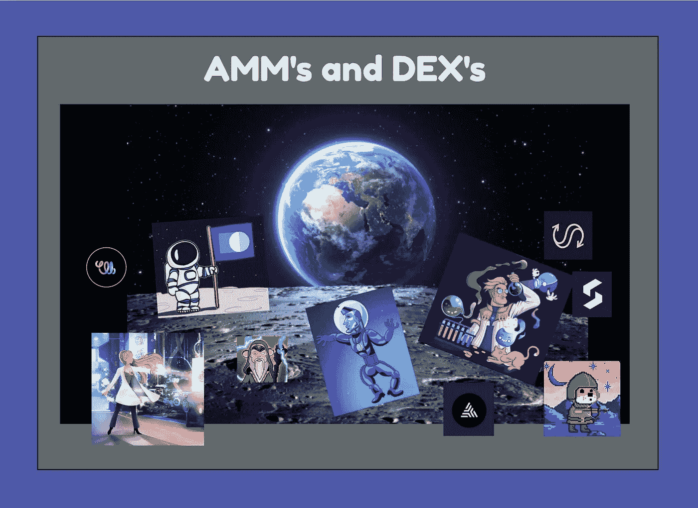
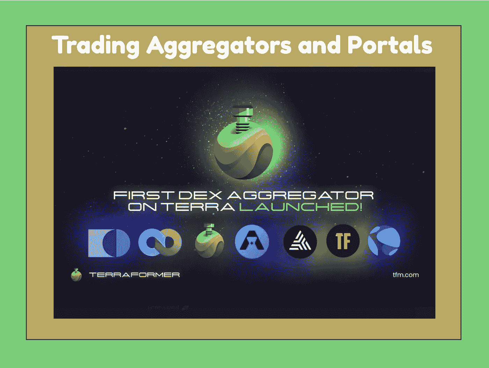
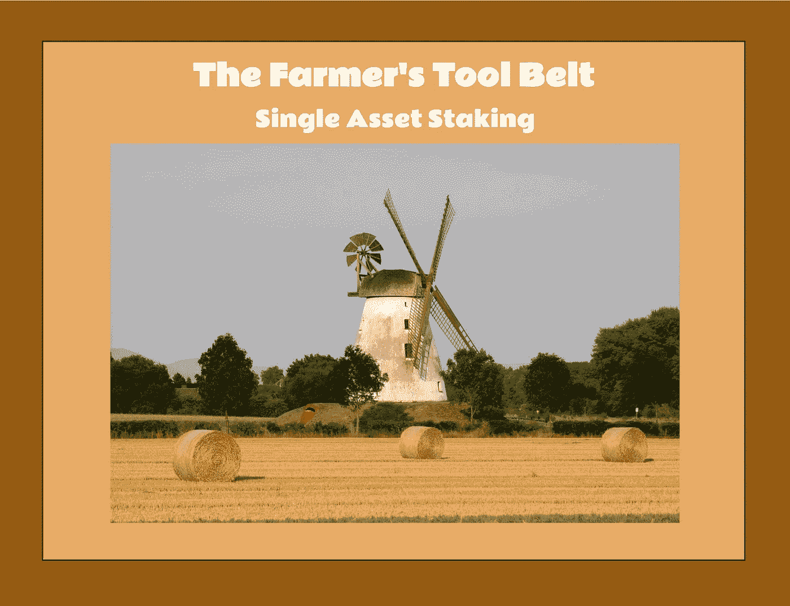
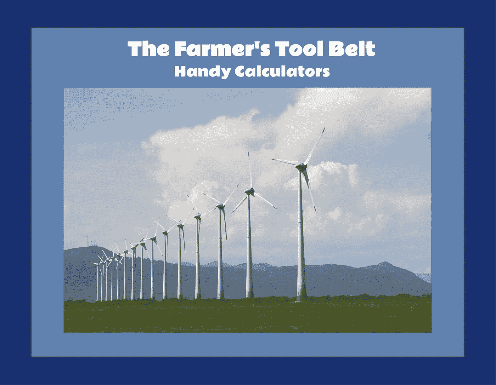
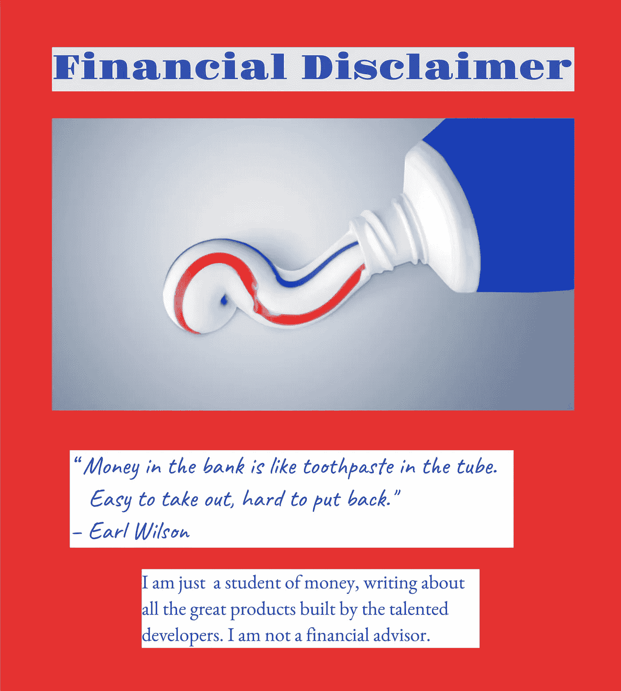

# DeFi 工具箱—第二部分

> 原文：<https://medium.com/coinmonks/a-defi-toolbox-part-two-f9bbfc97917d?source=collection_archive---------24----------------------->

# 工具箱展开

在构建 DeFi 工具箱的第一部分中，我们向我们的武器库中添加了应用程序和工具，以帮助我们跟踪投资组合、查找空投、探索区块链、了解最新的生态系统信息、绘制交易活动图表、监控价格，甚至设置域名。

在设置 DeFi 工具箱的第二部分中，让我们将贸易和农业工具和应用程序添加到我们的集合中。具体来说，让我们来看看目前为止我在旅程中发现的在 Terra 和宇宙区块链可用的工具。我把这些分成以下几类。

*   AMM 和德克斯的
*   交易聚合器和门户
*   农民的工具带—单一资产赌注
*   农民的工具带——流动性池
*   农民的工具带——方便的计算器

再次，记住我正在向你们报告我穿越更大宇宙的旅程。我一直在发现由才华横溢的开发人员开发的令人兴奋的新应用和工具。随着我们的发展，我们的目标是用越来越先进的工具来扩充我们的 DeFi 工具箱。

对于 Terra 区块链来说，当谈到交易、流动性池和激励性农业机会时，有许多选择。以下是最受欢迎的 AMM 和协议专用 DEX 列表。

https://dex.loop.markets/#Swap AMM 循环金融公司—

https://app.terraswap.io/[AMM](https://app.terraswap.io/)

https://app.astroport.fi/swap[AMM 航空港](https://app.astroport.fi/swap)

棱镜协议 DEX—[https://prismprotocol.app/](https://prismprotocol.app/)

特拉弗洛基·德克斯—[https://terrafloki.io/app/trade](https://terrafloki.io/app/trade)

我最近写了一篇比较四个 AMM 的文章，我在下面的资源部分留下了链接。令人惊讶的是，我分析的这些对比在三个月后仍然完全相关。与此同时，Loop AMM 已经进入 V2，增加了更多的 UI 改进，新的图表，增强的投资组合页面，扩展的仪表板页面，以及几个用于 swap，LP 和 farm 的 IBC 令牌。

从完全致力于经营 AMM 的两个区块链到在区块链经营的三个德克斯来处理他们特定的利基需求，我发现有许多跨宇宙的贸易和农业的惊人选择。

https://app.osmosis.zone/ AMM 渗透公司

https://sifchain-dex.forbole.com/#/swap AMM SIF chain

https://junoswap.com/

https://app.secretswap.net/swap

sienna swap DEX—[https://app . sienna . network/swap](https://app.sienna.network/swap)

此外，至少还有三个即将在 Cosmos 中推出，包括今年第二季度来自 Crescent Network 和 ComDex 的 DEX，以及第三季度的 Agoric AMM。

聚合器在许多不同的 DEX 上为你的交易寻找最好的价格。例如，在 TerraFormer 上，你不仅可以看到一个漂亮易用的用户界面，还可以看到你交易的最佳选择，以及它与其他选择的比较。我在下面的资源部分链接了一篇由 Lollipopo 写的关于 Terraformer 的文章。

地形改造者—[https://tfm.com/trade#Swap](https://tfm.com/trade#Swap)

兰戈交易所已经遍布八个生态系统和超过 27 个区块链。活跃的交易者有大量的选择。用户界面很好，也很容易使用。每笔交易的明确路线和相关费用都提前提供。我在下面的资源部分添加了一篇关于加密 Arpa 交换 Rango 的文章。

兰戈交易所—[https://app.rango.exchange/swap/BSC.BNB/TERRA.Luna/](https://app.rango.exchange/swap/BSC.BNB/TERRA.Luna/)

CoinHall 是一个令人惊叹的应用程序，不仅仅是 Terra 中跟踪价格和制图工具的最佳位置。他们也是一个聚合者。如果您想了解更多关于 CoinHall 的信息，可以看看我写的文章(参见下面的参考资料部分)。

coin hall—[https://coin hall . org/charts/terra/terra 1 M6 ywlgn 6 wrjuagcmmezzz 2 a 029 gtldhey 5k 552](https://coinhall.org/charts/terra/terra1m6ywlgn6wrjuagcmmezzz2a029gtldhey5k552)

虽然只有两个 Terra DEX 的合计，但必须特别提到 MiawTrader，因为在撰写本文时，它仍然是 Terra 区块链中一些最受欢迎的硬币和代币的限价单的去处。如果您想了解更多关于 MiawTrader 的知识，我在下面的源代码部分留下了我的文章的链接。

MiawTrader—[https://www.miaw-trader.com/home](https://www.miaw-trader.com/home)

MirrorMarket 是 Terra 中镜像生态系统的一个交易门户和仪表板。这是一个强大的工具，可以与来自 Mirror 的 masses 进行交互，并增加了额外的功能，包括对 masses 的限价单。有了 MirrorMarket，你可以跟踪你的大众投资组合，交易，借贷和农场。用户界面很漂亮，工作也很流畅。

镜像市场—[https://mirrormarket.finance/](https://mirrormarket.finance/)

当我们谈到镜子这个话题时，镜子追踪器应用程序对于分析咬肌的表现非常有帮助。除了图表之外，他们还提供策略解释、年度收益计算器和提醒服务。

镜像追踪器—【https://mirrortracker.info/ 

在秘密网络上，Button Swap 是一个 DEX 聚合器。他们支持大量代币的互换。原生令牌 BUTT 是用来收费的，如果你不想自己的屁股被看到，sBUTT 就是秘密的屁股版本。

按钮交换—【https://btn.group/secret_network/button_swap 

XDEFI 不仅仅是一个外观漂亮、易于使用的钱包，它还是一个 DEX 聚合器。你可以在十个不同的区块链之间交换代币，就在钱包里。你可以从下面的链接下载钱包的 chrome 扩展。我还在下面的资源部分提供了一篇来自 redmoon 的关于 XDEFI 的文章的链接。

XDEFI—[https://www.xdefi.io/](https://www.xdefi.io/)

对于单一资产农业，有几个很好的地方可以找到更新的年百分比率(APR)和年百分比收益率(APY)奖励信息。

赌注奖励提供所有主要区块链的赌注信息。

赌注奖励—[https://www.stakingrewards.com/cryptoassets/](https://www.stakingrewards.com/cryptoassets/)

对于宇宙特定的区块链，Keplr 最近更新了他们的用户界面，并添加了一个仪表板，上面装载了非常有用的信息。当你连接你的钱包，进入 Keplr 仪表盘，你可以看到你所有的赌注头寸的详细信息，包括金额、APR、资产分配和奖励。

Keplr 钱包—[https://wallet.keplr.app/#/dashboard](https://wallet.keplr.app/#/dashboard)

我最近写了一篇关于 Terra 和 Cosmos 中单一资产投资机会的详细文章。它充满了有价值的信息，当然我建议您看一看(参见下面的参考资料部分中的链接)。

到目前为止，关于激励性流动性池养殖，谈论最多的话题是非永久性损失。就我个人而言，我仍然质疑，当你专门购买代币用于耕种，而你以前并不拥有代币时，比较耕种和持有是否适用。不管怎样，流动性池和你在池中的份额的不断再平衡是真实的，必须小心管理。幸运的是，如果你仔细研究最佳的泳池，并选择合适的 AMM 进行养殖，你可以有效地控制再平衡效应，并获得一些真正有利可图的回报。

以下是我用来计算非永久性损失的最佳工具:

白板加密非永久性损失计算器—[https://whiteboardcrypto.com/impermanent-loss-calculator/](https://whiteboardcrypto.com/impermanent-loss-calculator/)

每日非永久性损失计算器—【https://dailydefi.org/tools/impermanent-loss-calculator/ 

芭蕾非永久损失计算器—【https://baller.netlify.app/ 

我所做的，以确保激励农业对我有利，是挑选 AMM 的，为我提供信息，使我在进入和退出泳池时做出正确的决定。那些列出所拥有的 LP 代币及其相关价值的 AMM 是好的，但最好的是那些也为我提供构成我的 LP 头寸的基础代币数量的那些。对于一些缺乏这方面信息的 AMM，你可以经常从 Apeboard Finance 获得详细信息。

有关农业流动资金池的新功能一直在增加。例如，渗透最近推出了超流体桩，我已经在下面的来源部分包括了一篇文章。在本文中，我介绍了从您的 LP 代币赚取额外奖励的机会。我已经测试了这个特性，我可以说它工作得非常好！

如果你在 Terra，世界上第二大的 DeFi 生态系统，并且你正在寻找最好的 APR，最好的 UI，和最容易使用的功能，看看 AMM 环路就知道了。V2 最近发布了 V3，Loop 团队已经准备好发布更多的功能。奖励在循环令牌中支付，您可以看到它们每小时累积一次。可以提取奖励，每周复利。投资组合和农场页面为您提供了您的 LP 值和累积奖励的详细信息。

循环农场—[https://dex.loop.markets/farm2](https://dex.loop.markets/farm2)

纵观宇宙，最好的农业 APR 的，功能，和最好的用户界面目前在 Sifchain 和渗透 AMM 的。奖励分别以 ROWAN 和 OSMO 代币支付。

Sifchain 农场—[https://sifchain-dex.forbole.com/#/pool](https://sifchain-dex.forbole.com/#/pool)

渗透农场—【https://app.osmosis.zone/pools 

所有可用池的详细信息都由 AMM 提供，包括 LP 值和您 LP 头寸的基础资产，这是一个非常有益的功能。Sifchain 每周一次将 ROWAN 奖励直接发放到您的钱包中，而 Osmosis 每天都这样做。

Dexmos 是一个非常有用的应用程序，可以查看每个渗透池的回报，按每天、每周、每月和每年细分。

https://www.dexmos.app/的德克斯莫斯—

JunoSwap DEX 已经开始填满其流动性池；然而，激励性的流动性农业还没有开始。当原始代币很快推出时，激励性流动性农场将推出其新的原生奖励代币。一些农场将获得双倍奖励，包括 JUNO-ATOM 和 JUNO-UST 池。

为了决定进入哪个农场并跟踪利率的影响，我喜欢使用计算器来节省我的时间并确定我的收入流是什么样的。

[https://www . calculate stuff . com/financial/compound-interest-calculator](https://www.calculatestuff.com/financial/compound-interest-calculator)

要了解复利对年收益率的影响，这里有另一个很好的计算器。

[https://www.calculatestuff.com/financial/apy-calculator](https://www.calculatestuff.com/financial/apy-calculator)

当我等待新的机会出现时，我总是确保我的 UST 没有闲着。为此，我使用 Anchor Earn，当它停在储蓄模块中时，赚取高 APY。更重要的是，我可以很快地赚进赚出。这里有一个很好的工具，看看你的存款表现如何，不要让你的 UST 闲置在你的钱包里有多有价值。

[https://science.flipsidecrypto.com/anchor_earnings/](https://science.flipsidecrypto.com/anchor_earnings/)

更进一步，您可以使用 Anchor Simulator 工具，跨多个 Terra 协议和提供的产品，特别是 Anchor、Mirror 和 Pylon，比较一项假设投资。在高级模式下，您可以对价格预测进行调整。

[https://anchor-simulator.com/](https://anchor-simulator.com/)

如果你打算把你的 UST 留在锚定收入更长的一段时间，这里有一个很好的提示。环路 AMM 有几个农场支付与 aUST 配对的代币的流动性激励，aUST 是我们在锚定收入中存入 UST 时收到的流动性存款收据。因此，当我们的澳元升值时，我们还可以以循环代币的形式获得额外奖励。

# 让我们继续前进

我希望这些信息对您有所帮助，并希望以这种方式对这些工具进行分类的价值能够为您在自己的旅程中提供参考。如果是这样的话，把这些文章收藏起来，作为一个方便的指南，当你需要的时候就可以切换回来。

让我们继续前进，在第三部分继续这个系列，看看一些高级工具，这些工具在我迄今为止的 DeFi 之旅中是不可或缺的。我还想准备一些真正令人兴奋的新应用和工具，它们就在眼前，旨在挑战我们的技能。

Wordt vervolgd — Opa。

# 资料来源、参考文献和进一步阅读

我关于渗透作用的 Loop 文章—[https://www . Loop . markets/next-stop-the-labs-of-defi-scientists/](https://www.loop.markets/next-stop-the-labs-of-the-defi-scientists/)

我的 Loop 文章比较了四个 AMM——[https://www . Loop . markets/loops——无意——史诗——大卫和三个巨人/](https://www.loop.markets/loops-unintentional-epic-david-and-the-three-goliaths/)

我的关于渗透超流的循环文章——https://www.loop.markets/the-next-generation-of-staking/

棒棒糖关于地形改造者的循环文章—[https://www.loop.markets/terraformer-aggregator-overview/](https://www.loop.markets/terraformer-aggregator-overview/)

关于兰戈交易所的加密 Arpa 循环文章—[https://www.loop.markets/rango-exchange/](https://www.loop.markets/rango-exchange/)

我关于 CoinHall 的循环文章—[https://www.loop.markets/terras-monitoring-station/](https://www.loop.markets/terras-monitoring-station/)

我关于 MiawTrader 的循环文章—[https://www.loop.markets/in-a-world-of-dogs-this-cat-rules/](https://www.loop.markets/in-a-world-of-dogs-this-cat-rules/)

关于 XDEFI 的红月亮循环文章—[https://www.loop.markets/defi-and-nft-wallet/](https://www.loop.markets/defi-and-nft-wallet/)

我关于单一资产农业的循环文章—[https://www.loop.markets/single-asset-farming/](https://www.loop.markets/single-asset-farming/)

你检查过 Loop 上所有精彩的内容吗？如果没有，那就自己来看看 Loop 社区有多牛逼: [https://www.loop.markets？ref=52879](https://www.loop.markets/?ref=52879)

> 加入 Coinmonks [电报频道](https://t.me/coincodecap)和 [Youtube 频道](https://www.youtube.com/c/coinmonks/videos)了解加密交易和投资

# 另外，阅读

*   [本地比特币评论](/coinmonks/localbitcoins-review-6cc001c6ed56) | [加密货币储蓄账户](https://coincodecap.com/cryptocurrency-savings-accounts)
*   [什么是融资融券交易](https://coincodecap.com/margin-trading) | [成本平均法](https://coincodecap.com/dca)
*   [支持卡审核](https://coincodecap.com/uphold-card-review) | [信任钱包 vs 元掩码](https://coincodecap.com/trust-wallet-vs-metamask)
*   [Exness 点评](https://coincodecap.com/exness-review)|[moon xbt Vs bit get Vs Bingbon](https://coincodecap.com/bingbon-vs-bitget-vs-moonxbt)
*   [如何开始通过加密贷款赚取被动收入](https://coincodecap.com/passive-income-crypto-lending)
*   [BigONE 交易所评论](/coinmonks/bigone-exchange-review-64705d85a1d4) | [电网交易 Bot](https://coincodecap.com/grid-trading)