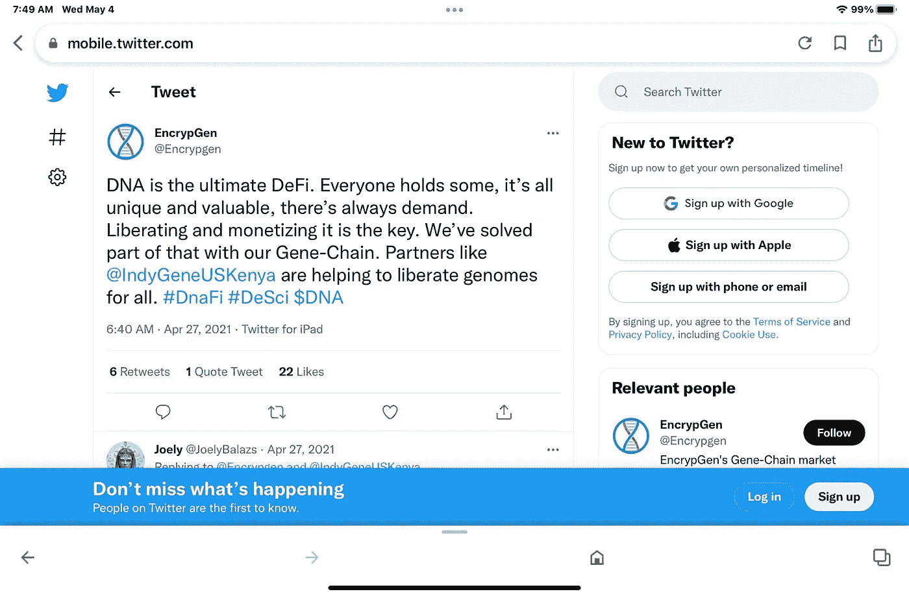

# 一个起源于 DeSci 的故事

> 原文：<https://medium.com/coinmonks/a-desci-origin-story-b6b234f7b1a3?source=collection_archive---------13----------------------->

## EncrypGen 如何创造了一个术语并帮助发起了一场运动

最近，DeSci 运动变得炙手可热，增加了致力于通过 Web 3.0 技术鼓励科学去中心化的活动、平台、联盟和 Twitter 账户。该术语旨在反映“DeFi ”,当我们在 2021 年 2 月首次公开使用 EncrypGen 来描述基因链时，DeFi 已经风靡一时，这是我们在 2018 年开创性的 DeSci 基因组学平台 luanched。下面是我们如何创造一个术语并帮助发起一场运动的故事，这是 EncrypGen 可以自豪地声称的[许多第一次之一，也是 DeSci 在二十多年的科学、伦理和研究诚信的研究和教学工作中的思想来源。](/dataseries/dna-nfts-and-art-50610561d844)

2004 年，我开始在布法罗大学与大卫·特里格尔博士合作教授一门名为“研究诚信:为什么好科学家做坏事”的课程，特里格尔博士与另一位亲密的朋友和导师理查德·赫尔博士一起创立了这门课程。第二年，我完全掌握了这门课程，当时特里格尔博士作为院长太忙了，我继续在 UB 教了四年。特里格尔和赫尔围绕着一个主题构建了这门课程，将它从哲学的理论伦理学中分离出来，那就是关注罗伯特·默顿发展的科学精神。默顿研究了科学的工作方式、机构和过程，并指出，要取得成功，科学必须坚持四个主要原则:有组织的怀疑主义、普遍主义、社群主义和无私。他称之为科学的“精神气质”。

Robert Merton: The Ethos of Science

2008 年，我被荷兰代尔夫特理工大学聘为终身助理教授。在那里，我完成了关于研究诚信的研究和写作，被提升为终身副教授，并被要求为所有研究人员、教授和管理人员开发大学水平的科学诚信教学同行培训项目。我每月讲课，帮助举办研讨会，还协调 IRB 的创建，并通常帮助指导大学的实践研究伦理，始终以 Ethos 方法为中心。

2010 年，我在*社会认识论*第 24 卷第 3 期发表了“[回到基础:技术和开源运动如何拯救科学](https://www.tandfonline.com/doi/full/10.1080/02691728.2010.499478?casa_token=6cpnlYiepawAAAAA%3AZf3bCc1xXMLHh5l7n_hvvlB5iMCLTTPNqGIYBps0NcfaiW_1D-6pRfezFabG19AYq-_Obqczp0v4Wyc)”。在那篇文章中，我提出互联网，特别是维基技术，可以帮助解决与科学精神有关的问题。我认为使用这样的技术可以帮助科学变得更快、更透明、更民主，并称之为“科学 3.0”，并建议通过拥抱这样的价值观和技术可以最好地实现科学精神。

2015 年，当我在墨西哥国家生物伦理委员会工作时，在墨西哥国家科学基金会 Conacyt 的资助下，我写了[ética de la investigación:integridad scientifica](https://scholar.google.com/citations?view_op=view_citation&hl=en&user=LsroX8QAAAAJ&citation_for_view=LsroX8QAAAAJ:3_LpOwP6eMYC)。然后，我在 2016 年出版了这本书的英文版，名为[科学诚信和研究伦理:来自科学精神的方法](https://books.google.com/books?hl=en&lr=&id=apfJDQAAQBAJ&oi=fnd&pg=PR8&dq=info:KPP2tZK6nbsJ:scholar.google.com&ots=TS6k_eeZCa&sig=bv-oTC46UaEuEASnabiCIR1OcQ0)。这项工作结合了我的讲座和从科学精神的角度对科学完整性的研究，并帮助激发了我与遗传科学家 Vanessa Gonzalez 博士合作的新兴趣，Vanessa Gonzalez 博士是我的配偶和长期合作者，他更新了 2010 年论文中的观点并将其应用于基因组学。2016 年末，我在我的母校发表了一次演讲，激发了 EncrypGen 的创建:“David Koepsell，JD，PhD，墨西哥国家生物委员会，[区块链和个人基因组学:安全地跟踪权利和责任”9/20/16](https://www.buffalo.edu/romanell/news-events/bulletin/lectures.html) 在 [Romanell 临床伦理和医学哲学中心](https://prezi.com/cct5iv0dbzf9/the-blockchain-and-personal-genomics/)。

到 2016 年 12 月，让区块链适应 2010 年论文中讨论的问题的想法变成了一项计划，即实际制作一些东西，将这些想法纳入工作产品，而不仅仅是学术论文。我们希望通过使用区块链和其他技术，使基因数据在科学中的应用“更快、更透明、更民主”。结果是成立了一家公司，并于 2017 年 5 月[在波士顿举行的生物 IT 世界](https://www.youtube.com/watch?v=KUAa0xkn-v8)大会上推出了原型。[到 2018 年](https://www.the-scientist.com/news-opinion/first-blockchain-based-genomic-data-marketplace-launches-65041)，我们发布了第一个公共产品，其中包含了我们需要去中心化和民主化基因组数据科学的基本元素:一个去身份化的基因组数据市场，消除了大型数据经纪人，并允许在世界任何地方使用$DNA(一种本地加密货币)进行点对点销售和基因组数据搜索和交易结算。

允许任何人参与并受益于科学，分发数据以及使用和解释的方法，使用开源而不是专利，鼓励公平分享科学和货币利润，这些都是我们现在称之为 DeSci 的主题，在 DeFi 热潮的顶峰，我们开始称我们的产品为 ***DeSci*** 产品。我们相信我们第一次公开使用这个术语是在 2021 年 2 月 26 日 YouTube 上的一次 AMA 中。我们已经在内部使用了这个术语，并且正在努力将它整合到我们的宣传和公开声明中。我们相信，通过将 DeSci 打造成协作、民主、分散的科学努力，我们可以吸引那些在金融领域拥有类似价值观的人的注意，并看到他们对开放科学的价值。我们也喜欢文字游戏。

Our first public use of the term “DeSci”

我们注意到在任期开始时采用缓慢，包括 2021 年 3 月的一个包含一些 DeSci 工具的 [github](https://github.com/opscientia/desci) 账户。2021 年 4 月，我们在推特上发布了这个词，并开始在我们自己的更多推特上使用这个标签。

More public uses

然后，到 2022 年，我们看到一个运动已经形成，并接受了这个术语。它现在已经进入主流，只要 DeSci 继续努力拥抱科学的精神，建立和分发工具和平台，使科学更快，更透明，更民主地参与，我们就可以在这场运动的前沿发挥我们的作用，如果贪婪和自我得到控制，就可以帮助改造和解放科学，就像区块链已经开始为金融所做的那样。

> 加入 Coinmonks [电报频道](https://t.me/coincodecap)和 [Youtube 频道](https://www.youtube.com/c/coinmonks/videos)了解加密交易和投资

# 另外，阅读

*   [印度最佳 P2P 加密交易所](https://coincodecap.com/p2p-crypto-exchanges-in-india) | [柴犬钱包](https://coincodecap.com/baby-shiba-inu-wallets)
*   [8 大加密附属计划](https://coincodecap.com/crypto-affiliate-programs) | [eToro vs 比特币基地](https://coincodecap.com/etoro-vs-coinbase)
*   [最佳以太坊钱包](https://coincodecap.com/best-ethereum-wallets) | [电报上的加密货币机器人](https://coincodecap.com/telegram-crypto-bots)
*   [交易杠杆代币的最佳交易所](https://coincodecap.com/leveraged-token-exchanges) | [购买 Floki](https://coincodecap.com/buy-floki-inu-token)
*   [3Commas 对 Pionex 对 Cryptohopper](https://coincodecap.com/3commas-vs-pionex-vs-cryptohopper) | [Bingbon 评论](https://coincodecap.com/bingbon-review)