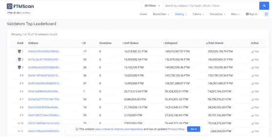
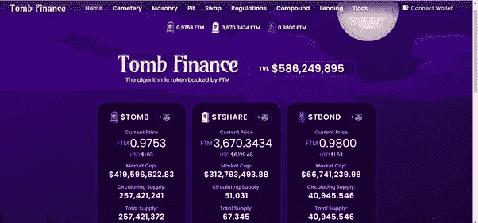
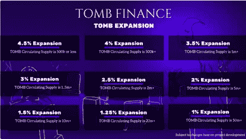
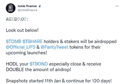

# 探索 Fantom 生态系统:坟墓金融

> 原文：<https://medium.com/coinmonks/a-dive-into-the-fantom-ecosystem-tomb-finance-feb0656e47f7?source=collection_archive---------18----------------------->

**最初的铸币税协议**

从技术上讲，最初的铸币税协议是稳定的硬币，通常与 1 美元挂钩。但《古墓丽影》是第一个成功与更不稳定的资产 Fantom 挂钩的协议。

**为什么？**

需要这样做的原因是因为 FTM 令牌将变得越来越少。运行验证器需要 Fantom 令牌。验证器确认并验证网络上的所有交易。随着网络的增长，交易的数量也在增长，验证者需要确保网络保持其著名的速度。FTM 的固定供应量为 31.75 亿枚代币(有史以来创造的 FTM 代币总数)，而流通供应量已经超过 25 亿枚(可供交易和目前在市场上使用的 FTM 代币总数)。运行一个验证程序需要 500，000 英尺。Fantom 网络上目前有 59 个活跃的验证器。

Ftmscan.com

仅前十名验证者就使用了超过 10 亿个 FTM 令牌。由于运行网络需要如此多的令牌并且供应固定，最终将没有足够数量的 FTM 令牌用于交易。如果有一种代币可以代替 FTM 作为交换手段会怎么样？

**进入古墓**

坟墓旨在成为 Fantom 的镜像资产，并取代它作为交换手段。简单地说，在理想的情况下:坟墓和坟墓的价值相等，因此就交换而言，一个和另一个一样好。凡托姆可以被标桩，可以进行坟墓交易，任何得到坟墓的人都知道他们可以用它来交换与凡托姆等值的坟墓。

Tomb 将自己与 FTM 挂钩，以解决网络最终将面临的问题，即缺少可用于交换的令牌，从而增加网络的价值。与 FTM 挂钩使 Tomb 能够从 FTM 的未来增长中获得价值，从而形成一种共生关系。

该协议锁定了超过 5 亿美元，是 FTM 网络上的第七大网络。该协议已经证明了自己的战斗测试，我相信它是在 DeFi 空间最强的之一。

Tomb.com

**令牌** 
**古墓**。协议的本地令牌，一种通过铸币税与 Fantom 价格挂钩的算法令牌，旨在用作交换媒介。

**墓股(Tshare)** 。治理令牌:持有者对指导协议未来发展的提案拥有投票权。在纪元扩张期间，印制的坟墓令牌被分发给那些在砖石建筑中占有股份的人。最大供应量为 70，000 代币。
分配方式:道 5500 12 个月线性分配，团队 5000 12 个月线性分配，奖励 595000 12 个月分配给流动性提供者。总供应量为 67，000，最大供应量为 70，000，这意味着绝大多数已经分发，对流动性提供者的 Tshare 奖励将于今年 6 月(2022 年)停止。

**【墓券(Tbond)** 。价格管理令牌，用于控制墓穴供应。当 TWAP(时间加权平均值)低于 1 时，这意味着在整个时期内坟墓的价格低于范托姆，债券发行，当 TWAP 高于 1.01 时可以赎回。当墓穴被换成钻石时，墓穴被烧掉，不再流通，通货紧缩，从而增加了墓穴的价格，使其更接近钻石的价格。当 Tbond 被赎回时，它对 Tomb 施加卖出压力，并将其推回到 Fantom 的价格。这是控制墓价的主要机制，并通过这一过程保持与 FTM 挂钩。

**三个纪元** 
**古墓扩张纪元**

如果 TWAP 高于 1.01，每一个纪元(六小时)的赌注者都会得到奖励，坟墓令牌的印刷数量取决于当前的流通供应量。目前的增长率是 3%。在一个扩张阶段，坟墓的分配如下:80%的奖励给 Tshare 赌注者，18%给 DAO 基金，2%给 DEV 基金。

如果有债务需要偿还，必须由国库购买的 Tbond，新铸造的坟墓的 65%归国库，直到所有 Tbond 都被赎回。

**墓禅纪元**

当 TWAP 在 1 和 1.01 之间时，它被称为无所事事的禅纪元。没有铸造新的坟墓，也没有发行债券。坟墓表现理想，与 FTM 挂钩。

**古墓收缩纪元**

当 TWAP 低于 1 时。债券是和坟墓一起发行和购买的，在这个过程中，坟墓被烧掉，从而把价格推回到挂钩的水平。当 TWAP 介于 1 和 1.01 之间时，t 债券可以在以后赎回，如果 TWAP 高于 1.1，还可以获得赎回奖金。还增加了第二个奖励，目前正在进行空投截图，Tbond 持有者将有权获得 2 倍的空投奖励。

Twitter @tombfinance

TombFinance 的未来

我非常看好这个协议，它已经被时间证明了。随着 Fantom 网络的增长，对坟墓的需求将会扩大，我们将会看到坟墓是否能够真正成为一种镜像资产，能够取代 FTM 作为一种交换手段。

目前，古墓生态系统仍在继续发展，这在很大程度上要归功于哈利·叶(Harry Yeh)，方顿生态系统也是如此，两者在未来将共同繁荣发展。坟墓金融成功的一个真实见证是涌现出的数百个副本。

[https://www.whatthefork.xyz/tomb](https://www.whatthefork.xyz/tomb)

许多这些模仿协议是骗局和地毯拉。他们已经看到了坟墓金融的财务成功，并希望产生同样的结果；由于很少或没有成功，大多数人陷入困境，再也没有恢复过来。这些克隆人缺少一个让坟墓融资如此成功的东西，那就是效用。陵墓的建立是为了解决一个问题；这些叉子被创造出来作为无意识的现金抓取工具。现在甚至有协议通过铸币税与坟墓挂钩。一个算法铸币税令牌被钉住一个算法铸币税令牌被钉住另一个令牌。

投资前总要问问自己，用例是什么。效用将推动价格行为。我鼓励所有人都成为坟墓家族的一员。