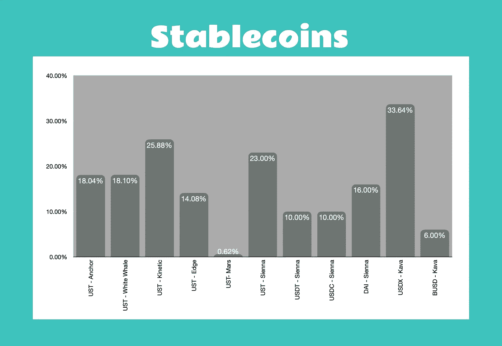

# 动荡时期的多元化投资组合

> 原文：<https://medium.com/coinmonks/a-diversified-portfolio-for-turbulent-times-3df0ef82bc8c?source=collection_archive---------37----------------------->

# 我们需要一个稳定的方法

包括加密货币在内的所有金融市场都弥漫着一种不安的情绪。这是完全可以理解的，因为这是一个非常可怕的时期。大量的宏观经济动荡正在蔓延到区块链的微观经济中，并对我们投资组合的未来盈利能力产生了令人不快的不确定性。

那么，我们有什么选择？回到法定现金肯定是许多人选择的一个途径；然而，这种方法可能不适合每个人的目标。在这种时候，听从我们信任的财务顾问的合理建议更为重要。度过经济衰退时期的普遍建议包括:

*   获得我们房地产的低固定利率抵押贷款
*   保持营运资本随时准备在我们的业务中使用
*   消除所有其他债务
*   在我们的 401K 投资组合中坚持长期战略
*   控制开支
*   保持现金应急基金。

在确保我们的传统金融得到妥善处理后，我们的加密货币投资组合仍存在一系列问题，包括:

*   如果我们只是因为相信行业的未来而不想退出加密货币，我们该怎么办？
*   如果我们不想再用传统工具赚取剩余可支配现金的部分年利率，那该怎么办？
*   如果我们已经确定了我们希望长期持有的有前途的区块链项目，会怎么样？
*   我们确定、研究并希望在 2022 年即将到来的发布中加入的那些令人兴奋的新项目怎么样？
*   如果我们想继续投资，度过这段不确定性和资产价格下跌的漫长时期，我们有什么选择？

我打算通过展示宇宙生态系统中可用的一系列选项来回答这些问题，这些选项包括诸如 Terra、Kava、Osmosis、Persistence One、Secret、Akash、Sentinel 等创新的区块链。在我今年早些时候写的一篇文章的研究基础上，当我整理我最初的防御立场时(参见下面来源部分中“跨越 Terra 和宇宙的单一资产农业”的链接)，我想扩展、比较和对比我们可用的许多选择。

# 稳定的硬币

以稳定的货币形式持有部分加密货币投资组合可以实现许多目标:

*   这是对资产价格下跌波动的防御
*   它避免了不得不退出回到菲亚特，这也是价值下降
*   它为我们提供了投资新项目的灵活性。

然而，稳定的存款不一定是不流动的资产，就像我们在传统银行的固定现金储蓄账户一样。相反，他们提供了一些极其丰厚的收入。而且，现在我们有许多好的选择，我们投资组合中稳定的货币部分也可以实现多样化。在下面的表格和图表中，看看我在宇宙区块链发现的所有可用选项。

**注释**

1.Anchor Protocol 以液态令牌的形式为放在他们金库中的 UST 发放存款收据。aUST 令牌可用于农业、贷款，甚至清算 AMM 和 Terra 区块链协议，包括 Loop、Astroport、TerraSwap、Edge 和鲸声优。

2.白鲸协议还以液体代币的形式为放在他们金库中的 UST 发出存款收据。vUST 令牌可用于在 TerraSwap AMM 上耕作。

3.动能货币协议也以液体代币的形式为放在他们金库中的 UST 发行存款收据。库斯特代币可以用来在 AMM 的阿斯特罗波特进行农业或贸易。

4.需要一个额外的步骤来将本机令牌转换或包装成秘密等效版本(或合成版本)。例如，我们的 USDC 存款先转换成可持续发展储蓄，然后才能存入银行获取收益。

# 顶点硬币和代币

尽管上面介绍的稳定币选项很棒，但来自最强项目的一些治理币和代币的可用收益不容忽视。我发现多元化的方法可以服务于多个目标，包括:

*   奖励是根据我们在赌注池中持有的数量和份额支付的，而不是硬币或代币的价格和价值
*   四月的波动，但令人惊讶的稳定和可预测的最佳区块链
*   奖励定期累积，可以复利或出售获得收入
*   与 LP 农业不同，在这些单一资产赌注池中没有重新平衡损失的风险
*   解冻期通常很短(从 14 天到 28 天)。

在下面的表格和图表中，看看这个类别中来自宇宙中许多优质区块链的大量顶级硬币和代币。

**注意事项**

1.所有列出的硬币和代币都由 Keplr 钱包支持赌注，除了 LUNA。LUNA 由 TerraStation 钱包支持，用于赌注。

2.所有赌注奖励都是手动申领的。

3.奖励用下注的硬币或代币支付。LUNA 是个例外，其中一部分赌注奖励以稳定的硬币支付。

# 竞争者

Cosmos 中有一系列 DeFi 应用程序和区块链，它们要么是最近推出的，要么是几个月前才推出的，提供利润丰厚的赌注产品。他们显示出巨大的早期潜力。虽然与 Apex 类别中的许多硬币和代币相比，这些硬币和代币可能还没有经过验证的记录或获得了足够的流动性，但它们也不容忽视。我将它们归类为竞争者，并在下面的表格和图表中进行了总结。

**注释**

1.所有 Terra 代币都由 TerraStation 钱包支持，其他代币由 Keplr 钱包支持。

2.所有奖励都是自动复合的。

3.奖励用下注的硬币或代币支付。

# 即将发布

一些令人兴奋的新项目正处于最后开发阶段，我正在密切关注他们的公告。我预计这些新的区块链和应用程序将提供有利可图的单一资产农业机会。看看下图中最让我心动的几个。

# 开发工作没有放缓

当我看到在宇宙生态系统的区块链发生的所有创新以及为这些发展提供资金的投资金额时，我相信我不退出是明智的。然而，在这个动荡时期，一个多元化、防御性和可预测的投资组合更为重要。虽然我们投资组合的确切组合会随着这充满挑战的一年的进展而频繁变化，但我对稳定硬币、顶点硬币和竞争者的平衡感到满意。关键是随着我们的发展，不断地、动态地重新平衡我们的投资组合。

我已经讨论了多种选择，将我们的多元化方法与单一资产农业结合起来为我们服务。这里有大量的数据；因此，我在下面的来源部分提供了这些区块链和 DeFi 应用程序的链接，以帮助您自己的研究。我们每个人都有不同的风险状况，有自己独特的方法，可以配置不同数量的资金；但是，我希望这里提供的信息对您制定自己的策略有用，这是为您量身定制的策略。

我决定继续投资区块链科技，安然度过未来的动荡时期。你可能会决定采取不同的方法。通过在这里展示这些数据和资源，你能够做出决定；然而，如果你选择退出，我有一种感觉，我会在另一边再见到你！

Tot ziens — Opa。

# 资料来源、参考文献和进一步阅读

主播——https://app.anchorprotocol.com/

https://app.whitewhale.money/[白鲸](https://app.whitewhale.money/)

动能货币—[https://app.kinetic.money/vault](https://app.kinetic.money/vault)

边缘——https://app.edgeprotocol.io/pool

火星—【https://app.marsprotocol.io/#/redbank 

sienna—[https://app . sienna . network/swap](https://app.sienna.network/swap)

卡瓦—[https://www.kava.io/](https://www.kava.io/)

卡瓦兰得—[https://app.kava.io/lend](https://app.kava.io/lend)

特拉—[https://www.terra.money/](https://www.terra.money/)

cosmos Hub—[https://cosmos . network/](https://cosmos.network/)

渗透—[https://app.osmosis.zone/](https://app.osmosis.zone/)

朱诺—[https://www.junonetwork.io/](https://www.junonetwork.io/)

阿卡什—[https://akash . network/](https://akash.network/)

哨兵—[https://sentinel.co/](https://sentinel.co/)

secret—[https://scrt . network/](https://scrt.network/)

爱丽丝—[https://www.irisnet.org/](https://www.irisnet.org/)

坚持一—[https://persistence.one/](https://persistence.one/)

SIF chain—[https://www.sifchain.finance/](https://www.sifchain.finance/)

Crypto.org—[https://crypto.org/](https://crypto.org/)

regen—[https://www . regen . network/](https://www.regen.network/)

https://www.certik.com/

iXO—[https://www.ixo.world/](https://www.ixo.world/)

星名—[https://www.starname.me/](https://www.starname.me/)

棱镜—【https://prismprotocol.app/gov 

阿斯特罗波特—[https://app.astroport.fi/governance](https://app.astroport.fi/governance)

环线—【https://dex.loop.markets/stake#stake 

新月—[https://app . crescent . network/staking](https://app.crescent.network/staking)

生刀—[https://www.rawdao.zone/](https://www.rawdao.zone/)

树荫——[https://shadeprotocol.io/](https://shadeprotocol.io/)

https://comdex.one/home

https://agoric.com/

适马— @sig_finance

海王星—[https://nept.finance/](https://nept.finance/)

水银—[https://quicksilver.zone/](https://quicksilver.zone/)

侍酒师—[https://www.sommelier.finance/](https://www.sommelier.finance/)

https://www.levana.finance/

我的循环文章“跨越大地和宇宙的单一资产农业”——[https://www.loop.markets/single-asset-farming/](https://www.loop.markets/single-asset-farming/)

我就是不能停止学习。在我最喜欢的地方和我一起锻炼大脑: [https://www.loop.markets？ref=52879](https://www.loop.markets/?ref=52879)

> 加入 Coinmonks [电报频道](https://t.me/coincodecap)和 [Youtube 频道](https://www.youtube.com/c/coinmonks/videos)了解加密交易和投资

# 另外，阅读

*   [3 商业评论](/coinmonks/3commas-review-an-excellent-crypto-trading-bot-2020-1313a58bec92) | [Pionex 评论](https://coincodecap.com/pionex-review-exchange-with-crypto-trading-bot) | [Coinrule 评论](/coinmonks/coinrule-review-2021-a-beginner-friendly-crypto-trading-bot-daf0504848ba)
*   [莱杰 vs Ngrave](/coinmonks/ledger-vs-ngrave-zero-7e40f0c1d694) | [莱杰 nano s vs x](/coinmonks/ledger-nano-s-vs-x-battery-hardware-price-storage-59a6663fe3b0) | [币安评论](/coinmonks/binance-review-ee10d3bf3b6e)
*   [Bybit Exchange 评论](/coinmonks/bybit-exchange-review-dbd570019b71) | [Bityard 评论](https://coincodecap.com/bityard-reivew) | [Jet-Bot 评论](https://coincodecap.com/jet-bot-review)
*   [3 commas vs crypto hopper](/coinmonks/3commas-vs-pionex-vs-cryptohopper-best-crypto-bot-6a98d2baa203)|[赚取加密利息](/coinmonks/earn-crypto-interest-b10b810fdda3)
*   最好的比特币[硬件钱包](/coinmonks/hardware-wallets-dfa1211730c6) | [BitBox02 回顾](/coinmonks/bitbox02-review-your-swiss-bitcoin-hardware-wallet-c36c88fff29)
*   [BlockFi vs 摄氏](/coinmonks/blockfi-vs-celsius-vs-hodlnaut-8a1cc8c26630) | [Hodlnaut 点评](/coinmonks/hodlnaut-review-best-way-to-hodl-is-to-earn-interest-on-your-bitcoin-6658a8c19edf) | [KuCoin 点评](https://coincodecap.com/kucoin-review)