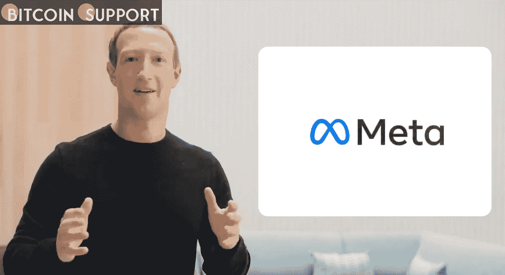

# 一名脸书举报者担心元宇宙会重复“世界上所有的错误”

> 原文：<https://medium.com/coinmonks/a-facebook-whistleblower-fears-that-the-metaverse-will-replicate-all-the-ills-of-the-real-world-b6a5241479f7?source=collection_archive---------65----------------------->

**Visit our website for full blog:-**[**https://bitcoinsupports.com/a-facebook-whistleblower-fears-that-the-metaverse-will-replicate-all-the-ills-of-the-real-world/**](https://bitcoinsupports.com/a-facebook-whistleblower-fears-that-the-metaverse-will-replicate-all-the-ills-of-the-real-world/)

Frances Haugen, the fugitive from Facebook, has shifted her emphasis to the Metaverse. She is concerned about Meta’s handling of privacy and very sensitive material.

In a new interview, Facebook whistleblower Frances Haugen took aim at Meta, implying that its version of the Metaverse will merely repeat all of its previous errors.

Haugen stated in an interview with Politico:

**“They’ve made grandiose claims about the Metaverse’s safety-by-design. However, if they do not commit to transparency, access, and other accountability mechanisms, I can envision a recurrence of all the harms currently occurring on Facebook.”**

In 2021, Haugen provided the Securities and Exchange Commission and The Wall Street Journal with hundreds of internal Facebook documents. Her experience working for the organisation has left her concerned about privacy and the corporation’s ability to accumulate data on every element of users’ interactions in the Metaverse.

“I’m quite concerned about the number of sensors involved. When we implement the Metaverse, we will need to add several Facebook microphones and various other types of sensors to our homes “‘She stated.

**“You really don’t have a choice anymore about whether or not Facebook may spy on you at home. We simply have to trust the corporation to act ethically.”**

Haugen is not alone in his worries. According to a recent survey, 70% of people lack confidence in Meta’s ability to protect their privacy effectively.

Andy Yen, CEO of encrypted email startup ProtonMail, is likewise concerned about Big Tech behemoths like Meta’s unilateral authority. He stated in an interview last week that his own company, Proton, will survive solely on the goodwill of digital titans.

“Today, technology firms could easily take us from the Internet with no legal or financial consequences,” he explained.

Yen has previously expressed concern about Big Tech gaining control of the Metaverse, telling Newsweek last year that Meta was “constructing a new infrastructure in which they control everything.” They control the technology, they own the VR headsets, and you’ve entered their universe, using their products and platforms.”

Yen stated that, given Meta’s track record, he does not believe we should trust them with such authority and that assurances about privacy in the Metaverse are meaningless unless and until the Metaverse’s business model changes.

**“At the end of the day, their business strategy is based on monetizing your data. As a result, there will always be a tension between what they say and what they need to do to generate money.”**

**Collecting data**

The Electronic Frontier Foundation (EFF) is a 501(c)(3) non-profit organisation dedicated to the defence of civil freedoms in the digital age. As with Yen, it expects that virtual reality headsets, augmented reality glasses, and other wearables will simplify data collecting and surveillance. They stated in December:

**“This data gathering, which is sometimes carried out by organisations with a track record of prioritising profit over safeguards, lays the groundwork for unprecedented intrusions into our lives, our homes, and even our thoughts.”**

The EFF is afraid that data collection and use for targeted advertising would result in the creation of a “biometric psychography” of our deepest wishes and preferences. Once the data is compiled, it may be monetized by third parties, even without our knowledge or consent.

**China’s syndrome**

While the Metaverse may appear to be an issue for the distant future, Chinese individuals are already experiencing it on a daily basis, albeit in a unique fashion.

WeChat is China’s preferred social networking platform. It boasts an astounding user base of over one billion people. 850 million of those are active users. The programme is accumulating unprecedented amounts of data on Chinese users. Additionally, the Chinese government has the ability to monitor every word, image, and video on it.

WeChat came under fire from Reporters Without Borders (RSF) prior to this year’s Winter Olympic Games. RSF warned journalists to safeguard themselves from Chinese surveillance while conducting on-the-ground reporting. “RSF advises journalists travelling to China to avoid downloading software that could be used to monitor them,” they stated. Among them were WeChat and TikTok.

Consider having that level of control over the Metaverse.

**Visit our website for full blog:-**[**https://bitcoinsupports.com/a-facebook-whistleblower-fears-that-the-metaverse-will-replicate-all-the-ills-of-the-real-world/**](https://bitcoinsupports.com/a-facebook-whistleblower-fears-that-the-metaverse-will-replicate-all-the-ills-of-the-real-world/)

**Disclaimer: These are the writer’s opinions and should not be considered investment advice. Readers should do their own research.**

> 加入 Coinmonks [电报频道](https://t.me/coincodecap)和 [Youtube 频道](https://www.youtube.com/c/coinmonks/videos)了解加密交易和投资

# 另外，阅读

*   [BlockFi vs 摄氏](/coinmonks/blockfi-vs-celsius-vs-hodlnaut-8a1cc8c26630) | [Hodlnaut 点评](/coinmonks/hodlnaut-review-best-way-to-hodl-is-to-earn-interest-on-your-bitcoin-6658a8c19edf) | [KuCoin 点评](https://coincodecap.com/kucoin-review)
*   [Bitsgap 审查](/coinmonks/bitsgap-review-a-crypto-trading-bot-that-makes-easy-money-a5d88a336df2) | [Quadency 审查](/coinmonks/quadency-review-a-crypto-trading-automation-platform-3068eaa374e1) | [Bitbns 审查](/coinmonks/bitbns-review-38256a07e161)
*   [密码本交易平台](/coinmonks/top-10-crypto-copy-trading-platforms-for-beginners-d0c37c7d698c) | [Coinmama 审核](/coinmonks/coinmama-review-ace5641bde6e)
*   [印度的加密交易所](/coinmonks/bitcoin-exchange-in-india-7f1fe79715c9) | [比特币储蓄账户](/coinmonks/bitcoin-savings-account-e65b13f92451)
*   [OKEx vs KuCoin](https://coincodecap.com/okex-kucoin) | [摄氏替代品](https://coincodecap.com/celsius-alternatives) | [如何购买 VeChain](https://coincodecap.com/buy-vechain)