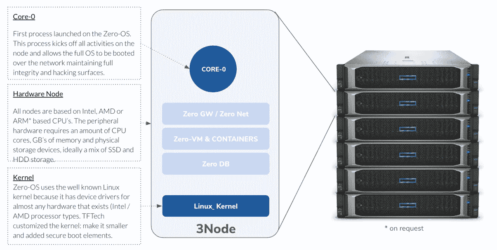

# 一个农民的旅程，通过生产，定义，节点，并扩大网格三倍

> 原文：<https://medium.com/coinmonks/a-farmers-journey-through-yielding-defi-nodes-and-expanding-the-grid-with-threefold-a70a3e3b98ea?source=collection_archive---------9----------------------->

## 继续我对三倍生态系统的深入探讨，我上周与领导三倍技术社区的 DIY 三倍农民 Scott Yeager 坐在一起，超越分散式互联网的表面，讲述他从开始到三倍的产量农业之旅，以及这中间给那些刚刚开始扩展未来互联网容量的人的教训。享受吧。

## **凯尔:你是如何参与高产农业的？**

**Scott:** [三倍](https://threefold.io/)是我参与的第一个被动收入加密项目。我从事加密领域已经有一段时间了，并且对运行验证器节点很感兴趣。但是，做这些事情总是有很高的附带要求，你需要在几乎所有的网络上进行验证。我还没有找到一个，这似乎是一个很适合的条款，你知道，在一个项目中进行投资是很舒服的。三倍兴奋我，因为你不需要赌注任何令牌开始。谁都可以种地；你所需要的只是硬件。所以这是我的第一步。从那以后，我尝试了一些其他项目，如合作伙伴研究，他们有一个节点，你可以运行，有一个较低的抵押品要求。

## **Kyle:从头开始构建节点结构的经验教训是什么？**

**Scott:** 当我发现三倍时，这个过程包括阅读维基上的大量信息，观看视频，并试图理解一切是如何工作的。我很高兴地说，在我和许多参与这个项目的人的帮助下，事情已经变得清晰多了。现在，我们有一些简单的工具，你可以用来找出如何优化你的节点，为你的投资提供最好的收益潜力。

有几个公式，我们用来评估资源如何在一个给定的节点，这只是一台计算机；顺便说一下，任何基于 64 位 Intel 或 AMD 的系统都可以，所以我们来看看节点内部的 CPU 内核数量、RAM 容量、固态硬盘和硬盘。很快，我们也会考虑 GPU。有一个公式可以计算这些数字，并得出我们所说的计算单位。此外，存储单元是节点中原始容量的合成版本，是了解容量大小的简单方法。

过去，要找到这些公式就像是翻遍了大量信息，并试图找出如何进行优化，你知道有多少个内核和多少 RAM。最近，我们有一些由社区成员制作的很棒的常见问题解答，列出了许多这些考虑事项。我还创建了一个 DIY 节点指南，这些都在我们的论坛上。我们的 wiki 和基于网络的模拟器上也有很好的信息，您可以输入您正在构建的系统的数字，并了解您每个月将获得多少代币。

我认为，最好的开始和加入方式是在 Telegram 上加入我们的农民聊天。那里有一些包含大量资源列表的固定消息。那里有一群务农的书呆子，他们可以回答出现的任何其他问题。所以我也在那里。如果您想加入我们的社区，请了解如何构建、学习和开始。电报或农民聊天是最好的办法。我想我们可以在这一集的笔记中加入一个链接什么的，也许？

## 凯尔:安装操作系统有它的怪癖；您在设置三重操作系统时有什么体验？

斯科特:我已经运行 Linux 很长时间了。所以我花了很多时间来处理在给定的硬件上运行操作系统时可能出现的问题。谢天谢地，今天的 Linux 比过去流畅多了。至于 [ZeroOS](https://library.threefold.me/info/threefold/#/technology/threefold__zos) ，我的经历一直是直截了当的；这是我第一次开始[农业](https://library.threefold.me/info/threefold/#/tfgrid/farming/threefold__farming_home)时给我留下深刻印象的一件事，当时正在建立 ZeroOS，这一点非常清楚。在大多数情况下，有几种奇怪的边缘情况，其中可能不支持特定的硬件。通常，我们的开发人员可以帮助解决这个问题。

Source: ThreeFold, [ZeroOS](https://library.threefold.me/info/threefold/#/technology/threefold__zos)

这个过程看起来是这样的:你注册了一个农场，这就是系统如何知道在哪里交付你获得的代币。有一个与三重令牌相关联的钱包地址，您可以获得一个场 ID，使用该场 ID，访问我们的引导网站，插入场 ID，并下载一个小文件，该文件会闪存到 USB 棒上。然后，您只需将 u 盘放入您的节点，并将其指定为引导设备。当系统启动时，它会读取 u 盘上的内容，并指示通过网络下载 ZeroOS。ZeroOS 是独一无二的，因为它实际上不会永久驻留在系统内部的任何存储上。每次节点启动时，操作系统都会通过网络进入。操作系统本身存储在 RAM 中，一点点缓存的东西发生在磁盘上。每次启动时，它都会得到一个新的副本。所以这是一个显著的安全特征。因为如果你的操作系统存储在磁盘上，当笔记被关闭时，有人可能会拿走那个折扣并篡改它。

我们有一个高度防篡改的系统，因为代码总是通过网络进入。它只存在于内存中。如果节点因为任何原因需要关闭，它会在备份时获得一个新的副本。总的来说，这是，是非常简单和容易的。一旦第一次启动，并且处理了任何异常，notes 往往会运行甚至几年，而不需要任何维护或修复任何东西。

要了解更多关于 triple 的信息，请访问

*作者注:以上采访已被编辑并缩减为本文的摘要。*

***三重*** *正在通过利用全球超过 20 亿台计算机(包括服务器、台式机和笔记本电脑)的综合处理能力来分散互联网，以创建一个开源、点对点、碳负互联网，用于部署任何当前和未来的技术。通过将区块链技术应用到云，while 解决了互联网的安全和自治问题，同时还允许基础设施扩展到任何有电和网络的地方，比任何可比的替代方案使用更少的能源，成本更低。*

**相关内容:**

 [## 将我们未来的互联网容量扩大三倍

### 继续我对三重生态系统的深入探讨，上周我采访了 Sacha Obeegadoo，他是……

kyleellicott.medium.com](https://kyleellicott.medium.com/expanding-our-future-internet-capacity-with-threefold-6e47c283f166) 

> 加入 Coinmonks [电报频道](https://t.me/coincodecap)和 [Youtube 频道](https://www.youtube.com/c/coinmonks/videos)了解加密交易和投资

# 另外，阅读

*   [币安期货交易](https://coincodecap.com/binance-futures-trading)|[3 commas vs Mudrex vs eToro](https://coincodecap.com/mudrex-3commas-etoro)
*   [如何购买 Monero](https://coincodecap.com/buy-monero) | [IDEX 评论](https://coincodecap.com/idex-review) | [BitKan 交易机器人](https://coincodecap.com/bitkan-trading-bot)
*   [CoinDCX 评论](/coinmonks/coindcx-review-8444db3621a2) | [加密保证金交易交易所](https://coincodecap.com/crypto-margin-trading-exchanges)
*   [红狗赌场评论](https://coincodecap.com/red-dog-casino-review) | [Swyftx 评论](https://coincodecap.com/swyftx-review) | [CoinGate 评论](https://coincodecap.com/coingate-review)
*   [Bookmap 评论](https://coincodecap.com/bookmap-review-2021-best-trading-software) | [美国 5 大最佳加密交易所](https://coincodecap.com/crypto-exchange-usa)
*   [如何在 FTX 交易所交易期货](https://coincodecap.com/ftx-futures-trading) | [OKEx vs 币安](https://coincodecap.com/okex-vs-binance)