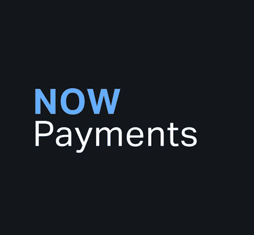

# ChangeNOW 生态系统的完整指南

> 原文：<https://medium.com/coinmonks/a-full-guide-into-the-changenow-ecosystem-b8cbaef0acc0?source=collection_archive---------24----------------------->

随着加密市场的发展和许多新的用例的出现， [**ChangeNOW**](https://changenow.io/?utm_source=medium&utm_medium=referral&utm_campaign=0804_cnguide) 正在顺应社区的需求并发布新产品来满足它们。

当我们意识到需要快速、安全和匿名的加密交换时，这一切都始于交换服务。随着加密技术的采用，我们启用了一个名为 [**NOWPayments**](http://nowpayments.io) 的数字硬币支付网关。当开发人员开始在区块链上广泛构建时，我们引入了 [**NOWNodes**](http://nownodes.io) 。后来，基于多年的加密经验，我们创建了用于投资组合监控的 [**NOW Tracker**](https://nowtracker.app/) 和用于便捷移动加密存储的 [**NOW Wallet**](https://walletnow.app/) 。

现在的生态系统还有很多。这篇文章深入探讨了我们的产品，描述了我们为您服务的所有可能方式。

# 密码交换服务

我们的代码产品——加密交换服务 [**ChangeNOW**](https://changenow.io/?utm_source=medium&utm_medium=referral&utm_campaign=0804_cnguide) 创建于 2017 年，很快成为顶级的即时加密交换平台之一。ChangeNOW 至今仍是我们生态系统的支柱。

我们提供快速、安全且易于使用的加密交换。让我们来分解一下:

*   400+ [密码](https://changenow.io/currencies)可与 60+ [法定](https://changenow.io/buy)货币一起兑换。资产清单包括市值最高的硬币以及新发行但受欢迎的代币。
*   我们提供匿名加密交换——不需要注册，也不需要留下任何个人数据。交换是安全的，因为我们不要求你的私钥，也不控制你的密码。
*   平均交换时间为 5 分钟。有时，在互换期间汇率可能会波动，为了保护自己免受市场波动的影响，您可以启用固定汇率而不是标准(浮动)汇率，并享受 100%的可预测性。
*   费用从 0.5%到 4%不等。没有隐藏的费用——它们已经包含在估计费用中。所见即所得。
*   兑换是无限的——你可以想兑换多少就兑换多少，大多数硬币最低 2 美元。

# ChengeNOW 移动交换机

我们针对 Android 和 [**iOS**](https://apps.apple.com/us/app/id1518003605) 的加密交换应用是为那些在旅途中使用加密的人准备的。正如网页版一样， [**移动兑换**](https://changenow.io/mobile-exchange) 允许快速匿名兑换 400+币，无需注册。提供标准和固定价格以及固定购买价格。没有隐藏的费用适用。

为了您的方便，该应用程序可以存储您的支付地址，但这不是必要的，我们无法访问您的数据(它存储在手机上，您可以在设置中删除它)。您可以管理屏幕锁定细节，以获得更好的隐私。在 ChangeNOW 的移动和桌面 exchange 版本中，我们的支持团队全天候随时准备处理任何问题。

# 现在钱包

[**NOW Wallet**](https://walletnow.app/) 是一款非保管式的加密钱包，你可以在一个轻量级的界面中享受安全的加密存储。以下是我们提供的服务:

*   非托管存储:密钥保存在设备上，任何团队成员都无法访问它们。你是唯一能控制你的数字硬币的人。
*   400 多枚硬币可供选择，包括 ERC20、BEP20 代币和 NFT。无需注册或设置过程，只需安装钱包并立即开始使用。
*   你可以交换密码或在应用程序中用 fiat right 购买更多。与我们的加密交换服务相比，不收取任何费用。
*   对于以太坊交易，我们提供一些高级功能，如 account nonces(一种交易计数器，允许您更灵活地操作基于以太坊的资金)。
*   打桩 BNB，现在 BEP-2 可用；新的赌注机会将很快增加。

# 现在付款

[**NOWPayments**](https://nowpayments.io/) 是一个网关，可以让您在网上商店中集成加密支付，或者在您的网站或博客平台上启用加密捐赠功能。它是这样工作的:

*   快速注册，下载你的交易平台的插件，或者复制捐赠工具/按钮的代码。
*   启用插件后，您的客户或追随者将选择他们愿意支付的货币(100+可用资产)并将密码发送到提供的地址。
*   我们将资金转换成您选择作为支付加密货币的硬币，并将其直接发送到您的钱包。

NOWPayments 提供 100 多种货币的即时支付，费用从 0.5%开始，随着营业额的增加而下降。个人客户经理可以全天候帮助您解决任何问题。

# 现在 Token

我们的原生 [**现**](https://changenow.io/tokens) Token 是第一个由即时加密交换服务发行的加密货币，也是第一个在币安链上推出的**。它允许你在 NOW 生态系统中操作:支付资产列表和不同链之间的加密货币迁移，进行空投，等等。您还可以在 NOW 代币中获得 [**返现**](https://changenow.io/blog/cashback-feature-available-on-changenow) 以进行加密交换。**

**令牌可以在 ChangeNOW 上 购买 [**。你也可以在**](https://changenow.io/currencies/now-token?from=usd&to=now&fiatMode=true) **[**上买 ERC-20 版本的 Uniswap**](https://v2.info.uniswap.org/token/0xe9a95d175a5f4c9369f3b74222402eb1b837693b) 或者在 [**上买 BEP-2 的那种币安 DEX**](https://www.binance.org/trade/NOW-E68_BNB) 。后者也是**可下注的，最高可达 25%的年利率和周派息。******

# ****现在跟踪****

********

****如果你在多个平台上保存你的密码，并希望跟踪你的投资组合规模， [**NOW Tracker**](https://nowtracker.app/) 是完美的工具。如果您的资产存储在非保管钱包中，添加钱包地址，来自公共块探索者的数据将被上传。如果您的资金在集中交易所，您可以手动输入金额，这样它们也会被计算在内。这些数据将存储在你的设备中，你可以随时删除。****

****该 app 适用于 [**安卓**](https://play.google.com/store/apps/details?id=io.changenow.nowtracker&hl=en_US&gl=US) 和 [**iOS**](https://apps.apple.com/us/app/now-tracker-%D1%81rypto-portfolio/id1536924823) 。在 NOW Tracker 中，您可以添加 10，000 枚加密硬币和 23 种法定货币。该应用程序显示每种资产在你的投资组合中所占的份额，并以你选择的任何法定货币(默认为美元)显示。如果您更换设备，AES 加密备份将帮助您恢复加密组合。****

# ****现在贷款****

****[**NOW Loans**](https://changenow.io/crypto-loan) 是一个透明的借贷服务，允许你在 crypto 中借钱。几十种资产可以作为抵押品，贷款货币可以是系绳、USDC、比特币、以太坊、Dogecoin 和 DigiByte。****

****这就是为什么加密贷款很简单:****

*   ****你可以借用密码没有信用检查和任何其他文书工作。我们唯一要求的是抵押品。****
*   ****我们的贷款价值比(LTV)是 50%，这意味着你的抵押品有很好的清算保护。有了 NOW 贷款，你也可以以 10%的固定年利率借出稳定的利息——只需存入代币，就能获得被动收入。****
*   ****在你收到贷款后，我们将不会以每月的费用来烦你。你只需在贷款期结束时支付利息。没有隐藏的费用。****
*   ****加载时间是无限的——只要你觉得准备好了，就可以还款。****
*   ****您的抵押品是安全的，因为我们将其存放在一个全天候监控的冷冻钱包中。私人密钥每月更新，硬币只能通过 VPN 访问。****

# ****现在节点****

****[**NOWNodes**](https://nownodes.io/) 是一个通过 API 让你访问区块链节点和块浏览器的服务。我们提供:****

*   ****一个定价计划中包含 40 多个节点和浏览器。****
*   ****API 响应时间不到 1 秒，正常运行率为 99.95%。****
*   ****一个大型样本库。****

****如果您想构建区块链或从浏览器获取事务状态的更新，您可以从今天开始使用 NOWNodes 在 [**主页**](http://nownodes.io) 上留下您的电子邮件，并接收您的 API 密钥。从每天 20，000 个免费请求开始。****

# ****ChangeNOW 附属计划****

****ChangeNOW 的 [**附属计划**](https://changenow.io/affiliate) 允许你在你的平台上赚钱，或者用我们的工具建立一个加密服务。可用的解决方案如下:****

*   ****[**即时交换 API**](https://changenow.io/api/docs) 。使用您的设计创建一个完全可定制的加密交换。技术维护是我们的责任。您可以将费用定在任何水平，我们将与您分享利润。****
*   ****[**流量货币化**](https://changenow.io/embeds/widget) 。如果你有一个博客或新闻媒体，其受众熟悉 crypto，你可以通过向他们提供我们的交流工具来帮助他们。通过 API 密钥或附属链接，我们将看到您的关注者进行了交流。****
*   ****[**保管 API**](https://changenow.io/custody) 。为您的企业提供保管解决方案。在一个平台中冷藏资金并处理支付。****
*   ****[**流动性提供者 API**](https://changenow.io/liquidity-provider) **。**使用 ChangeNOW 打造菲亚特入口或出口。您可以处理一种自己支持的货币，或者快速添加新的货币。****

# ****ChangeNOW 博客****

****我们的[博客](https://changenow.io/blog)向您通报我们生态系统的更新、crypto 中最热门话题的新闻提要，并提供我们描述趋势、硬币和市场中其他值得注意的事物的教育内容。我们的目标是让加密更容易理解，所以我们用一种对有经验的加密用户和新手都清晰的方式来写。****

****以下是不容错过的几个类别:****

*   ****[**新闻**](https://changenow.io/blog/category/news) 。每个人都在讨论的行业内最相关事件的提要。****
*   ****[**市场**](https://changenow.io/blog/category/market) 。指南、市场分析、专家意见等等。****
*   ****[**书院**](https://changenow.io/blog/category/academy) 。这是一个通过学习加密概念、技术和硬币来拓宽你的加密视野的地方。****
*   ****[**行业**](https://changenow.io/blog/category/industry) 。回顾趋势和新机遇，以及了解加密市场全球变化的方法。在这里，我们的公关负责人迈克·厄莫拉耶夫和 CBDO·波林·尚格特分享了他们对此事的看法。****
*   ****[**理工**](https://changenow.io/blog/category/tech) 。在这里，你将学习如何选择钱包，如何收费，如何区块链和加密交易的工作原理。****
*   ****[**硬币**](https://changenow.io/blog/category/coin) 。专门针对特定数字资产的分析。比如最新的一篇评论了新发布的 [**Apecoin**](https://changenow.io/blog/apecoin-ape-review-2022) 以及购买方式。****
*   ****[**改变现在**](https://changenow.io/blog/category/changenow) 。我们平台的新闻是为那些愿意了解 NOW 生态系统中最新酷功能的人提供的。产品、合作和最近的升级。****
*   ****[**茶歇**](https://changenow.io/blog/category/coffee-break) 。关于区块链、加密货币以及数字资产如何改变人们生活的真实故事。****

> ****加入 Coinmonks [电报频道](https://t.me/coincodecap)和 [Youtube 频道](https://www.youtube.com/c/coinmonks/videos)了解加密交易和投资****

# ****另外，阅读****

*   ****[如何在 Uniswap 上交换加密？](https://coincodecap.com/swap-crypto-on-uniswap) | [A-Ads 评论](https://coincodecap.com/a-ads-review)****
*   ****[加密货币储蓄账户](/coinmonks/cryptocurrency-savings-accounts-be3bc0feffbf) | [YoBit 评论](/coinmonks/yobit-review-175464162c62)****
*   ****[Botsfolio vs nap bots vs Mudrex](/coinmonks/botsfolio-vs-napbots-vs-mudrex-c81344970c02)|[gate . io 交流回顾](/coinmonks/gate-io-exchange-review-61bf87b7078f)****
*   ****[CoinFLEX 评论](https://coincodecap.com/coinflex-review) | [AEX 交易所评论](https://coincodecap.com/aex-exchange-review) | [UPbit 评论](https://coincodecap.com/upbit-review)****
*   ****[AscendEx 保证金交易](https://coincodecap.com/ascendex-margin-trading) | [Bitfinex 赌注](https://coincodecap.com/bitfinex-staking) | [bitFlyer 点评](https://coincodecap.com/bitflyer-review)****