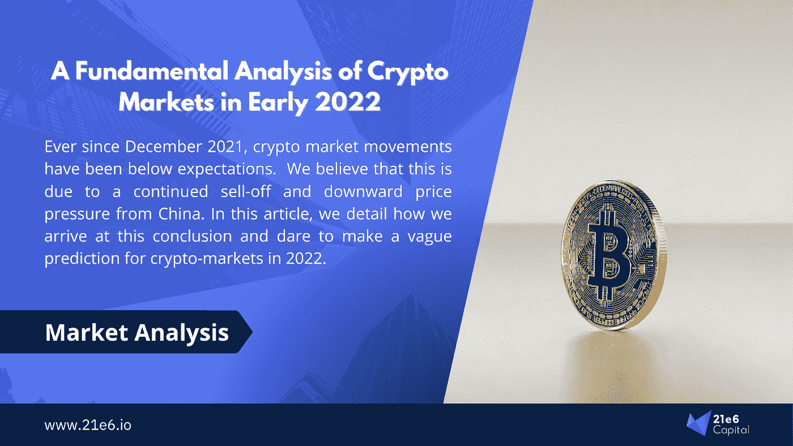
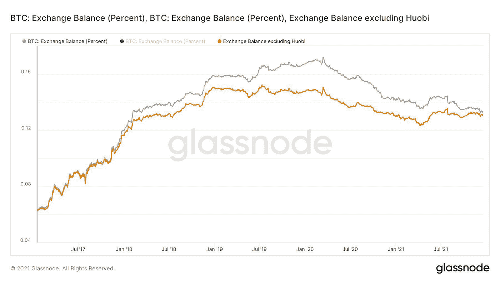
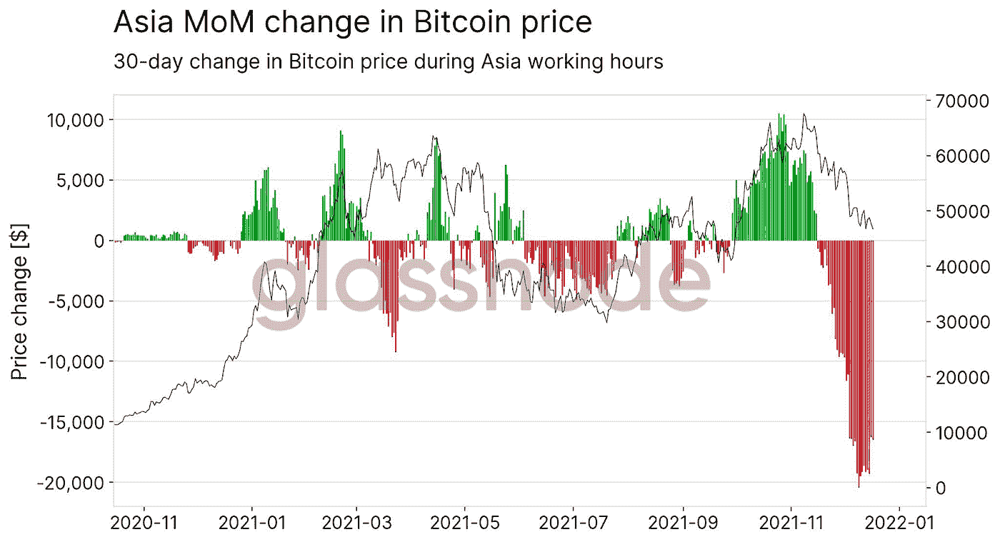
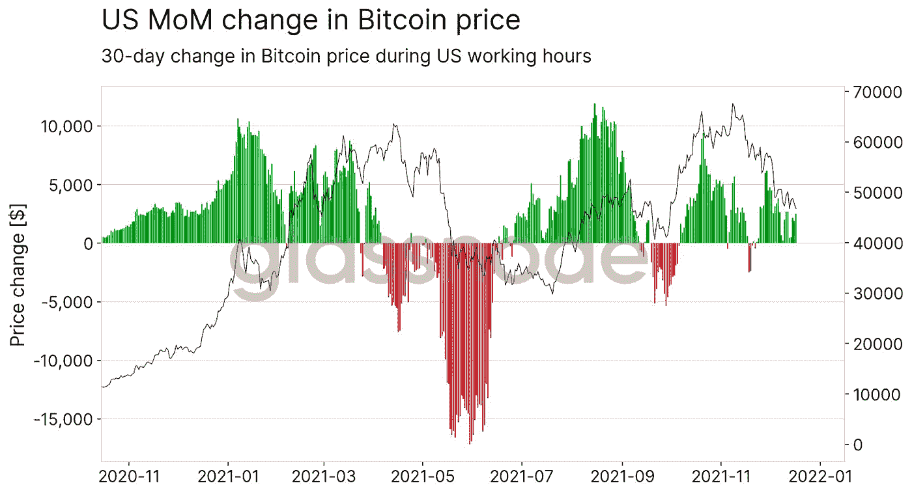
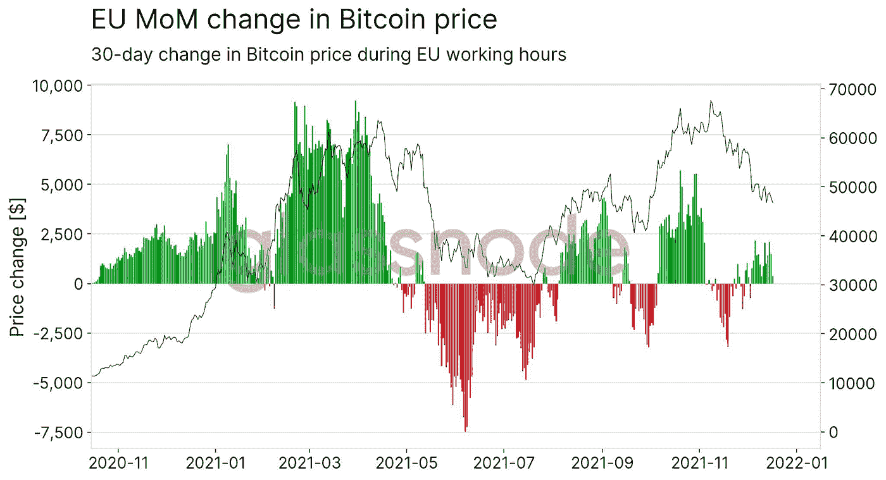
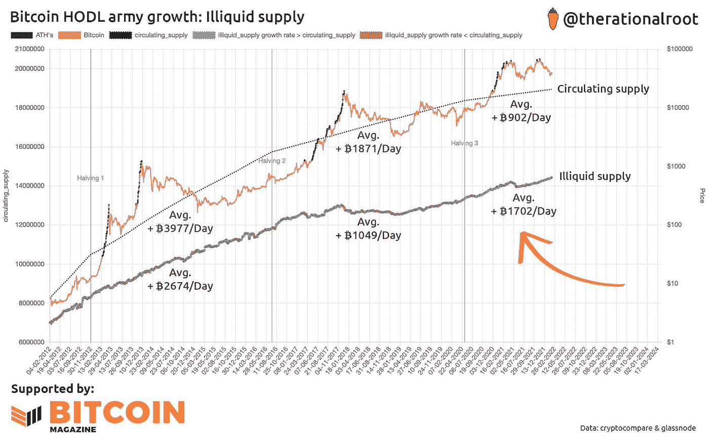

# 2022 年初加密市场的基本面分析:中国将很快停止出售比特币？

> 原文：<https://medium.com/coinmonks/a-fundamental-analysis-of-crypto-markets-in-early-2022-china-soon-to-stop-selling-bitcoin-e50dd62f464c?source=collection_archive---------14----------------------->

**高盛预测比特币今年将达到 10 万美元，区块链风险投资在 2021 年达到令人眩晕的高度，加密就业市场正以惊人的速度增长。尽管在机构和零售层面都出现了一波关于加密采用的好消息，但自 2021 年 12 月以来，市场走势远远没有达到所有人的想象。我们认为这是由于来自中国的持续抛售和价格下行压力，中国加密禁令的真正影响要到 2021 年的最后一个月才会显现。在本文中，我们详细介绍了我们是如何得出这一结论的，并大胆地对 2022 年的加密市场做出模糊的预测，考虑到尽管中国抛售，美国和欧盟市场的购买行动仍在继续。**

*作者:马克西米利安·布鲁克纳教授，菲利普·桑德纳博士*

# 尽管有好消息，加密价格已经停滞了几个月

2021 年的大部分时间可以被视为 crypto 非常积极的一年。不断有好消息传来，关于机构和主流采用的增加，在今年的最后几个月更是如此。2022 年的前两个月也继续传出利好消息。例如，高盛预测[比特币将在 2022 年](https://www.bloomberg.com/news/articles/2022-01-04/goldman-says-bitcoin-100-000-a-possibility-by-taking-on-gold)达到 10 万美元。最近的一些传言表明，贝莱德正计划通过其阿拉丁投资平台提供加密交易。报告显示，区块链领域的风险投资创下历史新高，高达 250 亿美元。根据 LinkedIn 的一份报告，LinkedIn 上的秘密工作机会增长了近 400%。**所有这些例子都指向一件事:无论是大型机构还是小型零售企业，对加密技术的接受度和采用度都在迅速上升。尽管如此，至少可以说，自 2021 年第四季度开始以来，加密价格一直停滞不前。2022 年 1 月是一个特别血腥的事件。**

对于最近几个月令人失望的价格走势，有许多看似合理的解释。首先，疫情继续投下它的阴影，奥米克隆浪涌当然做了他们的一部分。其次，也是更重要的一点，俄乌边境紧张局势的加剧令全球市场屏息以待。不确定性和焦虑是主导情绪。再加上对通胀的持续担忧和各国央行关于加息的令人困惑(有时是矛盾的)的声明，不难看出全球市场(因此也包括加密市场)的状况并不好。然而，我们认为，自 2021 年夏末或秋季以来，还有第四个因素(有时被忽视，但却是主要因素)推动加密价格下行。这个因素对股票市场没有影响，但对 crypto 是独特的。我们认为，中国加密禁令的真正影响仍在显现。但这可能很快就会停止。

# 自 2021 年 5 月禁令颁布以来，中国一直在出售比特币

由于比特币价格运动和加密市场的其他部分之间仍然存在非常明显的相关性，我们发现将比特币作为我们以下分析的基础是足够的。这里的价格变动应该会转化为市场的其他部分，就像我们在过去多次看到的那样。

为了开始我们的分析，有必要先回顾一下中国的加密禁令。您可能还记得，禁令并不是一下子出台的，而是在一年中分三个不同的阶段实施的:

*   第一阶段，2021 年 5 月:中国禁止其所有金融机构从事任何加密交易。
*   第二阶段，2021 年 6 月:中国政府禁止所有国内秘密采矿。
*   第三阶段，2021 年 9 月:所有加密货币在中国完全非法，没有解释的余地。

这些阶段中的每一个都单独对加密市场产生了直接影响，我们将在本文的稍后部分对此进行分析。现在，我们想把重点放在我们今天仍然看到的效果上。**从 5 月份开始，人们可以观察到中国对比特币的稳步抛售，在去年最后几个月变得更加强劲。抛售并不是突然的抛售，而是以一种更加可控的速度推进。**基本原理非常清楚:想象一下你的国家打击加密资产并开始实施这样的新规则。如果是这样的话，在这样一个国家，任何加密资产的持有者至少会考虑出售一些资产，以避免与政府对抗。举例来说，图 1 重点关注交易所持有的流通比特币总供应量的百分比。作为中国最大的密码交易所，火币网在这里备受瞩目(他们正在迁出，以便能够继续运营)。

*Figure 1: BTC Exchange Balance in % of total circulating BTC supply. Source:* [*glassnode.com*](http://glassnode.com)

我们可以观察到，在 2021 年 5 月(第一阶段)有一次突然下降，之后我们看到一个相当快速的恢复。然而，自此次复苏以来，余额一直在稳步下降，表明大型交易所进行了某种抛售。这由两条所示曲线的即将到来的会聚进一步支持。一个(灰色)显示外汇总余额，另一个(橙色)显示不包括人民币的外汇余额。当我们向图表右侧接近 2022 年 1 月时，我们可以看到曲线接近完全收敛。这与火币网的报道一致，报道称火币网正在关闭中国业务，只允许现有客户在最长两年的过渡期内提取资金。据报道，其他几家中国交易所也在遵循类似的策略。假设火币的大部分客户都是中国人(也就是说他们都要提现)，那么他们的比特币余额因供应过剩而下降也就说得通了。但中国密码交易所的“库存”不能低于零。因此，这种抛售压力应该停止。

# 亚洲市场对比特币价格产生负面影响

下图(图 2)进一步强调了中国正在发生抛售的观点。它显示了亚洲工作时间内比特币价格的变化，也就是这些市场最活跃的时间。由于中国是迄今为止最大的亚洲加密市场，我们将使用这个图表作为我们在中国看到的活动的代表。

*Figure 2: MoM change in Bitcoin price during Asian working hours. Source:* [*glassnode.com*](http://glassnode.com)

首先，我们可以看到整个 2021 年销售压力的小高峰，与中国加密禁令的阶段一致。第一阶段导致整个 5 月亚洲工作时间价格出现负值变化，第二阶段导致 6 月底至 8 月出现更多抛售。有趣的是，9 月份的全面禁令并没有产生立竿见影的效果。**相反，一个延迟的反应将在 2021 年 12 月左右开始。Huobi 和其他交易所宣布计划在 12 月初关闭中国业务。抛售大约在同一时间开始。**现在，尽管稍有延迟，但这一反应比针对前几阶段禁令的反应要强烈得多。这是有道理的，因为第一阶段和第二阶段“更成熟”，对大型交易所没有直接影响。

# 美国和欧盟市场的数据描绘了一幅不同的画面

与亚洲市场相反，美国和欧盟市场分别在 5 月和 6 月对第一阶段和第二阶段做出了更强烈的反应，而 9 月的最终禁令几乎没有影响。

例如，图 3 显示了美国工作时间比特币价格的变化。【2021 年的五月和六月是红色的。图 4 显示欧洲也是如此。然而，美国和欧盟对最终禁令没有任何反应，从 2021 年 12 月到现在，我们实际上可以在各自的工作时间内观察到积极的价格变化。

*Figure 3: MoM change in Bitcoin price during US working hours. Source:* [*glassnode.com*](http://glassnode.com)

更强的直接影响的一个原因可能是美国和欧盟秘密社区对中国即将出台的禁令的预先存在的 FUD(恐惧-不确定性-怀疑)。这种彻底的禁令可能已经在第一阶段和第二阶段考虑在内，因此第三阶段的冲击值和权重要小得多。

*Figure 4: MoM change in Bitcoin price during EU working hours. Source:* [*glassnode.com*](http://glassnode.com)

尽管自去年 11 月以来，亚洲市场的抛售力度超过以往任何时候，但美国和欧盟市场仍在无情地买入。尽管这不足以抵消亚洲抛售带来的价格下行压力，但这将显示其积极影响，这应该只是一个时间问题。我们认为，考虑到这里提供的数据，一旦亚洲抛售结束，来自美国和欧盟市场的购买压力将会势不可挡。随着源源不断离开中国的比特币枯竭(考虑到图 1，这应该会很快)，价格应该会对来自欧盟和美国的上行压力做出相应反应。我们认为欧洲和美国市场的这种购买情绪没有理由消退，假设我们继续保持前面详述的这种增加采用的趋势。

# 比特币 HODL 大军的增长可能会加速价格上涨

自第三次减半以来，流通比特币供应量一直在平均增长。902 BTC/天。相比之下，持有的比特币数量(因此缺乏流动性)每天增长约 1702 BTC——几乎是流动性供应增长的两倍。图 5 展示了这些数据。我们可以从中看出，新的比特币供应正在缓慢但肯定地减少。请记住，采用率正在上升，每天都有更多的新钱包注册，这两条曲线收敛只是时间问题。第四次减半预计在 2024 年，这将加速这一现象——但在此之前我们可能已经达到了一个临界点。用数字来表示:现在，大约。每天产生 900 个比特币。加州。1700 个比特币从流动性市场转移到非流动性供应市场。净效应是——每天——800 个比特币从液体供应中被移除。所有这些指标都是“平均值”,并且会随着时间而变化。

*Figure 5: Bitcoin HODL army growth, illiquid supply is catching up to circulating supply. Source:* [*Bitcoin Magazine*](https://bitcoinmagazine.com/)*, Twitter* [*@therationalroot.*](https://twitter.com/therationalroot?s=20&t=Pi6f4qOqx3SCYgNgMYQPrw)

目前中国的抛售是进入市场的过剩但暂时流动的比特币供应的主要来源。欧洲和美国投资者张开双臂欢迎这种供应，大量购买。**但是当这种过剩供应流枯竭时会发生什么？当中国加密交易所的客户出售了大部分资产(以接近零余额的“库存”表示)时，会发生什么？正如早些时候所暗示的那样，在更多利好消息的支撑下，美国和欧盟可能会继续购买，从而进一步加剧流动性不足的供应增长。**采矿奖励是不够的，因为需求远远高于供应。任何对经济学有一些基本了解的人都可以猜到接下来会发生什么。然后，下一次减半将在 2024 年开始。

# 对 2022 年的预测

随着中国交易所持有的加密资产(主要是比特币)的比例越来越低，我们预计中国的抛售将在未来几周甚至几个月内完成。然后，在其他条件不变的情况下，美国和欧盟市场将继续买入，并受益于这一波利好消息。随着越来越多的霍德勒继续买入并持有，流动性不足的供应进一步增加，而中国不再有任何暂时的重大抛售压力。这可能会导致价格上涨。然而，要实现这一发展，需要考虑 crypto 之外的三个关键宏观经济风险。所有这三个因素都可能促成或破坏这种运动。首先，我们需要看到围绕乌克兰危机的紧张局势有所缓和。这场危机不仅对 crypto 构成威胁，也对所有市场构成威胁。其次，欧洲央行债券购买计划到期和加息可能导致流入加密资产的资本减少。第三，美国、俄罗斯或土耳其等较大国家的监管变化可能会显著改变市场情绪。

# 评论

***请注意，本分析不代表财务建议，也不应被理解或解释为购买或出售任何证券、硬币或代币。任何意见表达(如有更改，恕不另行通知)都是作者个人的，作者不保证所提供的任何信息或分析的准确性或完整性。***

*如果你喜欢这篇文章，我们会很高兴你转发给你的同事或在社交网络上分享。如果你是这一领域的专家，并想批评或赞同这篇文章或其中的一些部分，请随时在这里或上下文中留下私人笔记，我们将予以回应或解决。*

# 关于 21e6 大写

21e6 Capital 是一家瑞士投资顾问公司，为专业投资者提供最佳加密投资产品。21e6 Capital 已经分析了全球 1000 多只加密基金，并将其浓缩为一个精选，可以在最大限度降低下行风险的情况下产生加密风险。21e6 Capital 拥有一支经验丰富的加密和金融专家团队，他们在数字资产和 DLT 方面有着深入的知识，在此团队的支持下，21e 6 Capital 创建了一个独特的量化策略，旨在实现类似加密的回报，同时将全球股票水平的风险和波动性降至最低。21e6 资本团队建立在强大的学术基础之上，拥有领先的加密资产和分散金融出版物和研究的记录，确保为金融行业专业人士提供最先进的加密投资解决方案。

在社交媒体上了解 21e6 Capital 的最新消息:

21e 6 LinkedIn 上的资本:[https://www.linkedin.com/company/21e6-dlt](https://www.linkedin.com/company/21e6-dlt)

21e6 推特上的资本:[https://twitter.com/21e6_Digital](https://twitter.com/21e6_Digital)

网址: [www.21e6.io](http://www.21e6.io)

# 关于作者

**马克西米利安·布鲁克纳**是 [21e6 资本公司](https://assets.21e6.io/)的营销&销售主管。在此之前，他被聘为[国际令牌标准化协会(ITSA)](https://my.itsa.global/) 的执行理事。在那里他根据国际令牌分类(ITC)框架专注于加密资产的深入研究和分类。他积极参与创建了世界上最大的代币分类数据库。Maximilian 毕业于法兰克福金融和管理学院，并对“令牌数据库的用例”进行了研究。您可以通过电子邮件联系 Maximilian。bruck ner @ 21e 6 . io，索取关于 21e6 Capital AG 的更多信息或询问有关本文的任何问题。你也可以在[LinkedIn](https://www.linkedin.com/in/max-bruckner/)([https://www.linkedin.com/in/max-bruckner/](https://www.linkedin.com/in/max-bruckner/))上关注马克西米利安，了解最新动态。

【Philipp Sandner 博士教授创立了法兰克福学派区块链中心( [FSBC](https://t.sidekickopen87.com/s3t/c/5/f18dQhb0S7kF8cpmrkVr4RpG59hl3kW7_k2841CX6NGW36PLkb1DWFGZN1Dh2LLg4ZcWf197v5Y04?te=W3R5hFj26QkH2W4cfKWd43P1h_W3QZmG81JxXw90&si=8000000020483768&pi=8ade3d9e-01b0-4158-de77-3df023d454ee) )。2018 年至 2021 年，他被德国主要报纸《法兰克福汇报》(Frankfurter Allgemeine Zeitung，FAZ)评为[“前 30 名”经济学家](https://t.sidekickopen87.com/s3t/c/5/f18dQhb0S7kF8cpmrkVr4RpG59hl3kW7_k2841CX6NGW36PLkb1DWFGZN1Dh2LLg4ZcWf197v5Y04?te=W3R5hFj4cm2zwW4mKLS-3M0j6bW41RkwN3zcKSrW3K6jCB4mCWPMW4cHc2t3M84zZW3T30bh3F7xMzW4fNrs_4cPTnzW1Lxc331GLryyW3K5Wql43T9x2W49HS6G3T1k6SW1S1nmr1GznmZW1GJ1g23K6jDBW41nX311Y-gRrF1--VSgS6TW1&si=8000000020483768&pi=8ade3d9e-01b0-4158-de77-3df023d454ee)。此外，他属于“40 岁以下前 40 名”——德国商业杂志《资本》的排名。他是德国联邦财政部金融科技委员会和数字金融论坛的成员。他还是 [FiveT Fintech Fund](https://t.sidekickopen87.com/s3t/c/5/f18dQhb0S7kF8cpmrkVr4RpG59hl3kW7_k2841CX6NGW36PLkb1DWFGZN1Dh2LLg4ZcWf197v5Y04?te=W3R5hFj4cm2zwW3M3DBh4fdHZSW3_rh9h4kCJycF3M3CVFQs4J1&si=8000000020483768&pi=8ade3d9e-01b0-4158-de77-3df023d454ee) 、 [21e6 Capital](https://t.sidekickopen87.com/s3t/c/5/f18dQhb0S7kF8cpmrkVr4RpG59hl3kW7_k2841CX6NGW36PLkb1DWFGZN1Dh2LLg4ZcWf197v5Y04?te=W3R5hFj4cm2zwW3zh2yr4fNk1WF1QsWmxmM4N1&si=8000000020483768&pi=8ade3d9e-01b0-4158-de77-3df023d454ee) 和[block chain Founders Group](https://t.sidekickopen87.com/s3t/c/5/f18dQhb0S7kF8cpmrkVr4RpG59hl3kW7_k2841CX6NGW36PLkb1DWFGZN1Dh2LLg4ZcWf197v5Y04?te=W3R5hFj4cm2zwW3K726T3ZZmPcW3F7xMD41n_LkW4hJTXV49Rd2y348V2&si=8000000020483768&pi=8ade3d9e-01b0-4158-de77-3df023d454ee)的董事会成员，这些公司活跃于区块链初创公司的风险资本融资和加密资产投资管理。

> 加入 Coinmonks [电报频道](https://t.me/coincodecap)和 [Youtube 频道](https://www.youtube.com/c/coinmonks/videos)了解加密交易和投资

# 另外，阅读

*   [用于 Huobi 的加密交易信号](https://coincodecap.com/huobi-crypto-trading-signals) | [HitBTC 审核](/coinmonks/hitbtc-review-c5143c5d53c2)
*   [如何在 FTX 交易所交易期货](https://coincodecap.com/ftx-futures-trading) | [OKEx vs 币安](https://coincodecap.com/okex-vs-binance)
*   [OKEx vs KuCoin](https://coincodecap.com/okex-kucoin) | [摄氏替代品](https://coincodecap.com/celsius-alternatives) | [如何购买 VeChain](https://coincodecap.com/buy-vechain)
*   [ProfitFarmers 点评](https://coincodecap.com/profitfarmers-review) | [如何使用 Cornix 交易机器人](https://coincodecap.com/cornix-trading-bot)
*   [如何匿名购买比特币](https://coincodecap.com/buy-bitcoin-anonymously) | [比特币现金钱包](https://coincodecap.com/bitcoin-cash-wallets)
*   [瓦济里克斯 NFT 评论](https://coincodecap.com/wazirx-nft-review)|[Bitsgap vs Pionex](https://coincodecap.com/bitsgap-vs-pionex)|[坦吉姆评论](https://coincodecap.com/tangem-wallet-review)