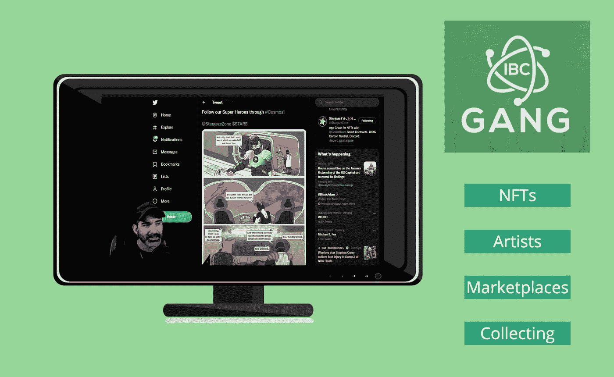

# 一群狂热分子

> 原文：<https://medium.com/coinmonks/a-gang-of-enthusiasts-e0b2c4805f5b?source=collection_archive---------12----------------------->

**聚焦内容创作者**

通过我在区块链各地的生态系统中的旅行，访问在线社区已经成为一种定期和有益的努力。我逛过治理论坛、应用论坛、discords、作家网站、区块链社区，当然还有各种活跃的 Twitter 爱好者团体。参与的质量和数量因社区而异。开始一个新的系列，我将聚焦我认为提供有价值的、信息丰富的、高质量的视频频道、播客和博客的内容创作者。

## **IBC 帮**

今年早些时候，我发现了一个拥有 YouTube 频道的社区，它不同于我以前进入过的任何其他社区。我立刻被这个频道的内容、草根社区的参与以及主持人和成员的真诚所吸引。我想强调是什么让这群爱好者如此特别，每天呈现什么类型的内容，以及社区是如何有机增长的。

## **彰显宇宙**

诚实和真实是描述坦克和 IBC 帮在 YouTube 上的每日直播流和特别视频的最佳方式。该频道显然是为了造福于蓬勃发展的宇宙社区，重点关注有关项目、团队、硬币和代币、NFT 以及这个主权区块链的伟大生态系统中的相关事件的当前有用信息。

Tank 不仅强调了建设者和项目，还强调了积极进行分析、写 twitter 帖子、评论 NFT 和发表文章的社区成员。实习生、社区版主、验证人员和开发人员的工作定期在 IBC 帮派频道上展示和讨论。

## **每日宏观讨论、新闻和分析**

每个 IBC 帮直播流开始与宏观环境的分析审查，链接到主要加密硬币和代币的图表分析:BTC，联邦理工学院和原子。随后，其他图表分析重点关注其他重要的 Cosmos 令牌的轮换阵容，包括 Juno 网络的区块链治理令牌、秘密网络和渗透区。Tank 始终开放，根据实时聊天的请求绘制其他令牌。

将特定区块链微观层面上发生的事情与更广泛的宏观经济事件联系起来的能力，是坦克的超能力之一。他很擅长用通俗易懂的方式解释世界经济如何影响我们的投资组合。直播流还触及影响宇宙中特定项目的特定新闻片段。

## **培养合作伙伴关系并介绍建设者**

给社区一个机会去倾听现有的、有前途的和未来的项目的创始人、开发者、验证者和营销者，这是 IBC 帮频道的另一个特色。

例如，Tank 采访并接待了来自 Konstellation Network、Passage3D、Comdex、PBCups Validator 和 Notional Validators 的创始人。Sifchain 和 Racoon Supply 的社区代表也加入了直播。

重点一直是培养与宇宙生态系统中的建设者和创造者的伙伴关系。最近，IBC 一伙已经开始与概念验证器合作。

## **增加 NFT 体验**

随着来自世界各地的人们对 NFT 越来越感兴趣，IBC 帮现在已经成为《家园宇航员》的固定节目。每周四，NFT 的收藏、艺术家和活动都会在直播网上讨论。

Tank 还宣布了他自己的 NFT 项目，该项目仍在开发中，但可能会在一个月后在 Stargaze 上启动。

## **真诚、无畏、诚实**

IBC 帮的 YouTube 频道已经有了一个很好的模式，我个人很期待听每天的直播。因为它们在 YouTube 上，如果我不能现场观看，我也可以稍后观看。仅仅看了几个月的节目，我就已经看到了一种适应变化环境的意愿。Tank 引入了新功能，培养了新的合作伙伴，甚至在他的商业投资组合中增加了一个新项目。我重视企业家精神，这在这个娱乐频道所代表的一切中显而易见。

正如 Tank 经常向 IBC 帮派指出的那样，在熊市期间建立一个视频频道并不容易。然而，如果有人真的有机会成功增加参与度，建立一个可持续的社区，超越当前低迷的市场，那就是 Tank。与真正的评论，诚实的意见，有用的图表分析，和翔实的嘉宾亮相，IBC 帮是一个资源，充满了有价值的信息，所有包装成一个娱乐节目！

他在门口喊——Opa。

## **资料来源、参考文献和进一步阅读**

YouTube 频道—[https://www.youtube.com/c/IBCGANG](https://www.youtube.com/c/IBCGANG)

IBC 帮推特— @IBC 帮

坦克的推特— @CryptoTank_

[https://discord.com/invite/ibcgang](https://discord.com/invite/ibcgang)IBC 帮不和邀请

概念验证器 Twitter—@概念道

家园宇航员推特—@宇航员 _nicl

https://app.stargaze.zone/marketplace NFT 市场

Stargaze Twitter — @StargazeZone

> 加入 Coinmonks [电报频道](https://t.me/coincodecap)和 [Youtube 频道](https://www.youtube.com/c/coinmonks/videos)了解加密交易和投资

# 另外，阅读

*   [CoinLoan 评论](https://coincodecap.com/coinloan-review) | [YouHodler 评论](/coinmonks/youhodler-4-easy-ways-to-make-money-98969b9689f2) | [BlockFi 评论](https://coincodecap.com/blockfi-review)
*   [XT.COM 评论](https://coincodecap.com/profittradingapp-for-binance)币安评论 |
*   [SmithBot 评论](https://coincodecap.com/smithbot-review) | [4 款最佳免费开源交易机器人](https://coincodecap.com/free-open-source-trading-bots)
*   [比特币基地僵尸程序](/coinmonks/coinbase-bots-ac6359e897f3) | [AscendEX 审查](/coinmonks/ascendex-review-53e829cf75fa) | [OKEx 交易僵尸程序](/coinmonks/okex-trading-bots-234920f61e60)
*   [如何在印度购买比特币？](/coinmonks/buy-bitcoin-in-india-feb50ddfef94) | [瓦济克斯审查](/coinmonks/wazirx-review-5c811b074f5b)
*   [加密交易机器人](/coinmonks/crypto-trading-bot-c2ffce8acb2a) | [概率评估](https://coincodecap.com/probit-review)