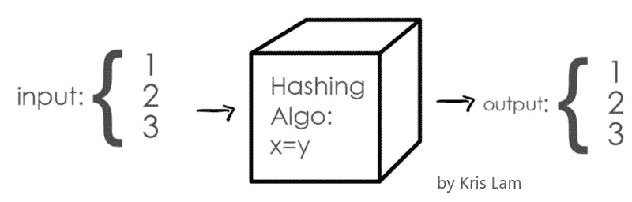

# 区块链和加密货币简介

> 原文：<https://medium.com/coinmonks/a-gentle-introduction-into-blockchains-and-crypto-currencies-4012beecc42f?source=collection_archive---------14----------------------->

区块链已经存在了 14 年，然而大多数人仍然不明白它是什么。这里有一个严格但可以理解的解释。

# 分类帐、散列和块

首先——账本。如果你以前研究过《加密与区块链》,你一定听说过它被用来形容区块链。如果你忘记了或者没有忘记，这里有一个快速复习。你可以把区块链想象成一个分类账，每一块代表一笔交易。因此，对于每个块代表一笔交易的区块链来说，当你给你的朋友寄 100 美元时，就会产生一笔交易，当他们把 100 美元还给你时，就会产生另一笔交易。这个区块链现在总共有 2 个记录两个交易的块。

Illustration of a Two-Block-Chain

那么为什么不使用传统的账本呢？一个字:诚信。要解释区块链如何确保其记录的完整性，必须了解两件事:什么是散列，块包含什么。

首先，让我们解决什么是散列。它是从输入中生成(哈希)的唯一数字。因为散列对于输入是唯一的，所以使用两个不同的输入不可能得到相同的散列。简单散列算法的一个例子是 x = y。当数字 1 被赋予散列算法时，散列是 1。此外，如果输入不是 1，则不可能输出 1。由于存储在计算机上的任何东西都是一个数字(尽管是二进制的)，任何数字信息(文本/图像/密码/音频文件/交易记录)都是可散列的。基本上，散列是数字内容的指纹。

Illustration of a Hashing Algorithm

继续，是什么让区块链成为如此可信的记录呢？每个块包含三样东西:它记录的信息、前一个块的散列和它的散列。让我们重温一下上面的简单散列算法(x = y)。回想一下，块的散列=(它的信息+前一个块的散列)。因此，每当数据块中的信息发生变化时，受损数据块的哈希也会被修改。由于后面每个块的散列都没有改变，所以链是不一致的。

Illustration of a Two-Block-Chain with Block Components

为了更好地说明这一点，让我们想象一个有三个分录和一个相应的长度为 3 的区块链的分类账。假设一个人想改变第二笔交易。他们可以通过使用一些专业的伪造技巧编辑纸质分类账中的第二个条目来欺骗所有人。然而，这在区块链上是不可能的。一旦他们改变了第二个块中存储的信息，第二个块的散列将是不同的(唯一性)。

Illustration of a Chain with a Compromised Block

现在，块 3 的 hash(0+' f '+' g '+' h ')不再代表它的前任(0+'f'+'i ')。块 2 被确定为受损。当然，对于长度仅为 3 的区块链，改变块 2 和块 3 仍然是可行的。因此，实际区块链实现了两个额外的安全措施来减轻这种风险:工作证明和分散。

工作证明使哈希公式变得复杂，延长了计算哈希的过程。以比特币的链条为例。计算每个块的散列大约需要 10 分钟(Blockchair，2022)。对于当前大约 726，355 个块(Blockchair，2022)，您将需要超过 720 万分钟或 13.7 年来改变链上的所有块。这将忽略在此过程中创建的任何新块。仅这一措施就使得任何人几乎不可能改变先前块中的任何信息。

去中心化是将区块链分配给任何想要帮助验证这些交易的人的过程。实际上，工作证明使得一台单独的计算机几乎不可能验证整个链。因此，多台计算机(矿工)将它们的计算能力集中到一个节点上。然后，该节点接收该链的副本，并在它的挖掘器之间划分该副本以供验证。每当一个节点生成一个新块时，所有其他节点都将接收它并验证其完整性。如果新块与整个链一致，链将添加新块，并将比特币释放到节点作为奖励(我们稍后将重新讨论这一点)。然后，每个节点定期检查其区块链是否与大多数节点的链相同。如果不一致，该节点将知道其链被破坏，并用最常见链的副本替换它。

为了更好地解释这是如何工作的，让我们想象一个有 3 个节点(A、B、C)的系统，这样存在长度为 3 的链的三个副本。

现在，假设节点 B 的链受到损害，使得块二中的信息被改变，并且块三被重新计算以保持一致(工作证明失败)。

Illustration of Compromised Chain

既然链条是去中心化的，那么只有 B 的链条是腐败的。因此，当 B 对链 A 和 C (0 + 'f' + 'g' + 'h ')进行定期完整性检查时，它将识别出其链(0 + 'f' + 'i' + 'h ')受到损害，并将其替换为正确的版本。

当然，想要改变块的专用对抗者可以通过为 B 和这个理论上的 3 节点网络中的一个其他节点重新计算整个链来实现。但是有了工作证明、分散化和大量的块，攻击一个链就变得不可能了。

希望您现在能够体会到使用区块链存储只读数据的安全性。整个系统使得对一个机构的信任变得不必要(即无信任)。任何试图利用该系统的行为都是不可能的，任何有兴趣证明其完整性的人都可以这么做。

# 代币，可替换或其他

随着区块链的出局，我们可以谈论加密货币和不可替代代币(NFT)。首先，什么是代币？如果区块链是分类账，代币就是交易中的项目。所以，比特币区块链记录比特币代币的交易，以太坊区块链记录以太代币。这些令牌作为激励人们成为矿工，并有助于保持区块链的安全。如上所述，当生成新的块时，进行计算的节点接收预先确定的令牌作为奖励。在同一链上注册其他令牌也是可能的。然而，这些替代硬币(alt-coins)不会作为采矿的奖励，而是作为链的原始令牌可以购买的商品。以以太坊网络为例。$TKING(是的，虎王的加密存在)目前在撰写本文时的交易价格为 0.000004474 美元。但是因为是在以太坊网上，所以只能用以太坊链上的其他币购买。再以流行的$DOGE 币为例。它只能用币安智能链(BSC)上的代币购买，因为它是在 BSC 上注册的。令牌组学的世界中存在更多的概念，并且非常有趣。但是它们的复杂性使得再写一篇文章是一个更好的决定。

NFTs 呢？它们与$DOGE 和$BTC 有什么不同？像$DOGE 和$BTC 这样的令牌是可替换的令牌，而 NFT，顾名思义，是不可替换的。可替代和不可替代的区别在于唯一性和可分性。可替换令牌可以被分割，并且不是唯一的。以比特币这种可替代的代币为例。由于它的整除性，我可以买 0.001 BTC。这个属性对于去中心化的概念是必不可少的，因为奖励是在一个节点的矿工之间分配的。此外，可替换令牌的非唯一性意味着我钱包里的比特币与埃隆·马斯克(Elon Musk)持有的比特币无法区分。另一方面，不可替换的令牌是不可分割的，并且是唯一的。它们代表了区块链不可分割和独特的项目。一些例子包括土地、绘画、机票和选票。需要注意的是，NFT 只代表物体本身，而不是物体本身。因此，一只无聊的猿的形象不在区块链上，只是它的表象。

Bored Ape Yacht Club #8817 by Yuga Labs. Its NFT sold for USD 3.4 Million

# 区块链解决了这个问题

那么，这项技术有哪些实际的使用案例呢？这取决于你的想象力和创造力。一个常见的实现是使用它们来跟踪游戏中玩家的装备/资产。DAOs 中实现了 crypto 的另一个用例。如果你没有听说过他们，他们是用区块链上的 NFTs 作为投票来决定他们行动的组织。我认为这一概念可以进一步扩展到我们政府的选举中。这一实施将解决诸如对投票制度缺乏信任和压制少数民族选民等问题。听我说完。

2020 年美国大选后，大规模抗议活动震撼了整个国家，人们在国会山因声称选民欺诈而发生骚乱。这是怎么发生的？除此之外(网络操纵、阴谋论、缺乏负责任的领导等等。)，对政府和机构缺乏信任是一个因素。我认为这是最关键的因素。如果人们更加信任这个系统，那么对选举舞弊的指控只会被当成阴谋而不予理会。这种对机构信任的崩溃来源广泛(种族不公正、假新闻、GFC 等等)。)，但在我看来，修复是直接的。通过实施区块链作为投票系统和 NFTs 作为选票，任何对选举过程有一丝怀疑的人都可以通过检查区块链本身来验证选举过程的完整性。让政府为每个登记选民创造一个钱包。到了选举周期，让政府把选票作为 NFT 发到每个人的钱包里。选民通过将代币投入候选人的钱包来投票。任何有疑问的人都可以亲自验证区块链。此外，关闭黑人社区投票站以压制他们在选举中的声音的策略(Salame，2020)(Fowler，2020)将成为过去。通过发送代币来投票，任何有手机的人都可以发出自己的声音。从这个意义上说，实施区块链将纠正对选民的压制，并恢复对这一进程的信任。

我已经向广泛的受众推销过这种想法，最常见的担忧是这种想法的碳足迹和对拥有加密钱包的选民的依赖。首先解决碳问题，目前的区块链确实使用了大量能源。一篇发表的同行评议文章估计，维持比特币区块链的碳足迹为 65.4 兆吨二氧化碳(MtCO2) (de Vries，gallersdrfer，klaaen 和 Stoll，2022 年)。这比希腊 2019 年的总碳足迹(5660 万吨二氧化碳)还要多。由碳排放导致的气候变化导致的极端天气条件的增加使得这一统计数据难以忽视。然而，支持选举进程的区块链没有这个问题。与一年中每秒都有交易发生的比特币相比，选举更为罕见。因此，选举区块链将只需要在选举周期期间在线，与比特币相比，减少了大量的电力使用。验证选举选票的速度也不是优先考虑的，这意味着不需要耗电的顶级哈希处理器。区块链的实施也将取代模拟选举的碳使用，进一步减少选举过程的净碳。NFT 选票将取代纸质选票，从而减少生产和运输过程中产生的所有碳排放。通过碳经济区块链和取代传统的选举程序，减少选举的碳足迹是可能的。

谈到第二个反对理由，的确，这将依赖于所有选民都有一个数字钱包。然而，目前的技术给任何能上网的人一个钱包。公共接入点的存在也是为了填补人们没有互联网的空白。更进一步说，一个将个人的政府身份与他们的钱包联系起来的“了解你的客户”( KYC)程序已经存在。选民的钱包可以通过将 KYC 记录与选民登记过程联系起来来识别。更不用说政府提供专门用于官方功能的钱包，如选举和存储信用评分等。互联网接入在美国越来越受欢迎，加上现有的 KYC 流程，这意味着在此范围内实施区块链将主要侧重于技术，而不是物流。

我已经偏离了轨道，开始推销区块链的一款应用。我就停在这里。希望，通过解释区块链是什么和它能做什么，你已经对这项技术如何潜在地改变我们的生活有了一些新的见解。

*:实际上，每个块可以包含 1 到 100，000 个交易，具体取决于区块链

# 参考资料:

木椅。(2022 年 3 月 9 日)。*比特币探索者*。从木椅上取回:【https://blockchair.com/bitcoin?from=bitcoin.com】T2

de Vries，a .，gallersdrfer，u .，klaaen，l .，和 Stoll，C. (2022 年)。重新审视比特币的碳足迹。*焦耳*。[https://doi.org/10.1016/j.joule.2022.02.005](https://doi.org/10.1016/j.joule.2022.02.005)

福勒，S. (2020 年 10 月 17 日)。为什么佐治亚州的非白人选民要排队等几个小时？投票点太少。从 NPR 检索:[https://www . NPR . org/2020/10/17/924527679/why-do-non-white-Georgia-voders-have-to-wait-line-wait-less-polling-pl](https://www.npr.org/2020/10/17/924527679/why-do-nonwhite-georgia-voters-have-to-wait-in-line-for-hours-too-few-polling-pl)

萨拉梅河(2020 年 3 月 2 日)。德克萨斯州关闭了数百个投票站，使得少数族裔更难投票。从《卫报》检索:[https://www . The Guardian . com/us-news/2020/mar/02/Texas-polling-sites-closures-voting](https://www.theguardian.com/us-news/2020/mar/02/texas-polling-sites-closures-voting)

> 加入 Coinmonks [电报频道](https://t.me/coincodecap)和 [Youtube 频道](https://www.youtube.com/c/coinmonks/videos)了解加密交易和投资

# 另外，阅读

*   [BlockFi vs 摄氏](/coinmonks/blockfi-vs-celsius-vs-hodlnaut-8a1cc8c26630) | [Hodlnaut 点评](/coinmonks/hodlnaut-review-best-way-to-hodl-is-to-earn-interest-on-your-bitcoin-6658a8c19edf) | [KuCoin 点评](https://coincodecap.com/kucoin-review)
*   [Bitsgap 审查](/coinmonks/bitsgap-review-a-crypto-trading-bot-that-makes-easy-money-a5d88a336df2) | [Quadency 审查](/coinmonks/quadency-review-a-crypto-trading-automation-platform-3068eaa374e1) | [Bitbns 审查](/coinmonks/bitbns-review-38256a07e161)
*   [加密复制交易平台](/coinmonks/top-10-crypto-copy-trading-platforms-for-beginners-d0c37c7d698c) | [Coinmama 审核](/coinmonks/coinmama-review-ace5641bde6e)
*   [印度的加密交易所](/coinmonks/bitcoin-exchange-in-india-7f1fe79715c9) | [比特币储蓄账户](/coinmonks/bitcoin-savings-account-e65b13f92451)
*   [OKEx vs KuCoin](https://coincodecap.com/okex-kucoin) | [摄氏替代度](https://coincodecap.com/celsius-alternatives) | [如何购买 VeChain](https://coincodecap.com/buy-vechain)