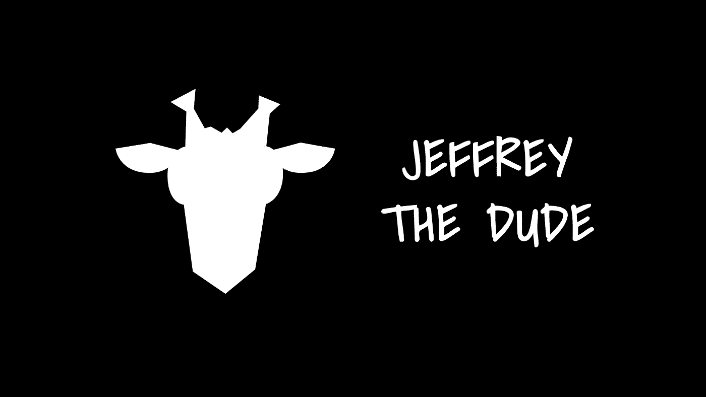
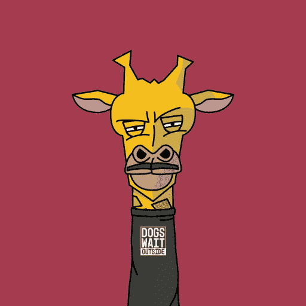

# 长颈鹿或 NFT:谁是杰弗里？

> 原文：<https://medium.com/coinmonks/a-giraffe-or-an-nft-whos-jeffrey-the-dude-f5ba063884d8?source=collection_archive---------61----------------------->

有些人说他是长颈鹿，有些人说他是 NFT，但杰弗里自称是花花公子

杰弗里是一种身体短小、尾巴丛生、鬃毛短、长有短角的动物。他的外套是浅黄色的，带有红棕色的斑点。哈哈 J 那就挺清楚了。他是一只长颈鹿！

但这还不是全部，事实上，这位老兄声称他不仅仅是一只长颈鹿:“请深呼吸，仔细看…，哦，就是它！你只是注意到了一个现状，一个好像是品牌的想法，我就是他喊的那哥们！”

# **我是品牌？**

事实上，Jeffrey 是一个由 5432 Jeffrey NFTs 持有者拥有和管理的品牌。这意味着每一个杰佛里·NFT 的拥有者也是整个**品牌**的一部分:这赋予了巨大的权力——一如既往，伴随着巨大的权力而来的是巨大的责任！每个 Jeffrey 所有者都从品牌收入中获利，并在其发展和管理中发挥积极作用。作为品牌大使，他们也将从中受益，从而加速品牌的发展，为合作和包容性治理提供灵感。

> 杰弗里说“我是一个独一无二的人”

我想他在这一点上是对的，因为每一个杰弗里 that 都是由超过 100 种不同稀有程度的特征创造出来的。生成的 Jeffrey 的 DNA 存储在以太网上部署的 ERC-721 不可替换令牌中，其元数据和图像存储在 IPFS 上，这个家伙是永远不变的。猜猜会发生什么？？没有人会有像你这样的杰弗里。永远不会。在门票售罄后，再也不会有第二个杰弗里了。

# **纨绔子弟任务**

Jeffrey 正在努力利用分散社区的力量推动公司走向创新和社会影响。他的使命是创建一个由社会和商业革命的愿望所激发的社区。都德家族的目标是成为第一家分权公司和全球品牌，在这里人们可以认识到包容、公平、尊重和社会责任等价值观。

## **铸造**

虽然，杰弗瑞已经结束了他们最初的造币厂，但还不算太晚，因为你仍然可以赶上公开销售，并加入他们的不和谐社区，参加社区活动，赢得一些额外津贴。

杰佛里·杜德 NFT 系列将作为一套独特的 **5432 件物品**发布。所有这 5432 辆 NFT 将在**三期**发售，直至售罄。106 辆 Jeffrey NFT*(# 1 至#106)* 在初始铸造期间铸造，其中第一辆 **56 辆** *(#1 至#56)* 为**【治理 Jeffrey NFT】**和其他 50 辆 *(#57 至# 106)*NFT 分为两部分:

*   **46**
*   **4** *(#103 到#106)* NFTs 被空投到 [JTD 不和社区](https://discord.gg/kg7BFvFH6Z)作为赠品。

## **公共造币厂**

自 5 月 7 日**起，公共造币厂**已经在他们的网站上开放。**薄荷价格**从 **0.15 ETH** 开始，每波增加**0.025 ETH；**

*   **#107** 到 **#543** 每个杰弗里将花费 **0.15 ETH**
*   **#544 到#1543** 每个杰弗里将花费 **0.175 ETH**
*   **#1544 到#2543** 每个杰弗里将花费 **0.20 ETH**
*   **#2544 到#3543** 每个杰弗里将花费 **0.225 ETH**
*   **#3544 到#4543** 每个杰弗里将花费 **0.25 ETH**
*   **#4544 到#5432** 每个杰弗里将花费 **0.275 ETH**

一旦铸造了所有的收藏，**“治理杰弗里 NFTs”**将在随后宣布的**拍卖会**上出售。

# **为什么你应该拥有一个治理纨绔子弟的人？**

治理 NFTs 由 56 个 Jeffreys *(#1 到#56)组成。它有巨大的优势，持有人将讨论机构群体的想法和提案，并与机构群体一起决定如何行动。他们将负责倡议、合作和赞助，以便组织和制定决策，社区将对这些决策进行投票——在区块链上，使用 Jeffrey NFTs。尽管如此，每个 Jeffrey holder 始终有权投票支持或反对品牌提案(以及提案本身！).*

## **结论**

[Jeffrey](http://www.jeffreythedude.com) 花花公子 NFT 有很多用例以及非常好的效用，因为每个所有者都构成了品牌的所有者。NFT 持有者还享有参与品牌相关重大决策的长期利益，**从** **品牌收入**中获利。

> [杰弗里](http://www.jeffreythedude.com)是**你**，杰弗里是**我们**所有人。

要了解更多信息，您可以查看他们的 [**白皮书**](https://docs.jeffreythedude.com/) 或下面的手柄:

[**网站**](http://www.jeffreythedude.com) **|** [**推特**](https://mobile.twitter.com/jeffreytdude) **|** [**不和**](https://discord.gg/esr6nkqE8h)**|**[**insta gram**](https://www.instagram.com/jeffreythedudenft/)