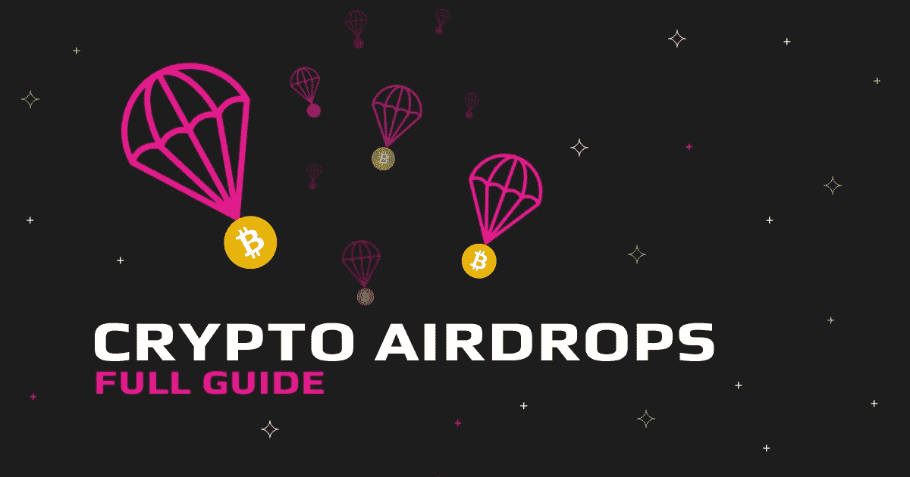

# 加密空投指南

> 原文：<https://medium.com/coinmonks/a-guide-on-crypto-airdrops-3f34eee5f49b?source=collection_archive---------6----------------------->

术语“空投”通常用于加密领域。在你的秘密旅程中，你有可能遇到过一次或多次。

但是你对空投了解多少，它们是如何工作的，你应该警惕什么？在本指南中，你会发现所有你应该知道的关于空投的重要细节，包括空投税。

# 什么是加密空投？

加密空投指的是总部位于区块链的初创公司出于有利的动机向不同的钱包分发加密货币。

通常，这些动机包括对公用设施代币或硬币的营销或促销，或为品牌创造知名度。无论动机是什么，它们总是好的，除非当事人打算欺骗密码持有者的资产，我们将在随后的章节中讨论。

# 加密空投是如何工作的？

空投就像社交媒体上的常规赠品一样——这一次，来自一个加密品牌。如果你持有特定资产，空投可能会直接送到你的钱包里。最近的一个例子是向无聊的猿 NFT 持有者空投了一枚硬币。

其他时候，你可能需要根据品牌的说明，通过参与一个或多个任务来申请空投。要执行的任务示例可能包括:

*   邀请朋友注册该品牌，
*   在社交媒体上分享品牌内容，
*   或者只是活跃在品牌的 Telegram 或 Discord 社区。

许多品牌通过社交媒体宣布他们的规则。此外，持有某种令牌，如 ETH 或 BTC，并使用支持该品牌令牌的钱包，就有资格申请加密空投。

许多空投来自区块链或 DeFi 初创公司，它们希望为自己的代币创造价值。这些初创公司这样做是为了准备代币预售，通常是私下进行，而不是公开销售或首次发行硬币(ICO)，后者可能会在之后进行。

# 加密空投安全吗？

空投是免费的——谁不爱免费的钱？但是，你应该警惕欺诈组织。很多冒充有前途的项目的品牌却是相反的。

此外，骗子可能会伪装成初创公司来组织空投。你永远不应该给任何人你的私人密钥或种子短语来赚取空投。由于 FOMO 在这个项目上的失误，人们犯了这个错误，导致了密码资产的损失。

其次，您应该为 airdrop 创建一个单独的钱包(使用不同的种子短语或私钥)。这将使欺诈方很难通过“[除尘攻击”来访问您的资产。](https://academy.binance.com/en/articles/what-is-a-dusting-attack)

除尘攻击是骗子用来访问您的钱包和窃取您的资产的一种方法。他们通过空投免费代币(称为灰尘)来做到这一点。这些令牌被绑定到恶意的智能合同，这些合同可以授权它们主动访问您的钱包。

# 有可能从加密空投中赚钱吗？

你可以从加密空投中赚钱，但不是那种能让你买车或帮助你创业的钱。至少在空投开始时没有。

由于空投组织者计划利用数字品牌常见的经济现象——网络效应——他们的令牌只有在更多人购买或持有时才会有价值。

只有在首次发行硬币(ICO)或出售私人代币后，您才能看到代币的价值。根据该项目围绕令牌的效力，空投可能会产生巨大的影响。

否则，某些因素，如以下因素，可能会导致令牌在空投后很少或没有价值:

*   小泵后持有人大量出售代币
*   对项目和令牌的怀疑
*   负面的市场影响等等。

# 加密空投要纳税吗？

美国国税局(IRS)将加密货币收入视为收入，因此需要纳税。然而，空投可能会因其性质而稍有不同。

美国国税局在其最近的官方税收指南之一中提到了加密空投——2019-2024 年的[收入规则。然而，它使用这个术语来指代从加密硬分叉中获得的收益，特别是从矿工或验证者那里。它没有明确强调我们在这方面所指的主动空投。](https://www.irs.gov/pub/irs-drop/rr-19-24.pdf)

这并不意味着空投可以不征税。公平的市场价值适用于空投，您必须报告每资本收益和损失的空投税，因为它们与您要求空投时的价值或您收到空投时的价值相关。

当你出售你的空投物资时，成本基础税也适用。成本基础是指空投加上额外的费用，如天然气或交换费。这意味着在申报空投税时，您可以考虑费用以确定公平的市场价值。

# 最大的秘密空投:值得吗？

像以太坊名称服务($ENS)和 LOOKS rare($ LOOKS)——一个受欢迎的 NFT 市场——这样的空投给了[接收者巨大的回报。虽然平均空投价值 30 美元或更多，但你可以通过参与更多与空投相关的任务来赚取更多。](https://cointelegraph.com/news/early-ethereum-name-service-ens-adopters-rewarded-with-a-hefty-five-figure-airdrop)

# 2020 年最佳加密空投

## 1.信任钱包令牌(台币)

Trust Wallet 是币安运营的多资产钱包，它是 2020 年最大的加密空投之一。它的 airdrop 要求用户下载并设置钱包，推荐家人和朋友，并申领多达 100 台币的令牌。

## 2.原子钱包硬币(AWC)

原子钱包是另一种多硬币钱包，它的空投要求用户注册并验证他们的电子邮件地址，并获得大约 15 个 AWC 代币。

## 3.基本注意力令牌(BAT)

基本注意力令牌($BAT)是 Brave Browser 的实用令牌。它的 airdrop 要求用户推荐他们的朋友和家人，以赚取 10 美元，外加 40 美元的 BAT。虽然没有 2000 万美元那么大，但 2020 年，BAT 无疑是最大的秘密空投之一。

# 2021 年最佳加密空投

## 1.bis WAP(BSW)

Biswap 为其空投运动投入了大约 40，000 BSW 美元。参与要求包括在 Twitter 上关注该品牌，推荐朋友和家人，转发帖子，并提供一个 20 英镑的钱包地址。

## 2.沙箱(沙子)

$SAND 是一枚为元宇宙平台沙盒提供动力的硬币，是 2021 年最大的加密空投之一。沙盒的 airdrop 要求参与者创建一个元宇宙账户，并关注该品牌的社交媒体句柄和社区，包括 Discord 和 Telegram。

## 3.独唱(独唱)

Sologenic 在其空投活动中瞄准了 1000 名幸运获奖者，奉献了 40，000 美元的 SOLO tokens。参与者将关注该平台的官方社交媒体句柄，并在 Telegram 上为其社区做出贡献，以获得资格。

# 如何找到加密空投？

有许多方法可以发现潜在的顶级加密空投，Discord、Twitter 和 Telegram 等社交媒体平台是发现它们的潜在中心。你也有可能在社交媒体上发现欺诈项目。

你也可以通过诸如 CoinMarketcap、Coindesk、Airdrop.io、Airdropking.io 等经过验证的网站发现最有潜力的加密空投。其中一些平台经过验证，并通过其电报渠道或网站提供独家加密更新。

同样接受空投是一回事；获取它们的价值是另一个问题。 [**进一步阅读**](https://swapzone.io/blog/crypto-airdrops) 了解如何交换或转换通过 airdrop 收到的代币。

> 加入 Coinmonks [电报频道](https://t.me/coincodecap)和 [Youtube 频道](https://www.youtube.com/c/coinmonks/videos)了解加密交易和投资

# 另外，阅读

*   [最佳以太坊钱包](https://coincodecap.com/best-ethereum-wallets) | [电报上的加密货币机器人](https://coincodecap.com/telegram-crypto-bots)
*   [交易杠杆代币的最佳交易所](https://coincodecap.com/leveraged-token-exchanges) | [购买弗洛基](https://coincodecap.com/buy-floki-inu-token)
*   [3 commas vs Pionex vs Cryptohopper](https://coincodecap.com/3commas-vs-pionex-vs-cryptohopper)|[Bingbon Review](https://coincodecap.com/bingbon-review)
*   [加密复制交易平台](/coinmonks/top-10-crypto-copy-trading-platforms-for-beginners-d0c37c7d698c) | [如何在 WazirX 上购买比特币](/coinmonks/buy-bitcoin-on-wazirx-2d12b7989af1)
*   [货币评论](https://coincodecap.com/coinloan-review)|[Crypto.com 评论](/coinmonks/crypto-com-review-f143dca1f74c)