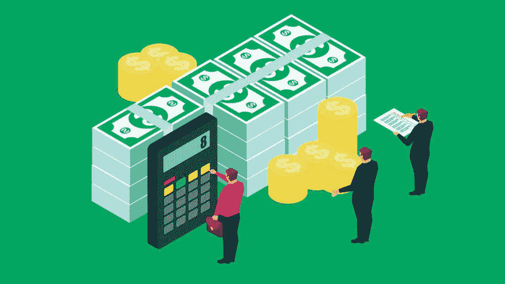
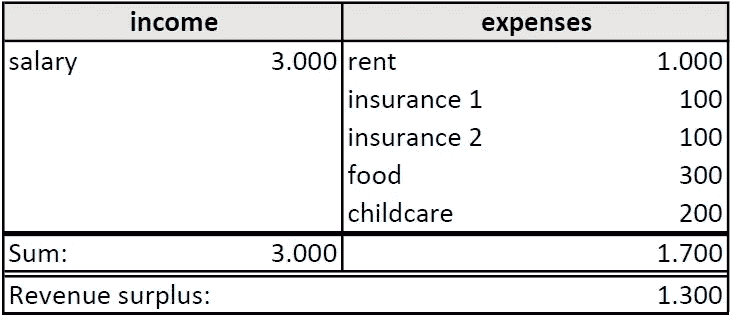
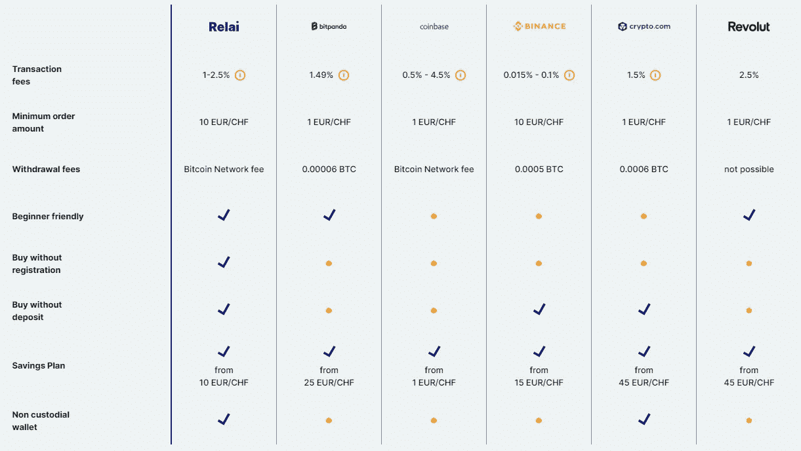

# 关于如何消费、储蓄和投资几乎每一项预算的指南

> 原文：<https://medium.com/coinmonks/a-guide-on-how-to-consume-save-and-invest-on-almost-every-budget-f1bce84035aa?source=collection_archive---------15----------------------->

回想起来，几年前，我赚的钱很少，我害怕投资，因为可能会失去它。今天，我承认，即使是最小的堆栈也能在未来拥抱你。在通货膨胀(撰写本文时欧洲的通货膨胀率为 8.7%)和零利率的时代，了解如何管理你的财富变得必不可少。

source: gobankingrates.com

# 清单

*   创建一个包含收入和支出的表
*   偿还你的债务
*   摆脱收取费用的婴儿潮银行；用巴蒂代替
*   在你收到薪水后马上创建一个长期订单，直接把钱存入你的储蓄账户
*   为 one world ETF(即 A1JMDF)创建一个循环买入基金
*   创建一个比特币的循环购买；远东[中继](https://relai.app/) +转介代码“SEPH”
*   享受消费
*   抛开你的投资，在享受生活的同时学习其他的东西

# 1.)收入和费用

为了管理我消费、储蓄和投资，我对它们进行预算，这比你想象的要简单得多。与金钱打交道的基础总是关于你的收入和支出的知识。让我们在沙滩上画一条线。这是健康理财中最讨厌但也是最重要的部分。**每月创建一个表格，一边是你的收入，另一边是你的支出。**

看看你过去 3 到 12 个月的银行对账单。我会分别列出租金和保险等固定成本，而我通常会将可变成本(比如家居用品)总结在一个项目下。在消费等支出大幅波动的情况下，我形成了一个实际的、略有上升的平均值。结果可能如下表所示，许多人可自由支配的钱变少了。即使你还有 100 个货币单位，你也可以建立一个堆栈。

你的计算不必一丝不苟地反映现实。你应该感受一下你的收入和支出水平。你的收入和支出之间剩下的钱是你可以使用的数量。在我们的例子中，我们还有 1300 个货币单位，将被分成储蓄、投资和消费。

但是在你考虑投资之前，做最重要的事情:偿还你的债务。投资带有一定程度的流动性，所以确保你不欠别人的。偿还你的债务意味着 1300 个货币单位中的大部分将流入支付你的贷款和利息。**其次，摆脱收取费用的婴儿潮银行。**对于德国人，我推荐 [ING 巴蒂](https://www.ing.de/girokontokwk/a/i90EnvIwmB)的银行账户，它对我们的目的来说相当可靠，而且免费。如果你愿意，你可以使用我的推荐链接，支付我 20€:[https://www.ing.de/girokontokwk/a/i90EnvIwmB](https://www.ing.de/girokontokwk/a/i90EnvIwmB)

其他国家的居民必须自己做研究。重要的评估点是成本、投资报价、数字应用、附加账户、附加信用卡。

# 2.)保存

积累应急资金是你的首要任务。为了省钱，我们只是利用了一个心理技巧——我们建立预算。每个现代银行账户都至少有一个额外账户。这将是你的储蓄账户。**您在收到工资后立即创建一个长期订单，将钱直接存入您的储蓄账户。**

多少钱？这取决于你。一个经验法则是，最终，你应该有 **3 到 5 个月的工资作为流动资产**。这是你在将一切投入投资之前想要达到的目标。你可以先把你的积蓄堆积起来，或者把它们分开。你可以节省 80 %,消耗 20%。或者你存 60%，投资 20%，消费 20%。寻找你感觉良好的百分比分割，优先考虑储蓄。您可以随时更改拆分。

# 3.)投资

现在让我们言归正传。大多数人没有任何关于投资的知识，也没有时间不断地通知自己。因此，要做的是做一个被动的投资者，管理好低风险。你所需要的只是时间和冷静，因为我们选择的资产会随着时间的推移而上升，而其间会有波动。关于时间方面，以年、数十年来思考，比以天、月来思考更好。随着时间的推移，我们将[平均成本](https://en.wikipedia.org/wiki/Dollar_cost_averaging)降低我们的风险敞口，并需要时间从[复利](https://en.wikipedia.org/wiki/Compound_interest)中获得价值。

我选择的资产是**ETF**和**比特币**。交易所交易基金提供了广泛的股票多样化，允许优化风险管理，同时伴随着低费用。交易所交易基金是显而易见的。关于比特币，我知道有很多批评者。我投资比特币是基于我看重的基本面，而不是当前的价格走势或媒体 FUD(恐惧、不确定性和怀疑)。比特币是一种稀缺、持久、便携、可分割、可替代、不可改变的数字资产，可以在短时间内长距离传输价值，并能够到达地球上任何角落的每个人。所以让我们进入细节。

**首先，选择一个世界 ETF** —不是分支，不是趋势。这个想法是投资于世界各地的股票来降低我们的风险。所以我从 [iShares](https://www.ishares.com/) (贝莱德[的 ETF 分支](https://www.blackrock.com/de))选择了一只 MSCI ACWI(所有国家世界指数)。它收费极低，利润不断积累，位于爱尔兰，包括近 3000 只股票。一只 ETF 就够了！

我的推荐:
ETF 名称:iShares MSCI ACWI UC its ETF(Acc)
ISIN:ie 00 b 6 r 52259
WKN:a1 jmdf
情况说明书:[链接](https://www.justetf.com/servlet/download?isin=IE00B6R52259&documentType=MR&country=DE&lang=en)

如果你使用德国的巴蒂银行账户，你将不必为储蓄计划支付任何费用。点击您的投资账户> Ordermanager >储蓄计划。通过搜索 ISIN 或 WKN 创建新的储蓄计划。在你的工资流入后不久制定储蓄计划。如果你已经达到了第二章的储蓄目标，你可以提高投资率。

**二、DCA 变成比特币** —不是 DogeElonMonkeyCoin，不是 NFTs 这样的趋势。远离所有的网络 3 加密 bullsh * t。99%是对赌博上瘾者的欺诈。同样，比特币是一种稀缺、持久、可携带、可分割、可替代和不可改变的数字资产，没有人可以从你那里拿走，它不受任何中央单元的控制，同时提供完全的去中心化。供应量每 4 年减半(减半周期)，比特币总量上限约为 2100 万。没有其他所谓的“加密货币”能够提供比特币的功能。这是一个完美的单位，能够满足我们随着时间的推移不断增值的需求。我推荐[多了解一下比特币](https://en.bitcoin.it/wiki/Help:FAQ)。

为了**保存比特币，我使用了一款名为**[**Relai**](https://relai.app/)**的瑞士应用，该应用目前仅适用于欧洲。美国的另一种选择是[天鹅比特币](https://www.swanbitcoin.com/)。两者都使得定期购买比特币变得容易。硬币保存在你选择的非保管钱包里，这意味着只有你有权限(不是你的钥匙，也不是你的硬币)。你可以从 10€开始。如果你愿意的话，接力赛的费用可以从 2.5%降到 1%**

**1)创建大约 100 欧元的重复购买
2)和
3)使用推荐代码(例如 SEPH)。**

**如果你认为我提供的信息是有帮助的，我会很高兴你使用我的推荐 SEPH。*免责声明:我获得了 0.5%的交易费用，否则这些费用将归 Relai 所有。***

**下图比较了购买比特币的不同可能性。**

****

**Comparison of different Bitcoin buying apps. Source: [relai.app](https://relai.app/)**

**我使用过其他服务，比如币安。那里的购买费用非常低。但交易所的硬币经常面临交易对手风险，如果你想把硬币转移到自己的钱包里，你将不得不支付高额交易费。**

**所以现在你投资了一只 ETF 和比特币。你对哪种资产投资多少取决于你的风险状况。你还不相信比特币，你认为它是一个骗局？将 90%的外汇投资于交易所交易基金，10%投资于比特币。不要低估“游戏中的皮肤”的潜在好处。你可以随时调整你的投资组合。目前，我将投资预算的 66%存进了比特币，34%流入了 ETF。**

# **4.)消费**

**现在你对你的资金流入和流出有了一个总体的了解，规划了你的储蓄和投资。用剩下的钱，你可以做任何你想做的事，而不会感到内疚。知道可以花在消费上的预算会降低认知努力，有助于你的放松。你的消费也是一个变量，你可以通过调整来增加你的储蓄或投资率。**

**正如巴菲特所说:*“不要把花完剩下的存起来，而是把存起来剩下的花出去。”***

# **5.)然后呢？**

**市场中的时间胜过市场时机。这是明智的建议，我们把我们的战略联系起来。我们唯一需要的能力是心态，提醒自己短期波动只是噪音，而股票和比特币会随着时间而上涨。感激每一次市场暴跌或衰退。你将能以便宜的价格购买。通过投资的自动化，你可以把时间花在其他地方。了解更多让你兴奋的事情，保持健康的状态，这样你就可以在以后享受收益。**

**干杯，亚历克斯**

**~在[推特](https://twitter.com/sephthreek)上关注我**

**免责声明: *请注意，我不是理财顾问。没有不冒风险的事。风险是你自己的。***

> **加入 Coinmonks [电报频道](https://t.me/coincodecap)和 [Youtube 频道](https://www.youtube.com/c/coinmonks/videos)了解加密交易和投资**

# **另外，阅读**

*   **[Bookmap 评论](https://coincodecap.com/bookmap-review-2021-best-trading-software) | [美国 5 大最佳加密交易所](https://coincodecap.com/crypto-exchange-usa)**
*   **最佳加密[硬件钱包](/coinmonks/hardware-wallets-dfa1211730c6) | [Bitbns 评论](/coinmonks/bitbns-review-38256a07e161)**
*   **[新加坡十大最佳加密交易所](https://coincodecap.com/crypto-exchange-in-singapore) | [购买 AXS](https://coincodecap.com/buy-axs-token)**
*   **[红狗赌场评论](https://coincodecap.com/red-dog-casino-review) | [Swyftx 评论](https://coincodecap.com/swyftx-review) | [CoinGate 评论](https://coincodecap.com/coingate-review)**
*   **[投资印度的最佳密码](https://coincodecap.com/best-crypto-to-invest-in-india-in-2021)|[WazirX P2P](https://coincodecap.com/wazirx-p2p)|[Hi Dollar Review](https://coincodecap.com/hi-dollar-review)**