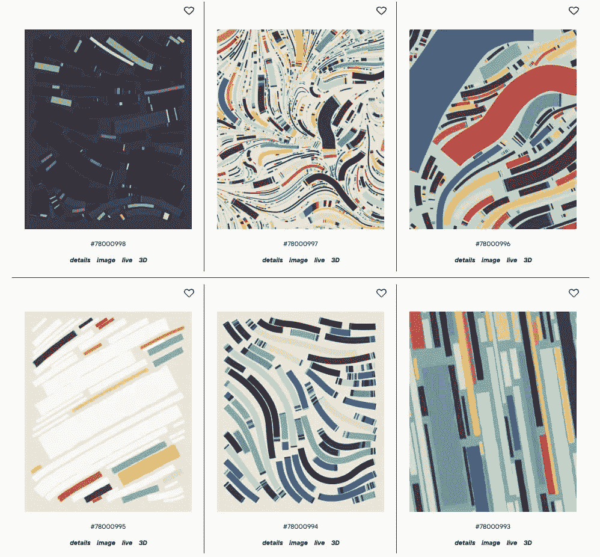
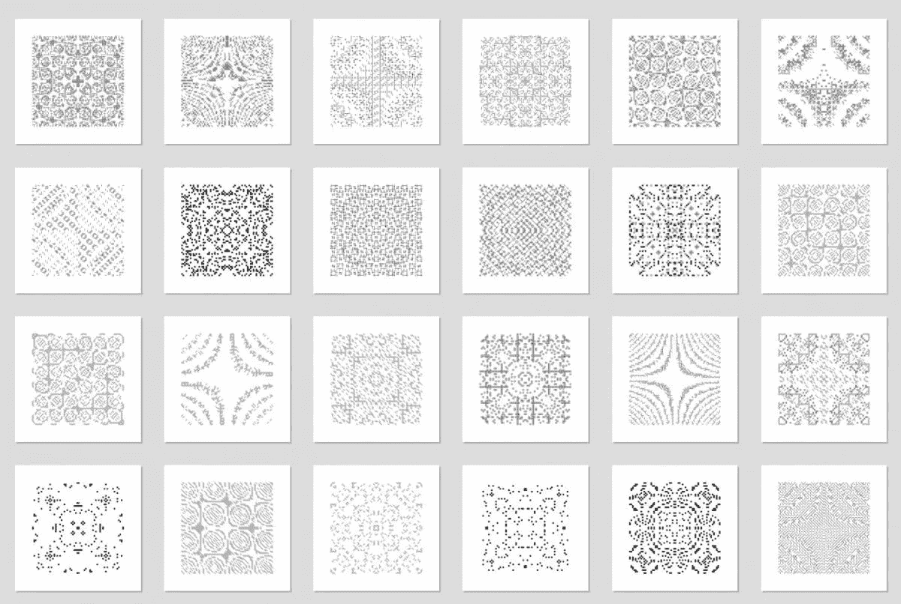

# 生成艺术指南

> 原文：<https://medium.com/coinmonks/a-guide-to-generative-art-nfts-9c46b75bd282?source=collection_archive---------30----------------------->

随着非艺术形式的日益流行，生成艺术非艺术形式已经成为最受欢迎的 NFT 艺术形式之一。事实上，像 Art Blocks 和 fxhash 这样的专用生成艺术平台的兴起有助于将这些 NFT 带到更广泛的加密艺术社区。以至于有些非功能性食物已经卖了几十万美元。

在本指南中，我们将了解生成艺术 NFTs 的基础知识。以下是我们将要讨论的内容:什么是生成艺术，什么是生成艺术非功能性艺术？NFT 最畅销的生成艺术项目有哪些，在哪里可以买到？

# 什么是生成艺术？

本质上，生成艺术是一种由计算机代码生成的艺术形式。为了解释这一点，一个自治系统遵循一种代码——可以把它视为一套规则——艺术家已经创建了这种代码来生成一件独特的艺术作品。这些规则可以从所涉及的颜色和图案到迭代次数和随机性。简而言之，一个自治系统和一个艺术家一起创造了生成性艺术。

通常，艺术家使用人工智能来实现他们的创作。算法、几何以及一定程度的随机性构成了生成性艺术的症结所在，最终的结果是一件连艺术家都无法预测的独一无二的艺术品！

# 作为非功能性艺术的生成艺术

事实上，生成艺术自 20 世纪 60 年代初就存在了。然而，直到 2021 年，艺术家们才开始将创意代码上传到区块链，以创建生成性艺术 NFT。简而言之，生成艺术 NFT 是使用[智能合约](https://nftevening.com/nft-smart-contracts-how-to-read-them-and-why-youd-need-to/)创建并存储在区块链上的生成艺术。

通常，生成艺术 NFT 是通过运行一个代码来创建的——不管它是否被开发成 NFT。通常，艺术家会创建一组图像，并在代码中添加某些规则。然后，该算法根据艺术家设定的规则，通过随机组合图像或图案来自动创建底层艺术品。

这些 NFT 最吸引人的方面是铸造作品的独特性。此外，还有一个令人惊讶的因素——收藏家和艺术家都不知道最终的作品会是什么样子。

# 最畅销的生成艺术 NFT 项目

既然我们已经介绍了生成艺术的基础知识，让我们来看看一些最畅销的 NFT 生成艺术项目:

# 自体幼虫——幼虫实验室的生殖艺术

由 CryptoPunks 的创造者幼虫实验室开发的 Autoglyphs 被吹捧为第一个链上生成艺术 NFT 项目。[据开发者](https://www.artnome.com/news/2019/4/08/autoglyphs-generative-art-born-on-the-blockchain)称，自动直升机是“一项生殖艺术的实验，每一个都是独一无二的，由代码创造的。”

回到 2019 年，任何人都可以通过支付 0.2 ETH(当时约为 35 美元)来制造这些 NFT。然而，自动直升机的供应量仅限于 512 架。由于极度稀缺，这些历史性的生殖艺术艺术品目前的底价为 189 ETH(约 23 万美元)。

# 泰勒·霍布斯的《菲登扎》

Tyler Hobbs 的 Fidenza 是最受认可的 NFT 艺术块项目之一。它总共包括 999 个 NFT，最便宜的 NFT 至少要花费 83 ETH(约 102，000 美元)。霍布斯于 2021 年 6 月推出了这些以彩色仿制品为特色的 NFT。

# 帕克的《失落的诗人》

丢失的锅是一个“多阶段 NFT 收藏品和战略游戏”。帕克是该领域最受欢迎的艺术家之一，他于 2021 年 9 月启动了该项目。该项目的第一部分叫做“Pages ”,包括 65，536 个单一的多版本 NFT。更重要的是，人工智能生成了集合中的每个 NFT。

# 埃兹拉·米勒的偿付能力

埃兹拉·米勒的创意，Solvency 是一个限量版的 WebGL(网络 3D 动画的开源标准)艺术品集合。本质上，Solvency 包含了 500 个版本的艺术品，这些作品是基于收藏家铸造的代币的散列而产生的。换句话说，杂碎会影响艺术品的图案和纹理，有些影响比其他影响更少。

# 德米特里·切尔尼亚克的《响铃人》

由加拿大艺术家和编码员 Dmitri Cherniak 创作，Ringers 包括 1000 个生殖艺术 NFT。这些的特点是一系列的“线和钉”。该系列是在 Art Blocks 平台上生成的，是其最畅销的 NFT 系列之一。它目前的底价是 44.9 瑞士法郎。

> 加入 Coinmonks [电报频道](https://t.me/coincodecap)和 [Youtube 频道](https://www.youtube.com/c/coinmonks/videos)了解加密交易和投资

# 另外，阅读

*   [OKEx vs KuCoin](https://coincodecap.com/okex-kucoin) | [摄氏替代品](https://coincodecap.com/celsius-alternatives) | [如何购买 VeChain](https://coincodecap.com/buy-vechain)
*   [ProfitFarmers 回顾](https://coincodecap.com/profitfarmers-review) | [如何使用 Cornix 交易机器人](https://coincodecap.com/cornix-trading-bot)
*   [如何匿名购买比特币](https://coincodecap.com/buy-bitcoin-anonymously) | [比特币现金钱包](https://coincodecap.com/bitcoin-cash-wallets)
*   [瓦济克斯 NFT 评论](https://coincodecap.com/wazirx-nft-review)|[Bitsgap vs Pionex](https://coincodecap.com/bitsgap-vs-pionex)|[Tangem 评论](https://coincodecap.com/tangem-wallet-review)
*   [如何使用 Solidity 在以太坊上创建 DApp？](https://coincodecap.com/create-a-dapp-on-ethereum-using-solidity)
*   [加密交易机器人](/coinmonks/crypto-trading-bot-c2ffce8acb2a) | [OKEx vs 币安](https://coincodecap.com/okex-vs-binance)