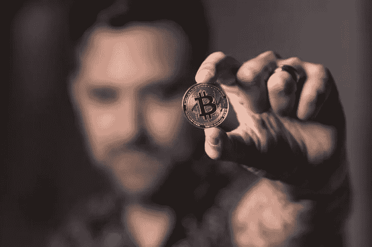

# 比特币要成为真正的主人必须克服的一个障碍

> 原文：<https://medium.com/coinmonks/a-hurdle-bitcoin-must-overcome-to-truly-become-the-master-4c7b1cfb7489?source=collection_archive---------89----------------------->

Credit: Crypto Crow

对冲基金，你知道那些操纵我们股票的邪恶的金钱人，只是由大多数富人的资金池组成。如果你想成为对冲基金的一员，你所要做的就是拥有 100 万美元的净资产，每年赚 20 多万美元，是的，仅此而已！不用说，这些类型的基金是为我们当中的富人。这些钱然后被集中起来投资…