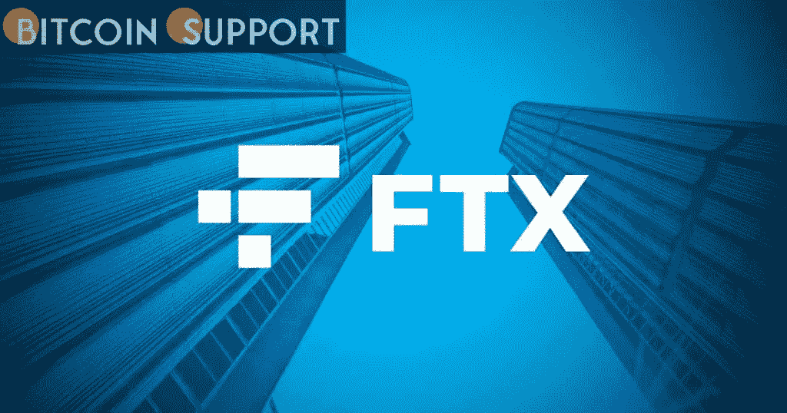

# FTX 的招聘启事。美国透露区块链的一个游戏单元正在建设中

> 原文：<https://medium.com/coinmonks/a-job-posting-on-ftx-us-reveals-that-a-blockchain-gaming-unit-is-in-the-works-29ea7e7c4b58?source=collection_archive---------74----------------------->

[https://bitcoinsupports.com/](https://bitcoinsupports.com/)

*   FTX 博彩公司是该公司在区块链博彩业 1 亿美元投资的一部分。

    ——FTX。全球加密衍生品和现货交易所 FTX 的美国子公司 US 似乎要在区块链推出一个新的博彩部门。根据 crypto exchange 网站上的招聘信息，该公司正在为其即将成立的区块链和游戏部门寻找软件开发人员。新的游戏部门将专注于吸引更多游戏开发商加入区块链的游戏生态系统，该系统用加密令牌和不可伪造的令牌奖励玩家。

    根据招聘启事，该交易所正在寻找精通 C#编程语言和 Unity 游戏引擎的软件工程师。截至发稿时，FTX 未能提供进一步的评论..据报道，新平台将是“加密即服务”，允许游戏开发者集成 NFT 和加密令牌支持。2021 年 11 月，FTX 宣布与 Solana Ventures 和 Lightspeed Venture Partners 合作，成立 1 亿美元的 GameFi 生态系统基金。随着主要科技巨头大举投资于不断发展的 P2E 游戏生态系统，GameFi 生态系统已成为 2021 年密码行业的关键突破用例之一。

    区块链游戏和点对点(P2P)的概念在游戏行业引发了很多争论。一方面，传统游戏企业鄙视新兴的 GameFi 行业，称其为“纸牌屋”和“骗局”，而 Web3 的支持者则将其视为游戏的未来。Reddit 的联合创始人 Alexis Ohanian 最近声称，P2E 将在不久的将来以超过 90%的份额统治游戏行业。

    根据博彩统计公司 Newzoo 的数据，全球博彩业年收入超过 1000 亿美元，预计未来两年内这一数字将超过 2000 亿美元。

    **访问我们的网站:-**[**https://bitcoinsupports.com/**](https://bitcoinsupports.com/)

    **免责声明:以上为作者观点，不应视为投资建议。读者应该自己做研究。**

> 加入 Coinmonks [电报频道](https://t.me/coincodecap)和 [Youtube 频道](https://www.youtube.com/c/coinmonks/videos)了解加密交易和投资

# 另外，阅读

*   [加密保证金交易交易所](/coinmonks/crypto-margin-trading-exchanges-428b1f7ad108) | [赚取比特币](/coinmonks/earn-bitcoin-6e8bd3c592d9) | [Mudrex 投资](https://coincodecap.com/mudrex-invest-review-the-best-way-to-invest-in-crypto)
*   [WazirX vs coin dcx vs bit bns](/coinmonks/wazirx-vs-coindcx-vs-bitbns-149f4f19a2f1)|[block fi vs coin loan vs Nexo](/coinmonks/blockfi-vs-coinloan-vs-nexo-cb624635230d)
*   [比斯勒评论](https://coincodecap.com/bitsler-review)|[WazirX vs coin switch vs coin dcx](https://coincodecap.com/wazirx-vs-coinswitch-vs-coindcx)
*   [7 大副本交易平台](https://coincodecap.com/copy-trading-platforms) | [BuyCoins 点评](https://coincodecap.com/buycoins-review)
*   XT.COM 评论[币安评论](https://coincodecap.com/profittradingapp-for-binance) |
*   [SmithBot 评论](https://coincodecap.com/smithbot-review) | [4 款最佳免费开源交易机器人](https://coincodecap.com/free-open-source-trading-bots)
*   [杠杆令牌](/coinmonks/leveraged-token-3f5257808b22) | [最佳密码交易所](/coinmonks/crypto-exchange-dd2f9d6f3769) | [Paxful 点评](/coinmonks/paxful-review-4daf2354ab70)
*   [加密套利](/coinmonks/crypto-arbitrage-guide-how-to-make-money-as-a-beginner-62bfe5c868f6)指南| [如何做空比特币](/coinmonks/how-to-short-bitcoin-568a2d0b4ae5)
*   [币安期货交易](https://coincodecap.com/binance-futures-trading)|[3 commas vs Mudrex vs eToro](https://coincodecap.com/mudrex-3commas-etoro)
*   [如何购买 Monero](https://coincodecap.com/buy-monero) | [IDEX 评论](https://coincodecap.com/idex-review) | [BitKan 交易机器人](https://coincodecap.com/bitkan-trading-bot)
*   [尤霍德勒 vs 科恩洛 vs 霍德诺特](/coinmonks/youhodler-vs-coinloan-vs-hodlnaut-b1050acde55a) | [Cryptohopper vs 哈斯博特](https://coincodecap.com/cryptohopper-vs-haasbot)