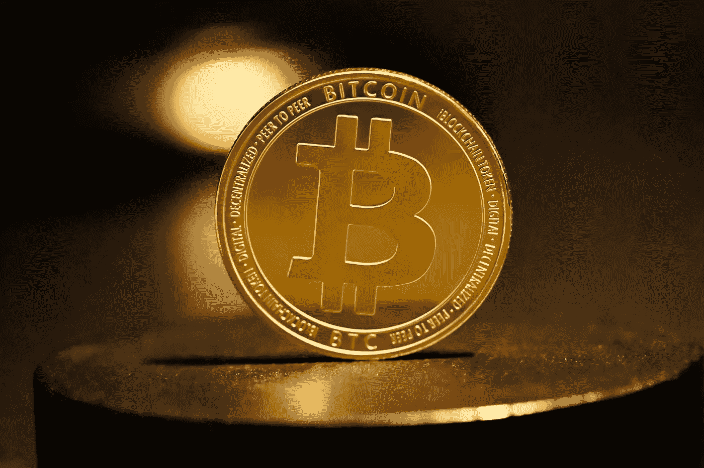
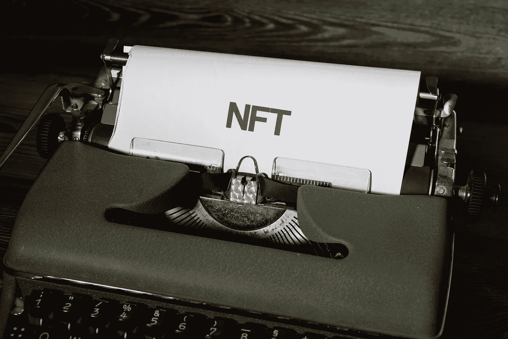

# 一封来自中本聪的信

> 原文：<https://medium.com/coinmonks/a-letter-from-satoshi-nakamoto-345a45d012bb?source=collection_archive---------11----------------------->

TL；速度三角形定位法(dead reckoning)

1.  人们总是追求公平竞争，尤其是当他们面对中央集权的时候。
2.  比特币给世界带来了去中心化，一个新的社区诞生了。
3.  作为一群寻求宁静、文化和家园的隐密游牧民，我们将建立一种新的生活方式。

拜占庭将军写了一封信。以中本聪为笔名的信使把它寄给了全世界。

几十年的发展和成就将 IT 行业带入了云计算时代。在所有的繁荣和魅力背后，陷阱逐渐显露出来。中央权威正在广泛侵蚀互联网。在激烈的权力操纵面前，没有任何正义可以存活，即使是软件公司也不行。随着一些声音呼吁公平竞争，区块链开始拯救这场对抗。支持者极力主张进一步推进去中心化加密。

# **人性在权威和利益面前很容易崩溃**

一直被抛在一边的个人数据，近年来为软件公司带来了巨额利润。这些数据很容易访问或操作。如果私人数据不属于个人，那么它如何证明其名称的合理性？然而，用户可能会被那些伪“慈善家”提供的定制服务和大数据淹没。这些诱惑确保用户在软件中逗留足够长的时间，以便巨大的流量充实公司的钱包。

游戏玩家赚得盆满钵满，而用户却泄露了他们隐私的每一个细节。除非有人受伤，否则一切都不会改变。这时，一个全新的社区在所有的扭曲和不平等中崛起。他们大声明确地说，个人数据和他们的在线轨迹只能由那个人掌握。不允许任何其他人窃取或利用这些信息牟利。这个社区就是我们现在所说的区块链。

# **中本聪来信**

论文*A Peer-to-Peer Electronic Cash System*于 2008 年由中本聪出版，阐述了基于 P2P 网络、密码技术、时间戳、区块链等的电子现金系统的架构。这个分散的系统运行在更加安全和合理的协议上，支付比特币作为奖励。这解释了比特币的发明以及这个中央集权世界中加密文化的出现。

比特币是什么？什么是区块链？比特币是一种在点对点基础上创建和分发的加密货币。区块链是比特币运作的底层技术。这是一个分散的、不可信的数据库。

Photo by [Kanchanara](https://unsplash.com/@kanchanara?utm_source=unsplash&utm_medium=referral&utm_content=creditCopyText) on [Unsplash](https://unsplash.com/s/photos/bitcoin?utm_source=unsplash&utm_medium=referral&utm_content=creditCopyText)

第一枚比特币于 2009 年 1 月被挖掘出来。自创建以来，已开采了 73 万个区块，总计开采了 1900 万个比特币，价值超过 3 万美元。在许多金融市场规模的阴影下，随着新兴的公共链和令牌应运而生，加密市场正在获得令人欢呼的势头，这反映在飙升的市场价格中。

比特币有其协议扩展性低的缺陷。这个小缺陷不会对交易流量或市场份额构成威胁，但可能无法满足加密热潮的要求。

例如，BTC 被标记为比特币互联网的单一货币，而用户不能创造自己的货币。比特币协议中使用的基于堆栈的脚本语言对于更高级的应用来说不够灵活，例如分散式交易所(dex)。

以太坊，另一方面，是一个公共的区块链，聚集了整个生态系统。这种社区运营的技术将区块链部门推进到下一个阶段，为加密科学注入了更多的多样性。

# **加密拥护者的天堂**

以太坊是一个使用区块链编程语言的加密社区，它使开发人员能够通过智能合约构建和发布下一代分布式应用程序。这个最大的应用开发平台允许用户按照自己的意愿在各种平台上为去中心化区块链应用(dApps)发起复杂的交易，包括加密货币。

自 2013 年以来，以太坊见证了 EVM 的成熟。在 ERC 721 和 ERC20 协议的支持下，NFT crypto punk、CryptoKitties 和 1C0 首次亮相，将加密货币的价值推向了新的高度，其中比特币的通胀率最高。共识算法已经从 POW 升级到 POS。在 2021 年 NFT 繁荣的背景下，令人瞠目结舌的 NFT 价值将 NFTs 推向了世界舞台。DeFi 和 GameFI 已经开始加速发展，这是多样化加密应用场景以及生态和市场扩张的主要动力。Layer 2 带来了一套以太坊的伸缩解决方案。最大的区块链开发者大会开幕和闭幕。2022 年，在市值最高的资产中，比特币排名第 10，以太坊排名第 34。

Photo by [Markus Winkler](https://unsplash.com/@markuswinkler?utm_source=unsplash&utm_medium=referral&utm_content=creditCopyText) on [Unsplash](https://unsplash.com/s/photos/nft?utm_source=unsplash&utm_medium=referral&utm_content=creditCopyText)

在某种程度上，加密市场的第二次牛市是由以太坊引领的，它将许多领先企业远远甩在了后面。

没有人能否认以太坊取得的巨大成就，因为它的分散社区正见证着前所未有的规模和市场份额。随着各种场景的出现，越来越多的用户逐渐被吸引到加密市场。在那之下不仅有可扩展的解决方案，还有以太坊社区和密码科学。

# **权力下放的世界**

分散化很好地解释了我们所知道的加密概念。随着中央权威深入到社会的各个层面，去中心化的技术成为摆脱这种社会灾难的一种方式。一个大型社区正在成形，因为人们渴望揭开它的神秘面纱。这将是一段漫长的旅程。

社区是某一领域的社会团体或组织的集合，是宏观社会的缩影和底层。对于现实生活中的社区，以下五个要素是必不可少的:

*   生活在紧密社区的一群人；
*   位于某一地区的；
*   配备服务基础设施；
*   有着共同的文化背景和生活方式；
*   社交上相互关联。

类似地，一个加密社区也是一个社交网络，一群有着共同志向和工作理念的人生活在其中。成员们建立了自己的文化和基础设施。每个人都能在社区中找到自己的位置。

不同的是去中心化自治组织(DAO)，其中所有事务都是基于节点之间达成的共识来决定的。这一机制运行在成员互动和谐、内容丰富、价值观正派的稳定状态中。

Photo by [Hannah Busing](https://unsplash.com/es/@hannahbusing?utm_source=unsplash&utm_medium=referral&utm_content=creditCopyText) on [Unsplash](https://unsplash.com/s/photos/community?utm_source=unsplash&utm_medium=referral&utm_content=creditCopyText)

社区价值观反映了由个人意志组成的集体思想。社区内容强调通过实践共同价值观实现的核心能力。

宪法道众筹了近 4600 万美元的加密货币，试图购买美国宪法的原版。克劳斯豪斯道集资买下 NBA 专营权。月道筹集资金将一名道成员送上太空。阿桑奇道致力于争取维基解密创始人朱利安阿桑奇的自由。

这种类型的 Dao 遍布世界各地，沉浸在他们自己独特的娱乐中。

具体来说，在区块链的帮助下，所有交易都可以分散到由具有共同愿景的同行共同创建的社区中。从更大的角度来看，你会发现一个完整的生态系统建立在整个社区的共同基础上，从基础设施到应用场景，从经济基础到上层建筑。

前一篇文章中详细介绍了云原生，它支持全周期软件开发，并以清晰的目标和简单的代码为基础。然而，这个聪明的解决方案包含了集中的因素。也就是说，软件被鼓励在分散的平台上运行。这些平台由加密社区开发和运营，依赖于类似于云原生的解决方案，区块链作为其底层技术。

广泛分散的社区成员有时会像野生动物一样聚集在一起，并表现出一定的纪律行为。他们就是一些人所谓的“浮躁”。

*请继续关注下一篇文章:《絮絮》👀*

***NetX，面向数字生活的可信、可靠的智能自治系统链原生互联网(***[***Trias***](https://www.trias.one/)***)***

[***铁人三项***](https://www.triathon.space/#/)***|***[***Ethanim******| Tusima | Behemotum | Octavius | Leviatom | Divina***](https://www.ethanim.network/)