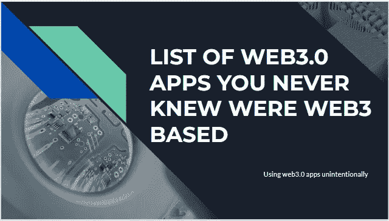
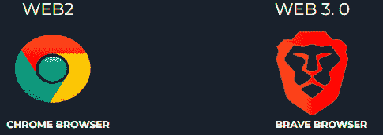
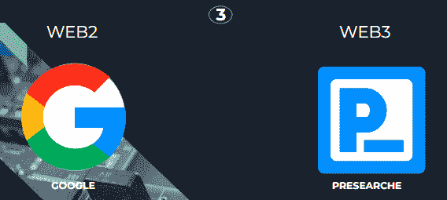
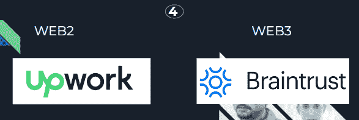
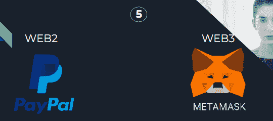
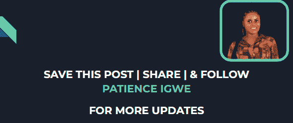

# 一系列你从来不知道的 WEB3 应用是 WEB3.0 应用

> 原文：<https://medium.com/coinmonks/a-list-of-web3-apps-you-never-knew-was-web3-0-app-1aee5b42414f?source=collection_archive---------9----------------------->

# 介绍

还是在 web3.0 上，很多人已经迁移到使用 web3.0 应用程序，甚至没有意识到这一点。因此，在这篇文章中，我将重点介绍一些 web2 应用程序及其相关的 web3.0 应用程序。因此，在我们深入研究的时候，试着找出你已经在使用的 web3 应用，以及为什么。但是在深入 web 3.0 应用程序之前，我想提醒您一些关于 web 3 的概念。

有没有想过 2021 年发生了什么，当脸书和其他一些社交平台被击落的时候？到处都是恐慌，因为如此多的人和他们的企业依赖于这些社交平台。此外，你有没有想过为什么你会在你的脸书或 youtube 新闻订阅上看到一些推荐的帖子？这是因为你在这些平台上做的事情几乎没有隐私，因为他们有你的数据。请记住，在登录这些应用程序时，您会删除您的 bo 数据，如年龄、位置、婚姻状况、职业等。通过填写这些数据，你无意中将你的详细信息交给了这些公司，甚至最终同意了他们的条款和条件，我知道我们中的一些人不会阅读这些条款和条件。所以，你看，在 web2 的许多问题中，隐私问题引起了对 web3 的需求。

Web 3.0。是建立在分权的概念上的。通过使用分散的网络，您的信息存储在节点中，这些节点与其他节点相连，这使其安全且不可改变。要了解更多关于 wb2 和 web3.0 的信息，请点击[此处](/coinmonks/web-3-0-the-evolution-of-the-internet-7becbbf2e54c)。因此，在 web2 和 web3 应用程序列表中，我们将考虑排名前五的 web2 应用程序及其相关的 web3 项目。

## 排名前五的 WEB2 应用程序及其相应的 WEB3 应用程序

有很多 web 2 应用程序你从来不知道有一个对应的 web3 应用程序，我们将考虑其中的一些应用程序:

1.  **CHROME 浏览器 VS BRAVE 浏览器**

在这里，你可以看到你使用的谷歌浏览器是一个 web3 应用程序，而勇敢浏览器是一个 web3 应用程序。这些浏览器之间的一个主要区别是隐私，在默认设置下，它会自动阻止在线广告和网站跟踪器。

所以，如果你使用勇敢的浏览器进行浏览，那么恭喜你，你已经在享受 web3 的自由了。那么，您正在使用或想要使用哪一个呢？

**2。YOUTUBE vs ODYSEE**

对于我们中一些已经使用视频内容的人来说，youtube 是最好的流媒体网站之一，它允许你上传视频，并在你获得一定数量的粉丝后将其货币化。但是，无论您是否同意，都可以取消它。

另一方面，Odyssey 是对应的 web3 流媒体网站，它也允许你通过上传自己的视频和观看他人的视频来赚钱。在 Odysee 上，您可以获得可兑换的 LBRY 积分，并且您没有被取消货币兑换或其他干扰的机会。

**3。谷歌 vs 预搜索**

谷歌是表现最好的 web2 应用之一。它是一个搜索引擎，组织全世界的信息，让所有人都可以访问，预搜索也是如此。

然而，presearch 是一个去中心化的搜索引擎，它为那些想要结束搜索垄断的人提供搜索选择、高质量的结果、隐私和奖励。

**4。向上工作 vs 智囊团**

如果你已经在自由职业领域工作了很长时间，那么你应该了解 Upwork 以及如何在那里找到工作。Upwork 是一个自由职业人才市场，它将企业与优秀人才联系起来，就像智囊团一样。

然而，智囊团是一个更加分散的自由职业者市场，因为它将企业与顶级技术人才联系起来，以完成战略项目并推动创新。

**5。PAYPAL vs METAMASK**

网络的发展已经影响了几乎所有的经济部门，包括金融机构。Paypal 是最好的 web2 金融技术之一，允许在线转账和服务器作为支票和汇票等传统纸质方式的电子替代方式。

另一方面，Metamask 是一种用于与区块链交互的软件加密货币钱包。

还有许多 web 2 及其相关的 web3 应用程序，比如:

## 网站 2 /网站 3

Spotify /Audius

中等/镜面

Godaddy / ENS

AWS S3 / Filecoin

这些只是 web2 应用程序及其对应的 web3 应用程序中的一部分。

> 加入 Coinmonks [电报频道](https://t.me/coincodecap)和 [Youtube 频道](https://www.youtube.com/c/coinmonks/videos)了解加密交易和投资

# 结论

我相信你已经听说过，甚至使用过一个或多个这样的应用，无论是 web2 还是 web3，你都可以很容易地发现它们的区别。那么，你认为他们中哪一个是最好的，为什么？

此外，如果你知道任何其他 web2 和他们的对应 web3 项目，请在评论部分提到它们，以便我们可以查看它们。

## 别忘了喜欢并关注我的频道以获取更多更新。

# 关于作者

Igwe Ihuoma Patience 是一名自学成才的创意和特定行业内容作家，也是一名加密货币爱好者，拥有 2 年多的经验和不断发展的区块链空间的知识。

我擅长内容创作、文案撰写、字幕管理、视频编辑和手机图形设计，我教其他人如何在加密货币和区块链领域起步，我的目标是让区块链的学习和更新易于任何人理解。