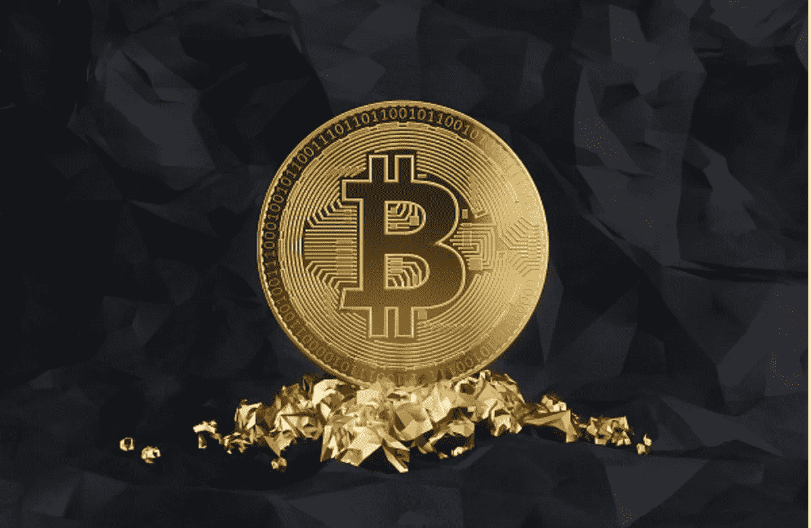
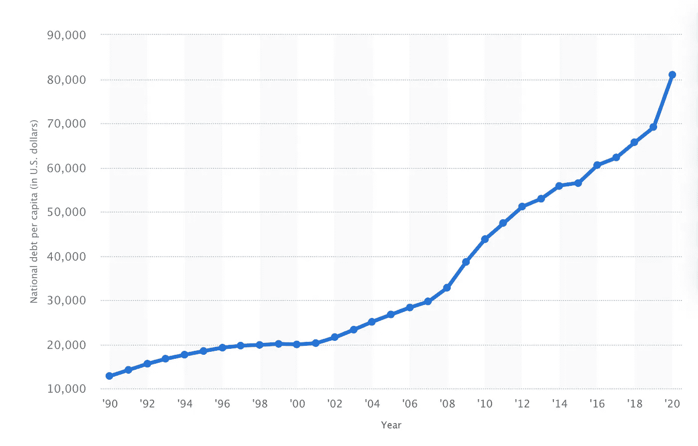

# 关于 stablecoins 的一点思考(1)

> 原文：<https://medium.com/coinmonks/a-little-thought-about-stablecoins-1-12f28638d9fc?source=collection_archive---------54----------------------->

2019 年新冠肺炎疫情以来，各种去全球化思潮和法规不断涌现；乌克兰战争后，金融领域的去全球化反思已经开始出现，美元还能信任吗？中立国的金融机构还能被信任吗？在这些信任危机的背后，表明去中心化的 BTC 和 ETH 将是未来人类发展的正确方向。

我们正处于一场大变革的十字路口。

# 关于权力

在谈论 stablecoins 之前，我们需要谈论一下电源。

目前关于 crypto 的规定都是假象，本质是一场权力斗争。权力的特性决定了权力总是自我强化、自我扩张的。当前大部分权力掌握在政客和富人手中；所以我们看到每个政府的权力都在不断扩大，同时财富也越来越集中，每个国家富人的财富比例也在不断增加。站起来。

随着区块链向金融和经济的渗透，一部分权力将不可避免地转移到链条和代码上。这是现在的权力拥有者无法承受的，他们会尽一切可能尽可能的阻止。这种权力的转移。

我们来看看这个乌克兰战争的例子。自乌克兰战争以来，美国要求各种机构制裁俄罗斯实体和个人。主要的密码交易所也不例外，最明显的是币安。几位美国政界人士点名批评了 cex 和币安，要求他们在对俄罗斯实体和个人实施制裁方面更加积极主动。币安首席执行官 cz 表示，与欧洲数百家银行相比，币安管理的俄罗斯用户资产不到银行资产的 0.3%，但美国政客一直盯着币安，要求币安制裁俄罗斯用户。币安比那数百家银行更有影响力吗？显然不是。

原因有二。
第一，cex 是对金融领域的颠覆。长期以来，金融领域都是持牌经营，从而保证了从业者的垄断地位和收入，而 cex 在一定程度上打破了这种垄断，一直是监管者眼中的刺；作为最大的 cex，币安自然首当其冲。

第二，cex 的资产可以很容易的转移到链条上，使其无法被制裁；而银行的资产只能在银行之间转移，无论转移到哪家银行，都无法避免被制裁；

区块链挑战美国的金融体系和铸币权。因此，无论是中国、美国还是其他国家的政府都不愿意看到区块链的发展壮大。经过几轮打击，中国基本消灭了国内交易所和矿业；同一时期，虽然脸书做了很多解释，做了很多准备，也吸引了很多传统金融机构，但是美国还是毫不犹豫的阻止了。facebook 发行稳定币的想法；在乌克兰战争之前，俄国一直限制使用 BTC，只允许开采 BTC 来赚取外汇。

如果各国政府铁板一块，估计 BTC 和 ETH 的使用早就被法律禁止了。然而，世界上每个国家都有利益冲突，不同的国家有不同的需求，这给了区块链产业发展的机会。

美国作为全球霸主，可以通过货币发行收割全球；其他大国，政府可以通过发行法币来收割自己的国家；最惨的是一些小国，基本上没有货币自主权，只能收割，所以我们看到，萨尔加多首先用 BTC 作为国家储备货币，然后南美国家也纷纷效仿，研究这个政策。现在俄国受到制裁，被踢出 swift 系统，俄国对 BTC 的态度发生了 180 度的转变，甚至愿意接受 BTC 作为原油和天然气的付款方式。

混沌世界促进了密码学的发展。乌克兰从一开始就接受了加密捐款，还发放了非加密捐款。现在俄国正在讨论接受 BTC 购买原油和天然气。这些政府行为极大地增强了 crypto 的共识。这对当前以美元为基础的全球货币体系构成了挑战。由于 crypto 不需要信任，它不能被任何人、任何组织、任何国家控制，它超越了国家主权。所以必然会取得最后的胜利。

在发行法定货币的过程中，政府获得了一种被称为铸币税的隐性利益。在区块链对政府提出的各种挑战中，铸造权利的挑战是最大的。BTC 和 ETH 更多的是一种资产属性，而 stablecoins 的影响力会涉及支付、流通、清算，渗透到经济、金融的方方面面。它给政府带来了巨大的利益，没有一个政府会轻易放弃这种权力，这是权力的本质决定的。所以我们可以看到美国这两年特别加强了对 stablecoins 的监管。

下图是美国政府从 1990 年到 2020 年的负债情况。在全球 200 多个国家中，美国是相对克制的政府，但尽管如此，美国政府的债务仍在加速增长。可想而知，其他国家的人民被通货膨胀掠夺了多少财富。

Paypal 是一家伟大的公司。从 1998 年开始，Paypal 从一个几个人的团队打败无数竞争对手成为现在的巨头，深刻改变了支付行业；然而，Paypal 并没有完全实现其最初的愿景--将世界上大多数人从通货膨胀中拯救出来。时至今日，在货币不断超发的情况下，连美国人也开始饱受通货膨胀之苦。

100 年前，我们吃的食物，住的房子都比现在便宜很多，当然收入也比现在低很多。在政府不断发行法定货币的过程中，由于货币流动的时效性，每个人获得的收益不同，政府从铸币税中获得额外收益；大多数人是通货膨胀的受害者，在货币超发的过程中变得越来越穷。

这并不是说 Paypal 不够好，不够伟大；本质上是 Paypal 做不到这一点；同时，任何个人、任何组织、任何政府都做不到。铸币税是通货膨胀的源头。权力的腐败和人性的贪婪是无法改变的。面对铸币税的巨大诱惑，权力不可能永远约束自己，货币还是会继续发行。所以，世界上任何信用货币的最终结局都是崩溃。从古至今，无一例外。

好了，我们马上就要谈到稳定点了。如果要防止通货膨胀剥削大众，就必须使用分散式算法。

> 加入 Coinmonks [电报频道](https://t.me/coincodecap)和 [Youtube 频道](https://www.youtube.com/c/coinmonks/videos)了解加密交易和投资

# 另外，阅读

*   [BlockFi vs 摄氏](/coinmonks/blockfi-vs-celsius-vs-hodlnaut-8a1cc8c26630) | [Hodlnaut 点评](/coinmonks/hodlnaut-review-best-way-to-hodl-is-to-earn-interest-on-your-bitcoin-6658a8c19edf) | [KuCoin 点评](https://coincodecap.com/kucoin-review)
*   [Bitsgap 评审](/coinmonks/bitsgap-review-a-crypto-trading-bot-that-makes-easy-money-a5d88a336df2) | [Quadency 评审](/coinmonks/quadency-review-a-crypto-trading-automation-platform-3068eaa374e1) | [Bitbns 评审](/coinmonks/bitbns-review-38256a07e161)
*   [加密复制交易平台](/coinmonks/top-10-crypto-copy-trading-platforms-for-beginners-d0c37c7d698c) | [Coinmama 审核](/coinmonks/coinmama-review-ace5641bde6e)
*   [印度的加密交易所](/coinmonks/bitcoin-exchange-in-india-7f1fe79715c9) | [比特币储蓄账户](/coinmonks/bitcoin-savings-account-e65b13f92451)
*   [OKEx vs KuCoin](https://coincodecap.com/okex-kucoin) | [摄氏替代品](https://coincodecap.com/celsius-alternatives) | [如何购买 VeChain](https://coincodecap.com/buy-vechain)