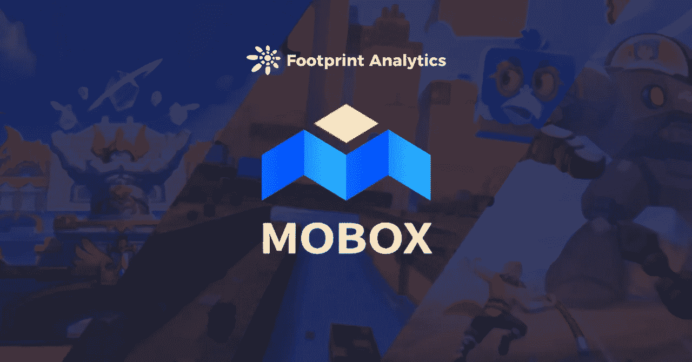
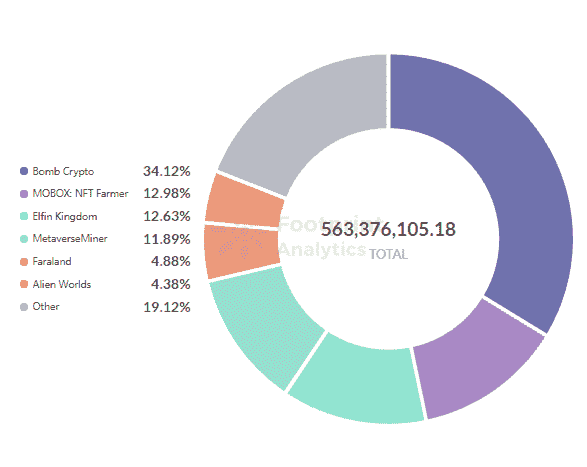
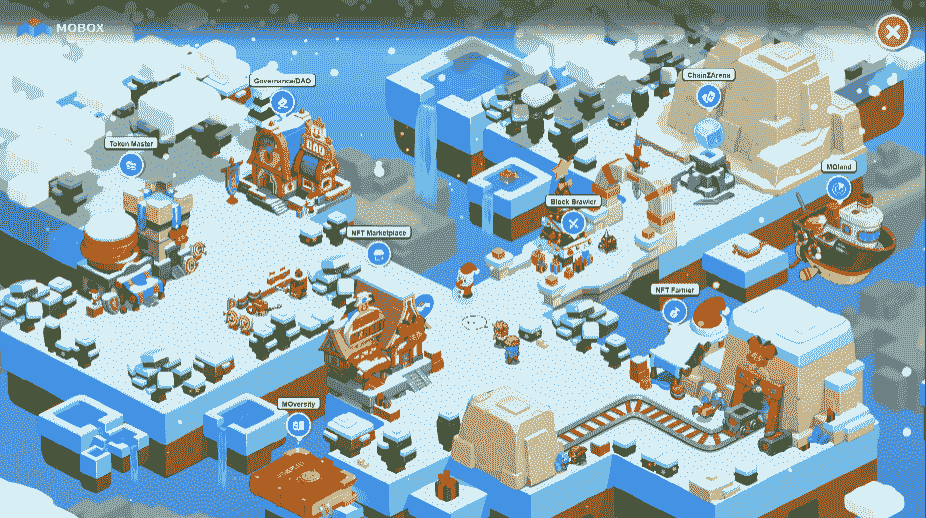
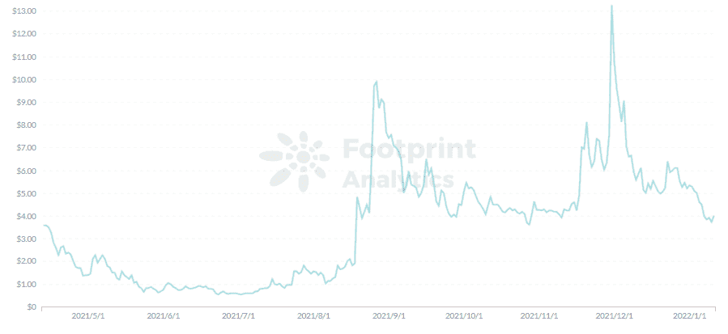
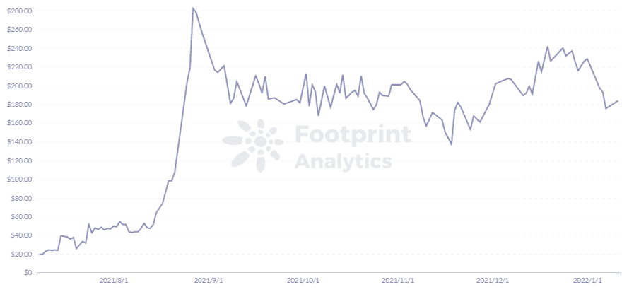

# 看看 GameFi 新秀 MOBOX |足迹分析的元宇宙

> 原文：<https://medium.com/coinmonks/a-look-at-the-metaverse-of-gamefi-rookie-mobox-footprint-analytics-a3fd8b98cca4?source=collection_archive---------12----------------------->

描述:上个月，在所有 BSC GameFi 项目中，MOBOX 获得了第二高的资金流入量。

数据来源:[足迹分析 GameFi 仪表盘](https://www.footprint.network/guest/dashboard/game-fi-overview-fp-c358ff97-6bf6-491c-b9fd-645fb8262e3f?channel=u-K8wXVP#secret=1CEF1D4E76499E7E20AD7BE2D827FCD2)

随着去年推出的几十个游戏化 DeFi 项目和赚取游戏，很难将一个幻想主题的 NFT 市场与另一个市场区分开来，将元宇宙创新者与拥有自己令牌的 flash 游戏区分开来。

虽然 MOBOX 与最近的许多 GameFi 和元宇宙产品相似，但它有一些独特的品质，投资者和玩家应该关注，尤其是它与 BSC 的集成。

最近它引起了人们的注意。

根据[足迹分析](https://www.footprint.network/)，从 12 月 11 日到 1 月 11 日，MOBOX 在所有 BSC 游戏中获得了最高的收入。

*Footprint Analytics — BSC GameFi Volume（30D）*

作为一个即玩即赚的游戏和投资平台的结合体，MOBOX 目前有一些用户可以玩的幻想主题迷你游戏、一个 NFT 市场和游戏化的 [DeFi](https://www.footprint.network/guest/dashboard/de-fi-data-analytics-footprint-network-fp-102523be-d937-4133-bf2d-71b1c6c8886f?days=past30days&name=sushiswap&channel=u-K8wXVP#secret=9DE4C2DBE2CF8005EF752DE3F20CE2B3) 功能。

玩家可以通过 4 种方式获得收入:

1.MBOX/BNB 流动性挖掘

为了 MOBOX 的长远发展，MOBOX 在 8 月之后暂停了除 MBOX/BNB 以外的所有其他池。用户可以通过“农夫”功能快速转换代币并提供流动性。目前的 APY 约为 120%，其中 115%是通过开采 MBOX 获得的。

2.NFT 矿业公司

MOBOX 上的 NFT 称为 MOMOs，在用户获得后会自动标记。在“挖矿营”中你可以看到总哈希力和用户的哈希力，用户的收入取决于用户对总哈希力的加权平均。

3.盒子或 NFT 交易

MOBOX 上有 3 个神秘盒子:盒子(陌陌)，箱子(每把钥匙一个盒子)，MEC 盒子(增加陌陌散列值的水晶)。BOX 的抽奖单价是上周市场均价的五分之一，用户可以在抽奖结束后出售获得收益。用户也可以通过用 NFT 换取差价来获利。

4.比赛

在 MOBOX 目前提供的三款游戏中，用户可以通过买卖装备、获得奖励、租借自己的 MOMOs 来获得收入。

*MOBOX*

# MOMOs 是什么？

MOBOX 的 MOMOs 是帮助用户在平台上挖掘的立方体图形。哈希功率决定了 MOMOs 的挖掘速度，可以通过以下方式提高:

*   获得可以“增强”的稀有 MOMOs
*   使用晶体升级 MOMOs)
*   将 MOMOs 分组为常见、不常见、独特和罕见的组，以获得额外的散列能力

玩家也可以通过出租他们的 MOMOs 获得额外的收入

# 3 款 MOBOX 游戏

MOBOX 上目前有 3 款游戏。

*   令牌主机

Token Master 包括 3 个迷你游戏:MOMOpoly、掠夺和 MOBOXer。玩家在争夺排行榜排名的游戏中争夺 MBOX 和 MEC。

*   街区斗殴者

Block Brawler 是一款 RPG 游戏，用户可以选择 6 种职业中的一种，通过不同的技能策略参与 PVP 或 PVE 游戏。MBOX 和 MEC 也被授予排行榜榜首，MBOX 需要购买资源和装备。

*   ChainZ 竞技场

作为有史以来第一款跨区块链和跨平台的游戏，ChainZ Arena 于 12 月作为一款闲置 RPG 游戏开放，允许用户使用卡片相互玩。

# MOBOX 经济学

*   MBOX

MBOX 是 MOBOX 的原始平台令牌，开发团队表示，在种子期或推出期间，不会以任何方式预先挖掘或向投资者分发它。

据 [Footprint Analytics](https://www.footprint.network/) 报道，MBOX 的价格为 3 美元，在 11 月 30 日上涨至 13 美元的历史高点。这主要是由于该游戏与币安的合作关系，允许用户通过币安应用程序访问平台功能，以及推出 100 万美元的盲盒空投，这使参与用户有机会获得陌陌。

*Footprint Analytics — MBOX Token Price*

MOBOX 凭借这一 airdrop 迅速获得了人气，但用户的溢出导致币安应用程序几次无法正常使用 MOBOX 界面。因此，MOBOX 暂时停止了活动，代币价格下跌。

*   veMBOX

veMBOX 是平台的一个治理令牌，通过跑马圈地 MBOX 获得，类似于[曲线](https://www.footprint.network/guest/dashboard/overview-of-curve-fp-f30918cf-fd44-4b26-ba6f-38c6b86b4b16?days=past30days&name=sushiswap&channel=u-K8wXVP#secret=A96E95A90B8386581D58B8C72367B680)的 veCRV 机制，跑马圈地时间越长获得的 veMBOX 用户越多。

跑马圈地 MBOX 也提升了流动性挖掘的收益，拥有 veMBOX 也是参加 BOX super 抽奖的一个要求。

*   键

关键是对 Farmer 流动性开采的奖励。但在 8 月份，MOBOX 调整了平台的经济模式，将押资产获得的收益从 KEY 改为 MBOX。该平台仍然可以使用钥匙打开箱子来获得 NFT，钥匙的价格从 8 月份开始飙升，并保持在 175 美元。

*Footprint Analytics — KEY Token Price*

*   回购和焚烧

MOBOX 用 80%的利润自动回购，烧掉 MBOX。当 MBOX 的价格低于过去 72 小时的平均价格时，合约将自动触发 MBOX 的互换并将其烧掉。MOBOX 想用这个机制来稳定 MBOX 的价格，但是 11 月代币价格的下滑说明这个机制并没有起到太大的作用。

# 摘要

7 月，币安智能链授予 MOBOX 其第二最有价值的建设者计划中的最佳项目之一，该项目很快获得了币安实验室的战略投资。

它现在计划与币安生态系统整合，包括币安迷你计划、币安支付和币安 NFT 市场。MOMOverse 将是第一个以这种方式与币安完全集成的跨平台元宇宙。

虽然 MOBOX 的创始人有着更远大的愿景，但目前已经推出的三款游戏表明，可玩性与其他 GameFi 项目相差无几。

**什么是足迹分析**

足迹分析是一个一体化的分析平台，用于可视化区块链数据和发现见解。它清理和整合链上数据，因此任何经验水平的用户都可以快速开始研究令牌，项目和协议。凭借一千多个仪表板模板和一个拖放界面，任何人都可以在几分钟内构建自己的定制图表。发掘区块链数据，利用足迹进行更明智的投资。

*足迹网址:*[*https://www . Footprint . network*](https://www.footprint.network/)

*不和:*[*https://discord.gg/3HYaR6USM7*](https://discord.gg/3HYaR6USM7)

*推特:*[*https://twitter.com/Footprint_DeFi*](https://twitter.com/Footprint_DeFi)

*电报:*[*https://t.me/joinchat/4-ocuURAr2thODFh*](https://t.me/joinchat/4-ocuURAr2thODFh)

*Youtube:*[*https://www.youtube.com/channel/UCKwZbKyuhWveetGhZcNtSTg*](https://www.youtube.com/channel/UCKwZbKyuhWveetGhZcNtSTg)