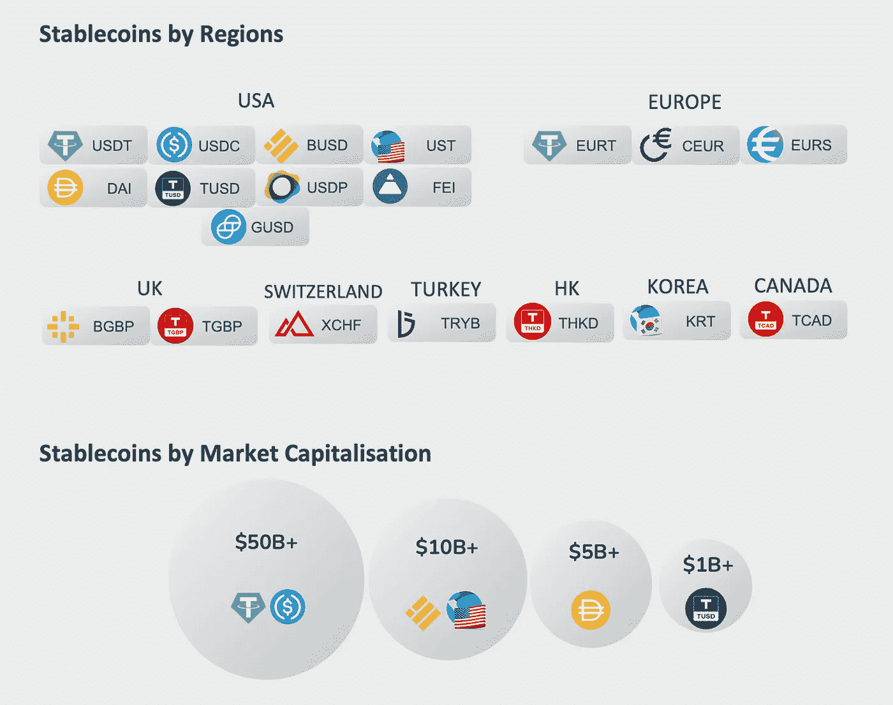

# 研究 Stablecoins:它们是什么，为什么存在？

> 原文：<https://medium.com/coinmonks/a-look-into-stablecoins-what-are-they-and-why-do-they-exist-244cff618198?source=collection_archive---------51----------------------->

比特币是作为一种“点对点”现金系统而诞生的。然而，在推出超过 13 年后，尽管许多人努力鼓励将其用作支付手段，但它尚未以这种方式起飞。

相反，许多比特币持有者将其视为一种投资，既有长期机会，也有短期机会。比特币的预期用途与用户实际对待比特币的方式之间的差距，很大程度上是由于其交易价格的波动性。

对于任何可行的支付手段来说，稳定性都是非常可取的。如果一种货币的价值每天或每小时都在大幅波动，货币持有者可能会因为害怕错过升值机会而不愿意花掉它。鉴于比特币的价格记录高度波动，它缺乏作为一种有吸引力的支付手段所需的稳定性。然而，正是这种波动性使得比特币和其他数字资产成为对许多投资者有吸引力的工具。

因此，某种代币的支付方式与其作为投资工具的吸引力之间存在冲突。如果代币有稳定的价格记录，作为支付手段是有吸引力的。然而，价格不变的资产对投资者没有吸引力。

这凸显了以下挑战:为了让现代支付系统进入区块链的基础设施，需要有一种广泛可用的非易失性数字资产。

已经推出的许多 stablecoins 都试图解决这个问题。

第一枚 stable coin[系绳](https://tether.to/en/)于 2014 年推出。

稳定的货币与非易变资产挂钩，比如美元。可靠的稳定信用可以为区块链在日常交易中的广泛使用铺平道路。此外，stablecoins 可能是许多传统行业采纳和使用智能合同所必需的。例如，想象一下，一份智能合同要求今天达成协议，下周为一件产品支付一定数量的数字货币。如果使用的货币是不稳定的，买方和卖方都不能肯定地知道合同执行时的价值。

Stablecoins 也广泛用于加密货币交易，它们充当中途站，简化法定货币和数字货币之间的过渡。它们也是许多 DeFi 平台的关键元素。

自从 Tether 推出以来，已经推出了各种各样的 stablecoins。有两种类型的稳定中心:分散的和集中的(本文的重点)。

集中稳定货币的稳定性来自于抵押品支持，其中所用的抵押品以挂钩货币计价。

例如，最大的美元稳定债券是集中发行的，并由包括美元和美国国库券在内的抵押品支持。需要一个集中的实体来管理这种类型的稳定(套利)机制，因为这种资产不能在区块链上直接跟踪。

这些稳定机制并不完善，也没有得到很好的维护。理论上，特定稳定货币的汇率可能会波动，尤其是在用户不确定自己是否有能力兑换代币以换取抵押品的情况下。出于这个原因，理想情况下，抵押品与发行的硬币数量的比例为 1:1——每发行一美元面值的稳定硬币，就持有一美元的抵押品。同样重要的是，发行者要对自己的抵押品保持透明。

2 月 21 日，在发现 Tether 没有像其声称的那样得到完全支持后，Tether 同意[支付 1850 万美元的罚款](https://cointelegraph.com/news/tether-to-report-reserves-and-pay-18-5m-fine-after-settlement-with-nyag)。

尽管存在这些问题，在撰写本文时，stablecoins 仍在密码社区中广泛使用，并已达到 1700 亿美元以上的市值…

# 反馈

在这里[让我知道你的想法](https://www.philippeho.com/contact)并在[推特](https://twitter.com/1philippeho)上关注我！

> 加入 Coinmonks [电报频道](https://t.me/coincodecap)和 [Youtube 频道](https://www.youtube.com/c/coinmonks/videos)了解加密交易和投资

# 另外，阅读

*   [折叠 App 审核](https://coincodecap.com/fold-app-review) | [Kucoin 交易机器人](/coinmonks/kucoin-trading-bot-automate-your-trades-8cf0ca2138e0) | [Probit 审核](https://coincodecap.com/probit-review)
*   [如何匿名购买比特币](https://coincodecap.com/buy-bitcoin-anonymously) | [比特币现金钱包](https://coincodecap.com/bitcoin-cash-wallets)
*   [币安 vs FTX](https://coincodecap.com/binance-vs-ftx) | [最佳(索尔)索拉纳钱包](https://coincodecap.com/solana-wallets)
*   [比诺莫评论](https://coincodecap.com/binomo-review) | [斯多葛派 vs 3Commas vs TradeSanta](https://coincodecap.com/stoic-vs-3commas-vs-tradesanta)
*   【Capital.com】|[港加密借贷平台](https://coincodecap.com/crypto-lending-hong-kong)