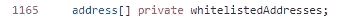
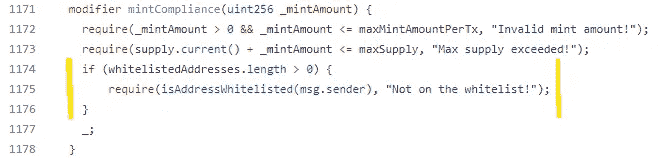
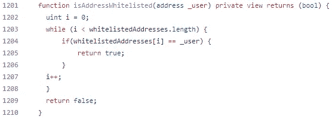
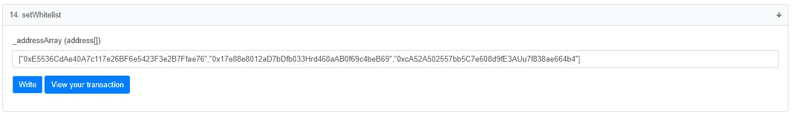

# 带有白名单的低气智能合同

> 原文：<https://medium.com/coinmonks/a-low-gas-smart-contract-with-a-whitelist-617f43eab0b5?source=collection_archive---------5----------------------->

***更新:虽然这里提出的方法实现起来非常简单，但管理白名单阵列的成本非常高，而且有更好、更便宜的方法来操作白名单。如果你想要一些现成的东西，请继续阅读，但我们建议你看看 Merkle 树或签名，以获得更好的解决方案。***

[HashLips](https://www.youtube.com/watch?v=McmhpmnQLto&ab_channel=HashLipsNFT) 解决了如何在区块链以太坊上发射一架 ERC-721 NFT 并保持(相对)低的汽油费的问题。

在我们之前的文章中，我们解释了如何调整 HashLips 合同来增加更多的灵活性，以及列出一些汽油费和美元金额的成本。头条新闻是，在合理的油价下，根据这份合同铸造一个 NFT 大约需要 9 美元——一点也不差。

许多 NFT 的创造者想知道是否有可能保持较低的天然气成本，但在合同中加入白名单。答案是肯定的——算是吧。

本文解释了我们如何调整简单的低气合同来添加白名单。铸造成本从每 NFT 9 美元涨到了 13 美元。考虑到一些 NFT 对 mint 的成本高达 100 美元，我们认为这是一个好结果。

**代码**
查看我们的 GitHub repo [此处](https://github.com/deadarchitects/test-low-gas-solidity/blob/2e16c5dca25ffd3e3e33dfb7ab68d8570a035354/V6.3%20contract.sol)为更新的智能合约代码。这是一个完全扁平化的文件，所以当它加载到 Remix 你不需要导入额外的文件。如果您以前没有部署过智能契约，那么 [HashLips 教程](https://www.youtube.com/watch?v=McmhpmnQLto&ab_channel=HashLipsNFT)是在深入研究代码之前快速入门的一个很好的起点。

**将白名单添加到代码** 白名单被定义为钱包地址的数组。这意味着，只需添加一个变量，您就可以创建一个包含任意多个白名单地址的数组。

接下来，我们调整了 mintCompliance 修饰符，以检查白名单是否处于活动状态(白名单长度> 0)，然后，如果有白名单，则检查试图进行 mint 的地址是否在白名单中。

这使用了一个新函数 *isAddressWhitelisted* ，它接收*消息发送者*的钱包地址，即试图伪造的地址。它检查这是否是真的，即地址是否在白名单上，如果不是，它抛出一个错误，并且 mint 不成功。

isAddressWhitelisted 函数使用 while 循环遍历白名单地址的数组，并查看是否有匹配的地址给尝试造币的用户。

**更新以太网扫描**
上的白名单要将白名单上传到智能合约，您可以用以下格式写入智能合约

[“地址 1”、“地址 2”、“地址 3”]等。

要清除白名单，只需编写一个空数组:

[]

下面的截图显示了三个地址被添加到白名单后，这在 Etherscan 上是什么样子。你需要小心语法和字符——有时撇号会被转换成“左引号/右引号”,这会破坏语法。如果您在尝试写入时看到红色错误信息，这可能是原因。

此合同没有白名单开/关的变量。如果白名单包含任何地址，则白名单开启。如果它是空的，那么它是关闭的。

**结论**铸造一个 NFT 的成本约为 13 美元，仅比简单低气合同略高(Gwei 为 50 美元，ETH 为 3000 美元)。

如果您认为这可以改进或者您有任何反馈，请告诉我们。如果你有任何问题，加入我们的不和谐服务器[https://discord.gg/mu4vr5krH5](https://discord.gg/2W3rSEFU6P)，我们会尽力帮助你。

[https://twitter.com/dead_architects](https://twitter.com/dead_architects)https://dead architects . XYZ

> *加入 Coinmonks* [*电报频道*](https://t.me/coincodecap) *和* [*Youtube 频道*](https://www.youtube.com/c/coinmonks/videos) *了解加密交易和投资*

# 另外，阅读

*   [Bookmap 评论](https://coincodecap.com/bookmap-review-2021-best-trading-software) | [美国 5 大最佳加密交易所](https://coincodecap.com/crypto-exchange-usa)
*   最佳加密[硬件钱包](/coinmonks/hardware-wallets-dfa1211730c6) | [Bitbns 评论](/coinmonks/bitbns-review-38256a07e161)
*   [新加坡十大最佳加密交易所](https://coincodecap.com/crypto-exchange-in-singapore) | [购买 AXS](https://coincodecap.com/buy-axs-token)
*   [红狗赌场评论](https://coincodecap.com/red-dog-casino-review) | [Swyftx 评论](https://coincodecap.com/swyftx-review) | [造币厂评论](https://coincodecap.com/coingate-review)
*   [投资印度的最佳密码](https://coincodecap.com/best-crypto-to-invest-in-india-in-2021)|[WazirX P2P](https://coincodecap.com/wazirx-p2p)|[Hi Dollar Review](https://coincodecap.com/hi-dollar-review)
*   [加拿大最佳加密交易机器人](https://coincodecap.com/5-best-crypto-trading-bots-in-canada) | [库币评论](https://coincodecap.com/kucoin-review)
*   [火币加密交易信号](https://coincodecap.com/huobi-crypto-trading-signals) | [HitBTC 审核](/coinmonks/hitbtc-review-c5143c5d53c2)
*   [如何在 FTX 交易所交易期货](https://coincodecap.com/ftx-futures-trading) | [OKEx vs 币安](https://coincodecap.com/okex-vs-binance)