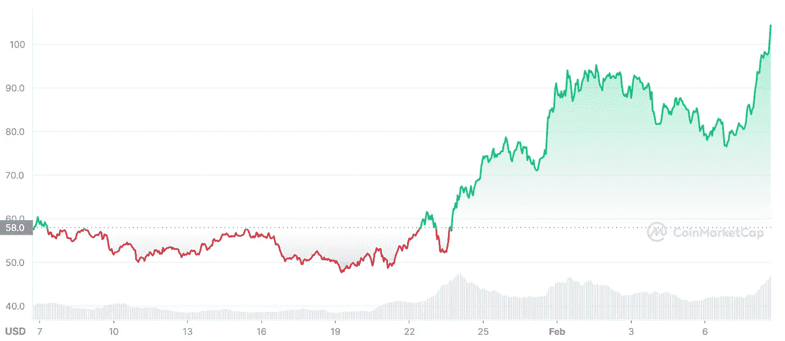
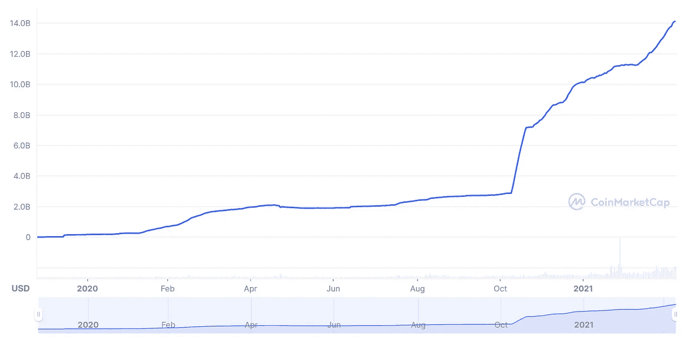
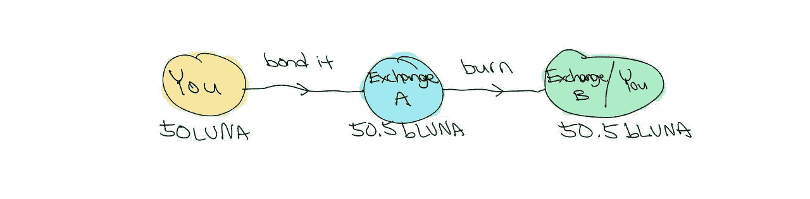
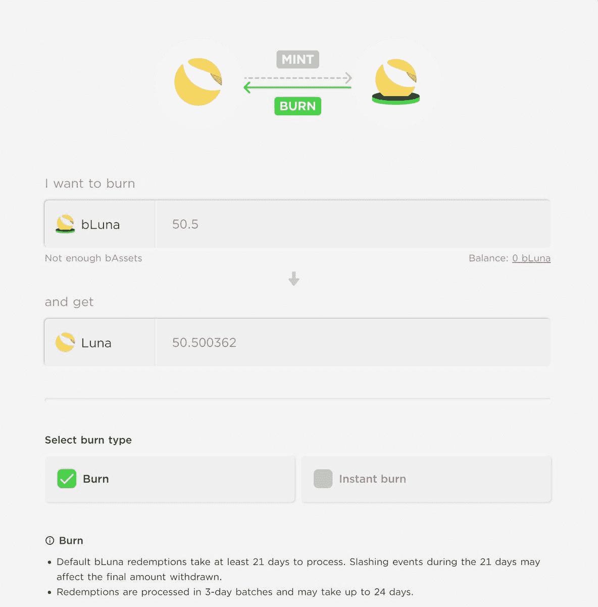

# 一个疯子的梦，21 天免费燃烧 0.5 LUNA

> 原文：<https://medium.com/coinmonks/a-lunatics-dream-burning-0-5-luna-in-21-days-for-free-ecdcb3504bb4?source=collection_archive---------45----------------------->

**露娜是什么？**

Terra (LUNA)是一个区块链协议，使用 fiat 钉住 [stablecoins](https://coinmarketcap.com/alexandria/article/what-is-a-stablecoin) 来驱动价格稳定的全球支付系统。Terra 将价格稳定和法定货币的广泛采用与比特币的审查阻力相结合，并提供快速和负担得起的结算。

[$LUNA price chart](https://coinmarketcap.com/currencies/terra-luna/)

尽管比特币在过去几个月里一直横盘整理，但 LUNA 能够保持强劲，现在反弹至 100 美元。

**是什么让$LUNA 与众不同？**

*“卢娜的价格是 UST 需求的函数，”*“UST 需求上升，卢娜的价格也会上升。”密码研究公司 Delphi Digital 的业务运营副总裁 Jeremy Ong 说。

它的基本供需！

[$UST market cap](https://coinmarketcap.com/currencies/terrausd/)

来自[Crypto banner](https://medium.com/u/2ee241b9d69a?source=post_page-----ecdcb3504bb4--------------------------------)的 Miles Deutscher 在下面的推文中说得再好不过了，UST 的市值每天都在增加！

**现在怎样才能免费赚到 0.5 露娜？**

通过套利。

套利是利用两个或更多市场中相同资产之间微小的价格差异进行的交易，它是市场效率低下的结果。

Arbitrage diagram

这似乎好得难以置信，但其中有什么蹊跷？

嗯，其实并没有什么陷阱，套利交易经常被精明的投资者用来利用市场的低效率，因为它通常被视为一种低风险的策略。唯一的缺点是 21 天的燃烧过程，这个过程是为了解除资产的束缚，我们将在下面讨论。

**嗯，有哪些步骤？**

1.  前往 [Terra station](https://station.terra.money/) ，这是 Terra 区块链的官方钱包。
2.  点击“交换”,并确保点击右上角的“Astroport”。

[Terra station](https://station.terra.money/)

**等等……什么是 bLUNA？**

布伦娜和露娜一模一样。它是一种流动性的、象征性的表示，代表了像[锚协议](https://medium.com/u/f25c4bc72765?source=post_page-----ecdcb3504bb4--------------------------------)一样的(PoS)利益相关区块链中的利益相关(债券)资产。

一旦你在你的 terrawallet 中有了 bLUNA，前往[锚协议](https://app.anchorprotocol.com/)。

1.  点击“bAsset ”,然后点击底部的“burn LUNA”。

[Anchor Protocol](https://app.anchorprotocol.com/basset/bluna/burn)

2.bLUNA 到 LUNA 的燃烧过程至少需要 21 天。

3.给你，21 天 0.5 露娜！交换和燃烧得越多，得到的月神就越多。

**我为什么不干脆让出农场露娜来积累更多？**

由于这是一个单边的股份，没有非永久性损失的风险！

如果你喜欢以帖子的形式阅读，请查看下面的推文: