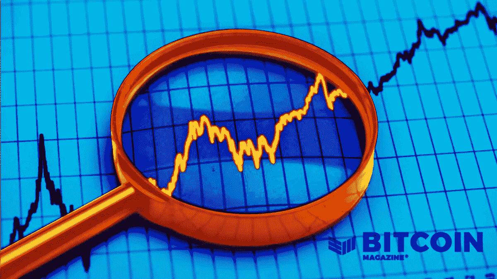
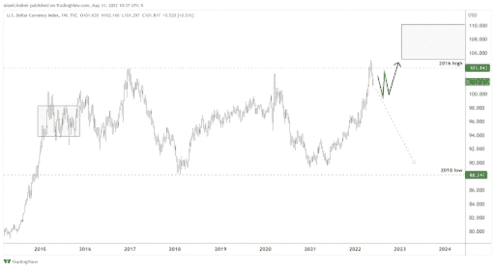
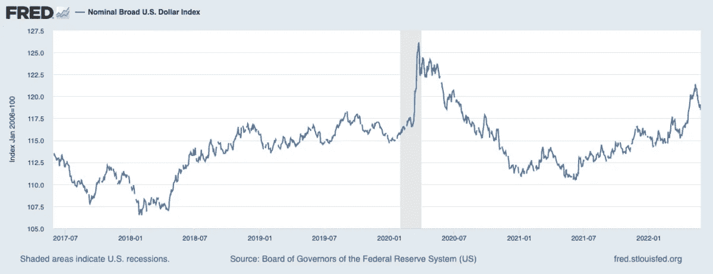
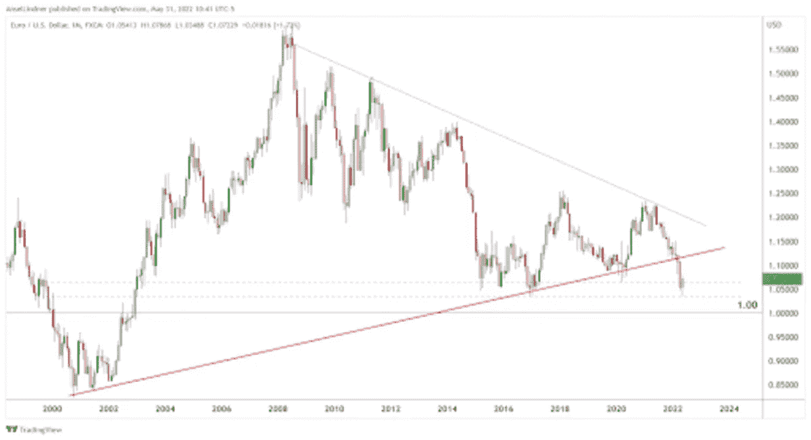
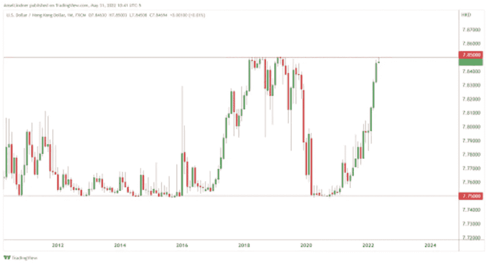
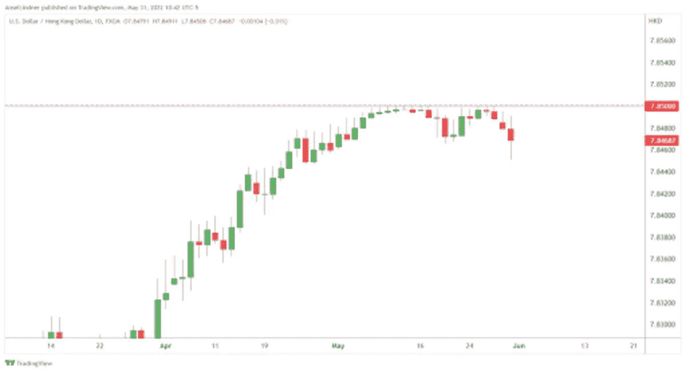
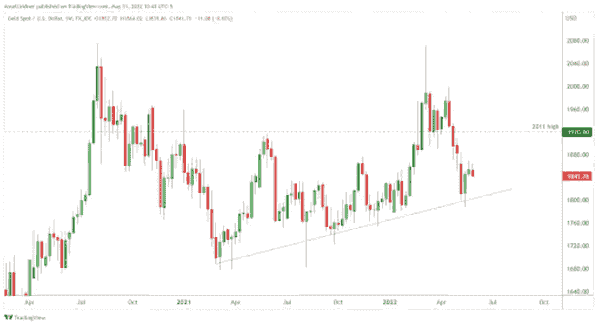
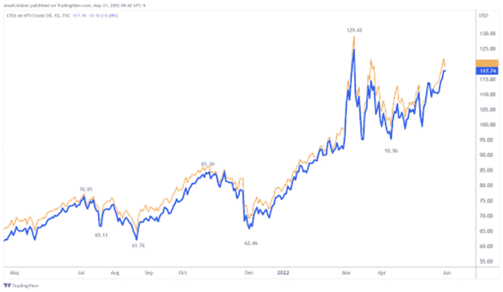
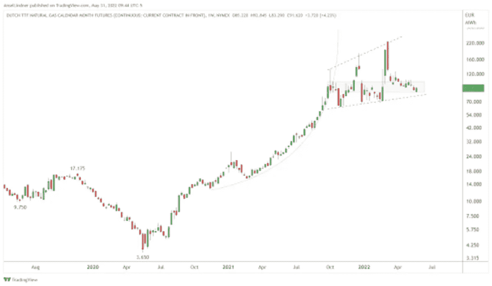

# 使用图表分析的宏观经济概览

> 原文：<https://medium.com/coinmonks/a-macroeconomic-overview-using-chart-analysis-6124cc6f3150?source=collection_archive---------77----------------------->

深入了解各种货币及其图表，以及对能源商品价格的观察，以及它们如何受到世界事件的影响。

[**在 YouTube 上看这一集**](https://youtu.be/1VtQJ5BQl3w?t=5182) **或者** [**隆隆**](https://rumble.com/v16ugtn-bitcoin-bike-tour.html)

**这里听插曲:**

*   [苹果](https://podcasts.apple.com/de/podcast/fed-watch-bitcoin-and-macro/id1543640492?i=1000564869397)
*   [Spotify](https://open.spotify.com/episode/7rTF4wbc1sH82pU37lP3FT?si=cf313d062ee04b84)
*   [Libsyn](https://fedwatch.libsyn.com/macro-chart-week-fed-95)
*   [阴天](https://overcast.fm/+m2aedYC3k)

在本期“美联储观察”播客中，我们将关注重要的宏观图表。我们涵盖了比特币图表、美元、欧元、港币等货币、黄金以及能源商品。我们没有时间看完我准备的所有图表，因为现场直播有时间限制。我将尝试在本周推出第二部分，以涵盖我的商品图表的其余部分，以及供应链和运输成本。你可以在这里找到[图表的幻灯片。](https://docs.google.com/presentation/d/1FN3vllfl93WFUlGhkFkj-wKFKwf8emU6uP-cb_uY8V0/edit?usp=sharing)

今天这一集涉及的其他话题包括美国总统乔·拜登(Joe Biden)和美联储主席杰罗姆·鲍威尔(Jerome Powell)昨天的会晤，在会晤中，我试图充实这场华尔街(鲍威尔)与全球主义者(拜登)摊牌的重要性，我们还谈到了上周达沃斯的一些事情，特别是基辛格关于乌克兰的评论。

“美联储观察”是比特币创造者的宏观播客。每集我们都将讨论全球宏观时事，重点是中央银行和货币问题。

# 货币

我们说的第一种货币是比特币。我讨论了最近阵亡将士纪念日的价格上涨，以及它如何与指标中日益增长的看涨背离同时发生。

然而，我也回到大约一年前，当时有一个非常相似的情况。2021 年 6 月，这两个指标出现看涨背离，并出现下降楔形的突破。这一举动是假的，被 7 月份的灰度(GBTC)解锁浪潮打断了。目前的情况在图表上相似，但在基本面上不相似。我只是想指出一个以前的例子，像本周这样的突破失败了。

在这里，我努力消除“比特币上涨等于美元崩溃”的错误说法。由于通缩压力推动人们套现并远离交易对手风险，美元和比特币可能会一起上涨。

接下来是美元。在直播中，我展示了下面的图表，并讨论了我们如何才能走向美元汇率的新的更高区间。也许我们会看到美元指数(DXY)在 100-110 的范围内再过五到七年，就像它在 2015 年如何跃升至 90-100 的范围一样。

*Dollar index chart with technical analysis (*[*source*](https://docs.google.com/presentation/d/1FN3vllfl93WFUlGhkFkj-wKFKwf8emU6uP-cb_uY8V0/edit?usp=sharing)*)*

对于许多不喜欢 DXY 的人来说，因为它太窄了(欧元 57.6%，日元 13.6%，英镑 11.9%)，我提供了一个贸易加权美元的图表，其中包括 30 多种货币，包括人民币和墨西哥比索。

在下图中，我们看到同样的盘整开始，但美元达到的高点(不包括新冠肺炎崩盘的高点)是一个新高。我认为，这也象征着贸易加权美元的阶梯式上涨。

*Trade-weighted dollar with 30-plus currencies (*[*Source*](http://fred/)*)*

请记住，强势美元是美联储的失败，它也给世界其他经济体带来了巨大的压力。

欧元几乎与 DXY 相反。它也显示了最近的突破，但在这种情况下是向下的。如果美元上涨是为了在走高前盘整，那么欧元将在走低前盘整。有一件事是肯定的，欧元已经突破了 20 年来的支撑趋势线，它面临着大幅下跌的大麻烦。

*Chart of the euro versus the U.S. dollar exhibiting a downward breakout (*[*source*](https://docs.google.com/presentation/d/1FN3vllfl93WFUlGhkFkj-wKFKwf8emU6uP-cb_uY8V0/edit?usp=sharing)*)*

接下来的两张图表是港元对美元的汇率。在第一张图表中，有一个非常明显的固定值:在 7.75 到 7.85 之间。最近，人民币汇率飙升至这一钉住区间的顶部，显示出中国、香港、台湾、日本和韩国等亚洲经济体面临巨大的美元压力。美元紧缩从今年开始迅速加剧。

*Monthly chart of the Hong Kong dollar versus the U.S. dollar (*[*source*](https://docs.google.com/presentation/d/1FN3vllfl93WFUlGhkFkj-wKFKwf8emU6uP-cb_uY8V0/edit?usp=sharing)*)*

港元的第二个图表是每日时间框架的特写。这一次，通过当局抛售美元和买入港元，联系汇率制得到了成功捍卫，但一个大问题是，他们是否有足够的储备在今年剩余时间里继续捍卫这一联系汇率制，就像他们在 2018 年所做的那样？

*Daily chart of the Hong Kong dollar versus the U.S. dollar (*[*source*](https://docs.google.com/presentation/d/1FN3vllfl93WFUlGhkFkj-wKFKwf8emU6uP-cb_uY8V0/edit?usp=sharing)*)*

香港当局公布了他们的储备数据，因此我们可以得到他们困境严重程度的线索。在 2022 年 4 月底，在联系汇率遭遇最大压力之前，他们的储备为 4657 亿美元，比 3 月份少了 160 亿美元。

我们看的最后一种货币，一部分是货币，一部分是商品:黄金。在过去的 11 年里，做一个黄金迷是很难的。目前，金价低于 2011 年高点 1920 美元，在记录时为 1840 美元。想象一下，持有黄金 11 年，尽管有印钞的叙事，还是亏损。在那个时候，你的选择要么是放弃错误的通货膨胀教条，要么疯狂地相信阴谋论。在我看来，这就概括了黄金社区。

*Gold spot price April 2021 through May 2022 (*[*source*](https://docs.google.com/presentation/d/1FN3vllfl93WFUlGhkFkj-wKFKwf8emU6uP-cb_uY8V0/edit?usp=sharing)*)*

# 能源商品

转到商品，在这一集，我只有机会覆盖两个图表。首先是布伦特原油(英国原油价格为橙色)和西德克萨斯中质油(WTI)原油(美国原油价格为蓝色)。它们通常高度相关，相对于欧洲布伦特原油略有溢价。

我今天想报道这张图表，因为头条新闻是关于欧盟对俄罗斯石油的第六轮制裁；这绝对是个笑话。正如你在图表上看到的，橙色线实际上是在宣布戏剧制裁的当天下降的。

*Brent crude and WTI crude oil prices (*[*source*](https://docs.google.com/presentation/d/1FN3vllfl93WFUlGhkFkj-wKFKwf8emU6uP-cb_uY8V0/edit?usp=sharing)*)*

我对油价的观点如下:全球需求崩溃的速度快于石油供应。最近从 2022 年 3 月开始的价格上涨是由于俄罗斯和乌克兰的冲突导致市场不确定性。石油严重超买。石油价格将很快开始下跌，降低价格和消费者价格指数(CPI)，并伴随着增长放缓。这不是滞胀情景，而是价格暂时飙升后的通缩萧条情景。

欧洲的天然气期货支持我的结论。除了对俄罗斯的制裁之外，它们已被大幅抬高，远高于理性的市场基本面。俄罗斯拒绝受到连续几轮制裁的影响，图表正在告诉我们，这些价格水平主要是由于人们的担忧，而不是市场基本面。一旦这些担忧消失(当乌克兰局势的结束变得更加明朗时)，价格将迅速向下调整。

*European natural gas futures (*[*source*](https://docs.google.com/presentation/d/1FN3vllfl93WFUlGhkFkj-wKFKwf8emU6uP-cb_uY8V0/edit?usp=sharing)*)*

这个星期到此为止。感谢读者和听众。如果你喜欢这个内容，请订阅，审查和分享！

这是安塞尔·林德纳的客座博文。所表达的观点完全是他们自己的，不一定反映 BTC 公司或比特币杂志*的观点。*

*原载于 2022 年 6 月 3 日 https://bitcoinmagazine.com***。**

> *加入 Coinmonks [电报频道](https://t.me/coincodecap)和 [Youtube 频道](https://www.youtube.com/c/coinmonks/videos)了解加密交易和投资*

# *另外，阅读*

*   *[TraderWagon 回顾](https://coincodecap.com/traderwagon-review) | [北海巨妖 vs 双子星 vs BitYard](https://coincodecap.com/kraken-vs-gemini-vs-bityard)*
*   *[如何在 FTX 交易所交易期货](https://coincodecap.com/ftx-futures-trading)*
*   *[OKEx vs KuCoin](https://coincodecap.com/okex-kucoin) | [摄氏替代品](https://coincodecap.com/celsius-alternatives) | [如何购买 VeChain](https://coincodecap.com/buy-vechain)*
*   *[ProfitFarmers 回顾](https://coincodecap.com/profitfarmers-review) | [如何使用 Cornix Trading Bot](https://coincodecap.com/cornix-trading-bot)*
*   *[如何匿名购买比特币](https://coincodecap.com/buy-bitcoin-anonymously) | [比特币现金钱包](https://coincodecap.com/bitcoin-cash-wallets)*