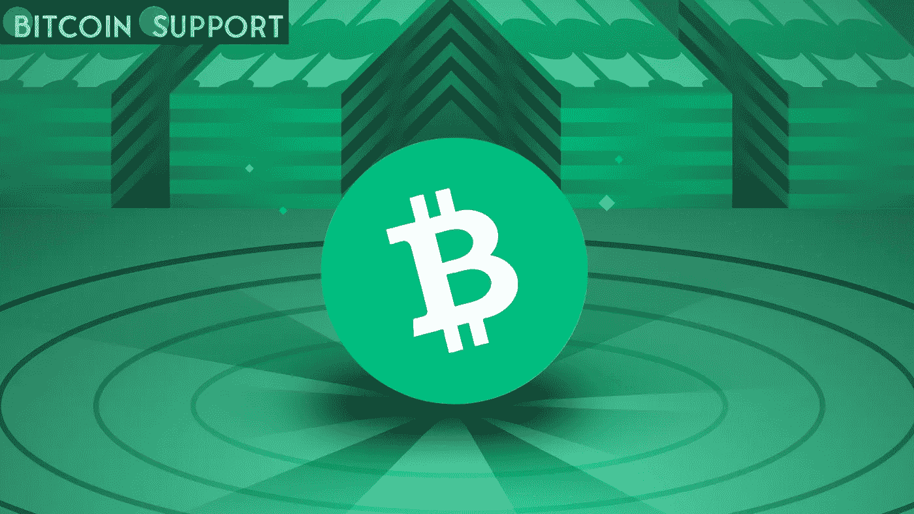

# 圣马丁岛的一名议员打算用比特币现金支付他的全部工资

> 原文：<https://medium.com/coinmonks/a-member-of-the-parliament-of-st-maarten-intends-to-have-his-entire-salary-paid-in-bitcoin-cash-30b7278784e1?source=collection_archive---------34----------------------->

**Visit our website:-** [**https://bitcoinsupports.com/**](https://bitcoinsupports.com/)

联合人民党(United People's Party)领袖、圣马丁岛(St. Maarten)议会议员罗兰多·布里森(Rolando Brison)周六表示，他已经成为第一位要求用比特币现金支付全部工资的当选官员。布里森相信，只要他的国家接受区块链技术和加密货币解决方案，圣马丁可能会成为加勒比海的“加密之都”。

**议员希望圣马丁成为加勒比海的“加密之都”**

虽然萨尔瓦多因其比特币投标法而闻名，但加勒比海已经成为加密货币使用的温床，特别是比特币现金(BCH)。根据 map.bitcoin.com 的数据，目前加勒比海地区有数百家零售商接受 BCH 的商品和服务。圣马丁议会议员、联合人民党(UP Party St. Maarten)负责人罗兰多·布里森(Rolando bris on)3 月 19 日透露，他将会以比特币现金(BCH)的形式获得自己的全部工资。

根据政府消息来源，圣马丁应该继续沿着挖掘“不断增长的加密货币现象”的路线前进布里森在声明中坚持说，他已经要求圣马丁财政部长阿德韦尔·伊里安更新在政府中使用区块链技术的计划。“我相信，如果我们继续创新并接受比特币及其所有好处，圣马丁有可能成为‘加勒比海的加密之都’，”布里森周六在一份声明中说。

**布里森正在“探索在圣马丁使比特币现金合法化的立法”**

这位圣马丁当选的政治家在推特上告诉他的追随者，他是第一个以加密资产支付方式领取全部工资的政府成员。“今天，随着我们的国家越来越多地接受加密货币和区块链技术，我成为世界上第一个以比特币现金支付全部工资的当选官员，”布里森在推特上写道。“我们感谢将圣马丁建成加勒比海秘密首都的建议，”圣马丁联合党领袖补充道。

布里森在声明中补充道，在去年的一次会议上，圣马丁财政部长表示加密货币和区块链的采用应该是一个主要的研究领域。布里森对财政部长关于如何走向创新的思想表示钦佩。UP 党领导人表示，下一个关键步骤将是制定监管比特币和区块链技术的立法。

“虽然我提议的消费者银行立法将加强我们历史上的商业银行形式，但我们也需要通过法律使加密货币交易在圣马丁更加有效和值得，”布里森解释道。这位圣马丁岛的议员还表示，他已经开始探索立法，使比特币现金(BCH)成为该国的法定货币。此外，Brison 寻求在圣马丁岛对 BCH 和不可替代代币(NFT)交易免税。这位来自圣马丁岛的民选官员评论道:“‘货币’的概念已经并将继续经历一场创新的海啸。”。“这一创新是在这个国家及其立法者努力解决如何将我们的本地货币和(电子)商务转换到数字时代的时候出现的。幸运的是，解决方案以比特币现金的形式就在我们面前。”

**访问我们的网站:-**[**https://bitcoinsupports.com/**](https://bitcoinsupports.com/)

**免责声明:以上为作者观点，不应视为投资建议。读者应该自己做研究。**

> 加入 Coinmonks [电报频道](https://t.me/coincodecap)和 [Youtube 频道](https://www.youtube.com/c/coinmonks/videos)了解加密交易和投资

# 另外，阅读

*   [用信用卡购买密码的 10 个最佳地点](https://coincodecap.com/buy-crypto-with-credit-card)
*   [最好的卡达诺钱包](https://coincodecap.com/best-cardano-wallets) | [Bingbon 副本交易](https://coincodecap.com/bingbon-copy-trading)
*   [印度最佳 P2P 加密交易所](https://coincodecap.com/p2p-crypto-exchanges-in-india) | [柴犬钱包](https://coincodecap.com/baby-shiba-inu-wallets)
*   [8 大加密附属计划](https://coincodecap.com/crypto-affiliate-programs) | [eToro vs 比特币基地](https://coincodecap.com/etoro-vs-coinbase)
*   [最佳以太坊钱包](https://coincodecap.com/best-ethereum-wallets) | [电报上的加密货币机器人](https://coincodecap.com/telegram-crypto-bots)