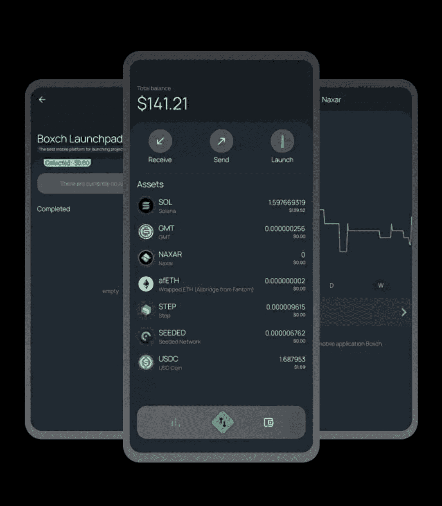
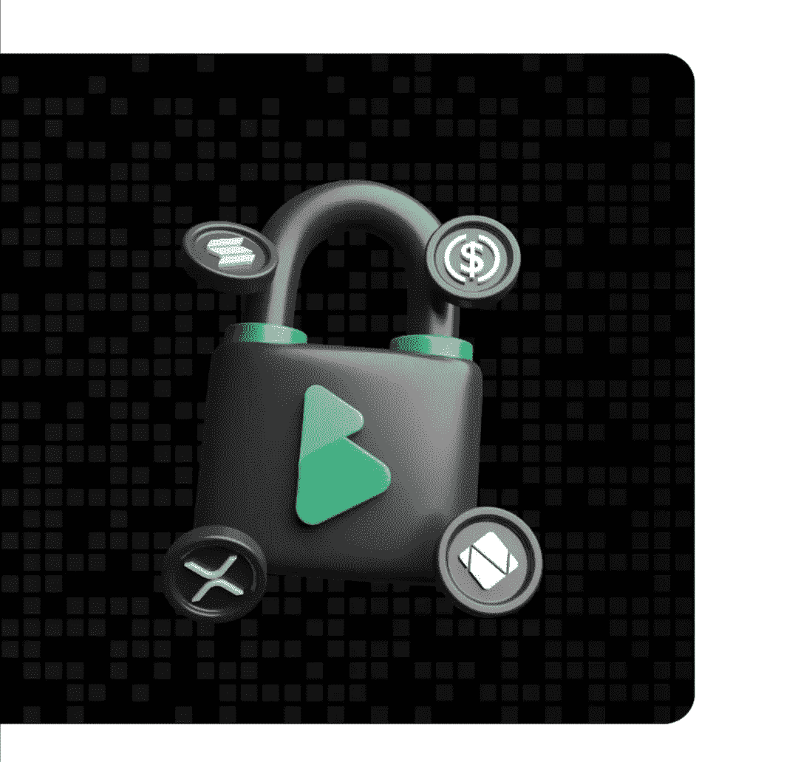
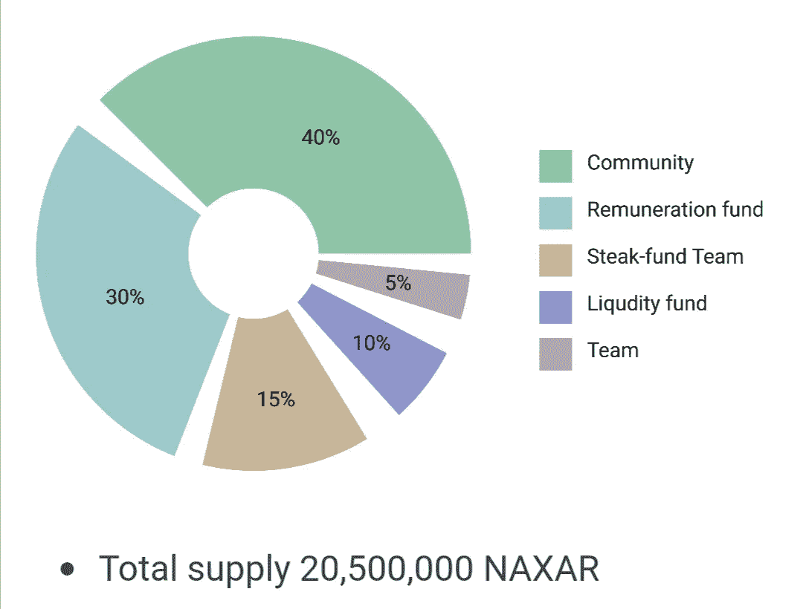

# 一款保证真正去中心化的移动应用——BOXCH

> 原文：<https://medium.com/coinmonks/a-mobile-app-that-guarantees-true-decentralization-boxch-1357e113818c?source=collection_archive---------16----------------------->

你对 DeFi 有什么了解？

最有可能是基本面，比如提到不需要第三方参与的金融体系，当然还有区块链技术的使用。

如果这就是你所知道的关于 DeFi 的一切，那么，作为一个密码爱好者，你仍然可以通过。因为这就是外行人对 DeFi 的定义，你可以在 web 2 互联网的任何地方找到它。

然而，完全去中心化金融(DeFi)是用户包容性的，这并不是你每天都能看到的。

出于某种原因， [Boxch 应用](http://boxch.net)不顾一切，决定提供真正完整的 DeFi 体验。这一次，不仅仅是 DeFi 被包括在内；还包括 web 3.0。

**关于 Boxch app**

Boxch 是一款基于 Solana 网络的分散式移动钱包，具有多种多样的 DeFi 功能。

考虑到 Solana 网络出色的可伸缩性和高达 700，000 tps(每秒事务处理)的事务处理速度，在 Solana 网络上进行构建是一个不错的选择。

Boxch 应用也有自己的原生令牌， [Naxar](http://boxch.net/#naxar) ，允许它集成 [CeFi](https://www.coinbase.com/learn/crypto-basics/what-is-cefi#:~:text=Definition%20CeFi%2C%20short%20for%20centralized,crypto%20debit%20card%2C%20and%20more.) 和 [DeFi](https://www.coinbase.com/learn/crypto-basics/what-is-defi#:~:text=Definition,on%20public%20blockchains%2C%20primarily%20Ethereum.) 功能。

Naxar 实用程序令牌为 Boxch 应用程序提供支持。这是无缝享受 Boxch 应用服务的必备条件之一。

纳克萨是基于索尔区块链，并有一个赌注功能，奖励那些赌注他们的硬币。然而，为某些激励措施下注仅限于 Boxch 应用程序。

Boxch 将有一个发射台，允许新的 Solana 网络项目使用该平台，并通过它进行 ico。通常，Boxch 应用程序上的 Naxar hodlers 将能够参与这些 ico。该应用的 launchpad 预计将通过设计提供灵活性。使得发起和参与 ICO 的过程变得极其简单。

它将作为一个应用程序，用户可以简单地访问他们喜欢的 Sol 项目，因为该应用程序的一部分功能是专门列出符合上市要求的 Solana 项目。

Boxch 应用程序在[谷歌 Playstore](https://play.google.com/store/apps/details?id=com.arj.boxch) 和[应用商店](https://t.co/ZYiDXmROCV)都有，允许潜在用户下载。Naxar 也可以在知名的加密市场买到，如 [CoinMarketCap](https://coinmarketcap.com/currencies/naxar/) 和 [CoinGecko](https://www.coingecko.com/en/coins/naxar) 。

在撰写本文时，Boxch 应用程序已经处理了超过 1000 笔交易。

只要用户满足登录条件，例如拥有[密码](https://www.techtarget.com/searchsecurity/definition/passphrase)，在 Boxch 应用上制作的个人钱包也可以加载到另一个兼容 Solana 的钱包中。

一个 [P2P](https://cointelegraph.com/news/what-is-p2p-trading-and-how-does-it-work-in-peer-to-peer-crypto-exchanges) 功能将允许用户参与更灵活的交易机会，并可能利用[加密套利](https://www.kraken.com/learn/trading/crypto-arbitrage)是开发者承诺在晚些时候实现的应用功能之一，正如项目路线图所强调的那样。

这款应用不仅可以作为一个非托管的数字钱包，还可以作为其他金融交易的平台。Boxch 是一个真正去中心化的移动应用，代表了 web 3.0 移动应用的样子。

**Boxch 应用提供什么？**

安全性:没有安全性，DeFi 将是不完整的。博克斯团队将安全放在首位，并将其融入项目运营中。

交易速度:Boxch 建立在 Solana 区块链之上，旨在以光速处理交易。

CeFi 和 DeFi 在一个应用程序中:Boxch 应用程序毫不费力地结合了传统 CeFi 和 DeFi 的特点，并且几乎免费向客户提供这两种服务。

令牌交换:Boxch 用户将能够简单地交换移动应用程序支持的令牌。

利用了索拉纳区块链。

[耕作](https://blockworks.co/what-is-yield-farming-what-you-need-to-know/#:~:text=Yield%20farming%20is%20the%20process,can%20employ%20more%20complex%20tactics.) / [赌注](https://n26.com/en-eu/blog/what-is-staking-crypto)协议:这款应用有一个名为 Boxch earn 的功能。这将使用户更容易下注和耕种他们的 Naxar 代币以获得奖励。

Listing/launchpad:它允许列出社区所需的项目和其他流行的 Solana 项目。它还将成为新项目的起点。

大众 ICO 参与系统:Boxch 的大众 ICO 参与解决方案的目标是使 ICO 参与变得简单，即使对于现金不多的投资者也是如此。它将证明，即使只有 10 美元的投资者也可以加入该平台，投资其发射台的新项目。

存储数字/加密资产:Boxch 是一个非托管钱包，允许用户存储他们的加密货币资产(在 sol 链上)。每个用户都有自己的私钥，他们用它来访问钱包。

未来，NFTs 将在 Naxar 和 Boxch 应用程序上提供。

**纳克萨尔令牌组学**

总共会有 2100 万枚纳克萨等级的代币被制造出来。在 5 年的时间里，预计总供应量中将有 100 万枚代币被[烧毁]，其中 50 万枚已经被烧毁。这将最终使纳克萨尔只有 2000 万枚代币可供流通。

分发:

5%归团队所有

10%留作流动资金

15%给牛排基金团队

30%留作薪酬基金

40%进入社区

[网站](http://boxch.net) | [白皮书](https://drive.google.com/file/d/1izWFbWOIG9oxRXmYtbZM9HiqoCfNlnrt/view) | [推特](https://twitter.com/_Naxar) | [电报](https://t.me/naxar_eng) | [Instagram](https://instagram.com/naxar_updates?utm_medium=copy_link) | [媒体](/@naxar_official)

> 加入 Coinmonks [电报频道](https://t.me/coincodecap)和 [Youtube 频道](https://www.youtube.com/c/coinmonks/videos)了解加密交易和投资

# 另外，阅读

*   [瓦济里克斯 NFT 评论](https://coincodecap.com/wazirx-nft-review) | [比茨盖普 vs 皮奥克斯](https://coincodecap.com/bitsgap-vs-pionex) | [坦吉姆评论](https://coincodecap.com/tangem-wallet-review)
*   [如何使用 Solidity 在以太坊上创建 DApp？](https://coincodecap.com/create-a-dapp-on-ethereum-using-solidity)
*   [最好的卡达诺钱包](https://coincodecap.com/best-cardano-wallets) | [Bingbon 副本交易](https://coincodecap.com/bingbon-copy-trading)
*   [氹欞侊贸易评论](https://coincodecap.com/anny-trade-review) | [Paybis 评论](https://coincodecap.com/paybis-review) | [Keevo 钱包评论](https://coincodecap.com/keevo-wallet-review)
*   [印度最佳 P2P 加密交易所](https://coincodecap.com/p2p-crypto-exchanges-in-india) | [柴犬钱包](https://coincodecap.com/baby-shiba-inu-wallets)
*   [Coinmetro 评论](https://coincodecap.com/coinmetro-review) | [VirgoCX 评论](https://coincodecap.com/virgocx-review)