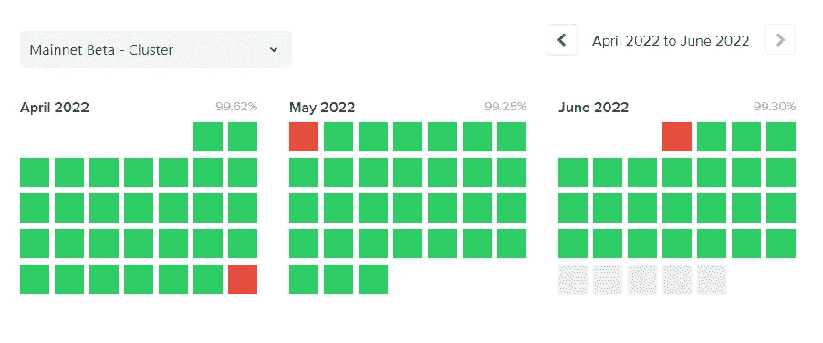

# 索拉纳急需的升级

> 原文：<https://medium.com/coinmonks/a-much-needed-upgrade-for-solana-d08b1c207322?source=collection_archive---------33----------------------->

## 它以速度快和费用低而闻名，但不幸的是，它最近一直受到性能下降的困扰。这个补丁足以推动它前进吗？

自 2022 年初以来，已经出现了不少影响网络性能的稳定性问题。虽然索拉纳的低费用使得一些问题的产生成为可能，但它仍然是让我对尝试网络感兴趣的关键因素之一。

诚然，低收费实际上为某些用户提供了垃圾交易的机会，使网络泛滥，有时导致网络无法使用。毫无疑问，这是一个关键问题，因为如果链条不能工作，它几乎是无用的。如果这个问题得不到尽快解决，当更多的人离开生态系统时，让他们回来可能就不容易了。

另一方面，某些连锁的高额油费确实威慑了这种行为但并没有完全杜绝。我个人认为，我们不应该把它看做是为此目的而建立的一个功能，因为归根结底，我们想要的是更多的采用，更多的有机增长，以及日复一日继续使用该链的用户，而不仅仅是在同一只鲸鱼或鲨鱼之间。

April to June 2022 but much more during Jan 2022

在过去的 6 个月左右，我们已经看到了许多事情发生在索拉纳链。比如降级性能、长时间降级性能、链上的“DDOS”、为清算而发送垃圾邮件的僵尸程序、为了制造 NFT 而向网络发送垃圾邮件的僵尸程序，以及它忘记时间并且比我们当前的实际时间落后 30 分钟的情况。

索拉纳已经有很多“讨厌”在线了，(风险投资公司掌握着大部分分配，集中链..)所有这些网络问题只是让它变得更糟，给它一个相当糟糕的味道。一种看待它的方式是，随着索拉纳从成立到现在所经历的增长，这是每个连锁店最终都要经历的事情吗？

只有在它被采用后才浮出水面的问题发展到一定程度？因此，现在而不是以后经历可能是一件“积极”的事情，表明实际上有使用该链的需求。就我个人而言，我真的很期待这个补丁，希望它能解决稳定性问题，至少现在是这样。

一如既往，感谢阅读并享受这张海豚的照片，😆

Photo by [Ádám Berkecz](https://unsplash.com/@aberkecz?utm_source=medium&utm_medium=referral) on [Unsplash](https://unsplash.com?utm_source=medium&utm_medium=referral)

在最近的升级中，正在实施一些更改，以提高网络的稳定性和可靠性。有三件主要的事情要谈，

1 **QUIC**
在我们简要谈论 QUIC 之前，先提一下 UDP 和 TCP 会比较好。

**UDP** —用户数据报协议。这用于节点将向网络中的领导者传输数据的情况。你可以把它想象成通过多条通道发送数据包，最终到达领导者那里。
由于流量过大，部分数据可能会丢失。因此，发送者自然会多次发送，以增加成功的机会。

**TCP** —这首先需要发送者和领导者之间的连接会话。一旦确认数据已经收到，发送方将停止发送。
你可以把它想象成沿着一个单独的通道发送数据，在那里有一个控制器让你知道你的数据是否已经成功发送，否则你应该尝试再次发送。但是这样做的缺点是，如果中间丢失了一些数据。在此之前，其他数据必须先等待。

这就像是两全其美。其中有一个连接的会话，该会话允许领导者知道哪个节点正在发送多个数据(垃圾邮件),并“减慢”它们的速度，而不阻止其他数据正常进入。

Photo by [Elena Mozhvilo](https://unsplash.com/@miracleday?utm_source=medium&utm_medium=referral) on [Unsplash](https://unsplash.com?utm_source=medium&utm_medium=referral)

2

给定其利害关系权重，具有更多 SOL 利害关系的那些节点将会获得更多，因为这将意味着它们发送的那些 txn 将导致更多的确认。

那些具有较少被标记的 SOL 的节点可以将它们的 txn 发送给那些具有较多被标记的 SOL 的节点，希望它们也将有更好的机会得到确认，因为那些节点将把它转发给领导者。

请记住，我们之前讨论过 QUIC，即使该节点有相当多的 SOL staked，验证器也能够识别出来自该节点的异常高的流量，并可以选择忽略它，以保持网络的性能

当然，如果所有节点都以这种方式运行，网络最终将会拥塞。所以这只是解决方案的一部分

3 这样做的目的是，一旦 txn 被确认和最终确定，用户将能够声明要收取的额外费用。

有了这个，就没有必要或没有意义发送重复的 txn 到垃圾邮件网络，希望让 txn 通过。这是非常相似的，让我想起以太坊的低，平均，高汽油费。

这笔额外费用也将支付给验证者(50%)，其余 50%将被烧毁。

结合上面提到的所有 3 点，我认为它应该足以有效地防止另一个延长降级的网络性能。QoS 阻止用户，通常是机器人向领导者发送垃圾短信，然后向那些需要他们交易的人收取额外费用。如果他们真的走上了这条路，他们的 txn 会得到确认，没有必要在网络上发送垃圾邮件。这对所有人来说都是双赢。

对于这个拥塞问题，这是一个非常有效的解决方案，我有点期待看到网络在压力测试时的表现，比如需要高 TPS 的事件。

希望你已经从这篇文章中受益🐸
关注或留言评论！👍
一如既往，感谢阅读！🙏

> 加入 Coinmonks [电报频道](https://t.me/coincodecap)和 [Youtube 频道](https://www.youtube.com/c/coinmonks/videos)了解加密交易和投资

# 另外，阅读

*   [比斯勒评论](https://coincodecap.com/bitsler-review)|[WazirX vs coin switch vs coin dcx](https://coincodecap.com/wazirx-vs-coinswitch-vs-coindcx)
*   [7 大副本交易平台](https://coincodecap.com/copy-trading-platforms) | [BuyCoins 点评](https://coincodecap.com/buycoins-review)
*   [XT.COM 评论](https://coincodecap.com/profittradingapp-for-binance)币安评论 |
*   [SmithBot 评论](https://coincodecap.com/smithbot-review) | [4 款最佳免费开源交易机器人](https://coincodecap.com/free-open-source-trading-bots)
*   [杠杆代币](/coinmonks/leveraged-token-3f5257808b22) | [最佳密码交易所](/coinmonks/crypto-exchange-dd2f9d6f3769) | [Paxful 点评](/coinmonks/paxful-review-4daf2354ab70)
*   [加密套利](/coinmonks/crypto-arbitrage-guide-how-to-make-money-as-a-beginner-62bfe5c868f6)指南| [如何做空比特币](/coinmonks/how-to-short-bitcoin-568a2d0b4ae5)