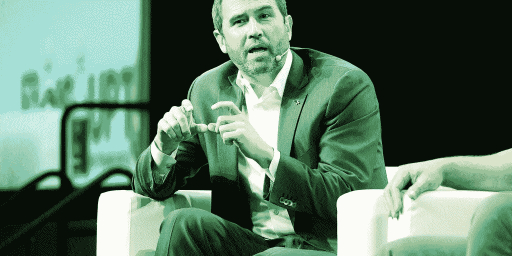

# 音乐偶像，我们快乐的公司为 NFT 音乐平台筹集了 750 万美元

> 原文：<https://medium.com/coinmonks/a-music-icon-happy-company-raises-7-5-million-for-nft-music-platform-c4712e8625e1?source=collection_archive---------56----------------------->

格莱美获奖音乐家约翰·传奇希望你能利用你的“感觉”赚钱

我们快乐的公司——由联想共同创立——已经筹集了 750 万美元的种子资金。该公司将利用这笔资金继续为其首款产品开发新功能，这款产品是今年 2 月推出的 NFT 音乐平台 OurSong。

Infinity Ventures 和 Animoca Brands 领投了这轮融资。Circle Ventures、Cherubic Ventures、FBG 资本等也参与其中。

NFT 是存在于以太坊或索拉纳等区块链上的独特标志，表示对一项资产的所有权，如一首歌曲或一件数字艺术品

OurSong 目前是 iOS 和 Android 的移动应用程序，用户可以轻松创建自己的静态图像、视频或音乐 NFT 或购买他人的 NFT，OurSong 将其称为“Vibes”。

该平台目前支持以太坊、BNB 链和 Thundercore 上的令牌。

虽然通过智能合约以“传统”方式制作 NFT 对于外行来说可能会感到困惑和繁琐，但我们的歌曲旨在通过其移动应用程序提供用户友好的 Vibes 制作。但它也拥有监护权，因此用户不必依赖 MetaMask 这样的加密货币钱包。OurSong 将所有货币和 Vibes 保存在其基于应用的钱包中，但用户可以根据需要将 Vibes 提取到他们的 MetaMask 或其他加密钱包中。

OurSong 使用 Circle 的稳定硬币 USDC 作为移动支付选项，此外还接受法定信用卡和借记卡。为了购买 Vibe，用户必须将菲亚特或 USDC 存入他们在 Our Song 应用程序上的账户，然后将其转换为该平台的货币 OurSong Dollars (OSD)。

## Legend 在平台上全力以赴，担任我们快乐公司的首席影响官和联合创始人。但我们快乐的公司还拥有许多其他联合创始人——准确地说是 8 位，包括脸书校友张艺和 Twitch 联合创始人林义杰。

台湾音乐流媒体服务 KKBOX 的克里斯林是我们快乐公司的首席执行官。他在一份声明中说:“我们专注于让大众的非功能性测试民主化。”

Animoca Brands 联合创始人兼执行主席 Yat Siu 将我们的快乐公司视为 Web3 创造者经济的重要组成部分。

> 加入 Coinmonks [电报频道](https://t.me/coincodecap)和 [Youtube 频道](https://www.youtube.com/c/coinmonks/videos)了解加密交易和投资

# 另外，阅读

*   [如何在 Uniswap 上交换加密？](https://coincodecap.com/swap-crypto-on-uniswap) | [A-Ads 审核](https://coincodecap.com/a-ads-review)
*   [加密货币储蓄账户](/coinmonks/cryptocurrency-savings-accounts-be3bc0feffbf) | [YoBit 审核](/coinmonks/yobit-review-175464162c62)
*   [Botsfolio vs nap bots vs Mudrex](/coinmonks/botsfolio-vs-napbots-vs-mudrex-c81344970c02)|[gate . io 交流回顾](/coinmonks/gate-io-exchange-review-61bf87b7078f)
*   [CoinFLEX 评论](https://coincodecap.com/coinflex-review) | [AEX 交易所评论](https://coincodecap.com/aex-exchange-review) | [UPbit 评论](https://coincodecap.com/upbit-review)
*   [AscendEx 保证金交易](https://coincodecap.com/ascendex-margin-trading) | [Bitfinex 赌注](https://coincodecap.com/bitfinex-staking) | [bitFlyer 审核](https://coincodecap.com/bitflyer-review)