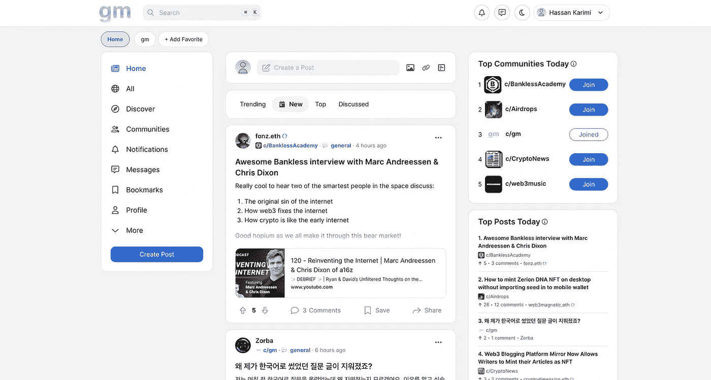

# 一个新的不和谐的替代品正在 Web3 中出现，叫做 gm。以下是你需要了解的。

> 原文：<https://medium.com/coinmonks/a-new-alternative-to-discord-is-emerging-in-web3-called-gm-heres-what-you-need-to-know-about-it-c9e00a2ce252?source=collection_archive---------1----------------------->

Web3 缺乏强大的沟通工具。

[不和谐](https://discord.com/)就是不是。我发现的最有前途的平台(仅在名字上胜出)是[GM](https://gm.xyz/)——一个由迈克和马特·麦吉尼斯兄弟发起的项目。

通用汽车主页截图

该平台有一个类似 Twitter 的界面，最好被描述为 Twitter 和 Reddit 的结合。你不用登录到无止境和难以关注的聊天流中，而是登录并看到由社区成员创建的帖子和文章。

在 Discord 上，不管所有的社区管理和指示，只是很难找到一个切入点。对话继续进行，一切都在于现场参与。另一方面，通用汽车通过将最受欢迎的话题移动到顶部，使跟踪话题变得更容易。

其他关键特性包括:

*   通过以太坊钱包登录
*   创建公共和私人社区的能力
*   任何人都可以访问的普通公共源

然而，通用汽车仍有一段路要走，以取代不和谐作为走向网络 3 通信。

不和谐之所以有效，是因为实时聊天至关重要。

Discord 有个手机 app。

不和谐允许语音通讯。

通过利用 Twitter 和 Reddit 的结构，通用汽车已经利用了一些最成熟和久经时间考验的社区建设系统。

虽然还有一段路要走，但未来是充满希望的。

通用汽车是为 Web3 打造的，但它还没有去中心化。

该团队正在采取一种他们称之为“渐进分散化”的方法，并从 AWS 上的 Web2 技术栈开始。

由于缺乏可靠的基础设施(和模糊的法规)，这是目前 Web3 中的一种常见方法。

通用汽车没有现有的盈利结构，他们的方法不会涉及广告或出售数据。他们还在想办法。

[Mike McGuiness](https://twitter.com/mikemcg0) 最近一直在播客上为通用汽车做宣传，你可以查看下面的采访了解更多信息。

Web3 是社交透明的:Michael McGuiness，gm.xyz 的联合创始人

[有益健康的密码:第九集——迈克尔·麦吉尼斯](https://youtu.be/diBwJWsNV2o)

*原载于* [*本航次*](https://web3voyage.substack.com/p/no-18-glitches-are-not-just-technical?s=w) [*迅*](https://web3voyage.substack.com/p/no-20-web3-will-one-day-be-chain?s=w)*2022 年 6 月 1 日。*

*随着我对 Web3 的深入研究，讨论将涉及加密货币，我希望确保包含此免责声明。这不是财务建议，仅供参考。*

*作为免责声明，我没有金融方面的背景或专业知识。法学，或者经济学。本文探讨了新技术，如 NFTs 和加密货币，以及艺术家和创作者的潜在用途。这仅供参考。它不提供也不打算用作法律、投资、财务或其他建议。*

> 加入 coin monks[Telegram group](https://t.me/joinchat/Trz8jaxd6xEsBI4p)学习加密交易和投资