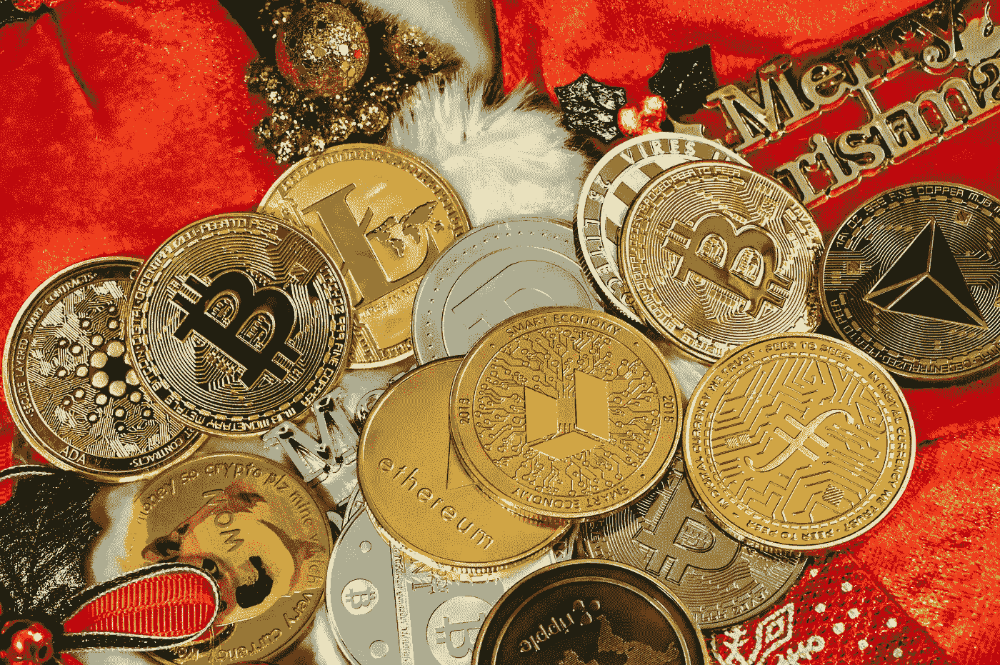

# 一个新的国家将比特币作为法定货币。这对交易者意味着什么？

> 原文：<https://medium.com/coinmonks/a-new-country-has-made-bitcoin-legal-tender-what-does-this-imply-for-traders-8f1f9ed36f7d?source=collection_archive---------63----------------------->

4 月 27 日，中非共和国议会以压倒性多数同意让比特币(密码:BTC)成为合法货币。除非你精通地理或了解中非政治，否则你可能不知道有这样一个国家存在。近年来，中非共和国已成为第二个这样做的国家。在六月…