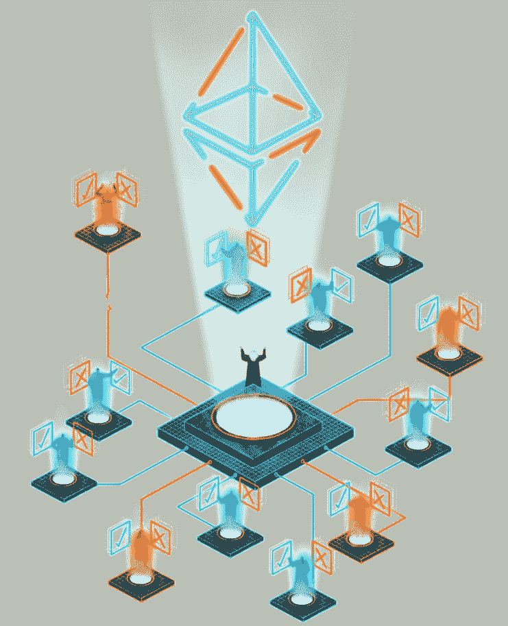
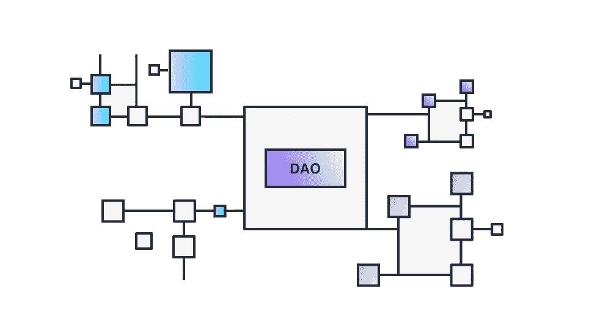

# 道斯世界介绍！

> 原文：<https://medium.com/coinmonks/a-new-phenomenon-in-crypto-daos-4a29688476fa?source=collection_archive---------12----------------------->

## 让我们探索去中心化的组织！

Decentralised Autonomous Organisations

# 介绍

一些不熟悉区块链世界的人可能会被所有的新术语、行话和大量可用的信息吓倒。当我第一次开始学习区块链、DeFi 和加密货币时，我也被现有的所有令人兴奋的新技术淹没了。我阅读的每一篇文章或每一页都会让我发现一些我以前不知道的术语。搜索这些术语是如何、是什么以及为什么存在的，让我从总体上了解了很多密码领域的知识，并让我在寻找“下一件大事”方面比其他投资者更有优势。

这些新事物中的一个就是 Dao，在这篇文章中，我将向您介绍 Dao 的概念，它们是如何工作的，您可以如何为它们做出贡献，以及 Dao 的未来将会如何！

# 那么什么是道呢？

“道”是“分散自治组织”的缩写。Dao 完全托管在区块链上，使用 web3 技术进行管理。该组织管理着一个社区金库，他们用这个金库来激励帮助他们实现目标的任务和工作。这样，利用分散的区块链的力量，社区可以实现以前认为不可能的新事物！能够将 DOA 与现实世界的机构进行比较的最接近的机构可能是 LCC，但最大的区别是社区而不是董事会决定了 DAO 采取的路线。DAO 的创始人通常仍然对这条路线有很大的影响，但随着时间的推移，社区可以慢慢地接受这些影响。

# 一把刀是如何工作的？

这就把我们带到了下一个问题；刀是如何起作用的？道是由有想法或远见的人创立的。这个人开了一个道，找到了同样对这个愿景充满热情的人。这个想法可以是任何事情，从开始一个投资俱乐部到试图改变气候到购买财产，任何想法或愿景都足以开始一个 DAO！一旦 DAO 建立了一个网站或(至少)一个沟通渠道，您就可以开始融资，出售代币来填补组织的初始资金。然后，这些令牌用于对有助于实现 DAO 目标的提案进行投票，一旦提案获得通过，财政部则充当完成提案的一种方式。如果你想增加你对道的影响，你可能想贡献或购买更多的代币！

# 成为一名贡献者意味着什么？

所以下一个逻辑思想是。我怎样才能对一把刀有所贡献？好问题！首先，你需要找到一个与你支持的愿景或想法相同的 DAO。Dao 总是需要可以为他们执行任务的人，所以只要加入一个，让自己沉浸在可用的信息和人当中。一旦你找到了一把刀，你就可以开始为它做奖励或任务了。这些工作可以是写文章，也可以是设计网站来管理社区。你可以联系组织的管理员，或者使用像 [layer3](https://beta.layer3.xyz/bounties) 或 [dework](https://dework.xyz/) 这样的网站来寻找有助于将 DAO 推向新水平的奖励。做这些奖励最有趣的部分是什么？执行这些任务或奖金通常会获得投票权(以代币的形式)或加密奖励。通过这种方式，你可以支持你袖手旁观的目标，同时还可以赚钱！

# 道史略。

第一个道叫做“分散自治组织”。“它试图成为一个 Kickstarter，任何人都可以提出一个想法，并从 DAO 中获得资金。这是一个巨大的成功，当以太坊的交易价格仅为 20 美元时，它的资金达到了近 2.5 亿美元。可悲的是，所使用的智能合同包含多个缺陷，其中一个被黑客利用，他在最终停止之前在以太网中提取了近 7000 万美元。这一黑客攻击的影响如此之大，以至于该连锁店决定采取分叉方式，恢复黑客攻击，并将资金返还给所有投资者。不是每个人都同意这种分叉，因为一些人坚持认为区块链应该是不可变的，即使在如此大的黑客攻击之后。其结果是以太坊经典链和以太坊链的创建，以太坊经典链仍然承载着黑客的资金，而以太坊链则恢复了黑客的身份。虽然可以理解的是，刀本身在被黑客攻击后死亡了，但是这个想法仍然存在，并且成为了现在每一把刀存在的基础！

# 道斯的未来。

虽然大部分 Dao 还在自己的步兵里，但有些已经成大事了！最近的一个例子是宪法道，其目标是用加密货币购买美国宪法。虽然他们失去了拍卖，这是一个伟大的例子什么(一次性)刀可以实现。当前的去中心化组织仍然主要生活在区块链和加密货币空间，但随着它们中的许多开始变得越来越大，它们将开始进入现实世界，并影响现实世界！我认为 DAOs 将实现令人惊叹的事情，我非常兴奋地看到他们将为(加密)世界带来什么！

# 结论

Dao 是一个非常有趣的概念，将彻底改变组织的构建和管理方式。他们可以把密码空间变得更好，可以鼓励每个人开始建立他们相信的东西。我会邀请每个人开始加入一个能激起他们兴趣的道，并沉浸在道周围的信息和人们之中。因为也许，仅仅是也许，你将领导下一个大的区块链和互联网组织！

***注；*** *此片原为* [*阿拉贡*](https://aragon.org/) *和*[*opencurnnt*](http://www.convet.it/)*的赏金呈文。两者都是道，希望通过学习课程或获得创造和管理自己道的实际经验来教育人们。有空的话两个都看看！*

**其他链接:**

*   为了让我的故事对每个人都免费，请给我买杯咖啡吧！[https://ko-fi.com/igormd](https://ko-fi.com/igormd)
*   如果你想开始交易，可以考虑用我推荐的库币！[https://www.kucoin.com/r/rf/1de5d](https://www.kucoin.com/r/rf/1de5d)
*   想从每天 1%的活塞赛跑开始吗？考虑使用我的好友链接！[https://piston-token.com/ref/igormd](https://piston-token.com/ref/igormd)
*   想成为页面上的特色吗？给我发邮件！

> 加入 Coinmonks [电报频道](https://t.me/coincodecap)和 [Youtube 频道](https://www.youtube.com/c/coinmonks/videos)了解加密交易和投资

# 另外，阅读

*   [如何在加拿大购买加密货币？](https://coincodecap.com/how-to-buy-cryptocurrency-in-canada)
*   [无聊猿游艇俱乐部(BAYC)回顾](https://coincodecap.com/bored-ape-yacht-club-bayc-review) | [拜比特 vs 比特币基地](https://coincodecap.com/bybit-vs-coinbase)
*   [5 款最佳加密交易终端](https://coincodecap.com/crypto-trading-terminals) | [最佳 DeFi 应用](https://coincodecap.com/best-defi-apps)
*   [比特币基地 vs 瓦济克斯](https://coincodecap.com/coinbase-vs-wazirx) | [比特鲁点评](https://coincodecap.com/bitrue-review) | [波洛涅克斯 vs 比特克斯](https://coincodecap.com/poloniex-vs-bittrex)
*   [德国最佳加密交易所](https://coincodecap.com/crypto-exchanges-in-germany) | [Arbitrum:第二层解决方案](https://coincodecap.com/arbitrum)
*   [币安交易机器人](/coinmonks/binance-trading-bots-d0d57bb62c4c) | [OKEx 评论](/coinmonks/okex-review-6b369304110f) | [Atani 评论](https://coincodecap.com/atani-review)
*   [最佳加密交易信号电报](/coinmonks/best-crypto-signals-telegram-5785cdbc4b2b) | [MoonXBT 评论](/coinmonks/moonxbt-review-6e4ab26d037)