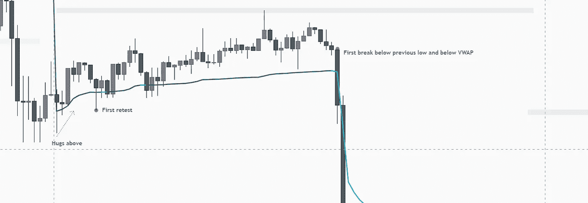

# 对 vwap、自定义时间段 vwap 和 TWAP 机器人有重要了解

> 原文：<https://medium.com/coinmonks/a-no-bs-guide-to-using-vwaps-custom-time-period-vwaps-and-twap-bots-3cceb13b1d7d?source=collection_archive---------2----------------------->

VWAPs:

Source: [What Are Common Strategies for Using Volume Weighted Average Price? (investopedia.com)](https://www.investopedia.com/ask/answers/031115/what-common-strategy-traders-implement-when-using-volume-weighted-average-price-vwap.asp)

简而言之，VWAP 是一项资产的公允价格或价值。大多数日内交易者使用每日 VWAP，因为它是大多数交易所和图表软件的默认设置。

*   如果价格高于 VWAP =认为看涨
*   如果价格低于 VWAP =认为看跌
*   如果你期待一个看涨的日子，最好的进场总是低于 VWAP
*   如果你预计熊市，最好在 VWAP 上方进场

**录入方式:**

1.  价格高于/低于 VWAP，第一次复试。

2)突破前期低点，VWAP 上方/下方结构的首次突破

就这样 tbh。大多数人认为 VWAP 是一个神奇的指标，但现实是有时价格会远离 VWAP，永远不会重新测试 VWAP 线。这就给我们带来了 VWAP 标准差。

**VWAP 标准差:**

这是一个与现在的 VWAP 有更多等距线的 VWAP。它可以是 0.5、1、2 和 3 个标准差。当价格突破背离时，趋势变得更强。

在强劲的趋势中，价格通常会重新测试这些偏差，而不是追溯到公允价值，VWAP 价值。所以，它成了一把双刃剑。那么，我怎么知道价格会回撤至哪个水平呢？**不能，所以不要做，赔钱。**确定价格之前接受或拒绝的偏离水平。

Price respecting 2nd and 3rd levels

Price respecting 1st and second levels

> 使用偏差作为基准来识别趋势的强弱。

**背离回撤策略:**

1.  等待价格突破第三个标准差以上/以下。
2.  价格未能突破第三标准偏差，并跌破第二标准偏差。
3.  第二标准偏差或低摆幅的进入复试。

**上一次 VWAP 收盘:**

前一天 VWAP 的公允价值如果不测试，就会被测试。这是做市商有大量订单等待完成的地方。

**自定义时间段 VWAP:**

现在，如果可以从 12 小时蜡烛线收盘或 4 小时蜡烛线收盘后绘制 vwap，岂不是太棒了。是的，有，它被称为滚动 VWAP 或 RVWAP。在 tradingview 上搜索 RVWAP。

4 hours rolling VWAP

您也可以使用这个交易视图工具在任何交易时段锚定 VWAP:

Just drop is to any point in time and it will extrapolate as price moves

**VWAP 的替代方案:**

零售使用 VWAP，而机构使用 TWAP 机器人来运行他们的订单。通常在一天的特定时间，做市商在采取大动作之前会运行他们的 twap 机器人来取出流动性。

**推荐指标:**

**也可以免费使用 Sigmabasis 指标:**

西格玛拜斯·TWAP:

Sigmabasis 偏差 VWAP 带:

*获得指标，免费加入 discord:*

[西格玛巴西斯-太空(launchpass.com)](https://launchpass.com/sigmabasis-space)

*要了解不对称加密信息和交易策略，请在 twitter 上关注我:*

[(1)sigma basis(@ sigma basis)/Twitter](https://twitter.com/sigmabasis)

感谢您的阅读。希望你们都明白这些概念，如果你需要任何帮助，在 discord 或 twitter 上给我发消息，如果我有空，我很乐意回答任何问题。

> 加入 Coinmonks [电报频道](https://t.me/coincodecap)和 [Youtube 频道](https://www.youtube.com/c/coinmonks/videos)了解加密交易和投资

# 另外，阅读

*   [3 商业评论](/coinmonks/3commas-review-an-excellent-crypto-trading-bot-2020-1313a58bec92) | [Pionex 评论](https://coincodecap.com/pionex-review-exchange-with-crypto-trading-bot) | [Coinrule 评论](/coinmonks/coinrule-review-2021-a-beginner-friendly-crypto-trading-bot-daf0504848ba)
*   [莱杰 vs n rave](/coinmonks/ledger-vs-ngrave-zero-7e40f0c1d694)|[莱杰 nano s vs x](/coinmonks/ledger-nano-s-vs-x-battery-hardware-price-storage-59a6663fe3b0) | [币安评论](/coinmonks/binance-review-ee10d3bf3b6e)
*   [Bybit Exchange 审查](/coinmonks/bybit-exchange-review-dbd570019b71) | [Bityard 审查](https://coincodecap.com/bityard-reivew) | [Jet-Bot 审查](https://coincodecap.com/jet-bot-review)
*   [3 commas vs crypto hopper](/coinmonks/3commas-vs-pionex-vs-cryptohopper-best-crypto-bot-6a98d2baa203)|[赚取秘密利息](/coinmonks/earn-crypto-interest-b10b810fdda3)
*   最好的比特币[硬件钱包](/coinmonks/hardware-wallets-dfa1211730c6) | [BitBox02 回顾](/coinmonks/bitbox02-review-your-swiss-bitcoin-hardware-wallet-c36c88fff29)