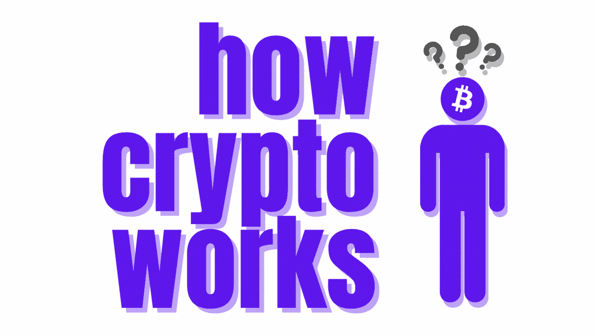

# 加密货币的非技术性指南(第 3 部分——利弊)

> 原文：<https://medium.com/coinmonks/a-non-technical-guide-to-cryptocurrency-part-3-pros-and-cons-ba2d67d3cfb1?source=collection_archive---------11----------------------->

## 加密货币的超级非技术性初学者指南。第三部分，共三部分。

***免责声明:*** *隐喻可以用来以非技术的方式解释技术概念。许多解释可能看起来过于简单或缺少技术信息。这是故意的。另外，* ***我不是理财顾问。***

How does cryptocurrency work (Part 3)? (Image by [Rachael Putnam](/@robosquiggles) via [Canva](https://www.canva.com/))