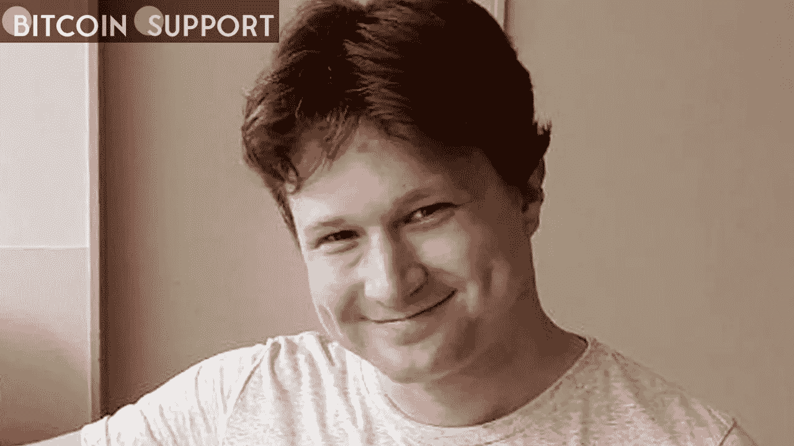

# 一名迷恋朝鲜的加密货币开发者因违反制裁被判五年监禁

> 原文：<https://medium.com/coinmonks/a-north-korea-obsessed-ethereum-developer-is-sentenced-to-five-years-in-prison-for-violating-21f3705a903?source=collection_archive---------40----------------------->

**Visit our website for full blog:-**[**https://bitcoinsupports.com/a-north-korea-obsessed-ethereum-developer-is-sentenced-to-five-years-in-prison-for-violating-sanctions/**](https://bitcoinsupports.com/a-north-korea-obsessed-ethereum-developer-is-sentenced-to-five-years-in-prison-for-violating-sanctions/)

前以太坊工程师维吉尔·格里菲斯(Virgil Griffith)因违反朝鲜制裁被判处 63 个月监禁和 10 万美元罚款。

以太坊(ETH)前开发者维吉尔·格里菲斯(Virgil Griffith)因参加会议和支持朝鲜违反美国经济制裁，被判入狱 63 个月，并被勒令支付 10 万美元罚款。

判决于 4 月 12 日星期二由美国纽约州南区地方法官凯文·卡斯特尔宣布。卡斯特尔法官评论说，“你在这里看到的是意图，一种有意识的、坚定的打破制裁制度的意图，”他补充说，格里菲斯的罪行因他“想教育个人如何逃避制裁”而加剧。

格里菲斯于 2021 年 9 月承认共谋违反《国际紧急经济权力法》，该法禁止美国公民在未事先获得财政部外国资产控制办公室(OFAC)许可的情况下向朝鲜(朝鲜)出口“商品、服务或技术”。2019 年初，格里菲斯被美国当局拒绝前往朝鲜，但他仍于 4 月前往平壤参加“区块链和加密货币会议”。他伪装成朝鲜人在会议上发表演讲，讲述该国如何利用加密货币规避制裁和洗钱。他还讨论了在与美国的核武器谈判中，如何利用智能合同为国家谋利。格里菲斯的辩护团队出示了可能导致他行为古怪的证据，试图减轻他的刑期。他们给格里菲斯做了心理评估，结果显示他患有强迫性人格障碍(OCPD)和自恋型人格障碍(NPD)。他的辩护团队断言，格里菲斯对 OCPD 和 NPD 的诊断解释了他对朝鲜的“痴迷”，并可能导致他无视朋友、家人和政府关于未经批准访问朝鲜的警告。格里菲斯获得了在法庭上发言的机会，他对自己的行为表示后悔，并宣称俄罗斯因入侵乌克兰而受到的制裁已经“显示了它们的价值”，他已经“治愈”了自己的“朝鲜情结”

格里菲斯没有被法庭说服，卡斯特尔法官说:

**“事实是，维吉尔·格里菲斯计划作为一个秘密英雄回国，因为他无视政府的制裁，因为他的勇气和高贵而受到尊重和赞美。”**

格里菲斯在 2019 年 11 月被 FBI 拘留，当时他刚从大会回来几个月。被捕前，格里菲斯多次与调查局会面，谈论他的旅行，包括向他们展示他自己在会议上发言的照片。朝鲜对加密货币的使用变得越来越复杂，既可以规避制裁，也可以通过黑客攻击窃取数百万美元。Chainalysis 在 1 月份披露，朝鲜黑客在 2021 年通过交易所违规和勒索软件窃取了约 4 亿美元，他们使用了一种复杂的洗钱策略，结合了分散的交易所掉期和几个加密酒杯。

**访问我们的网站获取完整博客:-**[**https://bitcoinsupports . com/a-north-Korean-痴迷-以太坊-开发者-被判五年有期徒刑-违规-制裁/**](https://bitcoinsupports.com/a-north-korea-obsessed-ethereum-developer-is-sentenced-to-five-years-in-prison-for-violating-sanctions/)

**免责声明:以上为作者观点，不应视为投资建议。读者应该自己做研究。**

> 加入 Coinmonks [电报频道](https://t.me/coincodecap)和 [Youtube 频道](https://www.youtube.com/c/coinmonks/videos)了解加密交易和投资

# 另外，阅读

*   《XT.COM 评论》|
*   [SmithBot 评论](https://coincodecap.com/smithbot-review) | [4 款最佳免费开源交易机器人](https://coincodecap.com/free-open-source-trading-bots)
*   [比特币基地僵尸工具](/coinmonks/coinbase-bots-ac6359e897f3) | [AscendEX 审查](/coinmonks/ascendex-review-53e829cf75fa) | [OKEx 交易僵尸工具](/coinmonks/okex-trading-bots-234920f61e60)
*   [如何在印度购买比特币？](/coinmonks/buy-bitcoin-in-india-feb50ddfef94) | [瓦济克斯评论](/coinmonks/wazirx-review-5c811b074f5b)
*   [隐翅虫替代品](/coinmonks/cryptohopper-alternatives-d67287b16d27) | [HitBTC 审查](/coinmonks/hitbtc-review-c5143c5d53c2)
*   [CBET 评论](https://coincodecap.com/cbet-casino-review) | [库科恩 vs 比特币基地](https://coincodecap.com/kucoin-vs-coinbase)