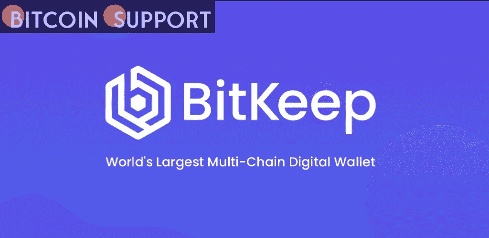

# 数字资产管理的一站式商店在最近的升级中，BitKeep 将自己定位为 Web3 网关

> 原文：<https://medium.com/coinmonks/a-one-stop-shop-for-digital-asset-management-in-the-most-recent-upgrade-bitkeep-positions-itself-46bb08df2829?source=collection_archive---------77----------------------->

**Visit our website:-** [**https://bitcoinsupports.com/**](https://bitcoinsupports.com/)

DeFi 变得越来越复杂，这意味着 DeFi 网关也变得越来越复杂。DeFi 继续以令人难以置信的速度扩张，向全球引入了新的交易和收款方式、投资、借款，甚至是一种新型的收藏品。然而，随着技术的进步和其他用例的出现，人们发现多样化的景观越来越难以穿越。甚至以前被认为仅仅是存储资产的实用工具的钱包，也已经发展成为去中心化交换(dex)、去中心化应用(DApps)和游戏的接入点。

尽管 DeFi 业务的这些切入点比以往任何时候都更容易获得，但该行业在优化用户体验方面仍有工作要做，以刺激新的增长并为其现有社区扩展功能。这意味着采用有用性和可访问性作为未来分散项目的开发标准。多链钱包和更全面的数字资产管理服务 BitKeep 正在满足蓬勃发展的 DeFi 行业的需求。尽管 BitKeep 来自亚洲，但它已经成为一个全球性的参与者，与各种区块链进行合作，包括 Polygon (MATIC)、Solana (SOL)、Ethereum (ETH)和 Terra (LUNA)，并且是 DeFi 市场的强大支持者。事实上，BitKeep 通过充当新用户的桥梁，帮助他们发现和确定高质量的 DeFi 项目，以便他们可以了解新出现的新举措，从而实现了这一目标。BitKeep 团队刚刚宣布发布该应用的 7.0 版本，增加了 NFT 市场区和发现区，将该程序转变为一个强大的工具，合并了五个部分:钱包、掉期、NFT 市场、DApp 和发现。

**不断进步**

该团队改进了他们钱包的 UX、安全性和功能性，这是此次改革的核心。这一举措试图为用户提供最方便的交易地点，同时也保护他们的隐私和安全。BitKeep 的钱包现在支持 40+主链和 DApps，包括 ETH、Polygon、币安智能链(BSC)、OEC 令牌、雪崩契约链(AVAX-C)、TRON (TRX)、Solana 等等。

尽管存在跨链功能，但用户可以通过单个帐户访问所有这些资产，从而受益于简化的体验。还增加了对十种语言的支持，包括中文、英语、韩语、拉丁语、美国语、阿拉伯语、土耳其语和越南语。随着他们的钱包改革，出现了一个改进的 Swap，一个包含报价、桥和 Launchpad 的位保留区。用户可以利用报价获得 200，000 个令牌的实时数据和信息，包括蜡烛图、交易历史和数据分析。桥功能还可以处理 10 个链和 26 个协议之间的交换，这要归功于许多用于建立更广泛市场的桥。

被称为 NFTs 的数字资产类别的增长是 DeFi 的核心。作为 7.0 升级的一部分，BitKeep 增加了一个新的 NFT 市场组件，用户可以参与各种数字艺术品和收藏品的交易和展览功能，为世界各地的创作者和收藏家提供 NFT 交易渠道。为了让用户保持领先于市场趋势，其他功能包括实时 NFT 收益排名和资产推荐。

发现功能包括一个帮助中心，为首次使用 BitKeep 的用户提供指导材料，如教程、安全建议和产品功能概述，以确保他们熟悉 BitKeep 的操作。努力通过礼品中心得到奖励，这是一个奖励系统，由几项具有不同奖励的家务劳动组成。

**重大转折点**

BitKeep 认为 7.0 版本的发布是公司历史上最重大的事件之一。他们的社区中现在有来自 168 个国家的 400 万经过验证的个人。根据 7.0 版本，BitKeep 通过向客户提供进入更大的 Web 3.0 世界的接入点，继续将自己确立为不仅仅是一个区块链钱包。

**访问我们的网站:-**[**【https://bitcoinsupports.com/】**](https://bitcoinsupports.com/)

**免责声明:这些是作者的观点，不应被视为投资建议。读者应该自己做研究。**

> 加入 Coinmonks [电报频道](https://t.me/coincodecap)和 [Youtube 频道](https://www.youtube.com/c/coinmonks/videos)了解加密交易和投资

# 另外，阅读

*   [5 款最佳加密交易终端](https://coincodecap.com/crypto-trading-terminals) | [最佳 DeFi 应用](https://coincodecap.com/best-defi-apps)
*   [最佳网上赌场](https://coincodecap.com/best-online-casinos) | [币安评论](/coinmonks/binance-review-ee10d3bf3b6e) | [BitMEX 评论](https://coincodecap.com/bitmex-review)
*   [麻雀交换评论](https://coincodecap.com/sparrow-exchange-review) | [纳什交换评论](https://coincodecap.com/nash-exchange-review)
*   [美国最佳加密交易机器人](https://coincodecap.com/crypto-trading-bots-in-the-us) | [经常性回顾](https://coincodecap.com/changelly-review)
*   [在印度利用加密套利赚取被动收入](https://coincodecap.com/crypto-arbitrage-in-india)