# 快速浏览 NFTs

> 原文：<https://medium.com/coinmonks/a-quick-degen-look-at-nfts-1856a4a5ab37?source=collection_archive---------21----------------------->

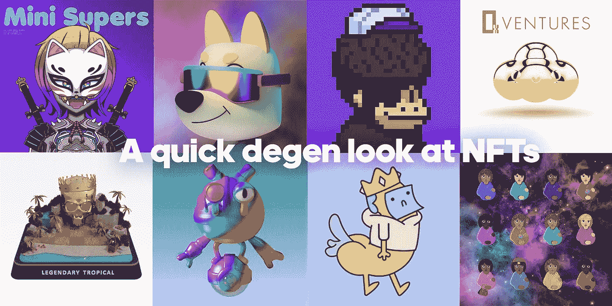

TLDR: Coinzy talks about the state of the NFT market, new and interesting projects. DYOR

你今天的作者是 [Coinzy](https://twitter.com/coinzycapital) ，我是 [0xVentures](https://0xventures.org) 的成员，你可以在这里关注我们的私人道[的推文。](https://twitter.com/0x_Ventures)

共同成员写的 Fluf World 的曲子 [@0xBankai](https://twitter.com/0xbankai) 。宝藏生态系统内容由联合成员 [@Slatt](https://twitter.com/slattTophy/) 撰写。

## 放弃

本文表达的观点仅代表作者的观点，不应作为投资的依据。

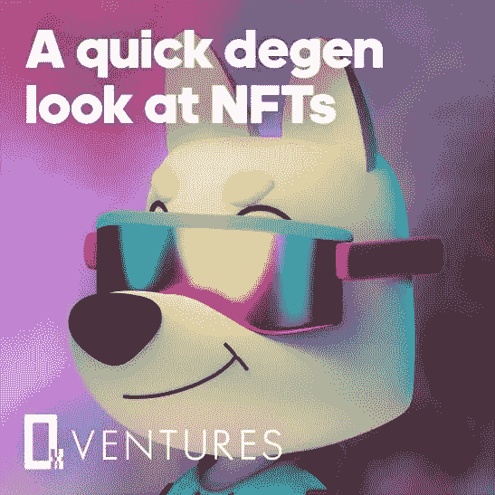

Let Coinzy and the gang take you on a journey…

通用汽车公司研究员德根斯，在这里分享一些关于 NFT 市场的状态，一些有趣的新技术和其他有趣的更边缘的项目的想法。有无尽的 NFT 项目和大量的大狗宣传片，所以我打算分享那些稍微不太主流的。如果你想加入凌晨 3 点造币局，记得在接下来的 0.2 秒之前在#Weiners 频道提交你的 WL 钱包。开个玩笑，保护好你的钱包，永远不要给任何人你的种子短语或私人密钥。正如我们本周看到的突出的 Chad [Arthur_0x](https://twitter.com/Arthur_0x/status/1506167899437686784) 。

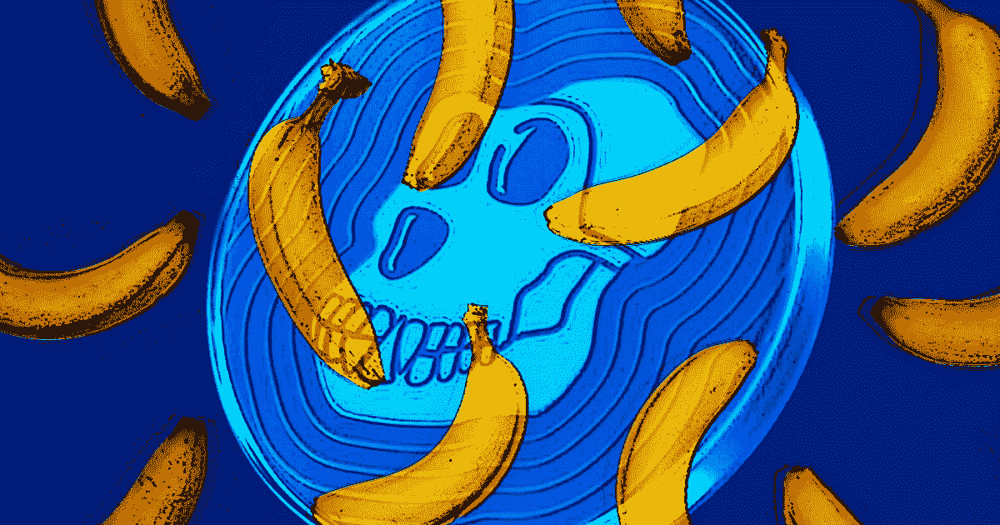

## **当前市场**

我们已经看到了 NFT 市场长期的增长和巨大的上升空间。即使当 Defi 市场跌至令人难以置信的低点时，NFT 的狂热仍在蔓延。零售在这里，鲸鱼在左右+中心抽水，香槟像水一样流淌。虽然这种长生不老药直接从我们的手指间流过，消失在时间的沙子里，但它不会永远年轻地消失。你可能注意到你最喜欢的不和谐变得非常安静，甚至我也发现很难在项目间推广免费的 WL 机会。这段休耕期有利于市场休息、恢复并为下一轮上涨做准备。现在，令人欣慰的是，这种逐渐减弱的兴趣又开始增长了，旧的操作系统优惠再次在我们的邮箱里响起，清楚地表明人们的兴趣又回来了。在一定程度上，这是因为所有 BAYC 持有人获得的$ape 硬币带来了大量的免费资金。交易员们在那里也度过了一段美好的时光，从 Ape 估值的大幅上升中获得了大量利润。当然，BAYC 被宇迦实验室收购，这是个大新闻。所有的 BAYC holder 现在都是他们无聊猩猩的知识产权所有者。

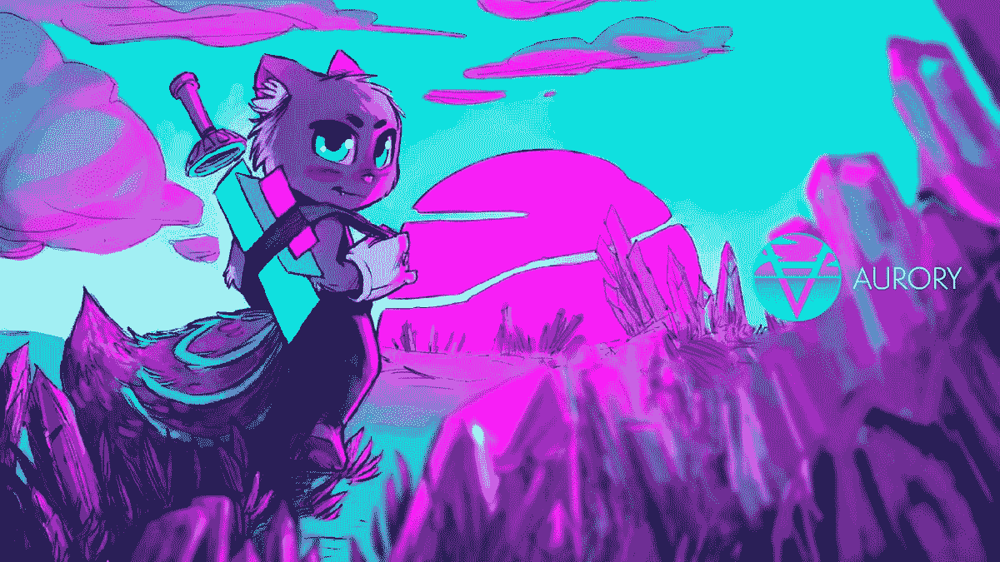

## 期待什么

这是一个广泛认同的观点，游戏保真将是一个不断增长和有利可图的加密领域。我们在这里分配，并认为它值得关注，跨越许多连锁店。这种前景，多链，多马克西，反马克西一直是一个持续的叙事我和其他人一直念叨了一段时间，并将继续这样做。我爱你给这个世界的所有野性的、创造性的、有时是爆炸性的礼物，所以让我们拥抱所有的信条。保持开放的心态，跟随最疯狂的实验，并把这些知识带在身边。

# **以太坊**

对于 Eth gas 的消费者来说，这是地狱般的一年，谢天谢地，成功项目的数量和利润大大超过了进入成本，改变了许多人的生活。我希望那些赚了钱的人，能够留住钱，并找到增加钱的方法。它将继续拥有最大的用户群和鲸鱼数量，但我们已经看到许多新 NFT 鲸鱼出现在其他连锁店，如索拉纳，特拉，草间弥生，月光等。

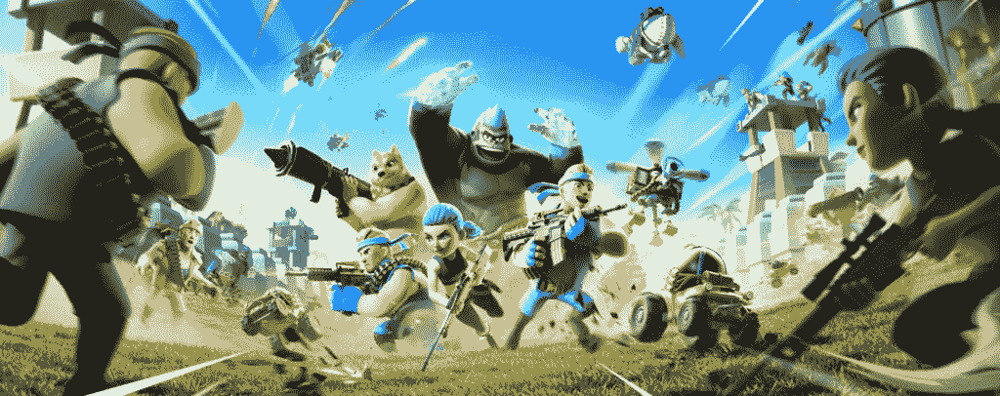

## [**Mavia 游戏的英雄**](https://twitter.com/MaviaGame)

我对 Mavia 游戏感到非常兴奋，因为我已经是一个普通而稀有的土地持有者了。你将建立你的基地，壮大你的军队，并通过征服整个 Mavia 的敌人基地来赢得红宝石。他们给 Eth 带来了在其他类别中看到的高度精致、高质量的游戏。承诺成为第一款 AAA 区块链基础建造者游戏。

[https://www.mavia.com/](https://www.mavia.com/)

[https://www.youtube.com/watch?reload=9&v = fjdpd 58 yiig](https://www.youtube.com/watch?reload=9&v=fjdpd58YIig)

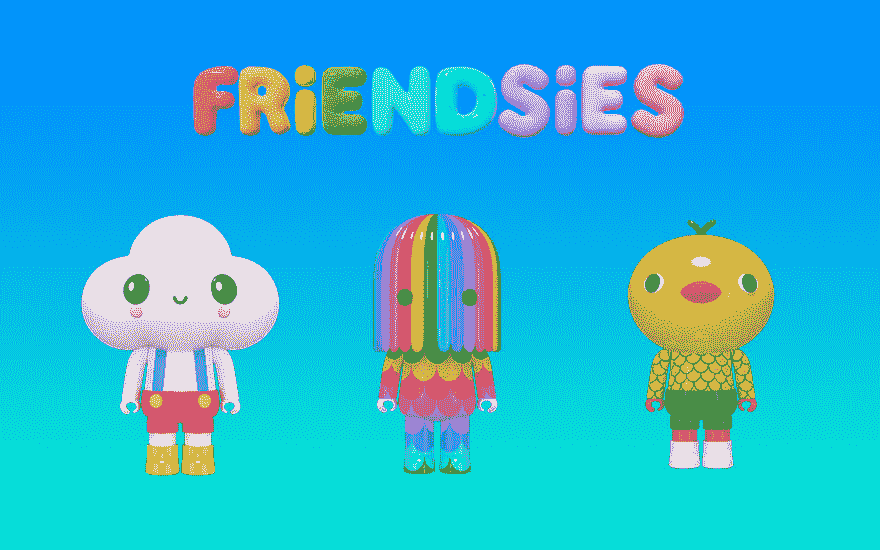

## [**朋友关系**](https://twitter.com/fRiENDSiES_Ai)

这将是一个华丽的小 AI 朋友。fRiENDSiES 是一个由世界知名的当代艺术家 FriendsWithYou 创建的网络 3 友好社区。FriendsWithYou 开发了一个独特的角色生成器，加载了数百个预先设计的 3D 资源，通过其不可变的发布链，为 10，000 名幸运的收藏家提供了定制和培养他们自己的终身数字伴侣的机会。通过令牌组学，fRiENDSiES 生态系统将由爱、良好的氛围和友谊驱动。我真的很期待角色生成器，看看这个非凡的团队还会推出什么。若要铸造，您需要持有以下链接的超级金云钥匙。

[https://discord.com/invite/friendswithyou](https://discord.com/invite/friendswithyou)

[https://friendsies.io/](https://friendsies.io/)

我也很喜欢玩一些较小的连锁游戏，这些游戏需要的时间更少，并且可以增加体验。这些对我来说更像自制的。

## [**费达尔兹**](https://twitter.com/feudalznft)

Feudalz 就是这样一个游戏。Fuedalz (humanz)是一个部分免费的造币厂，在一个大的回落之前飞到了几个 Eth，他们继续释放 Animalz，Orcz，Elvez 和 Landz。有一个半交互式的游戏，在那里你可以为金币袭击其他的金币，你可以在链上或链下储存金币。费乌达兹、兽人或精灵的比例决定了你的突袭效果。这个游戏将会经历几次迭代，我很期待它的成长。

【https://feudalz.io/ 

[https://www.youtube.com/watch?v=PE7Ew17GWhI](https://www.youtube.com/watch?v=PE7Ew17GWhI)

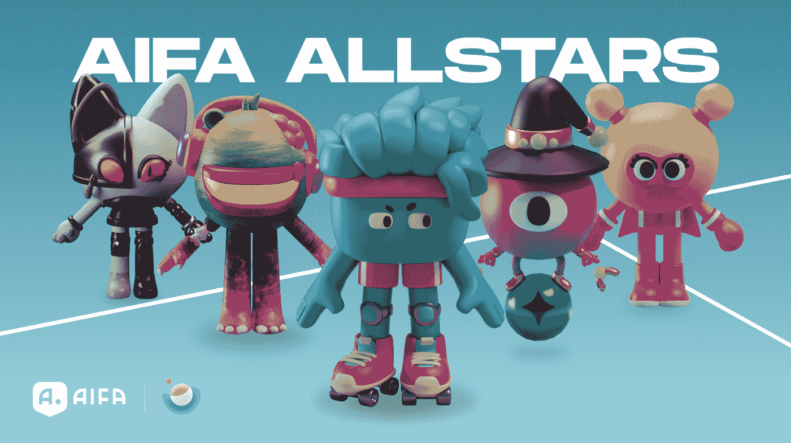

## [**改变状态机**](https://twitter.com/altstatemachine)

我们在 0xV 有许多 ASM Chads。它们是不可替代的智能的新协议。在许多游戏世界、金融应用程序和虚拟世界中创建人工智能代理并与之竞争和互动。它们可能会与不仅仅是 Fluf World 集成:想象一下沙盒、分散土地和 AI 大脑上的其他元数据。

AIFA 足球是全明星人物的旗舰游戏，即将为所有 Genesis brain 持有者(3 月 29 日)和那些希望参加探索拍卖(3 月 30 日)的人提供 DAO 令牌$ASTO 的象征性下降。$ASTO 也将被押上赌注，以产生一批新的第二代大脑。

此外，他们还有大的合作伙伴:正宗品牌集团(Reebok，Juicy Couture，Shaq。)正在合作一个穆罕默德·阿里拳击冠军。华纳兄弟不只是一个沉默的投资者，他们显然在谈判中非常活跃。华纳“对于元宇宙未来的潜力看到了不祥之兆”。大脑已经相当昂贵，应该可以用于其他多个身体(其他 NFT 项目)。就人工智能的效用而言，可能性是无穷的，无论你现在看到什么都只是开始。

[https://www.alteredstatemachine.xyz/roadmap-page/](https://www.alteredstatemachine.xyz/roadmap-page/)

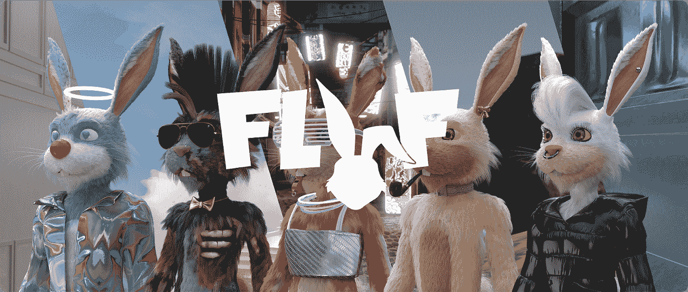

## [**Fluf 世界**](https://twitter.com/fluf_world)

Flufs 是由不可替代的实验室在 2021 年 8 月为我们带来的 10，000 个 3D 编程生成的兔子化身的创世纪集合。每一个特质都很重要，所有特质都会随着时间的推移通过空投和参加 IRL 活动等方式得到回报。每个 NFT Fluf 作为 3 个 NFT 的组合存在，由具有各种特征的兔子化身、背景和它的音乐组成。您可以交换场景和声音来定制您的心的内容！

作为元宇宙 Fluf 世界的顶级资产，它处于正在建设的更广泛的生态系统的中心。在短短的半年时间里，生态系统的增长令人印象深刻。迄今为止，他们已经与品牌/公司建立了深厚的合作伙伴关系和集成，以创建一系列协同的移动部件，每个部件都锚定了一个包容性和沉浸式元宇宙所需的战略方面。像 BAYC、Meebits、Jadu、Sandbox 这样的品牌已经计划进行集成，目的是通过协作努力创建一个可互操作的元宇宙。

[https://fluf.world/manifesto](https://fluf.world/manifesto)

今年 3 月，Fluf World 是 South by Southwest (SXSW)的冠名赞助商，这是一年一度的电影、技术和音乐节/会议，由全球主要品牌和创新者参加。FLUF 世界体验包括在定制的 FLUF 村举行的一系列虚拟现实互动活动，以及讨论 Web3 未来的行业领导小组。该团队提交了一份元宇宙宣言，这是一份关于**开放、包容的元宇宙**的集体愿景，赋予其居民权力，到目前为止，他们已经获得了包括微软、亚马逊、三星、特斯拉等在内的 1500 多家公司的承诺，为实现这一愿景而努力，即由公民运营的元宇宙可能会比由公司设计和运营的更富有、更公平、对用户更有价值。在为期 4 天的活动中，许多行业领袖与团队合作，寻求合作和协作的机会。激动人心的时刻即将到来！

> **互联 Fluf 生态系统项目:**

## **甲方承担**

一个由 9669 只随机生成的熊组成的集合，它们的焦点是世界的**音乐和派对**方面。想象一下像 Snoop Dog 这样的音乐艺术家创造了 NFT drops，例如自己品牌的派对配件和舞蹈动作，供他们的粉丝带到元宇宙的活动中。

[https://www.partybear.xyz/](https://www.partybear.xyz/)

## **地洞**

基本上，它是你的 flufs 的家，你可以根据自己的喜好对它们进行个性化设置。上面是**地块**地块(详情待透露)。

[https://burrows.fluf.world/](https://burrows.fluf.world/)

## **事物**

可爱的小蜘蛛同伴可以收获*菌丝体*——这是一个将在 Fluf 世界令牌组学中发挥关键作用的令牌。在与 ASM 的合作中，每个东西都配备了第二代大脑，因此能够使用其**人工智能**来生成独特的抽象艺术作品和更多作品(待披露)。

## **探索者**

由一家名为 Sylo 的公司建造，这是一个**分散式通信网络**，是 Web3 和元宇宙的重要基础设施。从钱包到钱包的角度考虑消息/语音/视频。只要有足够的$Sylo 股份，每个搜索者 NFT 都可以作为一个节点操作员来保护网络。探索者信标在 3 月 28 日的公开销售中被铸造并销售一空，基于社区决定的供应，从 50k 开始，结果铸造了 47895 个(其余的被称为妖精的神秘实体“捕获”)。

[https://www.seekers.xyz/](https://www.seekers.xyz/)

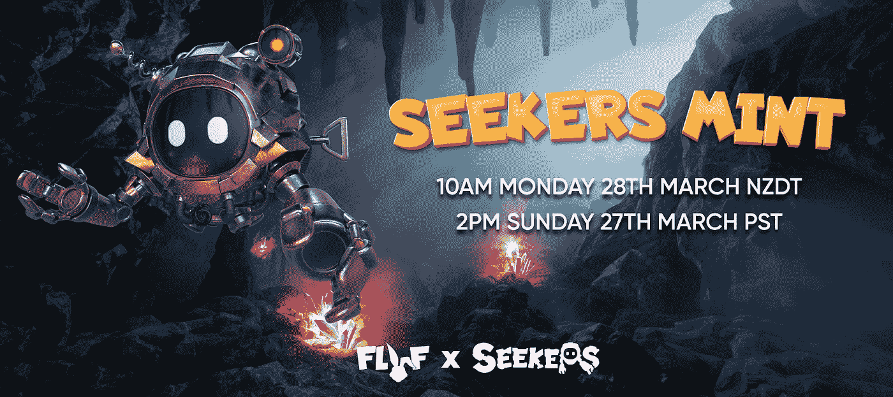

总的来说，Fluf 团队采取的方法是非常逆向的:不是做一个降落，然后试图吸引用户，Fluf World 的组成部分正在同时建立，而其社区一直参与他们如此热衷的生态系统的开发。

# 草间

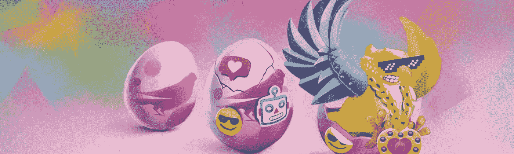

[RMRK 2.0](/@gbaciX/why-rmrk-2-0-on-singular-is-a-game-changer-for-nft-creators-5de5f1ccfec8) 在非功能性测试方面引入了一些惊人的进步，对我来说，它引领了这个领域的创新。比如嵌套，这是 NFT 拥有其他 NFT 的能力。或条件渲染，NFT 根据链上动作改变其外观的能力。或多资源功能，允许 NFT 拥有一个以上的资源。想想 NFT 在父结构、子结构中拥有其他 NFT，子结构的存在改变了父结构的外观或属性。在一个 NFT 中拥有多种资源或资产，为音乐行业等行业带来了巨大的机遇。可以为乐队/艺术家购买 NFT，它可以接收其他资产或 NFT 的空投，或者单个 NFT 可以保存多个静止图像、视频或其他资源。的最后一个功能是他们称之为情绪化的东西，它允许用户将表情符号添加到 NFT 中，以增加社交互动。卡娜莉亚鸟类收藏是所有这些技术的典范。

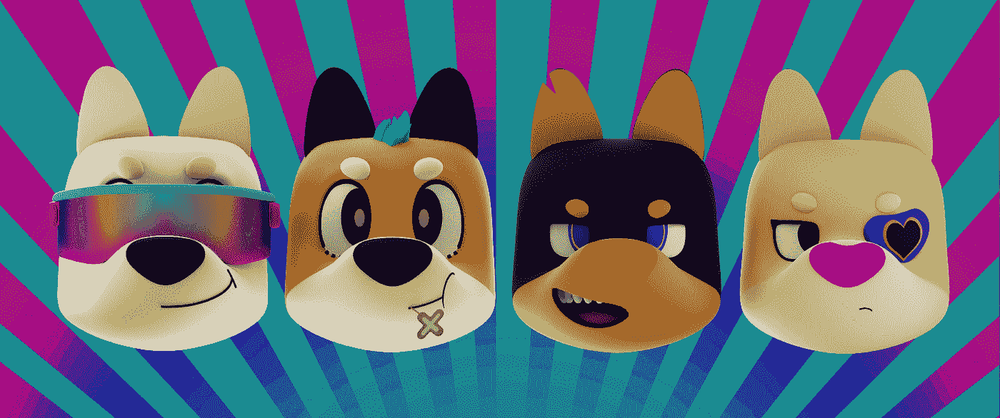

## [**柴犬故事集**](https://mobile.twitter.com/shibatales)

我个人是柴犬故事的顾问。柴犬故事是一款内置浏览器的“跳舞赚钱”区块链电子游戏，玩家可以在这里发现、收集、交换和组合激进的舞步(RDM ),在无限三角舞池中跳起十种独特的 shibalings！他们订购了阿莫帽套装，很快就会录制所有的舞蹈动作，这将会很有趣。这些人与 Dotsama 社区有很深的联系，甚至制作了虚拟指南 [Sophia](https://mobile.twitter.com/TheDotSamaEXPC/status/1497571518427058182) 。

【https://shibatales.space/ 号

# **月光**

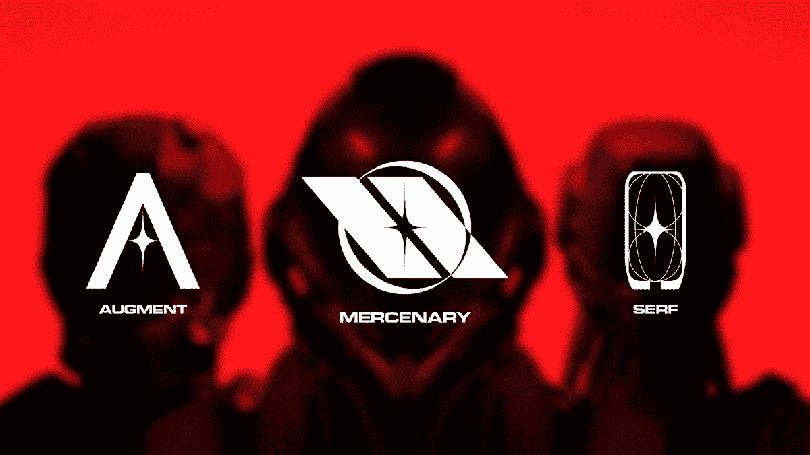

## [**被流放的赛车手**](https://twitter.com/exiledracers)

世界上第一个 NFT 太空竞赛经理建立在 Moonbeam 网络上。薄荷即将上市。艺术是飞的，网络是 EVM 友好的，所以带上你的 MetaMask 钱包。他们与一家令人难以置信的 3D 艺术制作公司合作，每一滴看起来都比上一滴更好。NFT 持有者将各自拥有车库和几辆赛车。

[https://www.exiledracers.com/](https://www.exiledracers.com/)

# **Terra**

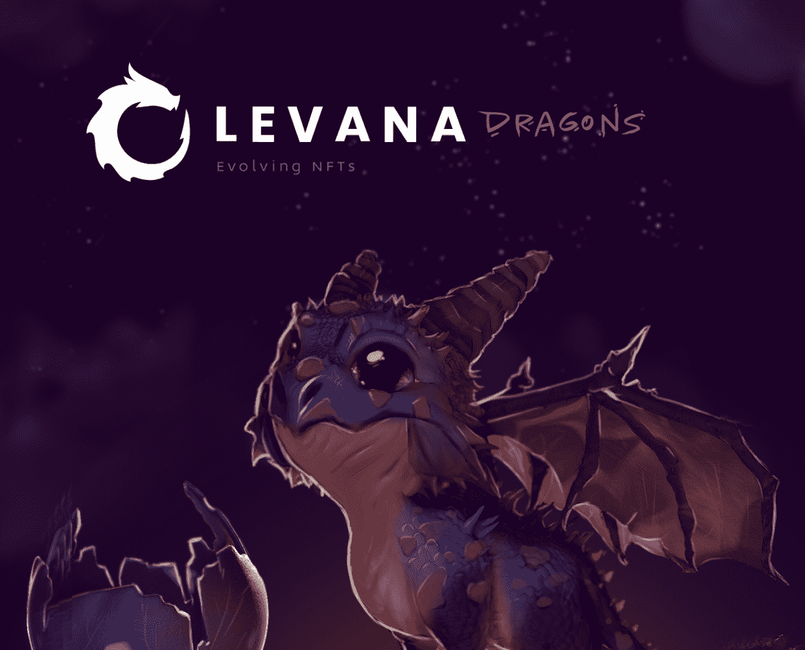

## [**莱万那龙**](https://twitter.com/Levana_protocol)

这款连锁 Terra 游戏旨在融合 DeFi、NFTs 和元宇宙，并向玩家传授...杠杆交易？是的。去年，竞标者竞拍捕捉流星的机会。后来，一个破裂事件让你打开你的流星，看看它是否包含龙蛋或其他资产。然后你可以用与微量元素相匹配的陨石尘埃来筑巢。这是一个非常酷的转变，创作者希望它能在这个过程中教授艺术定义。在过去的几个月里，参与者选择派别，组织力量在 testnet 战争任务中与其他派别对抗，玩游戏(一些有趣的原创侧滚游戏和一个选择自己的冒险任务)来赢得奖励，并围绕竞争创建一个社区。我期待着真正的游戏，看到可爱的龙孵化和成长。我是说看看那些小家伙的眼睛！

 [## 莱瓦那龙:进化中的 NFT

### 莱瓦那龙，进化中的 NFT

龙.莱瓦那.金融](https://dragons.levana.finance/) 

# Arbitrum(宝藏$魔法)

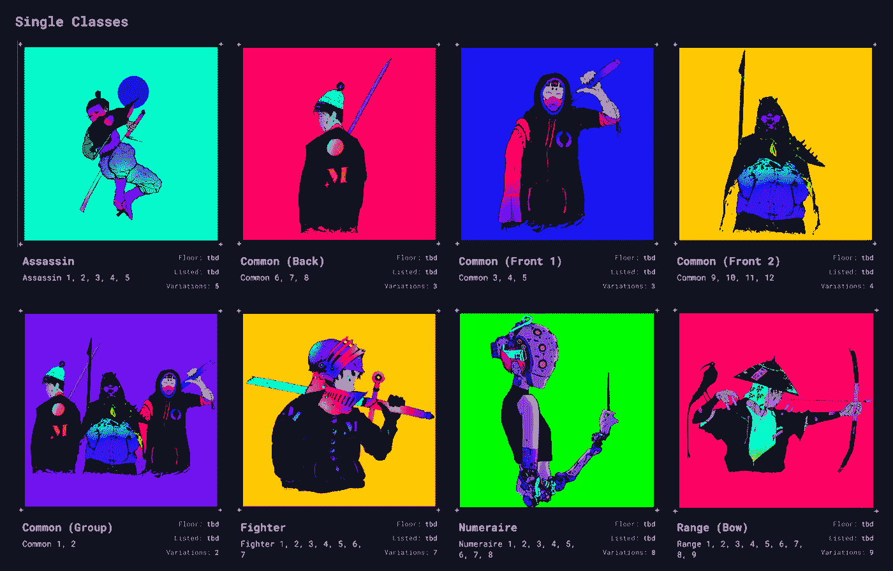

如此爱这里，“人民的任天堂”，从社区中诞生。潜在游戏和特许经营的新兴领域。大部分是免费薄荷糖，是的，免费的。和难忘的经历。再次，感觉真实和自制在这里给我。所有游戏都专注于如何与家人联系，赌注奖励或成功的任务给你其他的宝藏，你可以在市场上出售或在其他游戏中消费。这是一个迷人的实验，并且已经开始发挥作用。

## **军团**

现在**宝藏市场**中有两种军团——[创世纪](https://marketplace.treasure.lol/collection/legion-genesis)和[辅助](https://marketplace.treasure.lol/collection/legion-auxiliary)军团。军团是宝藏生态系统中 OG 中的 OG，甚至在 Smol 大脑接管之前！军团在农耕第一阶段奖励给宝藏早期成员(稀有军团 150，000 魔法，不寻常军团 50，000 魔法，普通军团 15，000 魔法)。5 个超级罕见的 1/1 军团通过抽奖的方式分发，而 Riverman 和 numaire 则分发给将 5 个宝藏部分迁移到 Arbitrum (Riverman)和 n 项目的赌注者(numaire)的人。这些军团在[桥世界](https://bridgeworld.treasure.lol)中充当主角，你可以派他们去做任务，召唤更多的辅助军团，入股阿特拉斯矿山开采$魔法排放，工艺等等！现在，你甚至可以用 10 美元的魔法获得新兵，并让他们去执行任务(新兵不会带回财宝，只会带回消耗品，但是团队正在为新兵提供升级，让他们能够升级并有更多的用途)。

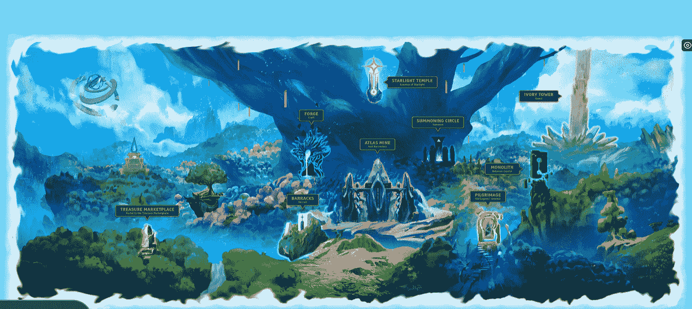

*Bridgeworld home page*

在桥牌世界里有很多事情可以做，有许多游戏理论和每个玩家可以选择的不同道路。《桥牌世界游戏指南》对于那些试图了解更多关于游戏玩法、统计数据和生态系统的人来说是最有用的信息之一。如果你正试图决定你是否应该成为一个工匠，任务，召唤师或者以上所有的职业，看看这个吧？？👀

## **蝠鲼**

战斗苍蝇是一个新的 PvP/P2E-DeFi 游戏，最近推出。你可以在宝藏市场的这里查看它们。游戏开始时，将你的蚕茧放在发射井中几个星期，慢慢地一个接一个地揭示你的战斗苍蝇的模型，在这一阶段将会揭示总共 4 个模型(蚕茧赌注在 2 天前上线，现在就让你的蚕茧赌注及时加入我们的第二季吧！！).在第一阶段结束后，玩家可以选择被动地在花园中下注以打捞或耕种 mod，或者他们可以选择通过下注一定数量的$magic 作为对对手的赌注，立即与他们最强/最喜欢的战斗机在 Hyperdome 中与其他玩家战斗。

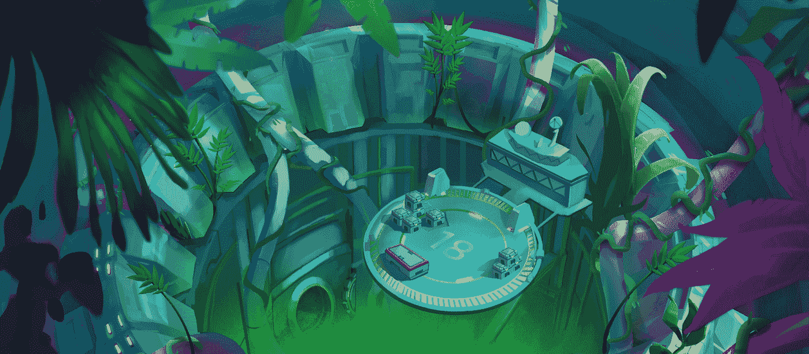

*Ze garden where BattleFlies can chill and farm mods*

当你可以调整和编辑你的战斗机可以拥有的 4 个模块，使它们变得更强(或更弱，lol ),并将它们发送到超级穹顶中与其他玩家战斗，希望赢得他们多汁的$magic 时，策略就开始发挥作用了。在这个项目中还应用了很多游戏理论和策略，而不仅仅是你简单的点击并等待 RNG 结果，你的结果将被你在游戏中的所有决策所考虑。要更深入地了解数字、模式以及 BattleFly 中的更多内容，请查看他们的[白皮书](https://docs.battlefly.game/overview/welcome-to-battlefly)。你会建立一个战斗苍蝇的稳定，并接管超圆顶建筑，还是你只是被动地冷冻和在花园里，赚取花蜜和稀有 mod 的机会，在他们的游戏内市场销售？

【https://www.treasure.lol/ 

[https://medium . com/@ clocksnatcher/why-treasures-genesis-legions-will-be-your-key-to-generation-wealth-10353 d32f 124](/@clocksnatcher/why-treasures-genesis-legions-will-be-your-key-to-generational-wealth-10353d32f124)

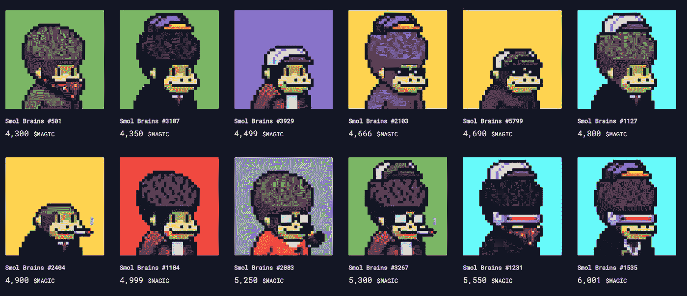

## [**斯莫尔大脑**](https://twitter.com/SmolBrainsNFT)

除了军团，斯莫尔的大脑是宝藏上的 NFT。Smols 是我第一次涉足宝藏生态系统，我很高兴我做出了这个飞跃。我驾驶一艘装满我的斯莫尔大脑猴子的宇宙飞船飞向月球，同时播放了大卫·鲍依的《火箭人》的原声演奏。我听了这首歌的每一个字，虽然像素火箭的引擎爆炸，它将永远留在我身边。我是在玩像《太空探索》和《国王探索》这样的像素化冒险游戏中长大的，这些游戏充满了古怪的幽默和简单的视觉故事。这些游戏和生态系统深深地打动了我。

[https://marketplace.treasure.lol/collection/smol-brains](https://marketplace.treasure.lol/collection/smol-brains)

[https://medium . com/@ SMOLBRAINS/smol-brains-a-初学者指南-268e1b24aab8](/@SMOLBRAINS/smol-brains-a-beginners-guide-268e1b24aab8)

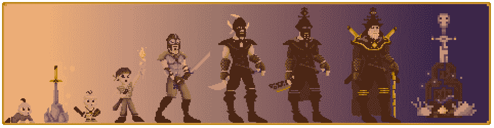

## [**生命的种子**](https://twitter.com/LifeNFT_)

以下是制造商的描述:一个生命的主人 NFT 从一个裹在襁褓中的新生儿开始。按照预先确定的时间间隔，婴儿开始成长——首先是儿童，然后是青少年、成人和老年人。通过进化，个体将表现出新的特征并经历与年龄相关的变化。他们会去上学，恋爱，从事一项职业，经历许多人生特有的成功和失望，最后，离开人世。人生是一场漫长的体验式棋盘游戏。这应该是一次情感体验。NFT 像人一样繁殖，而不是仓鼠。它们的寿命是有限的，但并非微不足道，就像我们自己一样。我还没有开始我的探索，但是我已经准备好并且渴望开始了！

[https://medium . com/@ treasury enft/life-by-jumpman-treasures-first-integration-bcdf 951159 a4](/@TreasureNFT/life-by-jumpman-treasures-first-integration-bcdf951159a4)

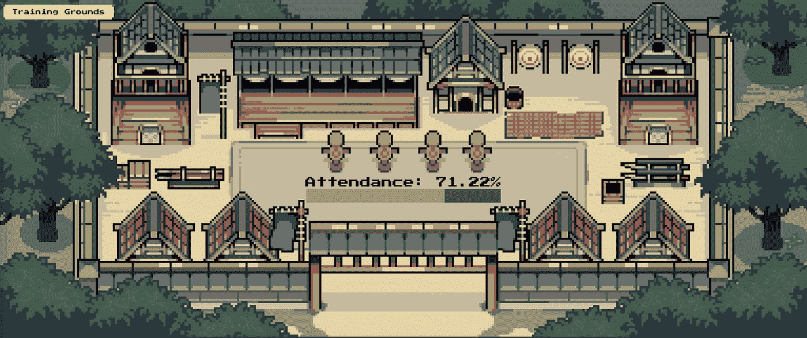

## [**幕府战争**](https://mobile.twitter.com/ShogunWarNFT)

幕府战争是一个即将到来的发挥和赚取 NFT 游戏与闲置战斗，社会协调，赌注，手工艺，和职业。我买了太多这样的小家伙了。他们目前都押了 30 天的奖励，作为游戏的第一部分。最近有一点小麻烦，他们离开了宝藏生态系统，但我相信给人们第二次机会，他们目前正在传递幽默，巨大的进步和微妙的故事。我肯定要骑这辆。

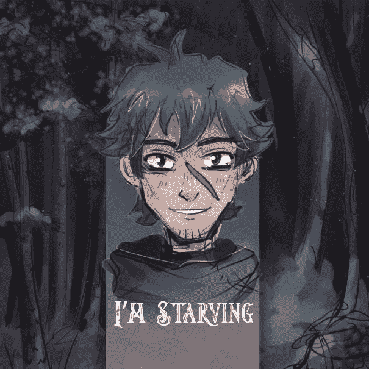

## [**我饿死了**](https://twitter.com/ImStarvingNFT)

我饿了是一个连锁的，故事驱动的社区游戏。这是一个非常特殊的项目。由一个朋友和 0xVentures 的成员发起，我作为一个作家被带上来，如果你一直在关注这个项目，你已经读过我的作品了。回到我关于 90 年代冒险游戏的观点，密码不可思议的本质为我打开了一扇机会之门，对此我很感激。我将帮助创造一个游戏，释放出创造性的能量流，给别人带来快乐。我们在 Twitter 和 Discord 上有超过 14400 名粉丝。你将获得免费造币厂的多个白名单(WL ),并得到财政部的批准，这是非常特别的。薄荷将是免费的，定于五月。这个 WL 的工作方式会有所不同:通过做任务，你获得的每个 WL 角色都会赋予你铸造一颗星 NFT 的权利。如果你有更多的 WL 角色，你可以铸造更多的明星。1 个 WL 角色= 1 个铸币厂。你最多可以有 10 个 WL 角色，所以每人 10 块薄荷糖。

[https://discord.gg/vdjjmpxH](https://discord.gg/vdjjmpxH)

# **结论**

先建，后求 WL。带上你的才华、市场、写作，远离 WL 的磨砺，成为一名贡献者。乐于合作，帮助真正有价值的建设者。这就是 web 3.0 的精神

明智一点，投资前考虑所有角度，用你的资本投票。

你选择获胜者。

> 加入 Coinmonks [电报频道](https://t.me/coincodecap)和 [Youtube 频道](https://www.youtube.com/c/coinmonks/videos)了解加密交易和投资

# 另外，阅读

*   [霍比审核](https://coincodecap.com/huobi-review) | [OKEx 保证金交易](https://coincodecap.com/okex-margin-trading) | [期货交易](https://coincodecap.com/futures-trading)
*   [网格交易机器人](https://coincodecap.com/grid-trading) | [Cryptohopper 审查](/coinmonks/cryptohopper-review-a388ff5bae88) | [Bexplus 审查](https://coincodecap.com/bexplus-review)
*   [7 个最佳零费用加密交易平台](https://coincodecap.com/zero-fee-crypto-exchanges)
*   [氹欞侊贸易评论](https://coincodecap.com/anny-trade-review) | [霍比保证金交易](/coinmonks/huobi-margin-trading-b3b06cdc1519)
*   [分散交易所](https://coincodecap.com/what-are-decentralized-exchanges) | [比特 FIP](https://coincodecap.com/bitbns-fip) | [Pionex 评论](https://coincodecap.com/pionex-review-exchange-with-crypto-trading-bot)