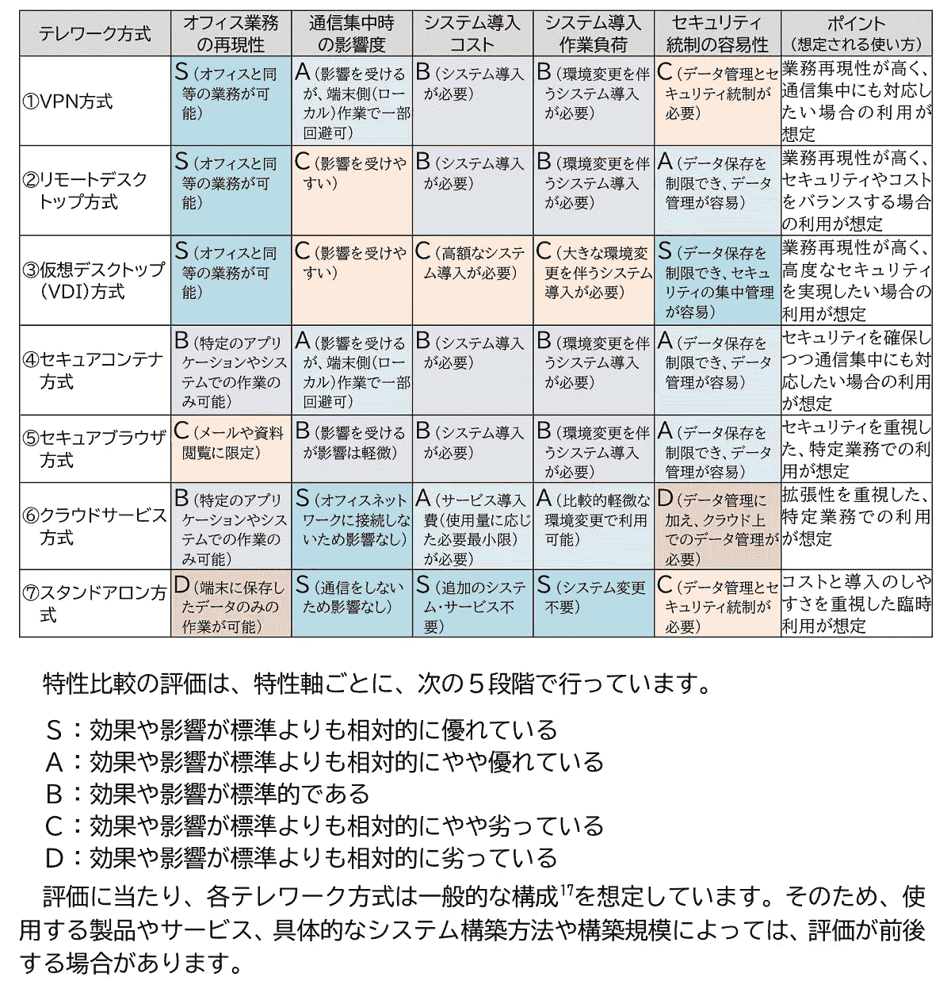
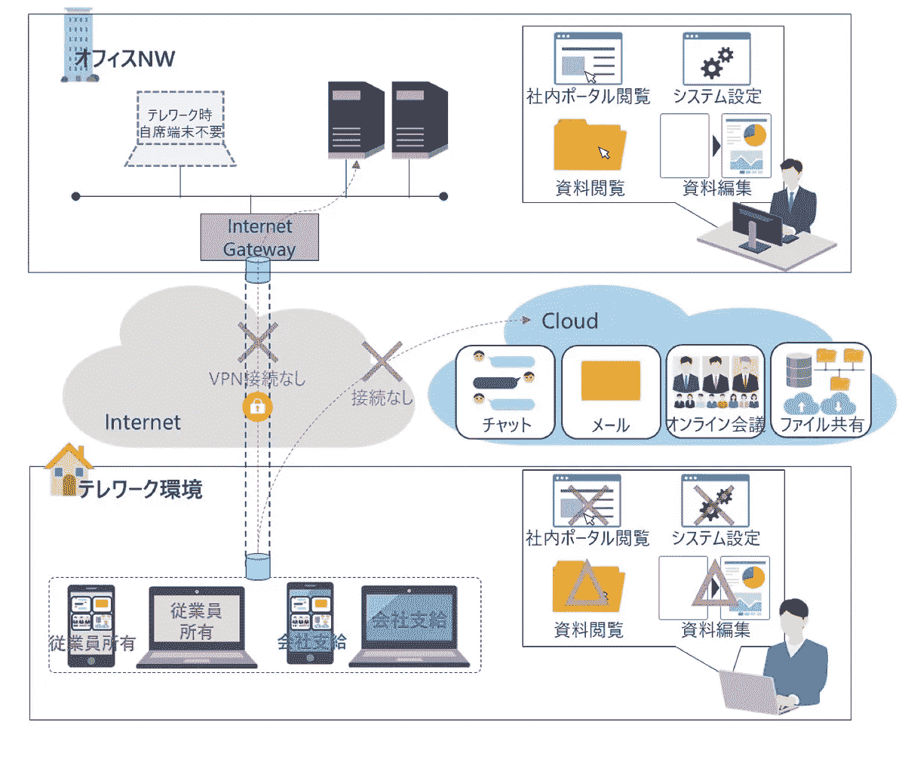
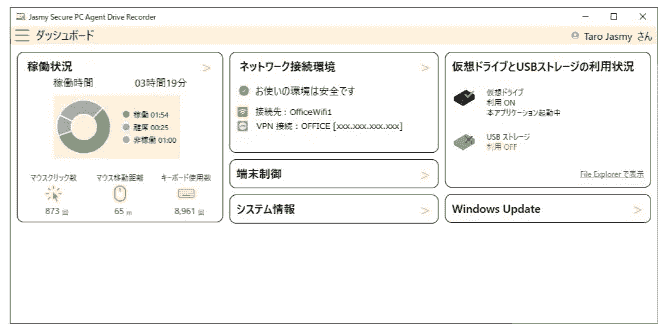

# 中小企业在家办公的“现实解决方案”。以可承受的成本满足指导原则。

> 原文：<https://medium.com/coinmonks/a-realistic-solution-for-smes-working-from-home-meet-the-guidelines-with-at-an-affordable-cost-e35e57f7bd59?source=collection_archive---------3----------------------->

(译自日本采访)

有几种方法可以实现远程办公。而中小企业在成本、负荷等方面方式受限。我们将通过在家工作的指导方针，探索低成本高效运作的方法。

**主要的远程工作方式存在成本等障碍**
安全措施在远程工作中显然很重要。科维德·疫情迫使公司适应在家工作，这使得一些公司在安全方面容易受到攻击。远程网络需要与办公室不同的安全措施，通常需要额外的财产投资。对于既没有时间也没有预算的中小型企业(SMEs)来说，这是一个很高的障碍。

总务省于 2021 年 5 月发布了“远程工作安全指南(第 5 版)”，为寻找实现安全远程网络而不产生成本的现实解决方案提供了线索。该指南解释了远程工作的基本考虑因素，并评估了各种远程工作方法的利弊。这是选择适合每个公司情况的远程工作方法的有用资料。

在《远程工作安全指南》中讨论的七种方法中，“独立方法”是中小型公司最容易实施的方法。根据《准则》的定义，“单机”并不意味着网络完全断开，而是被定位为只是不与办公网络连接的环境。

流行的远程网络方法是“VPN 方法”，它使用 VPN 连接到办公室，“远程桌面方法”，它使用远程桌面连接到公司的计算机，以及“VDI 方法”，它使用虚拟桌面(VDI)。

然而，所有这些方法都需要网络环境的基础设施、用于远程桌面的中继服务器和 VDI 环境，并且这些系统的成本是一个障碍。

这些方法严重依赖于设备的性能和容量。如果由于低规格导致处理速度变慢，业务运营可能会受到阻碍。此外，由于假设每台计算机始终连接到网络，因此它受每个员工的网络环境的影响很大。

**“独立方法”是一种低门槛的实施方式**
独立方法适用于难以对远程网络进行大量投资的中小型公司。

通常，“单机”指的是一台没有连接到网络的计算机，但是远程工作安全指南将其定义为“一种不连接到公司网络的远程工作方法”。换句话说，“来到办公室时将数据复制到公司的电脑上”，或者“以某种方式将数据带回家，在个人电脑上工作”。这样，远程办公可以立即开始，无需任何新的投资，充分利用现有的财产。

然而，很难期待一个没有任何互联网连接的商业环境。有在线订阅服务，如用于商业目的的电子邮件服务和群件。“我们推荐的是一个独立系统，它限制对办公网络的访问，但允许使用电子邮件和消息等云服务。Jasmy 软件开发主管 Takashi Hagiwara 说:“如果我们将它添加到总务省的远程工作安全指南中，我们可以称之为互联网连接的独立方法。

在这种结合了单机和云服务优点的远程工作方式中，安全控制比在唯一的单机方式中更高。但是，必须单独考虑将数据带出办公室的相关风险以及防止因终端丢失或被盗而导致数据泄露的措施。

Jasmy Secure PC 解决了这个问题。他们通过在计算机上安装专用代理来提供数据泄露对策和员工活动管理。Hagiwara 先生说:“通过将独立方法与 Jasmy Secure PC 相结合，我们可以提高远程工作安全指南的安全控制和其他方面的分数。具体来说，独立方法在“网络集中时的影响”、“系统实施成本”和“系统实施工作量”方面被评为“S”，我们认为在“安全控制的简易性”和“办公室操作的再现性”方面也有可能达到 B 级。

“使用介于‘云方法’之间的形式会更现实，在‘云方法’中，云服务仅用于有限的目的，例如允许使用电子邮件和聊天室等通信工具。Hagiwara 说:“使用 Jasmy Secure PC，您可以检查消息工具的活动，因此可以检查通信状态，并在必要时单独跟踪。”

**以单机方式在家工作+Jasmy Secure PC**
Jasmy Secure PC 通过以下三个功能加强在家工作时的安全控制。

首先我们来看《鬼驱》。这是安装代理时创建的专用数据区。该区域必须满足特定的访问条件，例如连接到预先注册的网络，这样可以防止在计算机被盗或丢失的情况下数据泄露。管理员还可以执行控制命令来锁定员工的计算机。

“当使用员工的个人电脑时，通过 USB 或其他方式带回家的数据只能存储在 ghost 驱动器上。对 ghost 驱动器的访问可以由来自控制命令的时间来限制。Hagiwara 说:“即使你与家人共享电脑，也不用担心你的儿子或女儿会在非办公时间查看 ghost drive 上的数据。

“远程处理功能”集中管理计算机上的信息，例如操作系统补丁的应用状态，因此可以检查计算机在远程工作期间是否处于良好状态。

“行车记录仪功能”，收集电脑活动历史，管理和保护他们在区块链。未经授权的操作也会被记录下来，从而有可能调查数据泄露的原因，并对未经授权的操作产生显著的威慑作用。

“当选择独立方法来降低成本时，您不会想花很多钱来获得额外的安全性。Hagiwara 说:“Jasmy Secure PC 没有初始成本，功能齐全的订阅版 Agent Pro 每月每台 440 日元(含税)，而远程检查用户计算机状态的管理器每月每 ID 2640 日元(含税)。

对于人力资源有限且难以进行大规模投资的公司来说，独立方法和 Jasmy Secure PC 的结合是远程工作的良好解决方案。

请注意，虽然独立方法不假设连接到办公网络，但用户可以根据总务省的指导方针使用互联网。因此，需要防病毒和其他预防措施。

“Jasmy Secure PC 可以加强安全控制，但这还不够。Hagiwara 说:“如果你从家里连接到互联网，仍然有感染病毒的风险，所以请使用计算机防病毒措施和预防措施。”

**解决在家工作期间的“沟通问题”**
在家工作期间，经理和他们的团队看不到彼此在做什么，因此有时会指出“不容易提问”、“不知道你周围发生了什么”、“如果负载平衡，理解起来很困难”等沟通问题。Jasmy Secure PC 也可以在这一点上帮助你。

“当员工在同一个办公室时，他们可以很容易地相互交谈，并随意分享问题。然而，在家工作时却不是这样，他们可能会感到更大的压力。管理人员需要检查他们团队的工作量，并采取后续行动。Hagiwara 说:“通过使用 Jasmy Secure PC 的行车记录仪功能，这应该会更容易。

小心！数据泄露风险比你想象的还要大
很多机密信息都包含在员工日常工作中接触到的数据中，比如设计架构、交易数据等。IT 专业人员需要警惕有针对性的攻击、勒索软件以及未经授权的数据删除。已经有几起日本公司因数据泄露而被起诉数十亿日元的案件。

根据日本经济产业省(Ministry of Economy，Trade and Industry)出版的《保护机密信息手册——提高企业价值》(Handbook for Protection of Confidential Information——to improving Corporate Value)，有五种对策:“控制访问”、“使其难以取出”、“确保可见性”、“提高对机密信息的认识”和“维持并提高信任度”。

Jasmy Secure PC 可以使用 ghost 驱动器和管理命令控制对机密数据的访问，还可以监控可疑的行为，如取出数据。除了可见性之外，员工和管理员还可以确保他们了解作为一个组织的信息管理。此外，由于基于可视化信息也促进了通信，所以它可以有效地作为对抗数据泄露的对策。

随着远程工作和云计算的普及，安全措施变得越来越重要。对于难以实施大规模 IT 产品的公司，从小处着手是值得的。