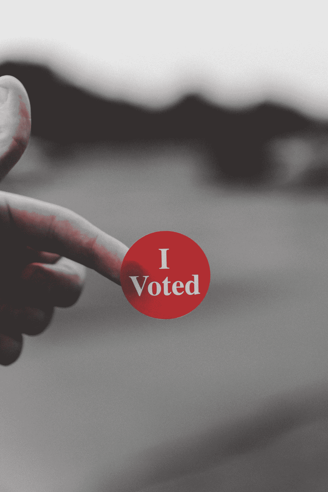

# 民主的一场革命“区块链”

> 原文：<https://medium.com/coinmonks/a-revolution-in-democracy-blockchain-3e62fae67c33?source=collection_archive---------33----------------------->

**简介**

技术在飞速发展，并通过在背后添加我们的生活来改变我们的生活。虽然有人称之为变革，但我想把这种始于技术的变革称之为革命。内燃机发明之后，蒸汽机革命之后，然后是电，互联网技术突然成为我们生活的中心。我们现在可以通过点击一个按钮，在机构和分支机构进行交易，互联网银行或电子政府，我们不再需要去学校接受教育，我们可以在家里通过我们的智能设备接受教育。现在，各州不需要使用成吨成公斤的纸张和印刷货币，他们只需轻轻一点就可以印刷数十亿美元，并立即推出虚拟货币。但是，我们生活中的一切已经能够如此适应互联网革命了吗，例如，民主对这场革命的适应程度如何，选举现在可以在网上举行吗？那些由各州印刷的加密货币有多安全，或者我只需点击一下鼠标就能进行的资金转移和金融市场交易有描述的那么安全吗？

Photo by [Hitesh Choudhary](https://unsplash.com/@hiteshchoudhary?utm_source=medium&utm_medium=referral) on [Unsplash](https://unsplash.com?utm_source=medium&utm_medium=referral)

**区块链技术**

区块链提供了网络中交易的永久记录。它类似于系统数据库，但使用分散的分类账而不是传统的端到端分类账，允许网络中的每个参与者拥有自己的分类账副本，并能够查看所有交易。每个块都受到与前一个块相关联的加密引用的保护，因此攻击或破解系统相当困难。

我们可以把区块链想象成这样一个世界，在这里，每一份合同、每一笔交易、每一份工作和每一笔支付都被数字化地记录和签署，并被识别、验证、存储和共享。区块链的每一步都是透明和安全的，因为该系统的每一项变革都需要协商一致。这确保了系统的高度可靠性，消除了风险和对中介的需求。

**电子投票**

爱沙尼亚是第一个使用电子投票系统的国家，欧洲自 2000 年以来一直在测试该系统。爱沙尼亚公民在 2005 年通过他们的芯片身份证进入投票网站并投票。在这些选举中，通过互联网投票的人超过了 33%。在随后举行的选举中，爱沙尼亚公民可以通过带有 sim 卡的移动设备投票。继爱沙尼亚之后，尽管人口过剩，电子投票也在其他欧洲国家、加拿大、甚至印度进行。让公民和政府担心的不是电子投票，相反，电子投票节省了时间和金钱，并提高了选举参与率。令人关切的是这些选举的安全和参加选举的机会。公民是否只与该系统连接一次，他们在投票后是否有机会撤回他们的选票，将采用何种进入程序，这一程序有多安全，最重要的问题是，如何确保这些选票的保密性，如何防止他们被操纵？

Photo by [Parker Johnson](https://unsplash.com/@pkripperprivate?utm_source=medium&utm_medium=referral) on [Unsplash](https://unsplash.com?utm_source=medium&utm_medium=referral)

**用于和可用于电子投票的系统**

目前正在讨论两种电子投票系统。一个是集中式系统，在该系统中，每次投票后收集的数据都创建在一个中央数据库上，另一个是通过区块链创建的系统，每个链都是一个中心。在上面的段落中，我提到了对电子投票和这一过程的关注，其中最重要的关注是安全性。讨论这一问题的专家认为，建立在中央系统上的电子投票会产生安全漏洞。单个数据库和系统能在多大程度上抵御网络攻击？这就是另一个系统发挥作用的地方，区块链。

**基于区块链基础设施的电子投票系统**

在上面的段落中，我简要地解释了区块链的工作逻辑。将在具有该基础设施的电子投票系统中投票的公民将通过他们的电子芯片 ID 卡或仅他们自己的生物特征数据进入。一旦他们进入系统，投下他们的票，并保存，他们将没有机会再次使用它。当投票过程在系统中发生时，一个环将被添加到链中，并通过处理其自己的数据连接到前一个环，并且该过程将对每次投票重复进行。这样所有的环都会承载前后环的数据，就好像是一个中心一样。为了攻击具有区块链基础设施的电子投票系统，必须攻击所有的环，因为每个环包含它之前和之后的数据，就好像它是一个中央系统一样。同时攻击所有的环并捕获或改变这些数据是不可能的，因为每个环本身就是一个中心，因此，专家认为电子投票中的安全问题可以用区块链技术来解决。

Photo by [Clay Banks](https://unsplash.com/@claybanks?utm_source=medium&utm_medium=referral) on [Unsplash](https://unsplash.com?utm_source=medium&utm_medium=referral)

**结论**

中国有句谚语说:"*当变革之风开始吹起时，有些人建造围墙，有些人建造风车."科技已经成为我们生活的一场革命。我们要么建一堵墙，徒劳地反对这场革命，要么用风车来利用这场革命。技术伴随着美带来了善和危险，它将带来的重要事情是能够用那些美消除危险。电子投票系统不仅为各州节省了金钱和时间，在选举中提供了高投票率，但也带来了安全威胁；我们需要做的是利用技术带给我们的创新和美丽，并再次消除技术带来的危险…*

[*你可以访问链接阅读土耳其语的文章……*](https://www.ikonionhukukvekariyerdernegi.com/post/demokraside-bir-devrim-blok-zinciri)

**参考文献**

1.  [基于区块链技术的安全数字投票系统，卡希夫·梅赫布·罕/穆罕默德·穆巴希尔·汗(奈德工程技术大学)，朱奈德·阿尔沙德(西伦敦大学)](https://core.ac.uk/download/pdf/155779036.pdf)
2.  [面向数字政府的区块链，JRC 政策科学报告，欧盟委员会](https://publications.jrc.ec.europa.eu/repository/handle/JRC115049)
3.  [https://www . gov tech . com/blogs/lohr Mann-on-cyber security/could-爱沙尼亚-be-the-model-for-secure-online-voting . html](https://www.govtech.com/blogs/lohrmann-on-cybersecurity/could-estonia-be-the-model-for-secure-online-voting.html)
4.  [https://www . Unilever . com . tr/news/news-and-features/2019/block-chain-nedir . html](https://www.unilever.com.tr/news/news-and-features/2019/block-zinciri-nedir.html)

> *加入 Coinmonks* [*电报频道*](https://t.me/coincodecap) *和* [*Youtube 频道*](https://www.youtube.com/c/coinmonks/videos) *了解加密交易和投资*

# 另外，阅读

*   [AscendEx Staking](https://coincodecap.com/ascendex-staking)|[Bot Ocean Review](https://coincodecap.com/bot-ocean-review)|[最佳比特币钱包](https://coincodecap.com/bitcoin-wallets-india)
*   [霍比评论](https://coincodecap.com/huobi-review) | [OKEx 保证金交易](https://coincodecap.com/okex-margin-trading) | [期货交易](https://coincodecap.com/futures-trading)
*   [比特币基地赌注](https://coincodecap.com/coinbase-staking) | [热点评论](/coinmonks/hotbit-review-cd5bec41dafb) | [库币评论](https://coincodecap.com/kucoin-review)
*   购买 Dogecoin 的 7 种最佳方式
*   [iTop VPN 审查](https://coincodecap.com/itop-vpn-review) | [曼陀罗交易所审查](https://coincodecap.com/mandala-exchange-review)
*   [比特币基地 vs 瓦济克斯](https://coincodecap.com/coinbase-vs-wazirx) | [比特鲁点评](https://coincodecap.com/bitrue-review) | [波洛涅克斯 vs 比特克斯](https://coincodecap.com/poloniex-vs-bittrex)
*   [美国最佳加密交易机器人](https://coincodecap.com/crypto-trading-bots-in-the-us) | [经常性回顾](https://coincodecap.com/changelly-review)
*   [A-Ads 审查](https://coincodecap.com/a-ads-review) | [Bingbon 审查](https://coincodecap.com/bingbon-review) | [Mudrex 投资](https://coincodecap.com/mudrex-invest-review-the-best-way-to-invest-in-crypto)