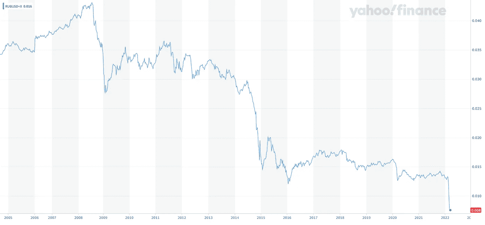
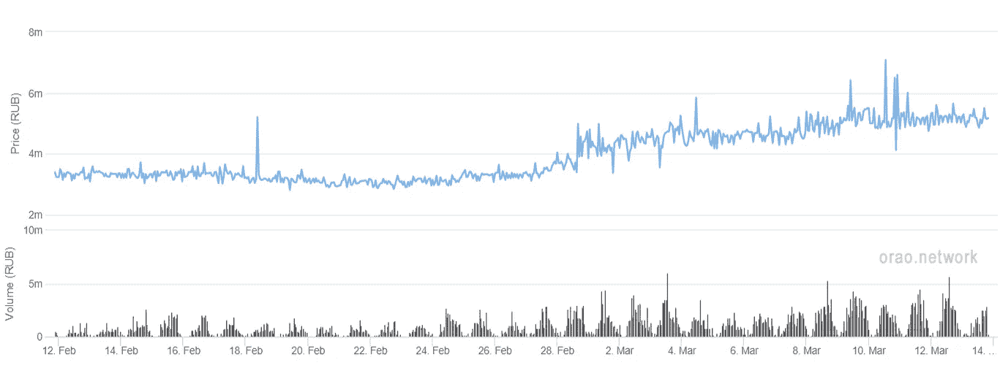
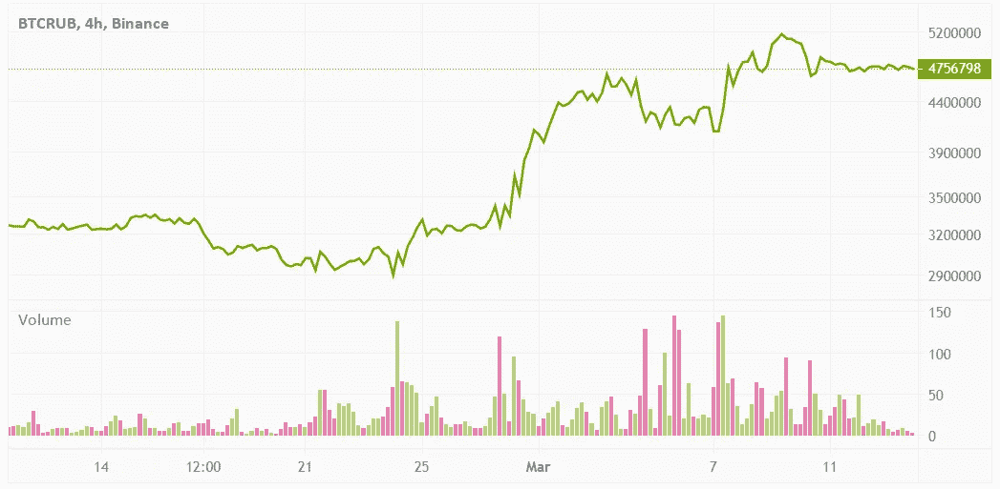

# 俄罗斯卢布神谕

> 原文：<https://medium.com/coinmonks/a-russian-ruble-oracle-d8a07427afa?source=collection_archive---------3----------------------->

Russian Ruble to USD exchange rate

在过去的两周里，一个人不得不与外界完全隔绝，不知道乌克兰发生了什么，也不知道世界是如何联合起来制裁弗拉基米尔·普京领导的俄罗斯联邦的。

2022 年开始于对通货膨胀的恐惧和中央银行宣布并提高利率。我们目睹了几乎所有东西的价格稳步上涨。今年年初，俄罗斯已经通过 9.5%的央行利率来对抗通胀，而德国的负利率为-0.88%，美国为 0.25%。2022 年 2 月 24 日星期四，俄罗斯继续入侵乌克兰的日子(2014 年克里米亚之后)，许多国家开始制裁俄罗斯经济的不同部分，导致俄罗斯卢布损失 20%。俄罗斯中央银行试图用数千亿欧元和美元来捍卫他们的货币，随着消息的传播，俄罗斯银行在欧洲的客户开始了银行挤兑，导致其中一些被出售，这就是克罗地亚储蓄银行的情况。随着战争的持续和跨大西洋联盟的日益强大，大多数俄罗斯银行被 SWIFT 拒之门外——这是一种潜在的“API”，我们称之为“电汇”，导致俄罗斯卢布在此前 20%的损失基础上贬值 30%。俄罗斯政府对外币提款施加限制，银行使这些限制更加严格，产生了出售加密资产的压力。

对于一个用俄罗斯卢布计算交易的加密交易员来说，这是一个大问题——因为每个俄罗斯公民都经历过杂货店每天调整价格，在许多情况下每天调整几次。早上卖 100 卢布的东西，到了午餐时间就卖到 120 卢布了。

唯一(相当)流动的销售加密货币的市场是 BTC 和 ETH 通过 P2P 和币安。后者将提供 Advcash 和 Payeer 将俄罗斯卢布转入银行账户，但流动性有限。这也将伴随着最低 2%的费用。

Peer to Peer BTC/RUB

从点对点图表中可以看到，比特币的交易量超过了 600 万卢布。

Binance BTC/RUB

除了一般的上升趋势，价格飙升并不相关。虽然点对点交易超过了 620 万卢布兑换 1 BTC，但币安交易员的最高交易价格为 525 万卢布兑换 1 BTC。随着更多制裁的实施和卢布贬值，提供卢布流动性将变得更加困难。

那么，对于俄罗斯密码交易员来说，他们信任哪家甲骨文公司呢？随着 oracles 目前在主要 dApps 上的使用，交易商只能希望定价提供商将达到动态汇率、卢布流动性、上坡道和下坡道定价的标准，而所有这些提供商都没有利用明显的套利机会。

ORAO 可以提供考虑到所有这些方面的定制 oracle。BTC/RUB 利率、美元/RUB 利率、入口和出口的流动性可用性。我们之前已经讨论过[定制的甲骨文](https://orao.medium.com/creating-project-specific-oracles-in-minutes-7dc78c307b0b)，并深入探讨了定价问题。

__________________________________________________________________

**P.S .有趣的事实:**
随着俄罗斯卢布目前的下跌趋势，在几个西方国家，把它用作卫生纸会比实际的卫生纸更便宜。

从卢布到瓦砾…

在[推特](https://twitter.com/OraoNetwork)上关注我们。

> *加入 Coinmonks* [*电报频道*](https://t.me/coincodecap) *和* [*Youtube 频道*](https://www.youtube.com/c/coinmonks/videos) *了解加密交易和投资*

# 另外，阅读

*   [Bookmap 评论](https://coincodecap.com/bookmap-review-2021-best-trading-software) | [美国 5 大最佳加密交易所](https://coincodecap.com/crypto-exchange-usa)
*   最佳加密[硬件钱包](/coinmonks/hardware-wallets-dfa1211730c6) | [Bitbns 评论](/coinmonks/bitbns-review-38256a07e161)
*   [新加坡十大最佳加密交易所](https://coincodecap.com/crypto-exchange-in-singapore) | [购买 AXS](https://coincodecap.com/buy-axs-token)
*   [红狗赌场评论](https://coincodecap.com/red-dog-casino-review) | [Swyftx 评论](https://coincodecap.com/swyftx-review) | [CoinGate 评论](https://coincodecap.com/coingate-review)
*   [投资印度的最佳密码](https://coincodecap.com/best-crypto-to-invest-in-india-in-2021)|[WazirX P2P](https://coincodecap.com/wazirx-p2p)|[Hi Dollar Review](https://coincodecap.com/hi-dollar-review)
*   [加拿大最好的加密交易机器人](https://coincodecap.com/5-best-crypto-trading-bots-in-canada) | [库币评论](https://coincodecap.com/kucoin-review)