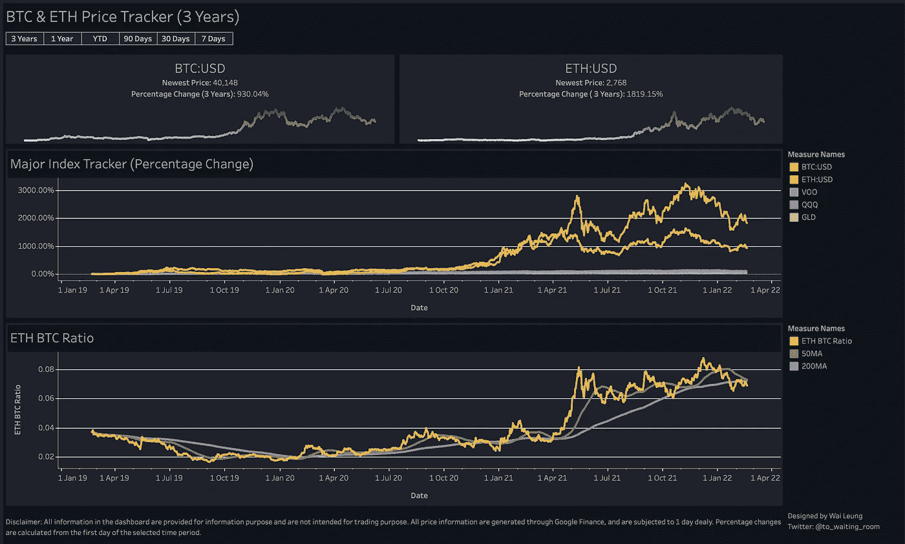
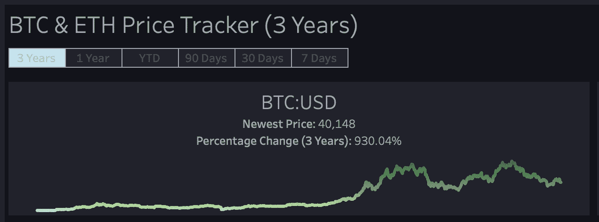
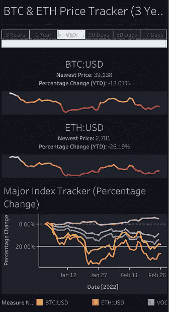
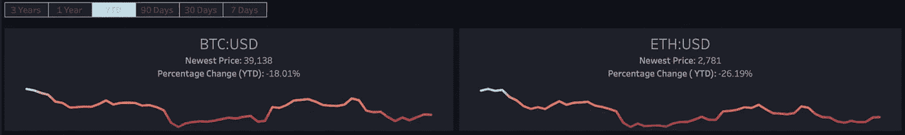
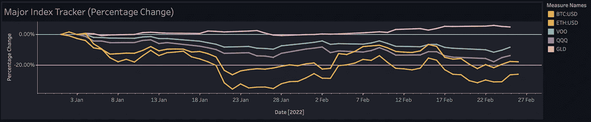
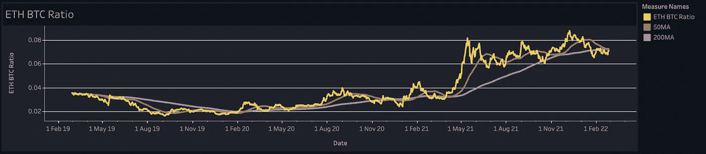
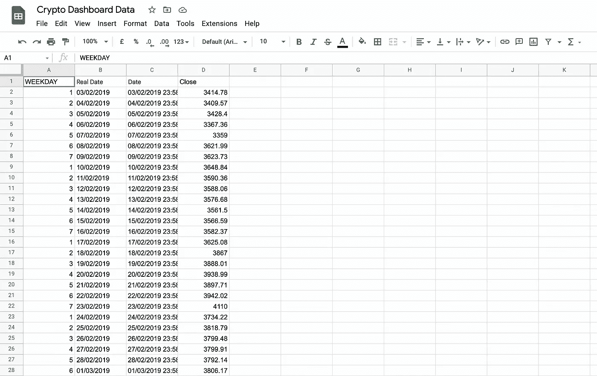
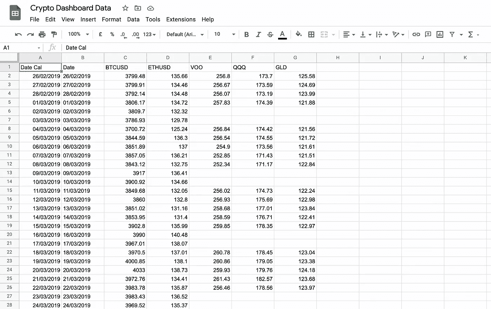
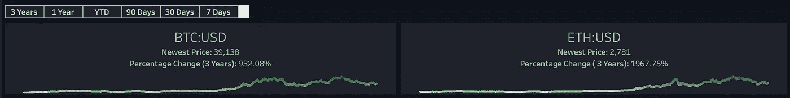

# 比特币和以太坊长期价格变化的简单仪表板(Google Sheets 和 Tableau)

> 原文：<https://medium.com/coinmonks/a-simple-dashboard-for-long-term-price-changes-of-bitcoin-and-ethereum-google-sheets-and-tableau-b20e583f7ec?source=collection_archive---------14----------------------->

Photo by [Thought Catalog](https://unsplash.com/@thoughtcatalog?utm_source=unsplash&utm_medium=referral&utm_content=creditCopyText) on [Unsplash](https://unsplash.com/?utm_source=unsplash&utm_medium=referral&utm_content=creditCopyText)

# 为什么？

加密货币支持者通常将主要加密货币宣传为“插入报价”

自从我了解加密货币以来，我发现自己不断在 TradingView 的图表之间切换，以观察比特币和以太坊的长期表现，试图评估这一论点是否会随着时间的推移得到验证。虽然我只使用 TradingView 的免费版本，但这不仅仅是一次点击的任务。

(我对在订阅服务上花钱非常谨慎，我感觉现在每个公司都在试图从我们每个月的薪水中赚钱。)

因此，我建立了一个仪表板，通过与主要金融指标的比较来跟踪比特币和以太坊的表现，让我的常规任务变得简单了一些。

# 我做的仪表板

长话短说，这里有一些仪表盘的截图:

Whole view of the dashboard

It has interactive function and mobile view too :)

或者，如果您想查看原始仪表板，请单击以下链接:

[https://public . tableau . com/app/profile/wai . leung/viz/BTCETHLong-terpricetracker/dashboard 1](https://public.tableau.com/app/profile/wai.leung/viz/BTCETHLong-termPriceTracker/Dashboard1)

我知道你可能认为仪表盘看起来太简单了，以下是一些原因:

*   这意味着很简单:我只是使用这个仪表板来观察长期的价格变化，而不是我是否应该在特定的时间购买或出售特定的密码，因此我不需要在仪表板上有很多技术指标。
*   目前，我正在使用 Google Sheets 的 GoogleFinance 功能来生成所有的财务数据，一些信息(如 cryptos 的交易量)无法使用该功能。还有，我也想过把通货膨胀率和债券收益率放到图表里，以后可能会这么做。

以下是对仪表盘内容的解释:

*   按钮，以便更好地查看所选时间范围
*   小图表显示比特币和以太币的价格变化，没有任何干扰(颜色变化表明价格是高于还是低于所选时间段的起始价格点)
*   主要指数追踪器:以百分比追踪比特币和以太坊的价格变化，比较追踪标普 500 指数(VOO)、纳斯达克 100 (QQQ)和黄金价格(GLD)的 ETF
*   BTC 以太网比率:与比特币相比，跟踪以太坊的价格强度，我还添加了 2 条移动平均线，以更好地了解趋势
*   百分比差异始终使用选定的时间范围进行计算(即，如果产品在第一个日期的价格为空，则该产品的百分比差异将使用下一个非空日进行计算)

# 我如何阅读图表

使用年初至今视图，我们可以看到比特币和以太坊今年表现不佳:

使用相同的观点，我们可以看到比特币和以太坊在选定的产品中表现最差，黄金仍然是自年初以来唯一一个增长率为正的产品，也许现在说比特币或任何其他密码将成为数字黄金还为时过早:

看看最近三年 ETH BTC 比率的变化，以太坊的表现从 2021 年 5 月开始回升:

# 我是如何构建仪表板的

为了构建这个仪表板，我使用 Google Sheets 通过内置的 GoogleFinance 功能获得了我需要的所有数据，然后将文件连接到 Tableau 软件进行可视化。我还将 Tableau 软件设置为每天自动刷新，以从 Google Sheets 文件中获取新数据。

## 废弃数据

如前所述，所有定价数据都是使用 Google Sheets 内置的 GoogleFinance 函数生成的，基本公式如下

> =GOOGLEFINANCE("BTCUSD "，" price "，TODAY()-1120，TODAY()，" DAILY ")

我在 Google Sheets 文件上为列出的所有 Cryptos 和 ETF 创建了单独的表。每张纸看起来都与这张纸相似:

Google Sheets to generate pricing data

我使用 WEEKDAY 列来快速验证从 GoogleFinance 函数返回的数据，并且我还在 Real date 列上使用 LEFT 函数从 GoogleFinance 在 Date 列上的结果生成干净的日期数据。

作为数据收集过程的补充说明，如上所述，我曾考虑在仪表板中包含交易量变化趋势，但 GoogleFinance 目前无法返回 cryptos 的交易量。我试图寻找其他解决方案，并发现了这个 Google Sheets 扩展，它通过 API 交互从 CoinGecko 中提取数据:

 [## Google Sheets 和 Excel 中的 CoinGecko 价格、交易量和市值

### 对于任何希望从 CoinGecko 中自动提取数据的人。

medium.com](/the-cryptocurious/coingecko-prices-volumes-market-caps-in-google-sheets-and-excel-a1a3ee201cb8) 

然而，由于 CoinGecko 方面的限制，它对于仪表板的目的来说似乎并不可靠。但将来，我可能会深入研究 API 交互，看看是否能得到不同的结果。

## 合并表格

Merged table

我使用 VLOOKUP 函数和一些附加函数将各个工作表合并成一个表格。

在 Date Cal 列中有两个不同的公式，我在单元格 A2 中使用了以下公式来返回 3 年前的日期:

> =EDATE(今日()-1，-36)

然后，该列的以下单元格使用类似的公式返回到今天为止的日期:

> =IF($A2<today></today>

因为 VLOOKUP 无法识别 date Cal 列中的日期，所以我添加了一个 Date 列，使用 LEFT 函数从 Date Cal 列中提取日期，然后从 C 列开始，我将 IFERROR 函数与 VLOOKUP 结合使用，因此，在 VOO、QQQ 和 GLD 列中，与股市收盘日期(周末和节假日)相关的单元格返回空值，而不是错误。

## 用 Tableau 可视化数据

*   交互式日期视图

为了更好地查看不同时间框架下的价格变化，就像大多数股票仪表板提供的那样，我通过将 Tableau 中的参数与外部 google sheets 文件链接起来，创建了一个按钮函数。

*   图表

仪表板中的所有图表都是普通的线形图，最棘手的部分是在主要指数跟踪器中。因为 Cryptos 价格每天都会返回，这与同一图表中引用的普通 ETF 不同，所以我结合了以下计算字段，以便始终根据所选时间段内返回的第一个价格返回百分比变化:

> **1。在 ETF 列中搜索非空值(插入图片)**
> 
> 如果不是 isnull(sum([VOO])，则 index()结束
> 
> **2。在 ETF 表中寻找第一个非空值(插入图片)**
> 
> 最小窗口([VOO 非空])
> 
> **3。根据第一个非空值**计算百分比差值
> 
> (SUM ([VOO])- LOOKUP (SUM ([VOO])，
> 
> ([VOO 第一非空]-index())))/
> 
> ABS (LOOKUP (SUM ( [VOO])，([VOO 第一非空]-index()))

另一个棘手的部分是将 ETH 和 BTC 的最新价格和价格变化(百分比)作为文本返回到前两个图表中，因为在 Google Sheets 文件中返回最新价格有延迟。我确保始终根据最新的非空值计算百分比变化，使用类似于上一部分的概念:

> **1。在 Cryptos 列中寻找非空值**
> 
> 如果不是 isnull(sum([Btcusd])，则 index() end
> 
> **2。在 Cryptos 列中寻找第一个和最后一个非空单元格**
> 
> **2a。第一个非空值**
> 
> WINDOW_MIN([Btc 非空])
> 
> **2b。最后一个非空值**
> 
> WINDOW_MAX([Btc 非空])
> 
> **3。返回密码的最新价格**
> 
> LOOKUP (SUM ( [Btcusd])，([Btc Last non empty ]-index()))
> 
> **4。根据最新的非空值返回百分比变化**
> 
> (LOOKUP (SUM ([Btcusd])，
> 
> ([Btc 最后一个非空]-index())) -
> 
> LOOKUP (SUM ([Btcusd])，
> 
> ([Btc First non empty]-index())))/
> 
> ABS (LOOKUP (SUM ( [Btcusd])，([Btc First non empty]-index()))

其他大部分作品只是标准的画面拖放。

# 最后的话

我在过去几个月才开始使用 Tableau，所以我的解决方案可能不是实现结果的最聪明/最干净的方式。如果你想出了一个更好的方法来构建类似的功能，请随时留下评论。

感谢阅读，特别感谢所有在线提供 Tableau 教程的人，我参考了很多资源，所以我不能在这里列出它们，但如果没有在线社区，我将很难完成这个仪表板。

干杯 datafam:)

> *免责声明:本文和仪表盘仅供参考，不用于交易目的。*

> *加入 Coinmonks* [*电报频道*](https://t.me/coincodecap) *和* [*Youtube 频道*](https://www.youtube.com/c/coinmonks/videos) *了解加密交易和投资*

# 另外，阅读

*   [Bookmap 评论](https://coincodecap.com/bookmap-review-2021-best-trading-software) | [美国 5 大最佳加密交易所](https://coincodecap.com/crypto-exchange-usa)
*   最佳加密[硬件钱包](/coinmonks/hardware-wallets-dfa1211730c6) | [Bitbns 评论](/coinmonks/bitbns-review-38256a07e161)
*   [新加坡十大最佳加密交易所](https://coincodecap.com/crypto-exchange-in-singapore) | [购买 AXS](https://coincodecap.com/buy-axs-token)
*   [红狗赌场评论](https://coincodecap.com/red-dog-casino-review) | [Swyftx 评论](https://coincodecap.com/swyftx-review) | [CoinGate 评论](https://coincodecap.com/coingate-review)
*   [投资印度的最佳密码](https://coincodecap.com/best-crypto-to-invest-in-india-in-2021)|[WazirX P2P](https://coincodecap.com/wazirx-p2p)|[Hi Dollar Review](https://coincodecap.com/hi-dollar-review)
*   [加拿大最佳加密交易机器人](https://coincodecap.com/5-best-crypto-trading-bots-in-canada) | [库币评论](https://coincodecap.com/kucoin-review)
*   [用于 Huobi 的加密交易信号](https://coincodecap.com/huobi-crypto-trading-signals) | [HitBTC 审查](/coinmonks/hitbtc-review-c5143c5d53c2)
*   [如何在 FTX 交易所交易期货](https://coincodecap.com/ftx-futures-trading) | [OKEx vs 币安](https://coincodecap.com/okex-vs-binance)