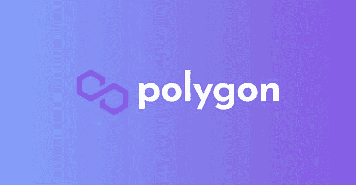
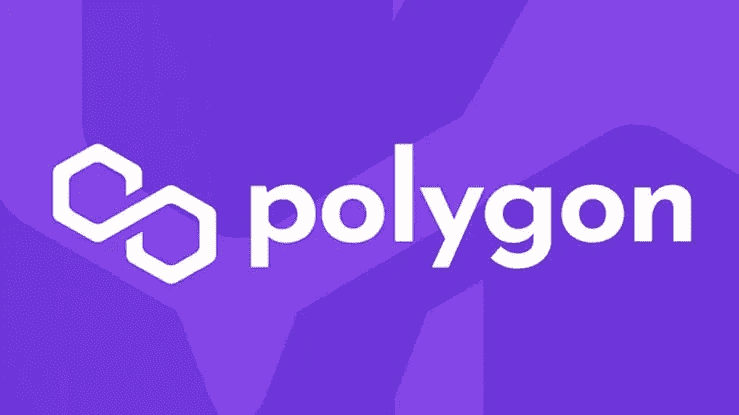
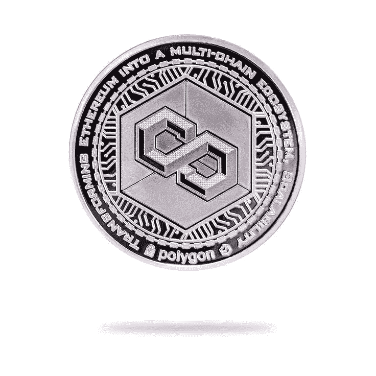
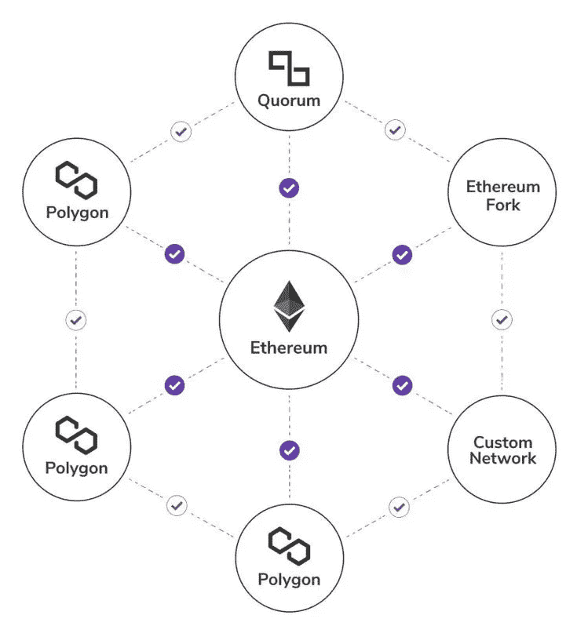
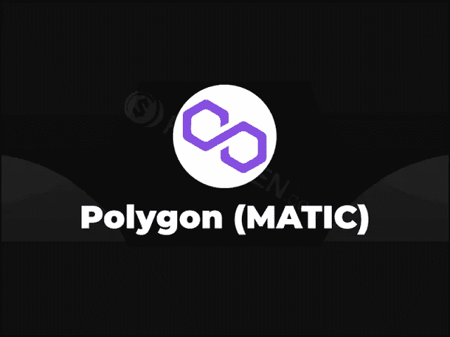

# 多边形的简单介绍

> 原文：<https://medium.com/coinmonks/a-small-intro-to-polygon-2e43632fb06f?source=collection_archive---------5----------------------->

为什么多边形值得我们花时间，今天我们就来讨论一下。最近 Polygon 经历了一个繁荣期，其不断增长的市场背后有各种各样的原因。Polygon 也被称为“以太坊的区块链互联网”,提供很多东西。今天，我们不会深入探讨它的体系结构，但我会向您介绍它的技术，以及为什么它会改变游戏规则。

**所以，首先，我们来讨论一下它的历史。**

# 历史

前身为 MATIC Network，于 2017 年 10 月上线。Polygon 是由 Jaynti Kanani、Sandeep Nailwal 和 Anurag Arjun(两位经验丰富的区块链开发人员和一位业务顾问)共同创建的印度初创公司。

在 Jaynti Kanani 注意到以太坊上由于 [CryptoKitties](/coinmonks/nfts-and-history-behind-their-creation-8436c8be9f6a) 一个受欢迎的 NFT 项目而产生的大量拥塞和可伸缩性问题之后。他决定联系区块链的开发人员和企业家 Sandeep Nailwal，以及 Polygon 唯一的非程序员联合创始人 Anurag Arjun。2017 年，Jaynti 本人作为数据科学家在 Housing.com 工作。他们中的三个人凭借之前的经验继续创办了 MATIC，从孟买开始他们早期的运营。

# 多边形

Polygon 一直在为开发人员解决他们通常在以太坊网络上面临的三大挑战。首先是低事务吞吐量，基本上以太坊每秒只能处理 30 个事务，与每秒 257 个事务的 Cardono 和每秒 65，000 个事务的 Solana 相比，这是非常低的。其次，以太坊网络不是那么用户友好，而且非常昂贵。第三，开发者的选择非常有限。

接下来是多边形网络，一个用于构建和连接以太坊兼容的区块链的协议和框架。

**那么，多边形到底是什么？**

Polygon 是一个第二层缩放解决方案，其主要目的是通过连接区块链来增加 Defi 工具和应用程序。

> **第二层缩放解决方案**
> 
> **基于公共区块链构建的一套解决方案，用于扩展其可扩展性和效率，尤其是针对微交易或操作。**

一个旨在创建“**以太坊的区块链互联网**”的平台，一个兼容以太坊的区块链多链生态系统。通过在以太坊上应用扩展解决方案和创建多链以太坊生态系统来构建和连接兼容以太坊的区块链网络的协议和框架。它的目标是通过提供一个简单易用的框架来实现，通过这个框架开发者可以很容易地启动他们定制的以太坊兼容的区块链。

# 技术

> Polygon ' s Light paper”——有了 Polygon，任何项目都可以有它专用的、优化的以太坊实例，它结合了独立的区块链和以太坊的最佳特性。此外，这些区块链与所有现有的以太坊工具兼容，可以在它们之间和以太坊之间交换消息。”

Polygon 的 [proof-of-stak](https://eth.wiki/en/concepts/proof-of-stake-faqs) e(PoS)网络允许开发人员以非常低的费用运行他们的区块链，并提供高交易速率，即在单个侧链上每秒 65，000 次交易，而所有事情都在 Etheruem 主链上完成。通过这种方式，开发商不必担心高气费或低交易率，也提供了更好的用户体验。另外，在多边形上建筑和在以太坊上建筑非常相似。此外，它支持以太坊虚拟机(EVM ),并使连接的链能够保持自我主权安全，同时还确保彼此之间以及以太坊主链之间的互操作性。

Polygon 支持两种主要类型的以太坊兼容区块链网络:**独立网络**和利用“**安全即服务”的网络**

简而言之，独立网络是完全独立的以太坊兼容的区块链网络，主要是具有既定项目和强大社区的企业网络。这些网络对它们自己的安全性完全负责，也就是说，它们有自己的验证者投票。而利用“安全即服务”的安全链没有验证器轮询。该服务可以由以太坊直接提供(通过欺诈证明或有效性证明),也可以由一群专业验证者提供。

他们将自己从 MATIC 更名为 Polygon，但他们的原生公用令牌仍被称为 MATIC，用于支付天然气费和扩展 Polygon 上的 Defi 生态系统。

# 还有什么？

Polygon 一直在解决开发人员通常在以太坊网络上面临的许多问题，朝着他们提供的工具和框架的愿景努力，这有助于开发人员推出超级可扩展和高性能的区块链，让开发人员仅在 30 分钟内扩展他们的 Dapps。

目前，有超过 7000 个 Dapps 在 Polygon 上运行。凭借他们提供的所有功能和解决方案，开发人员可以轻松地选择 Polygon 来测试或运行他们的区块链和 Dapps。

嘿，感谢你的阅读，希望你能学到一些有价值的东西。

在 Twitter 上关注我 [@_NejiLee](https://twitter.com/_NejiLee?t=3mpivSdY5hUn8t9lHBVvcA&s=09)

> 加入 Coinmonks [电报频道](https://t.me/coincodecap)和 [Youtube 频道](https://www.youtube.com/c/coinmonks/videos)了解加密交易和投资

## 也阅读

 [## 杠杆代币[多头代币]终极指南

### 杠杆化令牌是具有杠杆化风险敞口的 ERC20 令牌，不考虑保证金、要求、管理…

medium.com](/coinmonks/leveraged-token-3f5257808b22)  [## 最佳加密交易所| 2022 年十大加密货币交易所| CoinCodeCap

### 哪一个是最好的加密交换？在本文中，我们将根据多种加密货币列出 10 大加密货币交易所

coincodecap.com](https://coincodecap.com/crypto-exchange)  [## 2022 年最佳加密交换平台| CoinCodeCap

### 随着时间的推移，我们大多数人将转向 dex 以获得更好的安全性和隐私。因此。在这里，我们将讨论…

coincodecap.com](https://coincodecap.com/best-swap-platforms)  [## 10 大最佳在线赌场|赢得并赢取免费 BTC 2022 | CoinCodeCap

### 接收、支付和赚取加密货币| |有各种各样的最佳在线赌场可供选择，有可能…

coincodecap.com](https://coincodecap.com/best-online-casinos)  [## 2021 年最佳加密借贷平台| 6 大比特币借贷平台

### 获得比特币和其他加密货币的最佳贷款利率

medium.com](/coinmonks/top-5-crypto-lending-platforms-in-2020-that-you-need-to-know-a1b675cec3fa)  [## 2021 年 6 大最佳硬件钱包|顶级加密硬件钱包[更新]

### 最好的加密货币硬件钱包是绝对必要的。我们将在 NGRAVE、Ledger Nano X 和…

medium.com](/coinmonks/the-best-cryptocurrency-hardware-wallets-of-2020-e28b1c124069)  [## 加密交易机器人——19 款最佳免费加密交易机器人

### 2022 年币安、比特币基地、库币和其他密码交易所的最佳密码交易机器人。四进制，位间隙…

medium.com](/coinmonks/crypto-trading-bot-c2ffce8acb2a)  [## 最佳 4 个加密交易信号电报通道

### 这是乏味的找到正确的加密交易信号提供商。因此，在本文中，我们将讨论最好的…

medium.com](/coinmonks/best-crypto-signals-telegram-5785cdbc4b2b)  [## Bitsgap 评论-交易机器人加密信号和套利 2022

### 这篇文章的重点是 Bitsgap 审查，这是一个最终的交易解决方案，并提供交易机器人，信号…

coincodecap.com](https://coincodecap.com/bitsgap-review)