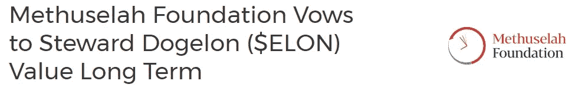
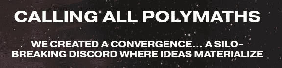
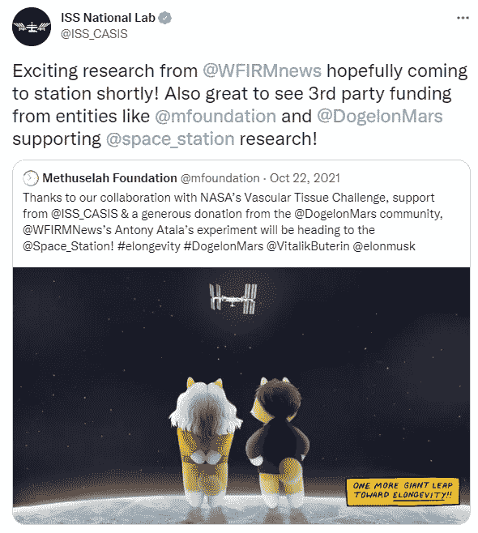

# 长寿的一小步

> 原文：<https://medium.com/coinmonks/a-small-step-for-elongevity-54b11844e72e?source=collection_archive---------2----------------------->

几个月来，Dogelon Mars 的持有者们一直在关注着最大的鲸鱼——玛士撒拉基金会。在 [$ELON](https://coinmarketcap.com/currencies/dogelon/) 社区内，人们纷纷猜测，长寿非营利组织将如何利用[维塔利克·布特林在 2021 年 5 月](https://elongevity.gitbook.io/discord_elongevity/amicus-token-paper)——代币问世后不久——给予他们的慷慨捐赠份额。然而，在过去的几个月里，基金会已经开始透露一些关于他们将如何撤资的暗示，但更重要的是，向铁杆持有人群体保证他们不需要害怕。

[https://www.mfoundation.org/news/our-promise-to-steward-dogelon-elon-value-long-term](https://www.mfoundation.org/news/our-promise-to-steward-dogelon-elon-value-long-term)

随着 Methuselah 网站上发布的[文章](https://www.mfoundation.org/news/our-promise-to-steward-dogelon-elon-value-long-term)，承诺将令牌提升到前所未有的高度，该基金会的成员最近几周在$ELON 论坛上多次暗示他们如何认真对待与社区的合作——最引人注目的是戴夫·戈贝尔(Dave Gobel)在 Dogelon Warriors Twitter 空间上露面，将$ELON 称为“任务令牌”。那么，就在几周前，玛士撒拉基金会发布了一个不和谐服务器，重申了他们和 Dogelon Mars 社区之间的合作，这应该不会让人感到惊讶。这种合作，以及随后的 Discord 服务器被戏称为“Elongevity”。

[https://discord.gg/elongevity](https://discord.gg/elongevity)

这个名字显然是对寿命延长研究 Methuselah 所知的，但当进入 Discord 服务器时，很明显这种合作比看起来要多得多。由 Methuselah 基金会执行董事 Sergio Ruiz 带头创建的这个空间并不是一个普通的见面会/见面会/公告类型的社区门户，而是一个当你有机会为打破障碍而合作时，了解世界的窗口。用 Ruiz 先生自己的话说，他的目标是建立一个“打破筒仓的社区，渴望学习和吸收知识”。

乍一看，有各种渠道供用户参与，最明显的是长寿，空间，加密和人工智能。这种交集无疑将吸引社区内不同理解水平和背景的许多爱好者参与进来，分享他们的知识，并将服务器发展成为一个学习中心，并实现有意义的合作伙伴关系。这也很有可能反映出玛士撒拉基金会这个名字在科学领域所拥有的第一手洞察力，从而加强$ELON 持有人对其投资的信任。

Discord 的成员名单上已经有了他们作为志愿者请来的专家的名字，显然他们是认真的。像 [**劳伦斯·伊恩**](https://www.linkedin.com/in/laurion) 、 [**艾利森·杜特曼**](https://www.linkedin.com/in/allison-duettmann-b5021a106) 、 [**拉塞尔·汉森**](https://discord.gg/elongevity) 和**托德·怀特**这样的人无疑会就这里将要举行的各种话题分享他们的意见。诚然，这些都是长寿领域的著名专家，但是，考虑到玛士撒拉与美国宇航局、国际空间站的联系，当然，他们现在通过大量的加密捐款所拥有的明显的权力(更不用说过去曾热情地向基金会捐款的杰出人士的广泛名单了)，人们只能想象谁会是下一个跳上服务器的人！

[https://mobile.twitter.com/ISS_CASIS/status/1451632329135427584](https://mobile.twitter.com/ISS_CASIS/status/1451632329135427584)

作为 Dogelon 早期持有者，我必须承认，这是疯狂的一年。当我们面临心爱的$ELON 的一周年纪念时，我们需要回顾和反思这对我们真正意味着什么。你们中的一些人(像我一样)可能怀着崇高的期望购买了这个令牌——它最初被称为像 Dogecoin 和 Shiba Inu 一样的“meme token”——但不可否认的是，它现在不仅仅是 meme。

在我们的社区里，我们已经彼此认识；我们开始建立有意义的友谊——在一个似乎不存在真正联系的时代建立联系。从各方面来看，我们中的许多人都应该跳槽——有些人用他们的“[fuddines](https://en.wikipedia.org/wiki/Fear,_uncertainty,_and_doubt)”让我们不知所措——但即使是这些社区成员似乎也因为积极的强化和鼓励而成长了许多。这应该证明我们能够共同取得的成就。我们现在必须提前考虑，以免陷入与之前出现的狗券相同的后果。

我们一起站在一个悬崖的边缘，这个悬崖还没有被如此大规模的执行过，如果没有 Dogelon Mars hodlers 带来的热情，它也不可能实现。这种努力，在实际意义上，可能会在很多方面使我们在密码空间中与众不同，并为我们这些能够与玛士撒拉基金会设定的愿景保持一致的人打开大门。所有人都认为，下一步的成功将使所有相关成员受益，但没有持续的参与，这是不可能的。

所以，对于我们这些一直在寻找密码领域有史以来最不懈、最无法解决的问题的答案的人来说:“*文*”——现在答案是[。](https://discord.gg/elongevity)

杰克斯·绝地退出…

传输结束符

> 加入 Coinmonks [电报频道](https://t.me/coincodecap)和 [Youtube 频道](https://www.youtube.com/c/coinmonks/videos)了解加密交易和投资

# 另外，阅读

*   [Bookmap 评论](https://coincodecap.com/bookmap-review-2021-best-trading-software) | [美国 5 大最佳加密交易所](https://coincodecap.com/crypto-exchange-usa)
*   最佳加密[硬件钱包](/coinmonks/hardware-wallets-dfa1211730c6) | [Bitbns 评论](/coinmonks/bitbns-review-38256a07e161)
*   [新加坡十大最佳加密交易所](https://coincodecap.com/crypto-exchange-in-singapore) | [购买 AXS](https://coincodecap.com/buy-axs-token)
*   [红狗赌场评论](https://coincodecap.com/red-dog-casino-review) | [Swyftx 评论](https://coincodecap.com/swyftx-review) | [CoinGate 评论](https://coincodecap.com/coingate-review)
*   [投资印度的最佳密码](https://coincodecap.com/best-crypto-to-invest-in-india-in-2021)|[WazirX P2P](https://coincodecap.com/wazirx-p2p)|[Hi Dollar Review](https://coincodecap.com/hi-dollar-review)