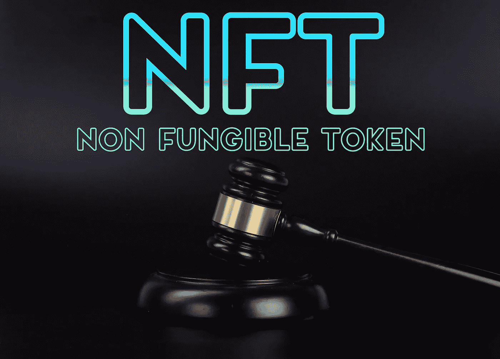

# NFT 简介

> 原文：<https://medium.com/coinmonks/a-soft-introduction-to-nft-db7acd265018?source=collection_archive---------30----------------------->

在过去十年左右的时间里，区块链技术的兴起为我们带来了许多新技术。似乎理解数字货币并不难，但现在我们又接触到了其他技术，如去伪存真、闪贷、NFTs 等等。

**可替代与不可替代:**

NFT 代表不可替代的令牌。不同的是，每个 NFT 代币本身是唯一的，1 个 NFT 代币不是…