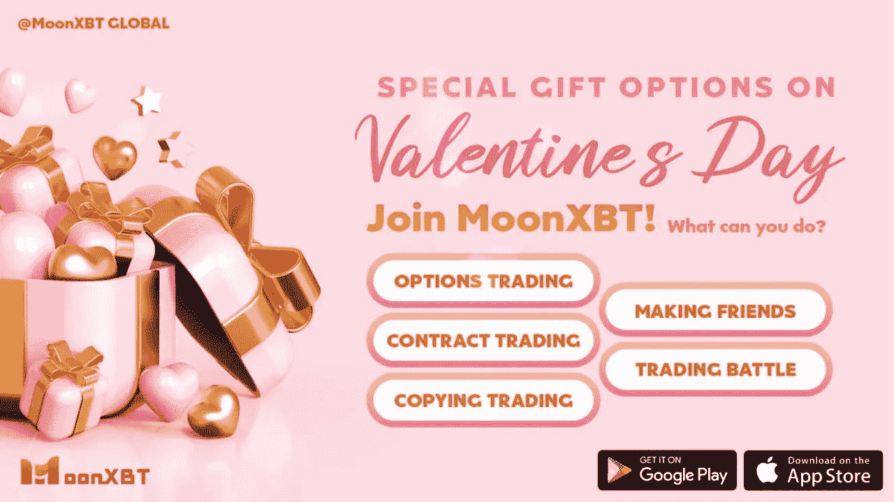

# 情人节的特别礼物选择:MoonXBT 的加密选项

> 原文：<https://medium.com/coinmonks/a-special-gift-option-on-valentines-day-crypto-options-at-moonxbt-73ebd868632b?source=collection_archive---------22----------------------->

这是一年中最浪漫的一天。巧克力、葡萄酒、花束、珠宝、蛋糕……一切都是为了给恋人们庆祝这个节日。抛开所有这些传统的选择，为什么不尝试一种更特别的方式来祝贺你爱的人呢？提供加密选项作为礼物，在这个特殊的日子里突出浪漫，你有庆祝真爱的答案。

通过提供加密选项，你可以向你爱的人展示你们之间的感情不仅是现在，也是未来。

加密选项是控制风险的一个很好的工具，而时间是最小化风险最重要的因素之一。购买期权后，你可以选择在到期时间前的任何时间执行合约。收到你给的加密选项，你的加密爱好者会看到你敏锐的眼睛，发现执行合同和兑现利润的最佳时机。在你们的关系中也是一样，你也有敏锐的眼光来发现刺激浪漫的机会(这可能会使你们之间的浪漫达到另一个水平)和要避免的潜在风险。你向你爱的人展示一个活在当下的人。

持有或交易加密期权也是关于未来的时间。加密选项的到期时间意味着您需要考虑从现在到未来某个时间的时间段。把加密期权作为礼物送给你所爱的人，他会在接下来的几分钟、几小时、几天、几个月里看到你爱的承诺……这是对未来的坚定承诺。

即使你爱的人不熟悉加密期权，一些额外的情侣活动，如介绍加密期权，研究风险和利润，寻找最佳交易策略，或者只是享受一起交易，肯定会在这一天为你们的浪漫加油。此外，对初学者来说，好消息是加密选项耗时更少。你的爱人在决定交易策略时不必密切关注市场波动 MoonXBT 的期权提供的有限风险和无限利润可以确保你的爱人顺利进入加密期权交易的世界。

此外，您不需要担心经常提供的短到期时间。在 MoonXBT，用户可以有多种选择——有些选项的到期时间从 5 分钟到 6 个月不等。就像你善于寻找最佳交易策略以平衡利润和风险一样，你一定会找到最合适的加密选项在这一天送给你爱的人！

别担心，你的爱永远不会被清算。

**关于 MoonXBT**

[MoonXBT](http://www.moomxbt.com) 是全球首个社交加密货币交易平台，总部位于开曼群岛，在新加坡、香港、马来西亚、韩国、日本、越南设有办事处。目前，MoonXBT 为全球交易者提供合约交易、社交互动、一键[副本交易](https://www.moonxbt.com/copytrading)服务，致力于构建更紧密的区块链生态系统。更多信息，请访问 www.moonxbt.com[。](http://www.moonxbt.com.)

> 加入 Coinmonks [电报频道](https://t.me/coincodecap)和 [Youtube 频道](https://www.youtube.com/c/coinmonks/videos)了解加密交易和投资

**同样，阅读**

*   [尤霍德勒 vs 科恩洛 vs 霍德诺特](/coinmonks/youhodler-vs-coinloan-vs-hodlnaut-b1050acde55a) | [Cryptohopper vs 哈斯博特](https://blog.coincodecap.com/cryptohopper-vs-haasbot)
*   [币安 vs 北海巨妖](https://blog.coincodecap.com/binance-vs-kraken) | [美元成本平均交易机器人](https://blog.coincodecap.com/pionex-dca-bot)
*   [如何在印度购买比特币？](/coinmonks/buy-bitcoin-in-india-feb50ddfef94) | [WazirX 评论](/coinmonks/wazirx-review-5c811b074f5b) | [BitMEX 评论](https://blog.coincodecap.com/bitmex-review)
*   [比特币主根](https://blog.coincodecap.com/bitcoin-taproot) | [Bitso 点评](https://blog.coincodecap.com/bitso-review) | [排名前 6 的比特币信用卡](/coinmonks/bitcoin-credit-card-bc8ab6f377c6)
*   [双子座 vs 比特币基地](https://blog.coincodecap.com/gemini-vs-coinbase) | [比特币基地 vs 北海巨妖](https://blog.coincodecap.com/kraken-vs-coinbase)|[coin jar vs coin spot](https://blog.coincodecap.com/coinspot-vs-coinjar)
*   [印度密码交易所](/coinmonks/bitcoin-exchange-in-india-7f1fe79715c9) | [比特币储蓄账户](/coinmonks/bitcoin-savings-account-e65b13f92451) | [Paxful 审核](/coinmonks/paxful-review-4daf2354ab70)
*   [杠杆令牌](/coinmonks/leveraged-token-3f5257808b22) | [最佳加密交易所](/coinmonks/crypto-exchange-dd2f9d6f3769) | [AscendEX 评论](/coinmonks/ascendex-review-53e829cf75fa)
*   [Godex.io 审核](/coinmonks/godex-io-review-7366086519fb) | [邀请审核](/coinmonks/invity-review-70f3030c0502) | [BitForex 审核](https://blog.coincodecap.com/bitforex-review) | [HitBTC 审核](/coinmonks/hitbtc-review-c5143c5d53c2)
*   [Crypto.com 费用](/coinmonks/binance-fees-8588ec17965) | [僵尸密码审查](/coinmonks/botcrypto-review-2021-build-your-own-trading-bot-coincodecap-6b8332d736c7) | [替代品](https://blog.coincodecap.com/crypto-com-alternatives)
*   [有哪些交易信号？](https://blog.coincodecap.com/trading-signal) | [比特斯坦普 vs 比特币基地](https://blog.coincodecap.com/bitstamp-coinbase)
*   [ProfitFarmers 回顾](https://blog.coincodecap.com/profitfarmers-review) | [如何使用 Cornix Trading Bot](https://blog.coincodecap.com/cornix-trading-bot)
*   [MXC 交易所评论](/coinmonks/mxc-exchange-review-3af0ec1cba8c) | [Pionex vs 币安](https://blog.coincodecap.com/pionex-vs-binance) | [Pionex 套利机器人](https://blog.coincodecap.com/pionex-arbitrage-bot)
*   [我的密码交易经验](/coinmonks/my-experience-with-crypto-copy-trading-d6feb2ce3ac5) | [比特币基地评论](/coinmonks/coinbase-review-6ef4e0f56064)
*   [CoinFLEX 评论](https://blog.coincodecap.com/coinflex-review) | [AEX 交易所评论](https://blog.coincodecap.com/aex-exchange-review) | [UPbit 评论](https://blog.coincodecap.com/upbit-review)
*   [AscendEx 保证金交易](https://blog.coincodecap.com/ascendex-margin-trading) | [Bitfinex 赌注](https://blog.coincodecap.com/bitfinex-staking) | [bitFlyer 评论](https://blog.coincodecap.com/bitflyer-review)
*   [麻雀交换评论](https://blog.coincodecap.com/sparrow-exchange-review) | [纳什交换评论](https://blog.coincodecap.com/nash-exchange-review)
*   [加密货币储蓄账户](/coinmonks/cryptocurrency-savings-accounts-be3bc0feffbf) | [赌注加密](https://blog.coincodecap.com/staking-crypto)
*   [BigONE 交易所评论](/coinmonks/bigone-exchange-review-64705d85a1d4) | [CEX。IO 审查](https://blog.coincodecap.com/cex-io-review) | [交换区审查](/coinmonks/swapzone-review-crypto-exchange-data-aggregator-e0ad78e55ed7)
*   [最佳比特币保证金交易](/coinmonks/bitcoin-margin-trading-exchange-bcbfcbf7b8e3) | [比特币保证金交易](https://blog.coincodecap.com/bityard-margin-trading)