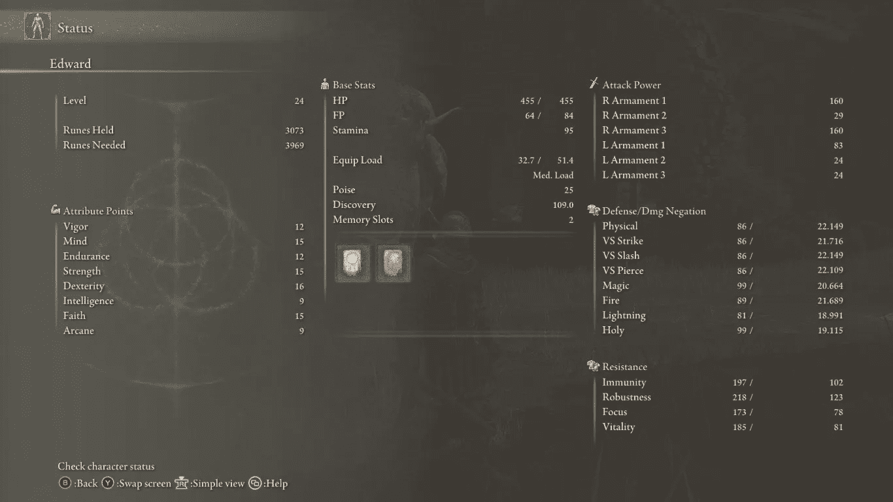

# 埃尔登环的惊人发现

> 原文：<https://medium.com/coinmonks/a-startling-discovery-in-elden-ring-f73c78d67757?source=collection_archive---------0----------------------->

你的属性和某些护身符是你的全部。

Pay attention to this pic people, it’s the only hope you have to get stronger.

好的，所以我对符文弧线进行了更多的研究，并且有了一个惊人的发现。符文弧线效果单独使用时，也不是永久的。

所以我的逻辑观点是，如果你愿意的话，你可以把符文弧和伟大的符文一起使用。我不敢相信我会这么说，但是你…