# 扔进海里的石头不会引起波浪——XRP 和涟漪基本面分析

> 原文：<https://medium.com/coinmonks/a-stone-thrown-into-the-ocean-does-not-cause-waves-xrp-and-ripple-labs-fundamental-analysis-90033c65244a?source=collection_archive---------2----------------------->

这份基本面分析是 Crypto Consulting Institute 的付费时事通讯的一部分，提供市场洞察、可行的交易信号和基本面分析。更多信息请访问:【https://www.cryptoconsultinginstitute.com/newsletter 

阻止许多人在这个广阔的世界旅行的一个因素是飞行、活动和住宿的费用，以及我们旅行的地方的当地法定货币与我们本国法定货币的转换。

当我们发现自己远离本土经济时，我们必须遵守我们正在进入的外国经济的规则。他们共有的一条规则是，他们通常要求你用当地法定货币结算商品和服务的款项。

可惜不是直接把澳元换成日元那么简单。银行在不同的结算网络上运营，通常使用通用货币(如美元)作为抵押品来清理通往目标货币的路径。

要从澳大利亚旅行到日本，我们需要使用西联汇款、速汇金或 Swift 等支付结算服务。我们将 10，000 澳元兑换成日元。为了清理出一条兑换我的货币的路径，一家银行可能需要通过几家中间银行来寻找一家与我的目的银行共享结算网络的银行，该银行将向我发行日元。

每个中间银行之间的转账都要收费。此外，还有澳元对日元的实际兑换或交易。这种兑换可能需要澳元到达一家日本银行，该银行将资金转到与目的银行共享网络的另一家日本银行。然而，他们的储备中不太可能有澳元。因此，澳元将在外汇市场上兑换成美元，再兑换成日元，然后存入直接借记卡。

可能需要 5 个工作日才能收到汇款或借记卡账户中的日元，以便在日本消费。虽然将澳元兑换成日元可能只需要 3 至 30 美元，但其中存在隐性成本。根据货币交易的市场，负责汇款的银行可能会以比其他市场相对更高的价格购买美元日元。

虽然偶尔旅行可能不会产生高昂的费用，但如果你在国外工作，并试图寄钱回家养家呢？你可能会发现这些国际交换费随着时间的推移会大量增加。

国际结算的低效率和高成本是比特币受欢迎的核心原因之一。是的，比特币的费用很高，速度也很慢，但鉴于它在许多货币市场都具有很高的流动性，将比特币兑换成日元要简单得多，我可以用日元给一个账户充值，在旅行时用这个账户购物。

然而，在比特币出现之前，许多人寻求用跨境支付来解决费用问题。Ripple Labs 是早在 2004 年就开始提供的服务之一。主要的价值主张是他们的分布式账本技术，以及后来的$XRP 令牌，这种令牌的费用要低得多，实现汇款的速度比比特币快得多，也便宜得多。

自 2014 年以来已经过去了很长时间，可以肯定地说，$XRP 不是镇上唯一一种可以绕过昂贵的银行间转账、货币转换和汇款的加密货币。

作为历史最悠久的加密货币之一，它似乎仍有很高的市值，我们必须将$XRP 和 Ripple Labs 分开，以确定它们是否相关。

作为加密货币的八年是一段很长的时间，可以暴露在市场上，陷入各种各样的骗局中。大多数人都熟悉 Ripple 与 SEC 的持续斗争。

我们不会在 SEC 的诉讼上花太多时间。相反，我们将深入什么是涟漪，令牌$XRP 是否服务于一个目的，其产品的价值，以及它是否仍然是相关的今天。鉴于大量的信息和对瑞波和 XRP 的看法，没有一条分析起来阻力最小的道路。所以，系好安全带，因为这将是一场漫长的比赛。

奇怪的是，为了这个分析的完整性，我觉得值得注意的是，我不是一个 XRP 美元持有者，我确实有预先存在的偏见进入这个分析。就像那些可能冲向争论任何一方的人一样，涟漪是一个非常有争议的话题。

考虑到这一点，我们将承认这些偏见，并力求客观地评估 Ripple/$XRP 的整体价值主张和未来。在整个分析中，Ripple 指的是公司和他们的产品，当我们提到$XRP 时，我们指的是他们的令牌。

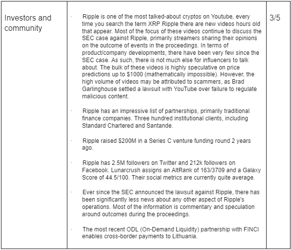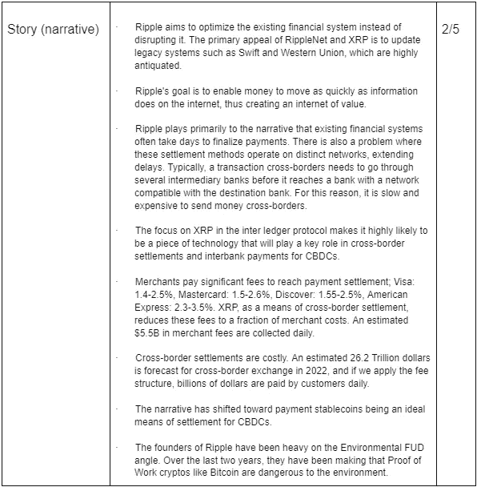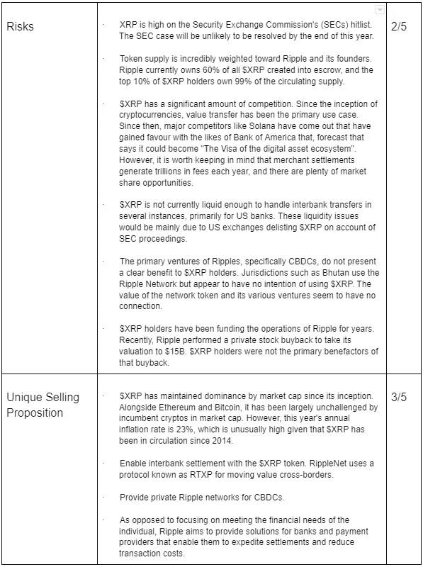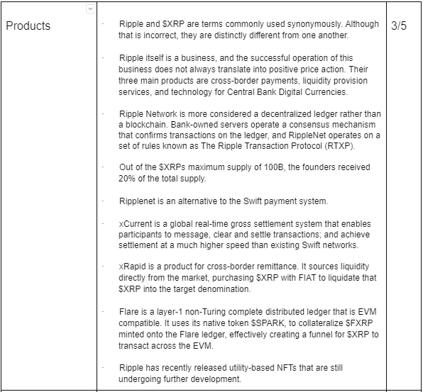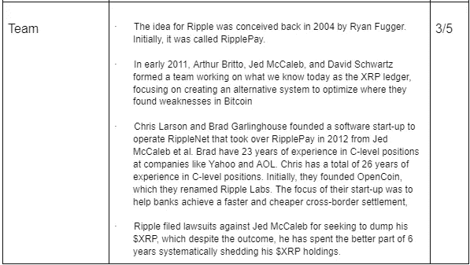

你的 TLDR 总结，D.I.S.R.U.P.T .要点:19/35

# 如何制造波纹

Ripple 是一个先于比特币的概念，其丰富多彩的历史值得我们反思。

这一切都始于 Ryan Fugger 于 2004 年创建的 Ripplepay，该公司旨在实现全球范围内廉价而安全的交易。Jed McCaleb、Arthur Britto 和 David Schwartz 买断了 Fugger，以实现他们的目标，建立一个促进全球交易的网络。Ripplepay 更名为 OpenCoin，open coin 在 2013 年更名回 Ripple Labs，他们移除了 Labs 部分，从 2015 年开始被称为 Ripple。

杰德·麦卡勒是一个值得一提的有趣人物。作为 Mt Gox 的前创始人，他在 2013 年离开了 Ripple，并在 OpenCoin 更名回 Ripple Labs 后不久将 Ripple 分为 Stellar Lumens。有趣的是，这正是杰德与 Ripple 高管因“一长串坏主意”而闹翻的时候。

杰德在创建恒星流明时就已经实现了这些想法，结果是可以预测的。事实证明，Ripple 的高管躲过了一劫。然而，杰德在 2013 年试图甩掉他的$XRP。对 Ripple 来说幸运的是，他们可以通过诉讼阻止他这样做。虽然抛售被阻止，杰德一直在系统地抛售他的 XRP，自去年 11 月中旬以来，他已经卖出了价值 21.47 亿美元的 XRP。

Ripple 在 2015 年与一些大银行测试了他们的产品，如巴克莱银行、澳大利亚国家银行(NAB)、加拿大皇家银行、桑坦德银行和西太平洋银行等。

2016 年，Ripple 在纽约州获得了许可证，允许他们使用加密货币进行操作。自那以后，他们继续与 300 多家机构客户建立合作关系。自那以后，100 家世界顶级银行中有 38 家与 Ripple 合作。

Ripple 的主要活动是与银行建立合作关系，并测试其汇款和跨境转账系统。

今天，银行系统在一个统一的网络中没有一套统一的规则。为了转移资金，我们需要找到一条清晰的路径让资金到达目的地。

RippleNet 是怎么回事？

互联网使用超文本传输协议(HTTP)来允许信息自由流动。类似地，RippleNet 使用 Ripple 交易协议(RTXP)让价值自由移动。

通过这种方法，Ripple 不关注个人。相反，他们专注于为银行提供降低成本和提高汇款、央行数字货币(CBDCs)和跨境支付交易速度所需的基础设施。

通过 RippleNet 的每一笔交易都遵循 RTXP 规则，一个作为验证者运行的计算机网络维护着一个谁拥有什么的共享账本。任何人都可以运行验证器；然而，这样做没有任何激励或奖励。

希望进入 RippleNet 的公司可以使用网关，银行运行网关为网络外的实体提供入口点。RippleNet 上的企业和银行可以访问三种核心产品，即 xRapid、xVia 和 xCurrent。银行可以将其持有的资产转移到 RippleNet 上，而客户对此一无所知。

RippleNet 在其网络上提供两种不同的货币。我和 XRP 欠你 100 美元。

白条储存在波纹钱包里。然而，借据代表你欠的东西，而不是你拥有的东西。它们是象征性的义务，用来偿还你在现实生活中获得的资产。借入的每项资产都会导致新借据的发行，并且不可互换，因为每份借据都有不同的信用/信托额度。你只能直接与发行人结算借据。

Ripple 的网络代币 XRP 是一种通过托管发行的货币，用于在网络上转移金额。美元 XRP 的好处是消除了通过多家中间银行转移资金的需要。相反，收款银行可以收到美元 XRP，他们可以清算成他们的首选货币来解决债务。然而，值得注意的是，两家银行不需要 XRP 美元来通过网络转移价值，并且可以有效地使用“开放标签”白条进行操作。

欠条=负债。

$XRP =资产。

鉴于 XRP 是一种不稳定的资产，不被全球银行普遍接受，因此它不能取代借据。借据是它们所代表的资产的衍生品。

当$XRP 交易被广播时，网络中的验证者将通过投票决定交易是否有效。要更新 RippleNet 分类帐，必须有 80%以上的投票同意交易有效。RippleNet 可以在 4 秒钟内处理 1500 笔 XRP 交易。

有许多关于为什么$XRP 是或不是中央集权的争论，值得一探究竟。

首先，一旦交易在 RTXP 上广播，Ripple Labs 就无法控制该交易，因为验证程序运行代码来完成网络上的分类帐。

然而，尽管 Ripple 不能控制协议上广播的交易，但他们对维护网络的公司或银行的提名有很大的影响。

其次，RTXP 是开源的。然而，他们的企业解决方案产品却不是。如果 Ripple Labs 解散，验证者仍然可以运行网络，尽管没有 Ripple，面向银行和企业的产品可能会停止运行。

第三，当我们将 RippleNet 上的交易性质与比特币区块链进行比较时，RippleNet 上发布的借条完全取决于*信任度*。你必须*相信*那些打白条的人会偿还债务，而比特币网络在*不信任的*环境中运作交易。

虽然 IOU 功能是 Ripple 网络具有大量交易的原因，但大多数交易都是零值交易，主要是由于 IOU 交易。

> “至于 XRP，96%的链上活动来自两种交易类型，提供创建和支付。大约 89%的提交是成功的，但只有 2.2%具有作者确定的经济价值(Ripple CTO David Schwartz 在声明中对此提出异议)。大多数其他交易都是非本地货币的借据，如 BTC，由“随机”账户发起，该研究称，“这些账户最有可能被视为一文不值”。“这项研究发现，一些账户会利用这些零价值交易和 XRPL 的低费用，连续几天不间断地向网络发送垃圾邮件。”——康奈尔大学梅萨里报告

第四，Ripple 符合反洗钱规定，而比特币网络上的交易是未经许可的，不能被阻止。顺便说一下，RippleNet 比比特币节能得多，因为 RippleNet 上没有采矿活动。

最后，与比特币相比，Ripple 公司对社区有着重大影响，并有效地引导他们的思维。比特币没有团队，或公司，没有一个未知的创始人，从这个意义上说，比特币更加分散。

有很多东西需要理解，但让我们快进到今天。

Ripple 有三个主要用例，都旨在为现有银行提供企业解决方案，以提升其服务效率。

跨境支付是一项由来已久的功能。

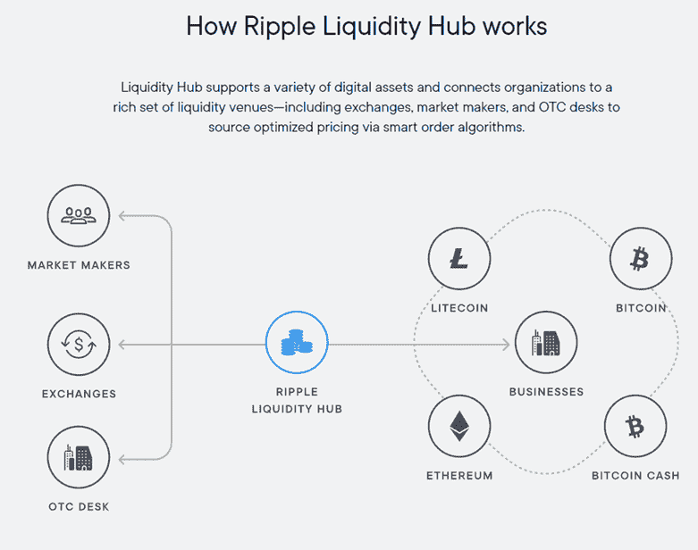

按需流动性确保银行有足够的流动性来完成银行间结算。

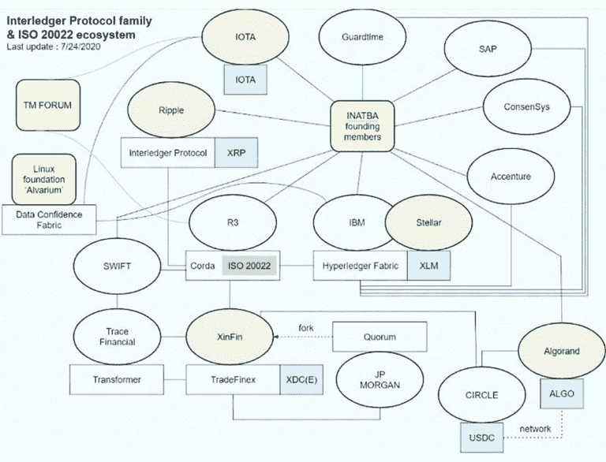

中央银行数字货币可能在为 CBDCs 设计的 Interledger 协议中发挥关键作用，为中央银行提供一种服务，利用 RippleNet 分类账促进资产交易(XRP)或负债交易(白条)。不丹和沙特阿拉伯是为发展中国家试点 RippleNet 的两家中央银行。

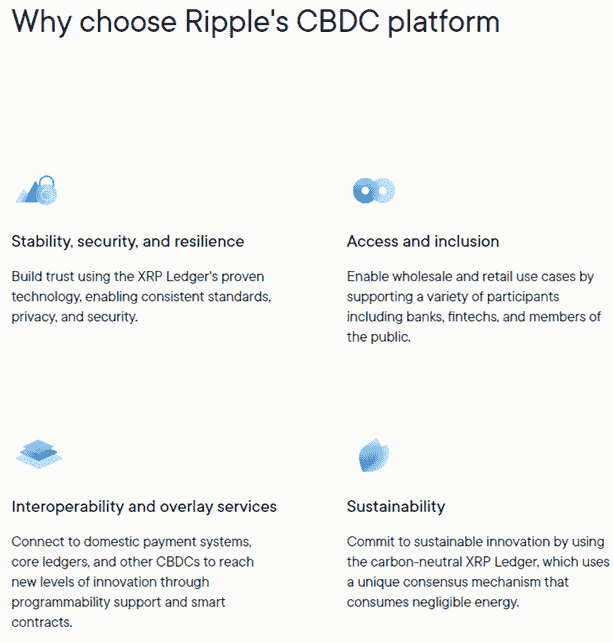

# 什么是你的，是预先开采的——XRP 令牌经济学

虽然奇怪的是，网络中的验证者没有像区块链那样收到采矿奖励或维护网络的费用。相反，$XRP 有 100 亿个预先挖掘的令牌，分布如下:

-面向创始人的 20B

- 7B 用于 Ripple 实验室

-面向公众的 20B(销售)

-每月向 1B tokens 的 Ripple Labs 发放 53B

Ripple 值有六位小数。

那些验证和维护网络的人没有任何奖励。

至少需要 20 XRP 存款来激活钱包，以防止网络上的垃圾邮件攻击。

一旦从托管中完全释放，$XRP 将随着时间的推移而通缩，因为每笔交易的交易费都被销毁了。Ripple Labs 继续将未使用的 XRP 美元重新存入托管账户。

-价格:0.42 美元

-循环供给:48.34B

-最大电源:100B

- 1500 TPS 和 3-5 秒的建立时间

-每笔交易收费半美分。

根据梅萨里的 XRP 指标:

通货膨胀率:28.45%

-XRP 前 100 个地址占总供应量的 56%

-前 1%的地址拥有 95%的供应量。

-前 10%的地址拥有 99%的供应量。

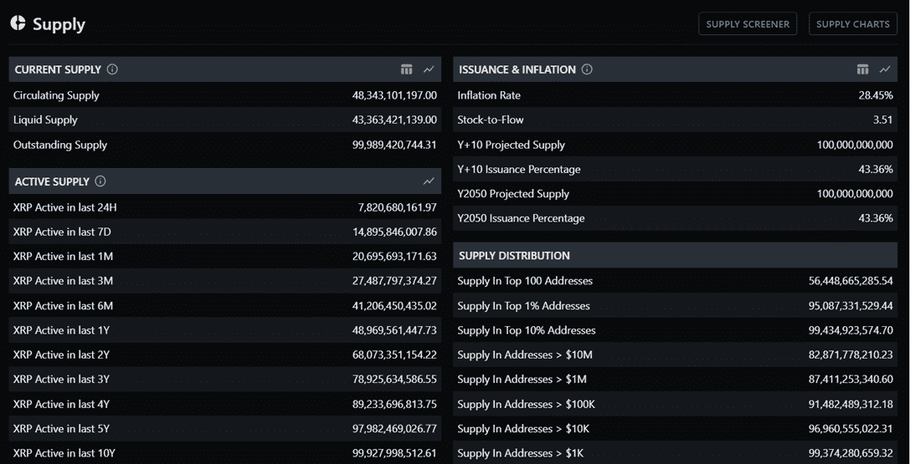

# 涟漪会随着时间消散

为了了解$XRP 是否保持相关性，我们首先需要思考如何将涟漪产品与后来出现的区块链技术相比较。

我们知道$XRP 的主要功能是一种结算货币，它可以从原始面额兑换成目标法定面额。

但这与加密货币市场日益增长的流动性有什么不同呢？

理论上，我们能不能拿着澳元，购买以太坊这样的高流动性资产，将其兑换成日元？

客观来说，是的。

Ripple 为银行提供了一个网络，代表它们的客户用$XRP 来促进这一过程。银行的好处是可以在狭窄的货币通道中获得流动性。除非你自己掌握了通过加密市场进行法定转换的加密技术，否则你仍然需要向银行支付汇款费用。从各国央行过去的降息降准中，我们知道，并不是所有的零售银行都将储蓄转嫁给消费者。

我们必须记住，Ripple 公开表示，他们专注于银行和机构的需求，对迎合散户投资者的需求不感兴趣。

Ripple 的另一个核心产品涉及按需流动性。这个想法是，一家银行将购买美元 XRP 发送到海外，然后在目标法定面值的市场上进行交换。

然而，这正是美国证交会针对 Ripple 的案件特别严重的地方——在美国证交会和法院明确 Ripple 是一种证券之前，它们在美国市场的流动性是不存在的，这可能导致 Ripple 在美国交易所重新上市。从这个意义上说，该法院案件直接影响了瑞波利用$XRP 来促进其业务。

但 Ripple 的问题在于向公众做出的断言和陈述的准确性。尽管它们拥有 300 多家机构客户，令人印象深刻，但它们在定义“合作伙伴关系”一词时却非常不透明。这些机构“合作伙伴”中有许多已经在跨境支付中试用了 RippleNet。尽管如此，还没有实际的证据表明 RippleNet 在这些机构试验该技术之外得到了积极的应用。

网络上有大量的零价值交易，EOS 也做过类似的事情。其结果是，网络确实会收到垃圾邮件，其中包含不具有“实际价值”的交易；因此，有意义的网络活动度量是不准确的。

此外，Ripple 假惺惺地追求一种环境 FUD 叙事，反对其市值最大的剩余竞争对手比特币和以太坊。

为了客观起见，有必要解释一下*为什么*是虚伪的。

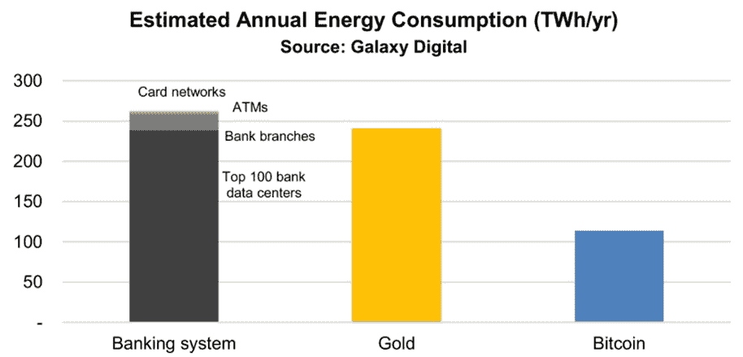

Ripple 只对银行的现代化感兴趣，而不是与之竞争。

如果明天比特币不存在，银行仍将消耗 250 万亿瓦时/年，每年将消耗略多于 100 万亿瓦时/年。

相反，如果比特币取代银行，这是比特币的主要价值主张，那么每年的消费将减少 250 万亿瓦时。

此外，如果比特币在未来实现了金本位，那么现有的黄金供应可能会被用于实际应用，而不是服务于价值存储功能。

在这种情况下，比特币有可能降低黄金需求，从而每年节省近 250 万亿瓦时。

更进一步说，多项研究发现，比特币高达 80%的能源消耗来自可再生能源。可以说，比特币比 RippleNet 更有利于环境，更有利于维护银行系统，因此与它们的持续能源消耗有直接关系。

布拉德最终收回了他的评论，并否认他试图 FUD 比特币。然而，他的联合创始人的后续评论并没有帮助混淆他们的意图:

> “随着越来越多的个人投资者和公司持有大量比特币头寸，随着世界努力避免气候灾难，比特币价格将达到社会难以容忍的水平，”—克里斯·拉森

为 Ripple 辩护的是，他们不是唯一一个试图从环境 FUD 角度诋毁竞争对手的人。当 Stellar 的首席执行官 Denelle Dixon 开始在国会断言他们更加负责任和环保时，Stellar Lumens($ term)将工作证据放在显微镜下进行能源消耗，并推断 PoW 在消耗上是不计后果的。

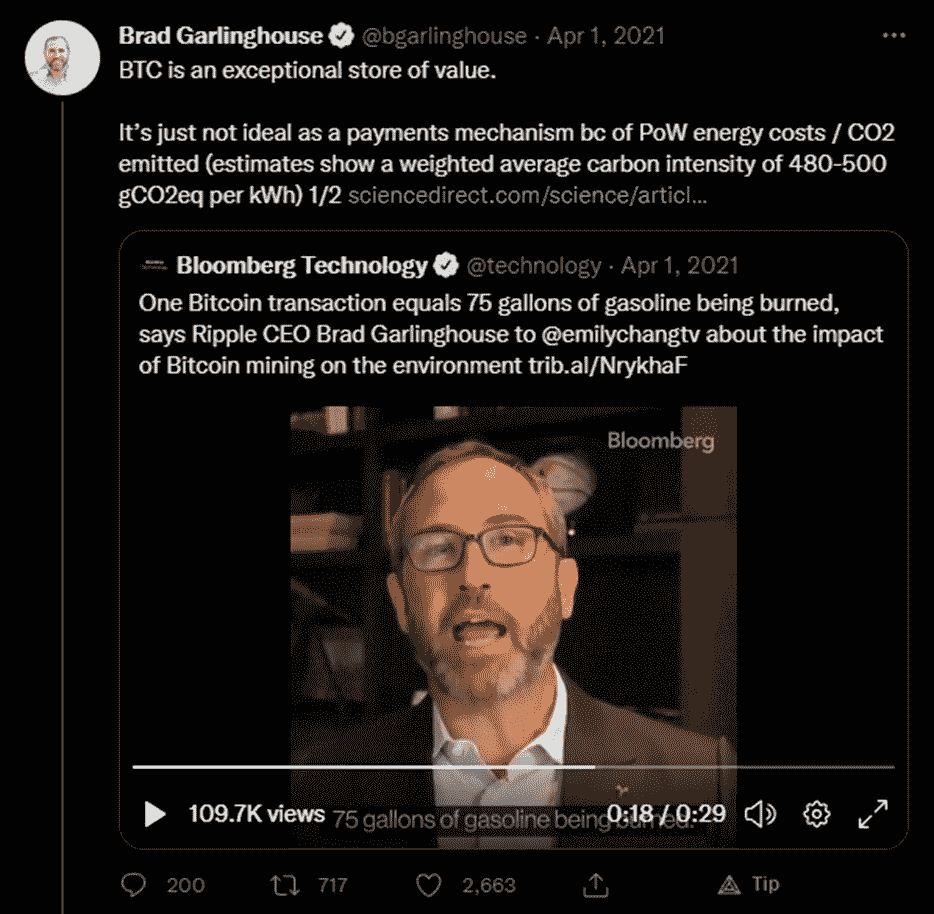

有人可能会说，RippleNet 已经被新兴的区块链解决方案超越，这些解决方案展示了更大的可扩展性，可以满足每天数百万次的交易。

Ripple 最大的优点也是它最大的弱点。它们早于市场上的大多数加密货币，这使它们有时间站稳脚跟，合作伙伴关系可以说是它们最大的优势。Ripple 继续升级他们的网络，但是底层基础设施已经过时。

新兴的区块链解决方案在很大程度上从包括比特币和以太坊在内的旧系统中寻求灵感是不可行的。然而，通过 Lightning Network 和 Ethereum Layer-2s 和 ETH 2.0 开发在现有网络的基础上进行构建是可行的。

鉴于 RippleNet 是非图灵完全分布式分类帐，很难实现高的可组合性水平，从而在虚拟环境中实现更大的功能。

人们可能会认为 RippleNet 与像 Solana T1 这样的公司相比已经过时了，后者已经开发了几年，并且有一系列通用的用例。它还提供机构服务。

其余的空间继续向前涌动，导致对涟漪的额外关注。他们有些多余的核心价值主张提高了他们在竞争中的竞争力。

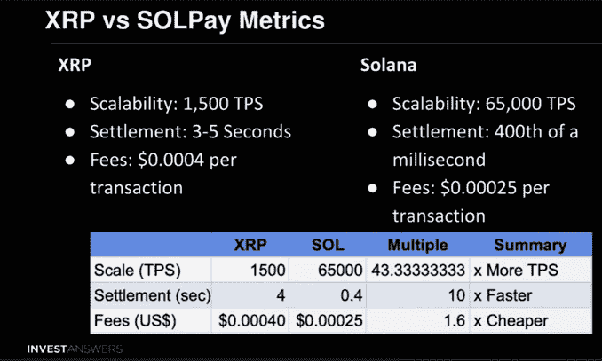

美国银行将索拉纳戏称为“数字资产生态系统的签证”。有了这些类型的声明，那些可能成为 Ripple 客户的客户(银行和机构)反而认识到，他们可以利用高度可扩展的无许可区块链来满足自己的需求。索拉纳是世界上最大的交易所，币安和 FTX 的资产。与此同时，在美国证交会的诉讼程序进行期间，XRP 已被美国交易所摘牌。这些诉讼不在 Ripple 的控制范围内，但这并没有阻止银行将重点转向利用符合监管规定的稳定账户，如$USDC，来进行跨网络的价值交易。

在 RippleNet 上确实有通过 xRapid 使用$XRP 的。然而，通过设计，如果银行要利用$XRP 将价值转移到目标面额，它将不可避免地必须购买源面额的$XRP，然后将其出售给目标面额。鉴于这种资产的波动性和监管不确定性，银行并未持有大量美元 XRP。更多的机构合作伙伴会给 XRP 持有者带来积极的价格影响，这并不完全准确。这种产品可能会强化 Ripple 和$XRP 努力摆脱的“泵-n-dump”标签。

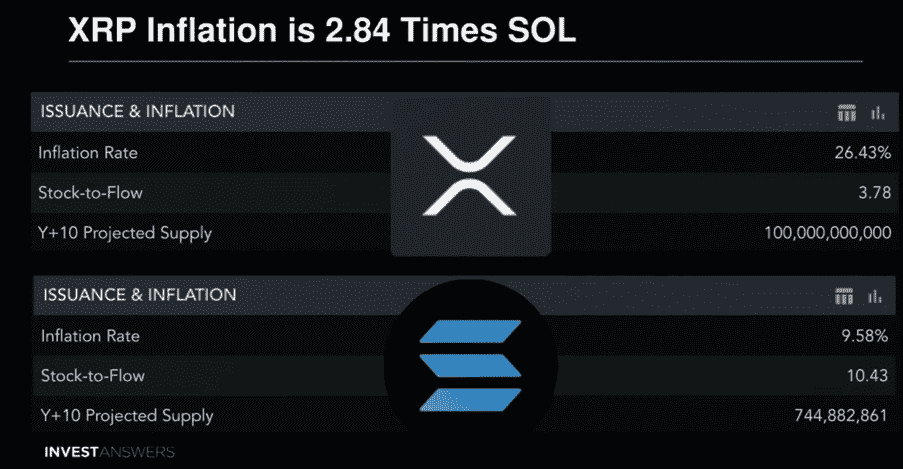

对索拉纳的一个核心批评是发行利率，但正如我们在上面的对比图表中看到的，XRP 美元供应量的膨胀倍数大于索拉纳。$XRP 已经流通了八年多，并以远高于其竞争对手的速度从托管中释放代币。XRP 从第三方托管中释放的所有资金都直接判给了 Ripple Labs。

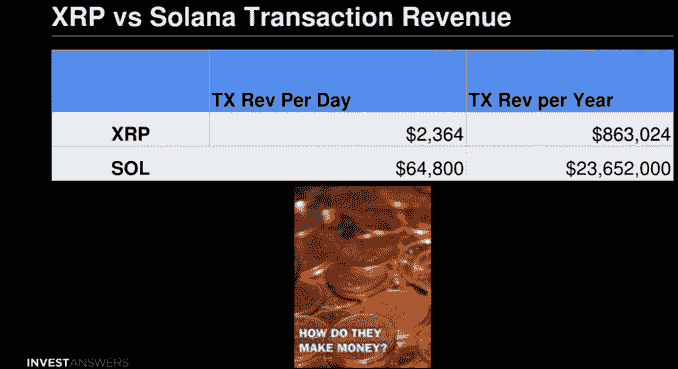

Ripple Labs 在全球 40 多个地方雇佣了 500 多名员工。考虑到他们每天从网络活动中获得的收入如此之少，他们是如何维持运营的，这是一个疑问。维持他们的运作将花费数百万美元。然而，根据 Ripple 的季度报告，其主要收入来源是 ODL 服务。尽管与美国市场隔绝，RippleNet 似乎仍被美国以外的国际银行和机构使用。

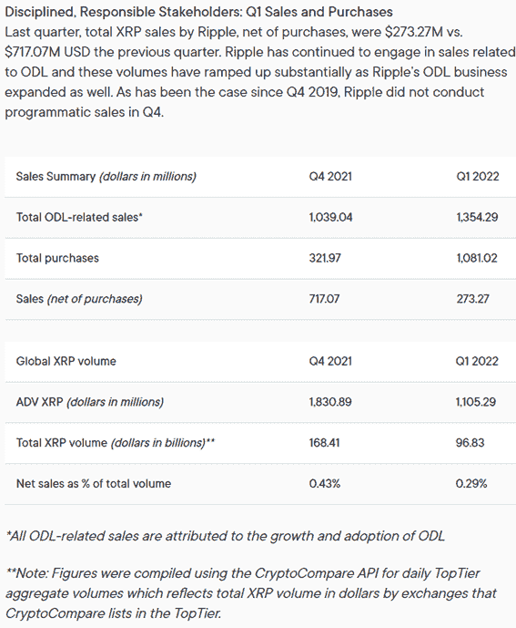

该公司的收入证明，出售$XRP 是 Ripple 现阶段的主要收入来源。在早期，Ripple 肯定会定期抛售 XRP 美元来资助他们的开发和运营。

> “(如果不出售 XRP)，我们就不会盈利，现金流也不会为正。XRP 是一个来源。我不知道如何回答这个问题，因为如果你拿走了我们的软件收入，我们的利润就会减少。如果你拿走我们所有的 XRP，我们的利润就会减少。所以我不把它当一回事。”—布拉德·加林豪斯

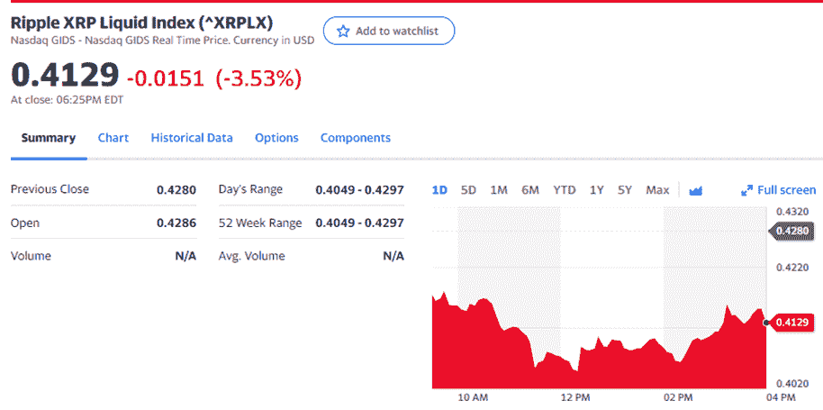

有许多关于 Ripple 的因素需要讨论，但真正的问题是，购买$XRP 而不是购买 Ripple 的股票的实际意义是什么？

首先，Ripple 股票是不公开交易的。在购买 Ripple 的股票之前，你必须被认可为“老练的投资者”。

其次，毫无疑问，Ripple 向社区倾销了他们的$XRP，以资助其运营。从季度报告来看，在 Ripple 的生命周期中，它们似乎是在用公司收入进行 XRP 股票回购。如果这是真的，这对多年来一直被抛售的$XRP 持有者来说是积极的，他们终于通过投资获得了一些运营资金补偿。Q1 2022，Ripple 声称其活动可占 RippleNet 交易量的 29%。

# 池塘里的一个涟漪比大海里的一块石头更引人注目——讨论

Ripple 这个名字在某种程度上是合适的。想象把一块石头扔进平静的池塘。我们经常在发展、新闻和事件的价格行动中得到强烈的反应，但这通常是短暂的。

如果我们希望用涟漪类比得更远，这就相当于把一块石头扔进平静的池塘中央，水面会起涟漪，每个事件都会有一些湍流。但当池塘平静下来时，它会恢复到之前的状态，因为剧烈的价格波动往往证明自己是投机的产物。

过去,$XRP 曾多次被称为“泵 n-dump”硬币。无论如何，使 XRP 成为伟大的短期投机投资的是围绕 XRP 的事件，这些事件经常导致异常可预测的价格行为。

例如，针对$XRP 持有者的歌鸟$SGB 和$SPARK airdrop 导致许多人预期购买$XRP，推高了价格，不料市场在持有者拍摄快照的那一刻做空并大量抛售。

证交会诉讼的结果对价格行为也有显著的可预测性影响。当 Ripple 基于一个孤立的结果看起来将赢得这场官司的时候，#XRPArmy 开始重整旗鼓。鉴于$XRP 确实有一大批追随者，在这些圈子里集结军队并不需要太多。

Ripple 认为，基于缺乏“公平通知”和过去 SEC 主席 Jay Clayman 的评论，以太坊不是一种证券，因为它是分散的，所以他们在法庭诉讼中具有优势。关于后者的观点是令人绝望的，因为这个论点是 RippleNet 分类帐本身是分散的，这是真的。尽管如此，鉴于有一家公司负责他们产品的运营，通过向$XRP 社区倾倒托管令牌来提供资金，这充其量是一个可疑的提议。该公司的活动确实影响了$XRP 的价格行为。

然而，我们可以更进一步，基于一些迹象表明，确实有来自 Ripple Labs 的精心挑选或有计划的误导。为 Ripple 说句公道话，这种“摘樱桃”的行为在双方都存在，可以说也适用于这种分析。不可能在一个 FA 中概括公司 18 年的活动、发展和成就。

然而，他们会第一个告诉你，如果你把一块石头扔进大海，它会掀起下一波巨浪。换句话说，他们在过去被抓了个正着，夸大了他们的商业活动对其股票价格的影响。特别是他们的伙伴关系的影响。

他们的几个合作伙伴没有通过试点项目阶段。一些人使用$XRP 进行跨境快速结算，但这很难说是基于通过零价值交易合并的网络活动。如果我们回顾一下索尔美元和 XRP 美元，在实际价值转移方面，前者的机构日交易量似乎比后者多。

虽然到目前为止的分析已经尽力公平对待 Ripple，但我们现在必须转向讨论 Ripple 的公司原则和价值观。

央行数字货币(CBDCs)是一个值得专门撰写的巨大话题。

但坦率地说，我们看看支持和反对 Ripple 去中心化的论点，最终，他们的目标是提供一个网络，中央银行可以借此流通可编程货币。发行央行可以对何时、何地以及是否接受货币施加限制和程序条件。

CBDCs 绝对不是加密货币。

虽然他们可以在分布式账本上运行，并利用区块链技术的某些方面，但他们无法满足区块链技术的四个关键标准。

审查阻力、分权、社区治理和无许可交易。

我们只要看看中国的数字元就够了。个人的钱可以按照发行者的意愿或通过算法设计来关闭。

事实上，来自中国的著名报道说，记者揭露政府腐败，他们的钱被列入黑名单，无法使用。我们还可以确认，一个公民的社会信用评分是通过算法确定的。如果他们被监控拍到乱穿马路，他们的社会信用评分将记录处罚。

这些处罚减少了个人获得服务的机会。为了了解这是什么样子，你可能想看看网飞黑镜第三季第一集“俯冲”。虽然它被描绘成小说，但未来可能走向的标志正在讲述并很好地展示了社会信用体系的黑暗面。

如果有人认为我在这里跳得太远了，我们已经看到加拿大的银行账户被冻结，作为对 GoFundMe 活动分子的政治回应。澳大利亚经营无现金福利卡，持卡人被禁止购买酒类等物品。

为什么它值得我们在社会信用体系的背景下接触 CBDCs？

中国的数字元是未来所有 CBD 发行的模板。世界现在期待中国效仿他们的政策，追求他们的经济成就和人口控制水平。

Ripple 希望为政府、中央银行和私人机构促进这些能力。

如果我们寻找原则和价值观的对比，比特币的精神气质与 XRP 截然相反。推而广之，比特币和以太坊这样高度去中心化的货币，寻求解放个人，让他们成为自己的银行。在这个系统中，你不需要获得许可就可以释放自己的 Dapp 或股份来保护网络，如果你想购买或交易资产，没有什么可以阻止你。简而言之，分散化的货币赋予了使用者真正的主权，一种不能被用来强迫或操纵的权力。

另一方面，Ripple 希望拯救银行，成为 CBDCs 未来的支付平台。他们不会让这些古老的机构不战而亡，同时仍然相信，提供此类服务将让他们自己和他们的投资者变得富有。

这样的追求一点也不令人钦佩或高尚。无论你在世界的哪个地方，你都目睹了过度中央计划的后果。为了避免混乱，所有的事情都必须保持平衡。现在，我们已经超出了中央集权的范围。从与非民选官员强加的非政府组织政策保持一致，到媒体机构的集中所有权，脆弱和高度集中的供应链，以及通过公共卫生政策持续瓦解中小型商业企业。

如果你认为这是一种延伸，我不怪你，但在我看来，这是涟波试图延续的世界。一个维持现有寡头政治的体系，而不是一个把权力还给人民和比特币的体系，是建立在后一种原则之上的。

分布式账本技术的含义正对人类的发展轨迹产生直接影响，因此我们应该关心我们投资的东西，因为它将塑造未来。

虽然有些人认为$XRP 是一个投资机会，但谁是你投资的主要资助人确实很重要，尤其是当你知道 Ripple 的价值以及 Ripple 托管的大量代币时。众所周知，他们关心的是维护现有的权力结构，而不是赋予投资者或个人权力。

虽然最终由你来决定投资什么来赚钱，但我们必须问自己，我们希望用我们的财富生活在一个什么样的世界里。成功投资$XRP 的收益是否超过我们主权和自决的重大代价？

你可以说我很夸张，但这个世界正开始远离破坏性投资，尤其是那些专注于环境的投资。他们这样做是否正确超出了这个 FA 的范围，但是最终，我们需要问自己，我们想给后代留下一个什么样的未来。如果你周围的一切和每个人都很穷，那么富有也没有什么好处。

当你观看几个关于 Ripple 的 YouTube 视频时，不乏讽刺。人们普遍认为，大型机构正在向一个中央集权的世界政府推进。这是具有讽刺意味的，因为 Ripple 的粉丝会认为这些发展(或一些不计后果的讽刺阴谋论)是不利的，是我们应该抵制的。与此同时，他们看好自己的投资——XRP，它是各国央行跨境交易价值的工具，以实现他们厌恶的控制水平。

事实上，这种不和谐显而易见，对于那些在 2018 年历史高点之前的早期投资者来说，长期持有人的大规模投资者精神病并不奇怪。如果你在 2018 年套现，那恭喜你了。如果你未能兑现或者是$XRP 的新进入者，你很可能在将来成为 Ripple 清算他们的$XRP 的接收端，就像他们过去所做的那样。对于那些未能套现的人来说，你可能会认为自己已经走得太远了。如果你持有这些袋子，许多人会相信他们的 XRP 美元将会突破历史高点。我们非常反对一厢情愿的做法，我们在 CCI 的客户对此非常敏感。

自称为#XRPArmy 的机构是在这样一种假设下运作的，即机构会涌入$XRP，为自己打气。但是如前所述，$XRP 明天可能会消失，RippleNet 仍将继续运行。但如果 Ripple 消失了，为公司带来收入的产品可能也会随之消失。只要$XRP 不被机构购买和持有，使用 RippleNet 进行 CBD 交易不会影响投机以外的价格。

此外，单位偏见无疑促使许多购买美元 XRP。许多人认为比特币的价格在 30，000 美元左右，并认为支付不到 1 美元的代币增加了上涨的可能性。这些假设忽略了流通供给和市值被稀释的程度。

总的来说，Ripple 在历史上是如何积极地向其他项目展示自己的。在 SEC 调查之前，他们过去发布的许多新闻都是围绕公司活动和合作关系发展的建设性内容。如上所述，Ripple 的联合创始人克里斯·拉森(Chris Larson)和布拉德·加林豪斯(Brad Garlinghouse)表示，比特币是一种环境危险。方便的是，他们忽略了保护传统银行业使命的虚伪性，传统银行业消耗的能源远多于比特币。住在玻璃房子里的人不应该扔石头。更不用说杰德·麦卡勒布(Jed McCaleb)在以社区为代价寻求清算他在 XRP 的全部股份以及创造被视为激烈竞争对手的恒星流明(尽管事实上它们似乎都在 ISO2002 过渡协议上)时引发的戏剧了。

美国证券交易委员会的诉讼理应有自己的 FA，因为它实际上已经演变成了肥皂剧级别的戏剧。脸书的天秤座和迪姆优雅地死去，因为他们没有又踢又叫地死去。一旦发现他们无法满足安全法的要求，他们就关闭了商店。许多论点是支持和反对$XRP 作为一种证券的。虽然在法律意义上，我没有资格做出铁证如山的断言，但邀请投资者购买$XRP，只是为了向他们倾销，以资助运营或丰富创始人的财富，这似乎给了$XRP 一种证券的光学。

围绕$XRP 在基础设施层面被去中心化的争论是有根据的。但是，试图认为 Ripple 在公司和组织层面上是分散的是令人讨厌的。按照设计，一家负责直接影响其托管资产 XRP 的公司，天生就是集权的。

此外，$XRP 持有者不仅无权决定公司收入如何分配，而且经常发生零价值交易来推断网络需求也令人难以置信。

公平地说，Ripple 肯定不是唯一经历过 DDOS 攻击的网络，但允许这些事件不间断进行背后的动机或目标确实让$XRP 警惕起来。

$XRP 持有者可以参与保护网络安全，但他们得不到任何经济回报。

就叙事而言，价值转移不是 Ripple 所能控制的。如果在每个司法管辖区都有相关的市场，其他资产可以抵押的所有加密资产都可以跨境发送并清算为当地法定面值。

相反，Ripple 似乎是被动的，并对他们所认同的叙述采取攻势。反对工作证明的环境 FUD 角度可以说是机会主义的，因为他们试图通过断章取义的能源消耗来投降。具有讽刺意味的是，环境 FUD 正在攻击比特币，比特币消耗了系统能量的一小部分，而 Ripple 试图保留这部分能量。假设 Ripple 让比特币变得多余，比特币挖矿可能会不了了之，但银行会留下来，继续消耗两倍于比特币挖矿者的精力。

作为批评的总结，我确实可以花一整天的时间来讨论危险信号，我们确实认为所有事情都应该保持平衡，所以让我们来谈谈一些核心建议，这些建议将使$XRP 成为一项有吸引力的投资:

-给予$XRP 持有者治理权，以决定有多少商业收入回到$XRP 代币。社区必须负责做出影响业务下放的决策。

-如果创始人和 Ripple Labs 烧掉了超过 95%的 XRP 美元头寸，而没有出售给市场(他们十年来一直通过在社区上出售他们的 XRP 美元获得资金，他们有足够的钱……)

-如果从所有机构收费中产生的收入减去运营费用，用于回购和焚烧 XRP 币。

-如果 Ripple 利用其与 Flare 网络的关系，它将允许$XRP 持有者通过 DeFi 解决方案从流动性供应服务中获利。如果 XRP 美元持有者能够直接受益于为 ODL 提供流动性，这将是一个很好的投资理由。

-如果信托基金和机构恢复原来的头寸，它们会在收到 SEC 调查的消息后进行清算。我们需要记住，风险资本家和机构不会通过掏空散户投资者的腰包来送钱。

-如果 RippleNet 被采用来促进 interledger 协议，那么除了猜测之外，机构没有必要投资$XRP。银行仍然可以利用网络。然而，网络必须变得更加依赖于 XRP，以确保持有者的长期增长。

- RippleNet 是一个网络，机构可以在其中为使用其 CBDCs 的用户定制权限和审查功能。一个积极的步骤将是 XRP 美元持有者和部署 CBD 的央行行长之间的联合治理。$XRP 持有者应该有能力投票反对给予不人道控制水平的特定 CBD 的实施。鉴于我们已经断言现有投资者的价值观与奥威尔式的世界事件不一致，如果他们在监管允许哪些 CBD 在其网络上发挥关键作用，这将为 Ripple 和$XRP 带来完整性。

基于我们到目前为止所谈到的，低范围的价格预测可能不会让你感到惊讶。

XRP 是一种你可以在短期内获得可观收益的资产。$XRP 是为数不多的可以策划“买入谣言，卖出新闻”策略的资产之一。随着证交会诉讼的进展，如果结果对$XRP 有利，那么投资于这种积极情绪将是显而易见的。

鉴于$XRP 是一个如此具有分裂性的象征，那些仅仅寻求从有利的法庭结果中屈服于看涨情绪的人，将比$XRP 的长期投资者有更好的时机扣动扳机获利。如果 Ripple 被清除了 SEC 的指控，许多多年来不关心美元成本平均的人可能会因为太深而不会考虑获利。

说到长期，就不好说了。$XRP 是少数几个保持市场主导地位、但尚未回到 2018 年每枚 3.40 美元历史高点的加密货币之一。

2021 年 4 月，在牛市期间，XRP 价格达到 1.84 美元。虽然空投激励措施在一定程度上支撑了这一点，但$XRP 突破 2021 年的历史高点也就不足为奇了。虽然有些人可能会说这个足总对$XRP 和 Ripple 有所图谋，但我们承认一个专门的持有人社区，并接受$XRP 自 2017 年以来在前 20 名加密中的不间断曝光是不容忽视的。然而，断言在当前的代币经济条件下，每枚 XRP 将达到 1000 美元是危险和鲁莽的。

坦率地说，涟漪和$XRP 是完全可以替代的。如果它们明天就消失了，也不会对实现无摩擦、廉价、快速的跨境结算产生实质性影响。

为什么？

各国央行已经在建立自己的私人区块链来满足自己的需求。

作为结算手段，新兴的区块链比 RippleNet 和$XRP 有效得多。

这并不是说 Ripple 不会继续在他们的业务运营中盈利，也不会继续建立更多的合作伙伴关系(尤其是如果$XRP 避免被视为证券)。作为一种保持市场主导地位的资产，XRP 有机会放弃美元，因为它是价格变动的主要可预测催化剂。

不过，我们需要考虑，我们是希望参与资助一项旨在延续现有传统金融体系的行动，还是希望赞助一项针对中央集权货币体系的强硬措施，并追求自决和自我主权。这是$XRP 和 Ripple 不向非机构投资者提供的两样东西。

# 参考

bitcoin.com，“研究显示，银行系统使用的能源明显多于比特币”，2022 年 5 月 18 日，[https://news . bit coin . com/Banking-System-Uses-measurely-More-Energy-Than-bit coin/](https://news.bitcoin.com/banking-system-uses-significantly-more-energy-than-bitcoin/)

Bybit，“初学者指南:XRP(涟漪)是怎么回事？”，2020 年 12 月 21 日，[https://learn.bybit.com/altcoins/what-is-ripple-xrp/](https://learn.bybit.com/altcoins/what-is-ripple-xrp/)

Coindesk，“随着 SEC 的诉讼，XRP 清算飙升，Token Airdrop Whipsaw Markets”，2020 年 12 月 25 日，[https://www . coin desk . com/Markets/2020/12/24/xrp-Liquidations-Soar-as-SEC-suction-Token-Airdrop-whip saw-Markets/](https://www.coindesk.com/markets/2020/12/24/xrp-liquidations-soar-as-sec-lawsuit-token-airdrop-whipsaw-markets/)

Coinloan，《涟漪(XRP)的完整历史》，[https://coin loan . io/article/The-Complete-History-of-Ripple-xrp/](https://coinloan.io/article/the-complete-history-of-ripple-xrp/)

Ripple 首席执行官澄清了他关于比特币能耗的言论，并驳斥了 FUD 的指控，2021 年 4 月 5 日，[https://coin ounce . com/ripple-CEO-clarifies-his-remarks-about-bit coin-energy-consumption/](https://coinnounce.com/ripple-ceo-clarifies-his-remarks-about-bitcoin-energy-consumption/)

康奈尔大学，“重温高可扩展性区块链的事务统计”，2020 年 3 月 5 日，[https://arxiv.org/abs/2003.02693](https://arxiv.org/abs/2003.02693)

加密新闻快讯，“Garlinghouse: Ripple 出售 XRP 以保持盈利”，2020 年 3 月 2 日[https://www . crypto-News-Flash . com/garling house-Ripple-sells-xrp-to-stay-profitable/](https://www.crypto-news-flash.com/garlinghouse-ripple-sells-xrp-to-stay-profitable/)

解密，“98%的 XRP 交易是空的，报告说”，2020 年 5 月 8 日，[https://decrypt . co/28176/98-of-xrp-transactions-are-empty-says-report](https://decrypt.co/28176/98-of-xrp-transactions-are-empty-says-report)

解密，《XRP 创造者克里斯·拉森:比特币必须停止破坏环境才能保持主导地位》，2021 年 4 月 24 日，[https://decrypt . co/68996/xrp-Creator-Chris-Larsen-比特币-必须停止破坏环境才能保持主导地位](https://decrypt.co/68996/xrp-creator-chris-larsen-bitcoin-must-stop-damaging-environment-to-stay-dominant)

《财经》杂志评论道，“涟漪——明星竞争日益激烈，但杰德·麦卡勒为什么要离开涟漪？”，2022 年 3 月 24 日，[https://finance feeds . com/ripple-stellar-substance-continues-Jed-mccaleb-leave-ripple/](https://financefeeds.com/ripple-stellar-rivalry-continues-jed-mccaleb-leave-ripple/)

Financefeeds，“RIPPLE 的按需流动性在日本上线，而 SEC 对 XRP 的诉讼却不了了之”，2021 年 7 月 28 日，[https://finance feeds . com/ripples-DEMAND-LIQUIDITY-GOES-LIVE-JAPAN-SEC-suction-xrp-GOES-SILENT/](https://financefeeds.com/ripples-demand-liquidity-goes-live-japan-sec-lawsuit-xrp-goes-silent/)

《福布斯》，“关于瑞波和 XRP 的 14 个常见误解”，2019 年 3 月 7 日，[https://www . Forbes . com/sites/thomassilkjaer/2019/03/07/14-Common-missions-About-Ripple-And-xrp/？sh=2e701c271d0b](https://www.forbes.com/sites/thomassilkjaer/2019/03/07/14-common-misunderstandings-about-ripple-and-xrp/?sh=2e701c271d0b)

《福布斯》，“SEC 指控 Ripple 出售 13 亿美元未注册证券，XRP 市值损失 20 亿美元”，2020 年 12 月 22 日，[https://www . Forbes . com/sites/jonathanponciano/2020/12/22/SEC-Charges-Ripple-With-Selling-130 亿美元未注册证券-xrp-loss-20 亿美元市值/？sh=3fef70a97e66](https://www.forbes.com/sites/jonathanponciano/2020/12/22/sec-charges-ripple-with-selling-13-billion-in-unregistered-securities-xrp-loses-2-billion-in-market-value/?sh=3fef70a97e66)

Messari，“最近的研究表明，EOS、XRP 和 XTZ 的大部分网络流量并非用于价值转移目的”，2020 年 5 月 12 日，[https://messari . io/article/Recent-study-says-most-network-traffic-on-EOS-xrp-and-xtz-is-not-for-value-transfer-purposes？referrer=asset:xrp](https://messari.io/article/recent-study-says-most-network-traffic-on-eos-xrp-and-xtz-is-not-for-value-transfer-purposes?referrer=asset:xrp)

汇款，‘快速支付需要多长时间？’，2022 年 1 月 25 日，[https://money transfers . com/swift-codes/how-long-a-swift-payment-take](https://moneytransfers.com/swift-codes/how-long-does-a-swift-payment-take)

Monneo，“跨境支付:基本指南”，[https://www . monneo . com/Cross-Border-Payments-An-Essential-Guide/](https://www.monneo.com/cross-border-payments-an-essential-guide/)

支付，'信用卡商户费用说明及对比[2022]'，2022 年 3 月 17 日，[https://pay.com/blog/credit-card-merchant-fees](https://pay.com/blog/credit-card-merchant-fees)

Ripple，“为立陶宛提供商 FINCI 带来的按需流动性”，2022 年 5 月 3 日，[https://ripple . com/insights/On-Demand-Liquidity-bring-to-Lithuanian-Provider-FINCI/](https://ripple.com/insights/on-demand-liquidity-brought-to-lithuanian-provider-finci/)

瑞波，《Q1 2022 年 XRP 市场报告》，2022 年 5 月 1 日，[https://ripple.com/insights/q1-2022-xrp-markets-report/](https://ripple.com/insights/q1-2022-xrp-markets-report/)

Ripple，“加密和区块链在气候变化中的催化作用”，2022 年 5 月 4 日，[https://ripple . com/insights/The-catalyst-Role-of-Crypto-and-区块链-in-climate-change/](https://ripple.com/insights/the-catalytic-role-of-crypto-and-blockchain-in-climate-change/)

Block，“Ripple 宣布股票回购，nabs 150 亿美元估值”，2022 年 1 月 25 日，[https://www . the Block crypto . com/linked/131577/Ripple-announced-stock-回购-nabs-150 亿美元估值](https://www.theblockcrypto.com/linked/131577/ripple-announces-stock-buyback-nabs-15-billion-valuation)

[https://www.xrpnews.com/](https://www.xrpnews.com/)XRP 新闻

Youtube，99 比特币，'什么是涟漪？(XRP、借条、网关和验证器解释)’2018 年 12 月 18 日，[https://www.youtube.com/watch?v=UmaWDpg4fMU](https://www.youtube.com/watch?v=UmaWDpg4fMU)

Youtube、CoinBureau、Ripple vs. SEC:会是这样吗？！最新 XRP 更新！!'，2022 年 4 月 29 日，[https://www.youtube.com/watch?v=Fd08RL7PnD4](https://www.youtube.com/watch?v=Fd08RL7PnD4)

Youtube、InvestAnswers，“深入研究支付、XRP、SolanaPay、Solana、Stablecoins 和未来！”，2022 年 2 月 17 日，[https://www.youtube.com/watch?v=YtVfNhQ1NmE](https://www.youtube.com/watch?v=YtVfNhQ1NmE)

> 加入 Coinmonks [电报频道](https://t.me/coincodecap)和 [Youtube 频道](https://www.youtube.com/c/coinmonks/videos)了解加密交易和投资

# 另外，阅读

*   [瓦济里克斯 NFT 评论](https://coincodecap.com/wazirx-nft-review) | [比茨盖普 vs 皮奥克斯](https://coincodecap.com/bitsgap-vs-pionex) | [坦吉姆评论](https://coincodecap.com/tangem-wallet-review)
*   [如何使用 Solidity 在以太坊上创建 DApp？](https://coincodecap.com/create-a-dapp-on-ethereum-using-solidity)
*   [最好的卡达诺钱包](https://coincodecap.com/best-cardano-wallets) | [Bingbon 副本交易](https://coincodecap.com/bingbon-copy-trading)
*   [氹欞侊贸易评论](https://coincodecap.com/anny-trade-review) | [Paybis 评论](https://coincodecap.com/paybis-review) | [Keevo 钱包评论](https://coincodecap.com/keevo-wallet-review)
*   [印度最佳 P2P 加密交易所](https://coincodecap.com/p2p-crypto-exchanges-in-india) | [柴犬钱包](https://coincodecap.com/baby-shiba-inu-wallets)
*   [Coinmetro 评论](https://coincodecap.com/coinmetro-review) | [VirgoCX 评论](https://coincodecap.com/virgocx-review)